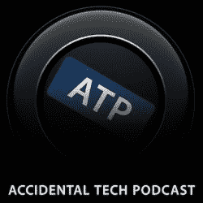

# 制作阴云，Instapaper & Tumblr:与新 raywenderlich.com 的 Marco Arment | Kodeco 的顶级开发人员访谈

> 原文：<https://www.raywenderlich.com/129219/making-overcast-instapaper-tumblr-top-dev-interview-marco-arment?utm_source=wanqu.co&utm_campaign=Wanqu+Daily&utm_medium=website>

## 查看我们对多产技术专家、技术作家和播客 Marco Arment 的采访，Marco Arment 是 Tumblr 的前首席技术官，也是 Instapaper 和 covery 的唯一创建者！

欢迎来到我们顶级应用程序开发访谈系列的另一部分。本系列的每个采访都聚焦于一个成功的移动应用或游戏开发者，以及他们取得今天成就的道路。今天的特别嘉宾是马可·阿门特。

Marco 是一位多产的技术专家、技术作家和播客。他最为人所知的是作为首席开发者和首席技术官的 Tumblr T1，是 T2 Instapaper T3 的唯一创造者，最近是 T4 govern T5 的唯一创造者，这是他广受欢迎的 iOS 播客应用。

当他不忙着编程的时候，Marco 要么在他的网站上写东西，要么主持他的几个播客中的一个，比如 T2 的偶然技术播客，T3，T4 的四强 T5 和 T6。

## 焦点

Marco，你因不止一个成功的项目而闻名。当你想出项目或业务的想法时，你用什么标准？

没有可靠的方法来想出成功的新项目——我失败和放弃的项目比成功的多得多。我知道的增加成功几率的唯一方法就是尝试更多的想法。

知道什么时候继续前进是一个棘手的平衡，我仍然没有掌握，但一个好的规则是，一旦你不再有动力或不能为一个项目做好工作，就继续前进。

你是一个多产的作家、播客和开发者。什么能帮助你区分该做什么和不该做什么？

我也是一个父亲和一个懒惰的拖延者，所以我的时间表到处都是，我不能很好地平衡我的项目的时间需求。(最值得注意的是，我最近几乎没写什么东西。)

我断断续续地工作。我可能会在一周内完成相对较少的事情，然后进行一场不可思议的马拉松，在几个小时内完成一周的工作。事实上，这就是我一直以来的工作方式，即使是全职的普通工作——我只是试图隐藏它，我的老板们似乎对这种高效爆发的结果很满意，忽略了我的无用时期。

没有人应该接受我的时间管理建议。我这样工作是因为这是我唯一能做的，而不是因为这是个好主意。如果你有更好的职业道德，那就利用它。

如果你想解决一些你以前从未做过的全新的事情(例如在《乌云密布》中实现“智能速度”和“语音增强”功能)，你会怎么做？

阴，马可的播客应用程序的 iOS

我经常有类似的疯狂想法，我通常只是构建基本的实现来看看它们是否有什么好处，然后自己尝试使用一段时间。我总是采用一种刚构建的方法来进行设计和特性实验(而不是正式的原型或图像模型)。

这些想法中的大部分从来没有公开过——甚至对 beta 测试人员也没有——要么是因为我不能让它们很好地工作，要么更常见的是，因为它们最终都是糟糕的想法。

但偶尔，他们会变得很棒，让一切都变得值得。这种实验是目前为止我最喜欢的开发部分。这些疯狂的想法中的一两个可以定义一个产品，或者让它在多年的竞争中脱颖而出。

## 独立发展

你不仅仅是一名开发人员。你也是自己的产品经理、项目经理和商人。你是如何发展你现在拥有的非技术技能的？

在当今竞争激烈的市场中，每个独立开发者都需要所有这些技能，甚至更多。从技术上来说，你可以做出一个很棒的应用，但是如果它的设计、营销或者商业模式有很大的缺陷，你就不会走得很远。

随着时间的推移，我在这些领域发展了相对较少的技能，就像我发展大多数技术技能一样:出于需要，在最后一分钟，在磕磕绊绊中，试图从更有经验的人那里获得尽可能多的智慧。

我很幸运能和许多比我聪明得多的人一起工作或接近他们，我从他们身上获得了不可估量的价值。我几乎生活在我的 RSS 阅读器里(还记得那些吗？没死！)，如饥似渴地阅读这些领域的人十几年来的博文。

在很大程度上，你似乎是一个人在运作。你外包什么，你在内部保留什么？

我外包了大部分图标设计，因为我通常不擅长这个，我还雇了一个会计来报税。就是这样。

我以前外包过支持，但很难做好，在 App Store 的价格水平上也很难自圆其说。因此，有点争议的是，我目前不提供技术支持，也不回复大多数电子邮件。我在应用程序中设定了相应的期望值，几乎每个人都对此完全满意。愤怒的人的比例现在看起来差不多(也许更低！)比我拥有昂贵的支持人员时更好。

作为独立开发者，应该避免哪些最大的错误？

到目前为止，我认为印度企业犯的最大错误是，对市场对他们生产的产品的价值抱有不切实际的期望，认为他们可以沉迷于数月或数年的花哨建设，而消费者会为此买单。

我们很容易看到来自 Panic 或 Omni 等知名开发商的成功、精心制作、设计完美的应用程序，并将它们的成功归功于它们的工艺、设计和令人愉快的细节。太多的开发者相信，如果他们把一个应用程序打磨到相似的水平，他们也会成功。然后他们将几个月或几年的努力投入到一个应用程序中，而这个应用程序往往永远不会成功，也无法保持这样的努力水平。

这些高调的成功故事并不是因为他们投入了大量时间或拥有世界级的设计而成功的，而是因为他们在竞争相对较少的领域解决了人们愿意花大价钱购买的共同需求。简而言之，它们非常合适，在市场上的时机也很好。

工艺和设计是放纵的奢侈品，他们成功的市场契合使他们能够这样做，而不是相反。大多数人购买这些应用是因为它们有用且必要，而不是因为它们漂亮。

仅仅做一些花哨的东西是不够的——它首先需要对市场有足够的价值，如果它起飞了，市场就可以资助你想做的花哨设计和技术奢侈。

## 灵感

过去，你曾说过设计是关于“它如何工作”，而不仅仅是“它看起来如何”(就像史蒂夫·乔布斯常说的那样)。除了你自己的应用程序，你还使用哪些应用程序来贯彻这一理念？

马尔科与约翰·锡拉库扎和凯西·利斯一起主持 ATP。

我喜欢令人愉快的小细节和特征。我总是在看这些应用程序，但我发现，看看其他精心设计的奢侈品世界更有启发性，因为他们已经做了更长时间，而且通常做得更好。

汽车是一个很好的来源，充满了自动化功能，豪华的口音，照明技术和控制启示。你甚至不需要去高端才能看到它们——本田雅阁比大多数应用程序都有更多的小细节。

我最近也迷上了机械表，这是另一个有趣细节的可靠来源。例如，我最近了解到，一些手动上弦的手表，一旦电量耗尽，每次都会将秒针停在零点，以便下次使用时更容易设置它们。

这正是我喜欢的那种令人愉快的小细节:一些潜在的复杂工程来实现一些大多数人甚至不会注意到的东西，但这使产品对每个人都更好，并将真正打动和取悦少数注意到它的人。

你崇拜谁？无论是在我们的行业还是其他领域，你认为谁是成功者？

我试图从做类似工作的人那里吸取尽可能多的智慧，但方式不同或在不同的市场上，比如布伦特·西蒙斯、大卫·史密斯、杰森·斯内尔、约翰·格鲁伯和 CGP Grey。

我也在我的直接行业之外寻找潜在有用的知识和智慧——总能从戴维·卡普、塞思·戈丁、霍华德·斯特恩、特雷·安纳斯塔索和已故的乔治·卡林那里找到很多。

你会对那些想和你一样谋生的人说些什么？

打破这种普遍的假设，即你可以煞费苦心地手工制作一个令人惊叹的应用程序，并多年来完全依靠该应用程序生活。这是非常罕见的，这不是我做的，我想我甚至不能说出谁会这么做。

认识到独立开发充斥着竞争。这并不是阻止任何人进入，而是在决定做什么(和不做什么)时应该考虑的:尽可能保持低成本，并在假设想法会成功之前迅速将其推向市场。如果是的话，那就投入更多的时间。如果没有，继续前进，尝试其他东西。你很难放弃一个你认为很棒的想法，但是当市场说话的时候，听它的。

尽可能使你的收入多样化。制作多个应用程序。咨询总是一个很好的选择，可以帮助资助其他发展。如果你可以写作或播客，也这样做。这些不仅可以带来额外的收入，而且可以建立一个观众群来帮助推广你的应用或咨询，不管观众群是大是小。在一个充满无差别替代品的应用商店中，不需要庞大的受众就能有所作为。

最后，不要太听我或任何其他单身人士的话。我只知道对我有效的方法，对其他人不一定有效，因为你不能让时间倒流。尽可能多地从不同的人群中吸收知识。如果你仔细观察和聆听，你会发现有很多伟大的智慧。

## 从这里去哪里？

我们对 Marco Arment 的顶级应用程序开发采访到此结束。非常感谢 Marco 与 iOS 社区分享他的旅程:]

我们希望你喜欢这次采访，并希望你在成为独立应用程序开发人员时能记住 Marco 的建议。最终，在 App Store 中开发一款成功的应用需要的不仅仅是好的编程和好的设计。

还有其他事情需要考虑，如建立受众、营销和找到合适的产品市场。好消息是，这些都是你可以学习的技能，就像马可一样。

如果你是一名应用程序开发者，在应用程序商店中有一款热门的应用程序或游戏排在前 100 名，我们希望收到你的来信。请随时给我们写信。

如果您对任何特定的开发人员有任何要求，请加入下面论坛的讨论！