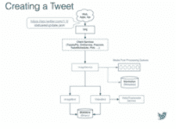

# Twitter 如何每秒处理 3000 张图片——高可扩展性——

> 原文：<http://highscalability.com/blog/2016/4/20/how-twitter-handles-3000-images-per-second.html?utm_source=wanqu.co&utm_campaign=Wanqu+Daily&utm_medium=website>

今天，Twitter 每秒钟创建和保存 3000 张(200 GB)图片。更好的是，由于改进了媒体存储政策，Twitter 在 2015 年节省了 600 万美元。

情况并不总是如此。2012 年的 Twitter 主要是基于文本的。一个没有墙上挂着所有很酷的电影的霍格沃茨。现在是 2016 年，Twitter 已经进入了一个媒体丰富的未来。Twitter 已经通过开发新的*媒体平台*实现了转型，该平台能够支持带有预览、多照片、gif、vines 和内嵌视频的照片。

[【Henna ker mani】](https://www.linkedin.com/in/henna-kermani-27701146)是 Twitter 的一名软件开发工程师，她在[Mobile @ Scale London](https://www.atscalelondon.co.uk/):[每秒 3000 张图像](https://code.facebook.com/posts/1566627733629653/mobile-scale-london-recap/) 的一次有趣的演讲中讲述了媒体平台的故事。演讲主要集中在图像管道上，但是她说大部分细节也适用于其他形式的媒体。

演讲中一些最有趣的教训:

*   做最简单可行的事情真的会让你精疲力尽。上传带有图片的推文的简单方法是一种锁定形式。它没有很好地扩展，尤其是在糟糕的网络上，这使得 Twitter 很难添加新功能。

*   **解耦**。通过将媒体上传与推文分离，Twitter 能够独立优化每条路径，并获得很大的运营灵活性。

*   **移动手柄而不是斑点**。不要在系统中移动大量数据。它会消耗带宽，并导致每个必须接触数据的服务出现性能问题。相反，存储数据并使用句柄引用它。

*   转移到**分段可恢复上传**导致媒体上传失败率大幅下降。

*   **实验研究**。Twitter 通过研究发现，图像变体(缩略图、小图片、大图片等)的 20 天 TTL(生存时间)是一个甜蜜点，是存储和计算之间的良好平衡。图像在 20 天后被访问的概率很低，因此它们可以被删除，**每天节省近 4TB 的数据存储空间** , **所需的计算服务器数量**、**几乎减半**，每年节省数百万美元。

*   **按需**。旧的图像变体可以被删除，因为它们可以被动态地重新创建，而不是预先计算。按需执行服务增加了灵活性，它让您能够更加智能地执行任务，并提供了一个中心控制点。

*   作为一种标准的图像格式，渐进式 JPEG 是真正的赢家。它有很好的前端和后端支持，在较慢的网络上表现很好。

在 Twitter 迈向媒体丰富的未来的过程中，发生了许多好事，让我们来看看他们是如何做到的...

## 老路——2012 年的 Twitter

### 写入路径

*   用户在应用程序中撰写推文，并可能附上图片。

    *   客户端将推文发布到单一端点。该图片与所有其他 tweet 元数据捆绑在一起上传，并传递给该过程中涉及的每一个服务。

    *   这个端点是旧设计中许多问题的根源。

*   **问题#1** :大量浪费网络带宽

    *   tweet 的创建和媒体上传紧密结合在一个操作中。

    *   上传正在进行，要么上传完全成功，要么完全失败。任何原因的故障、网络中断、瞬时错误等。，要求整个上传过程从头重新开始，包括媒体上传。上传可能会完成 95%,如果有一个失败，它必须再次上传。

*   **问题#2** :不能很好地适应新的更大的媒体尺寸

    *   这种方法无法扩展到像视频这样的大型媒体。更大的尺寸增加了失败的可能性，特别是在巴西、印度、印度尼西亚等新兴市场，这些地方的网络速度慢且不可靠，他们真的想提高推文上传的成功率。

*   **问题#3** :内部带宽使用效率低下

    *   连接到 TFE 的端点，Twitter 前端，处理用户认证和路由。用户被路由至影像服务。

    *   图像服务与变体生成器对话，变体生成器生成不同大小的图像实例(比如小、中、大、缩略图)。变体存储在 BlobStore 中，blob store 是一个键值存储，针对图像和视频等大型负载进行了优化。这些图像永远留在那里。

    *   在创建和保存推文的过程中，还涉及到许多其他服务。因为端点是单片的，结合了媒体和 tweet 元数据，所以这个包也流经所有的服务。这种大的有效负载被传递给不直接负责处理图像的服务，它们不是媒体管道的一部分，但是它们仍然被迫为处理大的有效负载进行优化。这种方法对于内部带宽是非常低效的。

*   **问题#4** :臃肿的存储占地面积

    *   来自几个月或几年前的推文的图片，如果不再被请求，将永远存在于 BlobStore 中，占据空间。甚至有时当推文被删除时，图片会留在博客商店里。没有垃圾收集。

### 读取路径

*   用户看到一条推文和与之相关的图片。形象从何而来？

*   客户向 CDN 请求图像的变体。CDN 可能需要询问图像的来源 TFE。这将最终导致在 BlobStore 中直接查找特定大小的 URL 的图像。

*   **问题#5** :不可能引入新的变种

    *   这个设计不太灵活。添加新的变体，即不同大小的图像，将需要为 BlobStore 中的每个图像回填新的图像大小。没有随需应变的设施。

    *   缺乏灵活性使得 Twitter 很难在客户端添加新功能。

## 2016 年的新方式——推特

### 写入路径

#### 将媒体上传与推文分离。

*   上传被立为一等公民。创建了一个上传端点，它唯一的职责是将原始媒体放入 BlobStore

*   这为如何处理上传提供了很大的灵活性。

*   客户端与 TFE 对话，TFE 与图像服务对话，图像服务将图像放入 BlobStore，并将数据添加到元数据存储中。就是这样。不涉及其他隐藏的服务。没有人处理媒体，没有人传递媒体。

*   从图像服务返回 mediaId，即媒体的唯一标识符。当客户想要创建 tweet、DM 或更新他们的个人资料照片时，mediaId 将被用作引用媒体的句柄，而不是提供媒体。

*   假设我们想用刚刚上传的媒体创建一条推文。流程是这样的:

    *   客户端点击更新端点，在 post 中传递 mediaId 它将冲击 Twitter 前端；TFE 将路由到适合正在创建的实体的服务。对于 tweets，它是 TweetyPie。DMs 和 Profiles 有不同的服务；所有服务将与图像服务对话；图像服务器具有后处理队列，用于处理人脸检测和儿童色情检测等功能；完成后，图像服务与 ImageBird 对话获取图像，或与 VideoBird 对话获取视频；ImageBird 会生成变种；VideoBird 会做一些转码；任何生成的媒体都将被放入 BlobStore。

    *   没有媒体在传播。节省了大量浪费的带宽。

#### 分段可恢复上传。

*   走进地铁，10 分钟后出来，上传过程将从中断的地方恢复。这对用户来说是完全无缝的。

*   客户端使用上传 API 初始化上传会话。后端会给它一个 mediaId，这是在整个上传会话中使用的标识符。

*   图像被分成片段，比如说三个片段。使用 API 追加段，每个追加调用给出段索引，所有追加都是针对同一个 mediaId。上传完成后，上传即完成，媒体即可使用。

*   这种方法对网络故障的恢复能力更强。每个单独的段都可以重试。如果网络因任何原因中断，当网络恢复时，您可以暂停并继续您中断的部分。

*   一个简单的方法却能获得巨大的收益。对于文件> 50KB，巴西的图像上传失败率下降了 33%,印度下降了 30%,印尼下降了 19%。

### 读取路径

#### 推出了一款名为 MinaBird 的 CDN 原点服务器。

*   MinaBird 可以与 ImageBird 和 VideoBird 对话，因此如果不存在图像大小变体和视频格式变体，可以即时生成它们。

*   MinaBird 在处理客户请求方面更加流畅和动态。例如，如果 DMCA 发生故障，很容易阻止或重新启用对特定介质的访问。

*   能够动态生成变体和代码转换，让 Twitter 在存储方面变得更加智能。

    *   按需变体生成意味着所有变体不需要存储在 BlobStore 中。巨大的胜利。

    *   原始图像保留到删除。变种只保留 20 天。媒体平台团队对最佳有效期做了大量研究。所有被请求的图像中，大约 50%的图像至多存在 15 天左右。保留比这更老的图像会产生递减的回报。很可能没有人要求使用旧媒体。15 天后有一条很长的尾巴。

    *   由于没有 TTL(生存时间),没有过期，媒体存储每天都会导致 6TB 的存储增长。惰性方法按需生成所有变体，导致每日存储增长 1.5 TB。20 天 TTL 并不比惰性方法使用更多的存储，因此它在存储方面没有太多成本，但在计算方面却是一个巨大的胜利。使用计算所有读取变量的惰性方法，每个数据中心需要 150 台 ImageBird 机器，而 20 天 TTL 需要 75 台左右。因此，20 天的 TTL 是一个甜蜜点，在存储和计算之间取得了良好的平衡。

    *   由于节省存储和计算就是省钱，2015 年 Twitter 通过引入 20 天 TTL 节省了 600 万美元。

#### 客户端改进(Android)

*   用谷歌创造的图片格式 [WebP](https://en.wikipedia.org/wiki/WebP) 进行了 6 个月的实验。

    *   图像比相应的 PNG 或 JPEG 图像平均小 25%。

    *   用户参与度有所提高，尤其是在新兴市场，较小的图像尺寸带来的网络压力较小。

    *   iOS 上不支持。

    *   仅在 Android 4.0+上支持。

    *   缺乏平台支持使得 WebP 的支持成本很高。

*   渐进式 JPEG 是 Twitter 尝试的另一个选择。它在连续扫描中渲染。第一次扫描可能是块状的，但它会随着连续扫描而自我完善。

    *   更好的性能。

    *   易于后端支持。

    *   编码速度比传统 JPEG 慢 60%。因为编码发生一次，服务发生多次，所以这不是一个大问题。

    *   没有透明支持，所以透明的 png 仍然存在，但是其他的都集中在渐进式 JPEG 上。

    *   在客户端支持由 [脸书的壁画](https://github.com/facebook/fresco) 库提供。关于壁画有很多非常好的事情要说。2G 连接的结果令人印象深刻。PJPEG 第一次扫描只需要 10kb 左右，所以加载时间不长。原生管道仍在等待加载，没有显示任何内容，而 PJPEG 显示了可识别的图像。

    *   tweet 详细视图中正在进行的负载实验的结果。p50 装载时间减少 9%。p95 装载时间减少 27%。失败率下降了 74%。连接速度较慢的用户确实会大获全胜。

## 相关文章