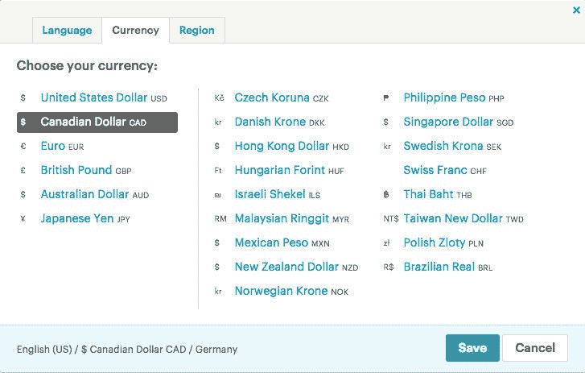
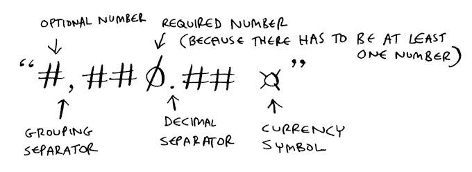
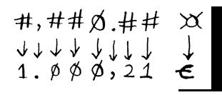
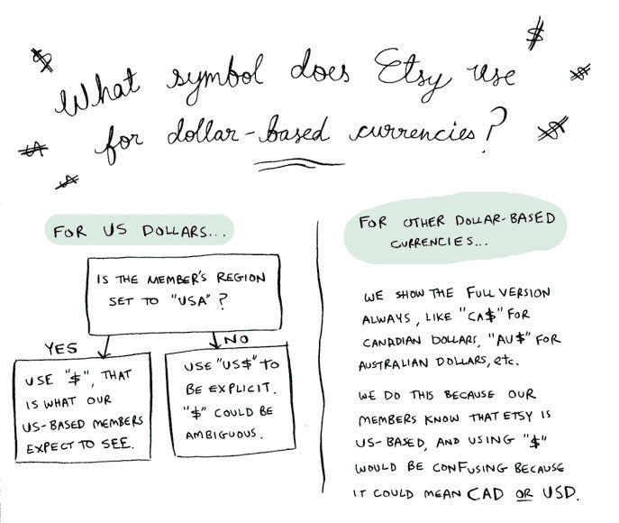
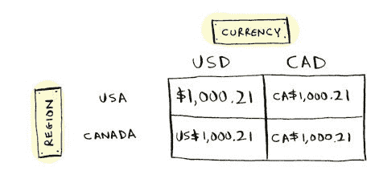
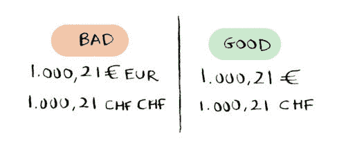
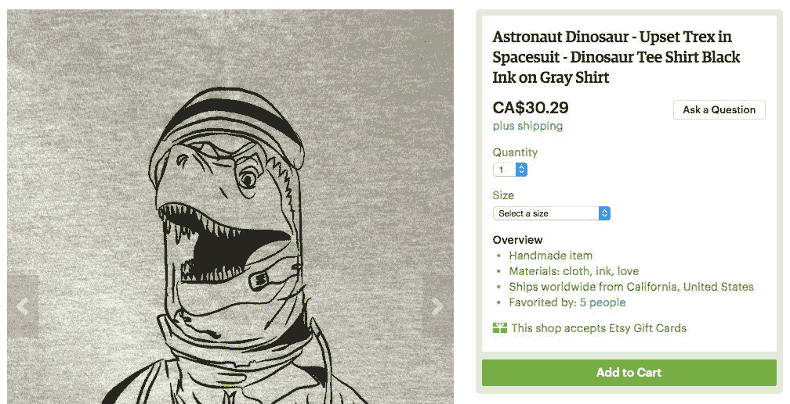
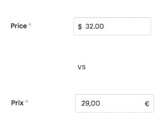

# Etsy 工程| Etsy 如何格式化货币

> 原文：<https://codeascraft.com/2016/04/19/how-etsy-formats-currency/?utm_source=wanqu.co&utm_campaign=Wanqu+Daily&utm_medium=website>

想象一下，如果你走进一家杂货店，看到的价格都是胡言乱语(“1，00.21 美元”或“100 美元”)，你会有什么感觉。一”)。你有信心在这家商店购物吗？

Etsy 在 200 多个地区开展业务，使用 9 种语言。重要的是，我们的会员体验在所有地区都是一致和可信的，这意味着我们必须为所有会员正确定价。

## 在这篇文章中，我将介绍:

*   错误货币格式的示例
*   如何正确格式化货币
*   我们在此过程中做出的实际实施决策

为了理解，您需要知道一件重要的事情:货币格式取决于三个属性:货币、成员的位置和成员的语言。

## 错误货币格式的示例

以下是一些错误货币格式的示例:

*   一位用德语浏览的会员进入您的网站，看到一件售价为“1，000.21 欧元”的商品。
*   一名日本会员看到一件售价为“847，809.34”的商品
*   一个加拿大成员看到了“$1.00”。

如果你不知道为什么上面的例子令人困惑，请继续阅读。

### 出了什么问题:一个用德语浏览的会员进入你的网站，看到一个售价为“1000.21 欧元”的商品？

第一个例子是最简单的。如果会员用德语浏览，价格中的逗号和小数应该被翻转。因此“1，000.21”实际上应该格式化为“1.000，21”。这不是很令人困惑(作为一名德国会员，你可以算出价格是*假设*是多少)，但这是一次糟糕的经历。

顺便说一句，如果你在德国，使用欧元，但是用英语浏览，你希望看到什么？回答:“1000.21 欧元”。这里的分隔符和符号位置基于语言，而不是地区。

### 怎么了:一个日本会员看到一个商品卖“847809.34”？

日元没有小数部分。没有半日元这种东西。所以“847，809.34”可能意味着“847，809”，或者“84，780，934”或者其他完全不同的意思。

### 怎么了:一个加拿大会员看到的是“$1.00”？

如果你的网站是美国的，这可能会令人困惑。这里的“$”是指加元还是美元？一个简单的解决方法是在末尾添加货币代码:“1.00 美元”。

## 如何正确设置货币格式

[ ](http://i.etsystatic.com/inv/53e930/3491676947/inv_fullxfull.3491676947_2px3xqm0.jpg?version=0) Etsy 的区域设置选择器

为国际成员格式化货币是困难的。Etsy 支持 9 种语言、23 种货币和数百个地区的浏览。幸运的是，我们不需要找出所有这些组合的正确格式，因为 CLDR 的好心人已经帮我们做了。CLDR 是一个庞大的格式样式数据库，每年更新两次。这些数据被打包成一个名为 [libicu](http://site.icu-project.org) 的便携式图书馆。Libicu 随处可用，包括手机。如果你想格式化货币，你可以使用 CLDR 数据来完成。

**对于每种语言+地区+货币组合，CLDR 给你:**

*   货币符号
*   货币代码
*   小数点和分组分隔符
*   格式模式。

典型的模式如下所示:

[](http://i.etsystatic.com/inv/2b545a/3444008928/inv_fullxfull.3444008928_o65ml7gk.jpg?version=0) 一种 cldr 模式

这是德国+德国+欧元的模式。它告诉你:

*   货币符号在末尾
*   价值和货币符号之间有一个空格
*   欧元分为三组，比如 100 万美元(而卢比分为两组:100 万美元)。印地语+印度+卢比的模式是“#、#、##0。###")
*   这是一种小数货币，格式精度为 2(而日元不是小数货币，使用格式“0”)。

**注意**:模式*不会*告诉你小数点和分组分隔符是什么。CLDR 单独给你这些，它们不是模式的一部分。现在，您可以使用这些信息来格式化一个值:

[T2】](http://i.etsystatic.com/inv/311cd1/3491677095/inv_fullxfull.3491677095_o6hses79.jpg?version=0)

如果你想用 CLDR 来格式化价格，你的语言可能已经有库来帮你做了。例如，PHP 有 [NumberFormatter](http://php.net/manual/en/class.numberformatter.php) 。JavaScript 有 [Intl。数字格式](https://developer.mozilla.org/en-US/docs/Web/JavaScript/Reference/Global_Objects/NumberFormat)。

## 实际执行决定

CLDR 是伟大的，但它不是最终的权威。这是一个合作项目，这意味着任何人都可以向 CLDR 添加货币数据，然后每个人投票决定数据看起来是否正确。人们也可以投票改变现有的货币数据。CLDR 数据不是一个精确的东西，它是流动的，不断变化的。有时你需要为你的用例定制 CLDR。以下是我们所做的定制。

### 使用美元符号($)的货币的问题是

我们在 Etsy 使用 CLDR 来格式化货币，但是我们已经对它做了一些改变。有一个特别的问题真的困扰着我们。美元货币真的很难打交道。加拿大元的符号在加拿大是“$”，但在美国和其他地方是“CA$”以避免与美元混淆。因此，如果我们跟随 CLDR，加拿大成员将看到“$1.00”。但是我们的加拿大会员可能知道 Etsy 是一家总部设在美国的公司，在这种情况下,“$”对他们来说可能是不明确的- **它可能意味着加元或美元**。以下是我们如何选择货币符号以避免混淆，同时满足会员的期望:

[](http://i.etsystatic.com/inv/a3641f/3491677157/inv_fullxfull.3491677157_hg6i0ian.jpg?version=0)Etsy 用什么符号表示以美元为基础的货币？

以下是以不同货币+地区组合格式化的值“1000.21”:

[T2】](http://i.etsystatic.com/inv/798aab/3444009154/inv_fullxfull.3444009154_q7wymos2.jpg?version=0)

您可能想知道，为什么不在价格的末尾加上货币代码呢？例如，美元可以是“1，000.21 美元”，加拿大元可以是“1，000.21 加元”。这也是显式的，但我们不需要复杂的逻辑来改变货币符号。但是这种方法有另一个问题:冗余。

假设我们在每个地方都添加了货币代码来解决 CAD 问题。欧元将被格式化为“1.000，21 欧元”，但“欧元”是多余的。更糟糕的是，瑞士法郎没有货币符号，所以 CLDR 建议使用货币代码作为货币符号。**这意味着他们会看到“1.000，21 瑞士法郎瑞士法郎”**，这显然是多余的:

[T2】](http://i.etsystatic.com/inv/614344/3444009234/inv_fullxfull.3444009234_l67vnr23.jpg?version=0)

在末尾添加货币代码是显式的，但不符合成员的期望。我们的德国会员说他们不喜欢“1.000，21 欧元”的样子。最后，Etsy 决定不显示货币代码。相反，我们根据需要更改货币符号以避免混淆。

[](http://i.etsystatic.com/inv/db58af/3444009296/inv_fullxfull.3444009296_fqbeltxn.jpg?version=0) 设置英语/加拿大/加拿大元的挂牌价格

## 覆盖 CLDR 数据

这里有一个简单的例子，我们覆盖了 CLDR 格式。我们是一个网站，所以当然**我们希望我们的价格被包装在 html 标签**中，以便它们可以被适当地设计。例如，在我们的列表管理器中，我们希望根据地区正确设置价格输入框的格式:



在完成格式化后，很难在 html 标签*中包装价格:有时符号在末尾，有时符号和值之间有空格，有时没有，等等。要做到这一点，html 标签需要成为模式的一部分，所以我们需要能够直接覆盖 CLDR 模式。*

最终，我们覆盖了许多默认的 CLDR 数据:

*   标志
*   模式
*   负格式的模式
*   添加 html 标签

不同的图书馆对此提供了不同程度的支持。PHP 的 NumberFormatter 允许您覆盖模式和符号。JavaScript 的 Intl。NumberFormat 不允许您覆盖任何一个。没有一个库支持在输出周围包装 html 标签。最后，我们编写了自己的 JavaScript 库，并为其余部分添加了包装器。

## 跨平台的一致格式

我们必须在 PHP、JavaScript 以及我们的 iOS 和 Android 应用程序中格式化货币。PHP、JavaScript、iOS 和 Android 都有不同版本的 libicu，因此它们有不同的 CLDR 数据。我们如何在这些平台上保持格式一致？我们采用了双重攻击计划:编写跨平台的相同测试，并确保所有 CLDR 覆盖在平台间共享。

我们编写了一个脚本，将我们所有的 CLDR 覆盖导出为 JSON / XML / plist。每次覆盖改变时，我们运行脚本为所有平台生成新数据。下面是我们的 JSON 文件现在的样子(节选):

```
{
    "de_AU": {
        "symbol": {
            "AUD": "AU$",
            "BRL": "R$",
            "CAD": "CA$"
        },
        "decimal_separator": ",",
        "grouping_separator": ".",
        "pattern": {
            "AUD": "#,##0.00 \u00a4",
            "BRL": "#,##0.00 \u00a4",
            "CAD": "#,##0.00 \u00a4"
...
```

我们编写了另一个脚本来生成测试夹具，它看起来像这样(摘录):

```
"test_symbol&&!code&&!html": {
    "de": {
        "DE": {
            "EUR": {
                "100000": "1.000,00 \u20ac",
                "100021": "1.000,21 \u20ac"
            }
        },
        "US": {
            "EUR": {
                "100000": "1.000,00 \u20ac",
                "100021": "1.000,21 \u20ac"
            },
            "USD": {
                "100000": "1.000,00 $",
                "100021": "1.000,21 $"
            }
        }
    }
}
```

该测试表明，给定这些设置:

*   显示货币符号
*   隐藏货币代码
*   格式化为纯文本，而不是 html
*   对于德/美/美元设置
*   值 100021 的格式应该是“1.000，21 $”

我们总共有数百个测试来检查语言/地区/货币代码的每一种组合，包括符号显示与隐藏、文本格式与 html 格式等。根据所有平台上的货币格式化程序的输出来检查这些期望值，因此我们知道它们都正确且一致地格式化货币。**每当覆盖发生变化时(例如，在所有地区将 CAD 的符号改为“CA$ ”)，我们都会更新 CLDR 数据文件，以便新的覆盖能够传播到所有平台。**然后，我们更新测试设备，重新运行测试，以确保覆盖在所有平台上都工作。

## 结论

再也没有“847809.34”了！格式化货币很难。如果您想正确地执行此操作，请使用 CLDR 数据，但请确保根据您的特殊情况在必要时覆盖它。我希望我们的改变能给国际会员带来更好的体验。感谢阅读！