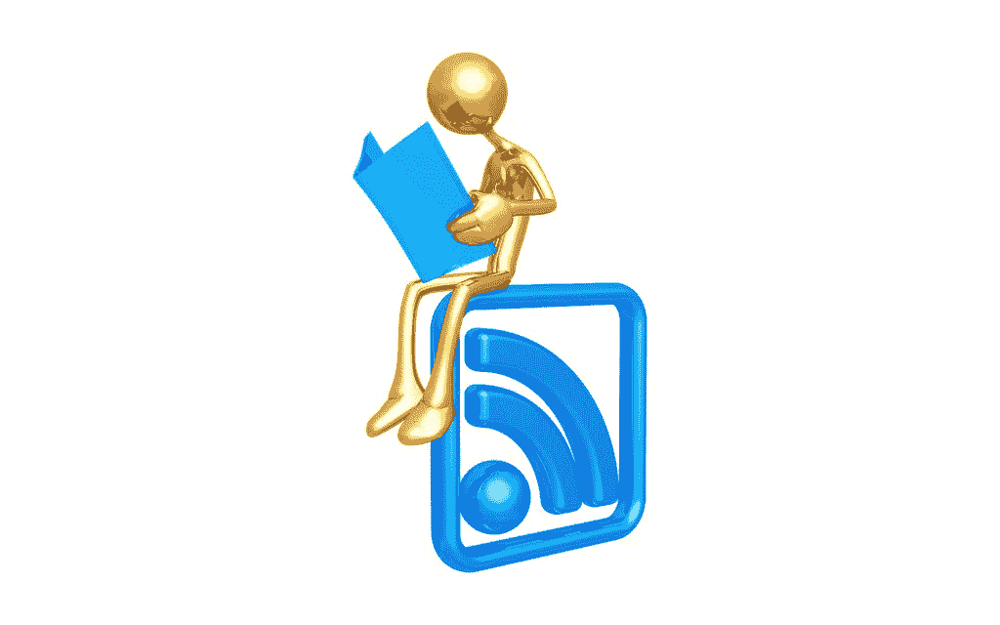

# 读者啊！我的读者——锥子

> 原文：<http://www.theawl.com/2016/04/o-reader-my-reader?utm_source=wanqu.co&utm_campaign=Wanqu+Daily&utm_medium=website>

> RSS 提要让读者能够更好地跟踪他们的书签，本质上是为他们做的。每篇新文章都以粗体显示，就像收件箱里的新邮件一样。它允许更丰富的互联网浏览体验，包括分享、电子邮件和打印功能，以及各种订阅源的主页定制——谷歌充分利用了这一功能。RSS 允许互联网用户对他们的搜索标准和订阅源进行挑剔。

引用你自己的大学论文“真正简单的辛迪加”在社会上合法吗？哦好吧。曾经有一段时间(2007 年)我对这个互联网抱有希望。曾经有一种人道的方式来筛选一天的新闻，这不仅仅是站在观点和病毒像素的水龙头下，它们会粘在你身上，然后你必须像细菌一样传递它们，因为你只是一个载体。这就好比如果，你的邻居和友敌没有看你选择的报纸(哈哈纸)，只是在你的大方向上，不请自来地喊着他们认为有新闻价值的东西。

还记得谷歌阅读器的好时光吗？你可以在你自己的标签里，用你喜欢的内容提供商的图标来装饰你的墙壁，用你自己的方式来消费网络内容。现在全是算法、转发和突发新闻。Google Reader 于 2005 年推出，当时一切都还好，BuzzFeed 还没有成立，[，2013 年 7 月 1 日关闭](http://www.theawl.com/2013/07/coffin-closed)。在我看来，那是互联网死亡的日子，我们现在经历的是炼狱。不要拘束。

如果你现在访问谷歌阅读器的网站，你会得到一条蹩脚的消息:“谷歌阅读器已经[停产](http://googleblog.blogspot.com.au/2013/03/a-second-spring-of-cleaning.html)。我们要感谢我们所有的忠实粉丝。我们知道你可能不同意这个决定，但我们希望你会像喜欢 Reader 一样喜欢这些选择[这些选择中没有一个是足够好的，因为它们就是不一样。它们中没有一个真正成功过，这也不是反对读者天才的理由！谷歌](http://alternativeto.net/software/google-reader/)[声称](https://googleblog.blogspot.com.au/2013/03/a-second-spring-of-cleaning.html) Reader 的创建宗旨是让“人们更容易发现并关注他们最喜欢的网站”相反，我们的网站现在密切关注我们，更好地瞄准我们，压制我们，把我们变成金钱，就像许多笼中的肉鸡，用豆粕膨化。感觉不好，是吗？这不像 Google+是一个东西，但是你不会看到 Google 关闭它，因为脸书。哈哈，还记得巴兹吗？波怎么样？

以复活的精神:带回开放的互联网。把谷歌阅读器带回来。没事，谷歌；你犯了个错误。我们会原谅你的。

图片: [Flickr](https://www.flickr.com/photos/53384689@N06/4972331761/in/photolist-8zouZX-aotmL4-7f6mWR-paXeyf-aow5q3-g46J7-aovx57-aow74u-9tsrbn-4Ex9MA-5D5r7Q-paXk5V-qCg2zN-aT98uM-a38Qj4-auDasT-4wtXdv-pZ7qPP-qm5ro-aosNeB-qbziL2-53Czqk-6KkT3k-aow6cw-eosi6V-pjxeoU-473hpr-9CAwdi-paZfAD-aow7vy-4EsVDe-4BFyGL-aotk26-aovxLC-aotkZK-5Qo84q-7z7YKK-aotkKa-9tsrbe-9J8tSe-dFptra-rbUkSJ-3cGyCK-5S1Uun-9J8xwp-qDH6i5-5AbKa5-pbB4Yd-pbtq5A-dxg9g7)