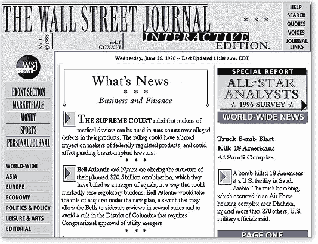
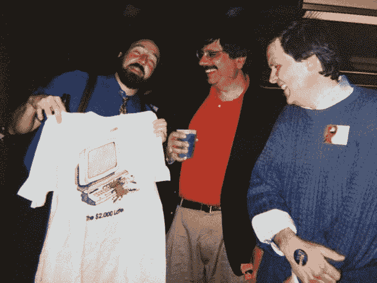

# 华尔街日报网站——从一开始就是付费网站——今天 20 岁了|尼曼新闻实验室

> 原文：<http://www.niemanlab.org/2016/04/the-wall-street-journal-website-paywalled-from-the-very-beginning-turns-20-years-old-today/?utm_source=wanqu.co&utm_campaign=Wanqu+Daily&utm_medium=website>

华尔街日报(几乎)从未免费在线阅读过。20 年前的今天，当完整的网站——当时名为《华尔街日报》互动版——正式上线时，它有几个月是免费的。

《华尔街日报》负责专业新闻产品和事件的编辑戴夫·佩迪特(Dave Pettit)告诉我说:“一直以来，《华尔街日报》都会对其网络版收费。”。“我们在 4 月份推出，8 月份他们推出了订阅服务。试用期是免费的——早期的原型也是免费的——但人们总是期望商业新闻内容，尤其是期刊内容，会在订户付费墙之后。”

佩迪特最初在《华尔街日报》担任货币与投资编辑，1995 年负责一个基本的[市场新闻网站](https://si.wsj.net/public/resourcimg/BN-NS185_HOMEPA_360RV_20160425130610.jpg)，从那以后，他一直在《华尔街日报》担任各种职务。到 1995 年，该报已经开始召集员工为一个更充实的网站而努力，佩迪特回忆说，尽管在早期他们“资金不足”，但高层管理人员总是支持网络版。

“我们在第一年左右的时间里，只是想出了事情如何运作的系统——提出了工作流程、覆盖范围和初始网站的设计。然后一旦我们开始生活，我们时间就花在了建设上。在那些日子里，我们只有少数人，”佩迪特说。“我们很幸运，从一开始，我们就得到高层的支持。其中一个表现是，他们在《华尔街日报》的国家新闻部旁边为我们腾出了空间——如果你说的是 1995 年、1996 年，那真是太酷了。”

“有了互动版的额外信息和功能，我们相信读者会支付我们收取的适度订阅价格，”“互动版”的创始编辑[尼尔·巴德](https://twitter.com/neilbudde),[在宣布正式网站](http://www.wsj.com/articles/SB849581696318836500)推出的期刊报道中说，他在 1995 年基本网站之前开发了一个早期原型服务，依靠用户拨入获取信息。(巴德现在是路易斯维尔信使日报的[副总裁/执行主编。)](http://www.courier-journal.com/)

《华尔街日报》进军付费在线内容引起了轰动——以下是《纽约时报》对 WSJ.com 发布的报道:“华尔街日报打赌互联网读者将付费”——正式发布前的压力是巨大的。

Rich Jaroslovsky,[在线新闻协会](http://journalists.org/)的[第一任主席](http://journalists.org/about/board-of-directors/rich-jaroslovsky/)，现在是《观察家报》的科技专栏作家和 SmartNews 公司的副总裁，在[为《观察家报》撰写的一篇文章](http://observer.com/2016/04/twenty-years-ago-today-i-launched-wsj-com/)中回忆了发布前的失败。一次例行的服务器维护程序最终导致整个系统瘫痪，没有任何迹象表明系统何时能恢复运行:“现在，在媒体和科技界的关注下，我们陷入了瘫痪。我们在发射前所做的许多工作都付之东流了，我们坐了几个小时，无所事事，痛苦不堪。”

截至去年 12 月，WSJ.com 约有 828，000 名数字用户，另有 12，000 人通过其他方式(如通过他们的公司或酒店付费让客人访问)访问。据《华尔街日报》发言人称，在《WSJ.com》发行时有 361 人订阅，如今仍是订户。

回想起来，早期的日子感觉几乎是可笑的低效。在线员工和印刷员工的工作流程非常分离。初级职员可能从“交互式新闻读者”(本质上是文字编辑)开始，然后作为“交互式新闻作者”进行改写网页制作是一个笨拙的过程。

“我们不得不在计算机之间交换软盘。《华尔街日报》华盛顿在线编辑蒂姆·汉拉汉说:“当时，有人担心如果我们将一台面向网络的电脑接入内部网络，我们可能会面临外部安全问题。”。

汉拉汉在《华尔街日报》最初的 WSJ.com 团队中是一名互动新闻阅读器。他和佩迪特都提到了早期为每张桌子配备两台电脑的麻烦——一台用于内部编辑，一台用于访问“互联网”。佩迪特说，为了给故事添加链接，制片人必须从“网络”电脑上检索故事，然后手工打出整个链接。

“当我们制作整份《华尔街日报》时，我们仍然只能一次让一个人把故事放到网站上并进行整理，”佩迪特补充道。“人们要花几个小时把它们从一个部分传到另一个部分，而且东西总是会崩溃。我们的文件管理系统极其古怪，而且功能有限。”

印刷是报纸的支柱，尽管这些年来，新员工不断加入，为网站报道原创特色，以补充印刷报道。

“我们将报道资源集中在在线投资、个人理财、科技、旅游等主题上——在线预订是一件大事。在事情开始转向更好的整合之前，在高峰时，我们可能有 70，75 人的专门工作人员，”佩迪特说。“今天，所有这些工作都在继续，我们更大规模的综合员工同时从事印刷和在线工作。”(一月份，它重组了新闻编辑室，改变了第一页的结构。)

《华尔街日报》的日间编辑凯特·奥尔特加(Kate Ortega)说:“最初，至少对我来说，可能是因为我晚上工作，感觉我们很多数字工作人员夜以继日地制作网站，而一些剩余的人白天制作数字内容，如市场数据、大宗商品故事、企业收益重写本。”。(网站从一开始就应该不断更新。)1999 年夏天，奥尔特加开始在《华尔街日报》担任互动新闻读者(汉拉汉聘用了她)，之后在该报担任助理新闻编辑，然后监管一个互动图形团队。“当时我们仍在‘等待’印刷。我们有一些只在网上的专栏，其他人写专题内容——一个金融专栏作家。我们面临着业内每个人都可能面临的挑战和压力——我们面临着在网上获得优质、可靠内容的压力。”

“我们希望变得可信。汉拉汉说，我们想让报社的同事说，‘嘿，这些家伙很不错’，而不是说，‘还有另一个版本的《华尔街日报》达不到我们的标准。’。“我们想证明我们无愧于《华尔街日报》的名字，确保我们在印刷和网络上的声音保持一致。”

“从一开始，即使我们是在线的，即使我们是一个年轻的员工，我们也需要涵盖印刷杂志的所有相同的问题和敏感性，这一点非常清楚，”佩迪特说。“我们对此非常重视:在《华尔街日报》工作的一部分是该机构及其诚信的重要性，这一直是我们的出发点。”

网上的东西开始建立。佩迪特说，1997 年发表的《华尔街日报》最早的互动文章之一，阐述了数据如何在互联网上移动，以及降低性能时间的因素。奥尔特加回忆说，图形团队的第一个大作品之一是 2003 年美国入侵伊拉克期间出版的交互式地图。它多次重新设计了自己的网站，

[most recently in 2015](http://www.niemanlab.org/2015/04/after-the-launch-of-its-long-awaited-web-redesign-the-wall-street-journal-hopes-to-spur-innovation/)

。新部门激增。它发射了

[WSJ Pro](http://www.capitalnewyork.com/article/media/2015/09/8576455/wsj-launches-pro-service)

，一项跨专业行业的附加订阅服务。它有多个移动应用程序。今天，杂志的

[interactives can be found in 3D](http://graphics.wsj.com/3d-nasdaq/)

这是第一份在 Snapchat Discover 上获得官方位置的美国报纸。

“今天，我们得到了早期 WSJ.com 乡亲。你可以在每张桌子上看到它们，”奥尔特加说。“还有人领头呢

[What’s News app](http://www.niemanlab.org/2015/08/the-wall-street-journal-is-targeting-its-loyal-subscribers-with-its-new-news-digest-mobile-app/)

发布，有人在做视频，有人在做资金和投资。我们的核心小组分散到了编辑室的其他部门，他们做得很好！"

“现在我想说的主要区别是，我们从《华尔街日报》的一个重要但明显不同的部分，从边缘到成为我们今天所做事情的中心，”汉拉汉说。“同事的角色已经从非常具体，变成了与印刷一样的在线角色，与传统角色一样的数字化角色。旧墙已经消失了。”

照片里面的故事尼尔巴德，丰富 Jaroslovsky，汤姆·贝克在一周年的 WSJ.com 由詹妮弗埃德森。詹妮弗·埃德森拍摄的编辑迈克·埃莱克在新闻编辑室的头像。