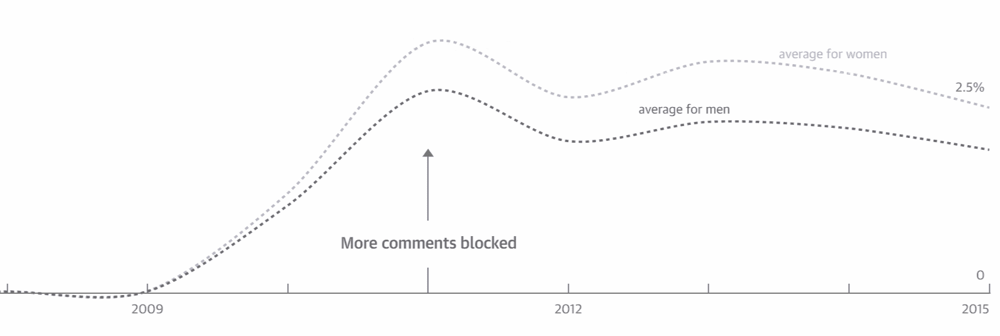
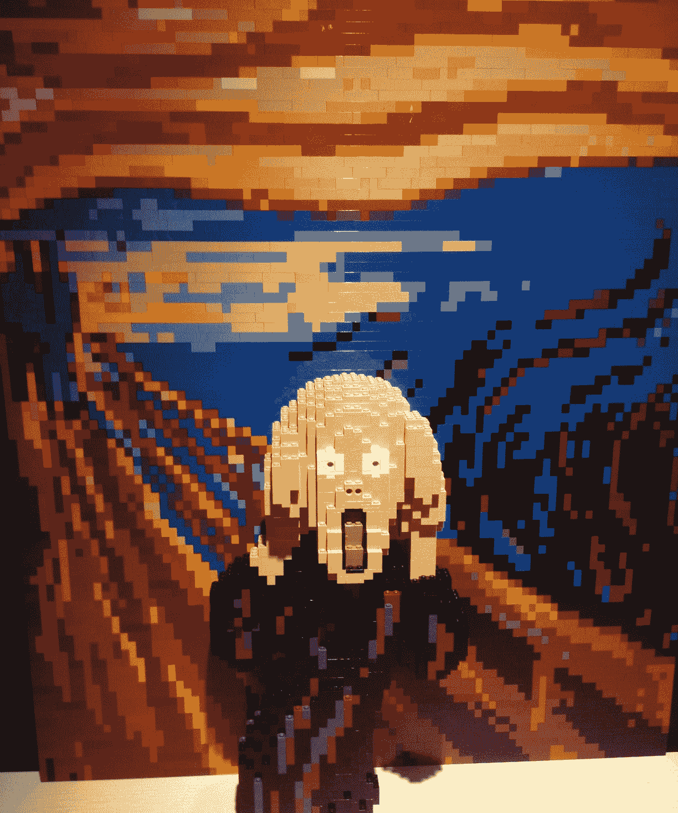
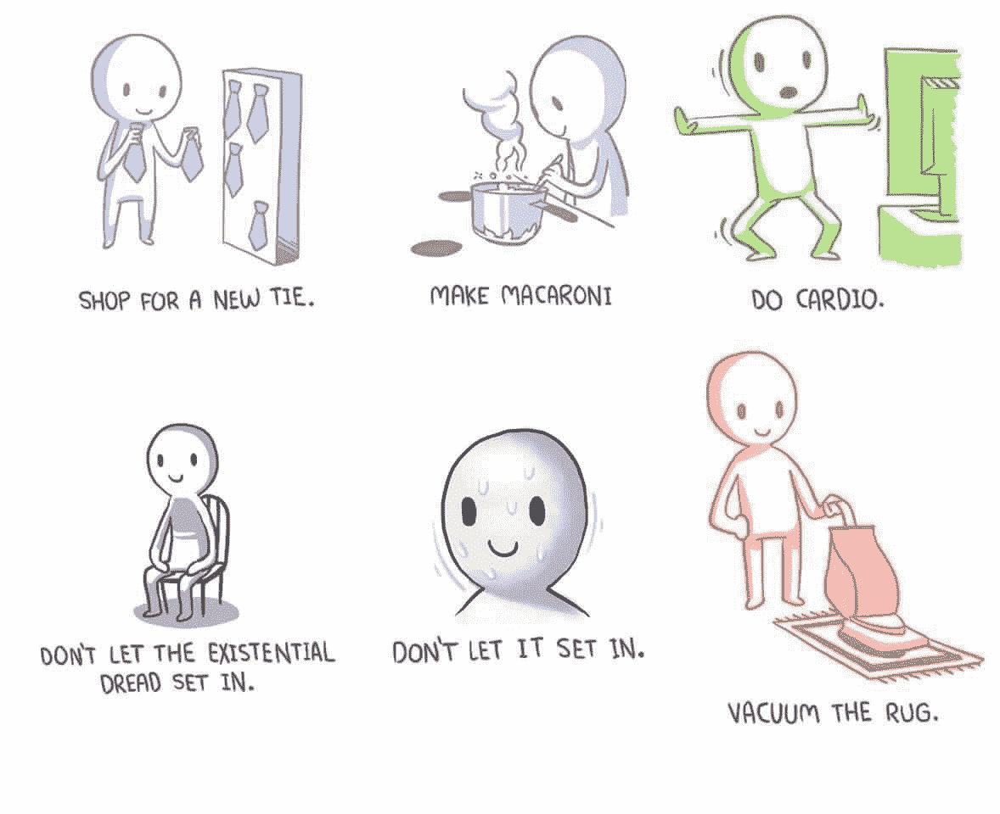

# 他们必须是怪物

> 原文：<http://blog.codinghorror.com/they-have-to-be-monsters/?utm_source=wanqu.co&utm_campaign=Wanqu+Daily&utm_medium=website>

自从我开始研究话语，我花了很多时间思考软件如何鼓励和推动人们在网上更有同理心。这就是为什么阅读像这篇文章这样的文章会让人感到困扰:

> 今天是我哥哥的 32 岁生日。对他的家人来说，这是一个特别激动的日子，因为他已经不在人世。
> 
> 他去年二月死于海洛因过量。今年比去年更艰难。我在午夜开始哭泣，最终哭到睡着。今天的症状包括零星啜泣的爆发和无法克服的空虚感。我妈妈在我哥哥的脸书主页上发了一条令人心痛的评论，说这一切都不公平。她的孩子应该在这里，而不是不见了。"让我们如此悲伤的上帝在哪里？"她问。
> 
> 作为回应，有人——一个陌生人(我猜是另一个人)——用一个词评论道:“瘾君子。”

这种互动可能看起来有点奇怪和脱离上下文，直到你意识到这是一个有点名气的人的脸书页面，他制作了出色的节目公园和娱乐。当然，这并不能以任何方式原谅这种行为，但它确实解释了为什么陌生人会路过并进行观察。

在旧观念中有一个深刻的真理，人们能够说这些事情**是因为他们正看着一个充满文字的屏幕**，而不是直接面对他们将要对其说一件可怕事情的人。互联网允许的一个抽象层次，打字，这在许多其他环境中非常强大…

…有一些严重的情感后果。

作为移情的一个练习，试着想象对坐在你正前方的一个真人说一些人们在网上互相输入的可怕的事情。或者不要想象，而[只看这个视频](http://www.esquire.com/sports/videos/a44351/female-sports-reporters-mean-tweets/)。

<iframe src="https://www.youtube.com/embed/9tU-D-m2JY8" frameborder="0" allowfullscreen="">VIDEO</iframe>

我要求你看完整个视频。我做不到。这是我第二次尝试，不到两分钟我就不得不关掉它，因为我再也受不了了。

这些评论是针对女性的，这绝非巧合。在过去的几年里，我开始明白，作为一个异性恋的白人，我是如何有幸免受这种待遇的。但是其他人就没有这么幸运了。《卫报》分析了 7000 万条评论，发现网上虐待不成比例地堆积在女性、有色人种和不同性取向的人身上。

> 雪崩在网上很容易发生。匿名解除了人们的抑制，使他们中的一些人更有可能滥用。暴民可以很快形成:一旦一个辱骂性的评论被发布，其他人通常会蜂拥而至，竞争看谁可能是最残忍的。这种滥用可以跨平台快速传播——从 Twitter 到脸书，再到 blog posts——并且可以在多种设备上看到——工作时的桌面，家里的手机。对目标人物来说，可能感觉犯罪者无处不在:在家里，在办公室，在公共汽车上，在街上。

我只尝过一次这种待遇。“被包围”的感觉是显而易见的——每天、每个小时都有持续不断的尖酸刻薄和评判涌向你。这并不令人愉快。这绝对影响了我的精神状态。有人在评论中说，最终这并不重要，因为作为一个白人，我可以随时离开这种情况。他们是对的。我开始体会那种感觉，当你不能走开的时候，当这种骚扰伴随着你到处上网的时候，你永远不知道下一次事件什么时候会发生，或者它会以什么样的形式出现。

想象一下每天都处于紧张状态的感觉。当离开不是一个选择时，你的精神状态会发生什么？它给了我很大的停顿。

[T2】](http://www.brickartist.com/)

我很欣赏斯蒂芬妮·威特尔斯·瓦克斯与那个留下糟糕评论的人的互动方式。这是一个自己有两个孩子的男人，应该对孩子死亡的痛苦并不陌生。然而，他觉得有必要用“瘾君子”这个词来回应一位母亲因孩子染上毒瘾而失去孩子的痛苦。

> 这不就是同理心吗？把自己放在别人的位置上，知道并意识到我也是人，因此，容易受到这个悲剧或其他悲剧的影响？

大多数人会简单地删除评论，屏蔽用户，然后走开。完全可以辩护。但她没有。她花时间和精力试图去理解这个虐待她母亲的人，去接近他们，去沟通，去表现出这个男人似乎无法表现出的同理心。

想想 Lenny Pozner 的相关故事，他在 Sandy Hook 失去了一个孩子，并成为那些认为这是一个骗局的组织的攻击目标，同样无私地将大部分时间用于驳斥和反驳这些奇怪的说法。

> 波兹纳说，特雷西被指控的骚扰并不是第一次。他说，有一整个网络的人相信媒体报道了一场从未发生的大规模枪击事件，这场悲剧是一场精心策划的骗局，旨在增加对枪支管制的支持。波兹纳说，他经常在社交媒体上收到丑陋的评论，例如，“最终你会因你背叛人民的罪行而受到审判，”“…我不会满意，直到 caksets 被打开……”，以及“你伪造这一切得到了多少钱？”

当你把同理心局限于那些容易产生共鸣的人——被压迫者，不值得同情的受害者——时，就很容易实践同理心。但是，与那些憎恨、喋喋不休、故意让别人生活痛苦的人感同身受完全是另一回事。如果你能做到这一点，你就是一个远比我优秀的人。我很纠结。但是我向你致敬。没有比在最困难的情况下练习移情更好的方法了。

在个别情况下，伸出手去，真正试着同情你不同意或不喜欢的人是可行的，甚至是那些碰巧是仇恨组织的终身成员的人，[就像梅根·菲尔普斯-罗珀的非凡故事](http://www.newyorker.com/magazine/2015/11/23/conversion-via-twitter-westboro-baptist-church-megan-phelps-roper):

> 作为堪萨斯州托皮卡市韦斯特博罗浸信会的成员，菲尔普斯-罗珀认为艾滋病是上帝派来的诅咒。她相信所有其他形式的悲剧——战争、自然灾害、大规模枪击——都是上帝对一个注定要灭亡的国家的警告，她有责任传播他公正审判的消息。为了抗议美国对同性恋越来越多的接受，韦斯特博罗浸信会在死于艾滋病的男同性恋者和死于伊拉克和阿富汗的士兵的葬礼上担任纠察。成员们举着标语，上面写着“上帝憎恨 FAGS”和“为死去的士兵感谢上帝”，他们的努力引起的愤怒已经把这个只有不到一百名成员的小教堂变成了仇恨的全球象征。

也许互联网最大的失败之一是情绪劳动成本的崩溃。

> 首先，我们将重新定义这个问题:真正的问题不是问题孩子的观点——他可以有他想要的任何观点。问题是他做的是零情绪劳动——他根本不考虑他的观众或他对人们的影响。(可能，他只是真的不擅长模仿别人的反应——无论他缺乏意愿还是缺乏技能，结果都是一样的。)但是要成为一个好的社区成员，他需要考虑他的听众。

真正的同理心意味着伸出手，以爱的方式与每个人交往，即使是那些伤害、仇恨或恶意的人。但是在互联网上，你能做到每天都做，一天多次，跨越几百个人吗？向某人提出这样的要求合理吗？除了圣徒之外，这可能吗？

问题依然存在:**为什么人们会在第一时间发布这些可恶的东西**？为什么对一个母亲的痛苦回复“瘾君子”？为什么要求一个被谋杀的孩子的父亲公开证明他孩子的死不是一个骗局？为什么发微博说“感谢上帝有艾滋病！”

不幸的是，我想我知道这个问题的答案，你不会喜欢的。

[T2】](http://www.webtoons.com/en/comedy/bluechair/ep-59-busy-work/viewer?title_no=199&episode_no=61)

我不喜欢它。我不想要。但我知道。

我在这篇文章中给你带来了一些沉重的负担，为此，我道歉。我想我在这里试图传达的东西的重量需要它。我必须警告你，我将要链接的下一篇文章比我上面贴过的任何东西都要重得多，可能是我贴过的最重的东西。这部电影讲述了由于父母不小心把孩子绑在汽车安全座椅上而导致孩子死亡的悲剧案件中出现的法律困境，它赢得了理所应当的普利策奖。这也是我读过的最令人痛心的事情之一。

> 艾德·希克林认为他知道原因。希克林是来自纽约奥尔巴尼的临床心理学家，他研究了致命车祸对幸存司机的影响。他说，这些人经常受到公众不相称的严厉评判，即使这显然是一场事故，即使无可争议地不是他们的错。
> 
> 希克林说，人类有一个基本的需求，那就是为他们的生活创造和维持一种叙事，在这种叙事中，宇宙不是无情的，可怕的事情不会随机发生，如果你保持警惕和负责任，灾难是可以避免的。
> 
> 他认为，在高热病例中，父母被妖魔化的原因大致相同。“我们很脆弱，但我们不想被提醒这一点。我们想要相信这个世界是可以理解的，可控的，没有威胁的，如果我们遵守规则，我们会没事的。**所以，当这种事情发生在其他人身上时，我们需要把他们和我们放在不同的范畴。我们不想变得和他们一样，而我们可能变得和他们一样的事实太可怕了，无法面对。所以，他们必须是怪物。**

这个人留下了吸毒的评论，因为他害怕。他担心自己的孩子会成为吸毒者。他担心他的孩子会在 30 岁时死去，这不是他的错，也不是任何人的错。当一位母亲面对自己孩子因吸毒致死而感到痛苦和悲伤的真实、切实的证据，以及这种事可能发生在任何人身上的现实时，他变得无法承受。

那些“桑迪胡克·特鲁瑟斯”骚扰受害者的父亲，因为他们害怕。他们担心他们自己的孩子可能在一周的任何一天被残忍地枪杀，子弹穿过站在他们面前的老师的身体，拼命地试图保护他们不被杀害。他们不能做任何事情来保护他们的孩子免受这种伤害，事实上，我们任何人都不能做任何事情来保护我们的孩子免受随机谋杀，在学校里，在一周的任何一天，在任何一个精神不稳定的人的突发奇想下，用突击步枪。这就是残酷的现实。

当面对父母因失去孩子而感受到的痛苦和悲伤的深渊时，由于他们无法控制的世界中完全随机的机会，他们可能永远无法控制，也许我们中没有人能够控制，压倒性的存在恐惧感简直难以承受。所以 ***他们就得是怪物*** 。他们一定是。

我们将竭尽全力与这些充满仇恨的怪物战斗，这样我们就可以忘记我们的痛苦，至少暂时忘记。

> Lyn Balfour 被无罪释放后，这条评论出现在夏洛茨维尔新闻网站上:
> 
> “如果她有太多的事情要考虑，那么她应该闭上双腿，不要孩子。他们应该在大热天把她锁在车里，看看会发生什么。”

我想象着这些父母正在经历的痛苦，读着另一个人打给他们的这些文字，就在*打*的时候，我内心的某些东西破碎了。我处理不了。但是我们不要因为恐惧而互相争斗，要认识到发布这个可怕的东西的怪物是我。是你。是我们所有人。

看穿恐惧，超越怪物，发现自己的重量对许多人来说太可怕了，难以承受。在一个重东西的世界里，它是最重的。

| [广告]在 Stack Overflow，我们帮助开发者学习、分享和成长。无论你是在寻找你的下一份理想工作，还是在组建你的团队，[我们都会支持你](http://careers.stackoverflow.com)。 |

