# Nick Craver -堆栈溢出:我们如何进行部署- 2016 版

> 原文：<https://nickcraver.com/blog/2016/05/03/stack-overflow-how-we-do-deployment-2016-edition/?utm_source=wanqu.co&utm_campaign=Wanqu+Daily&utm_medium=website>


> 这是堆栈溢出架构的一长串帖子中的第 3 条。
> 上一篇文章(#2): [堆栈溢出:硬件- 2016 版](/blog/2016/03/29/stack-overflow-the-hardware-2016-edition/)

我们已经讨论了[栈溢出的架构](/blog/2016/02/17/stack-overflow-the-architecture-2016-edition/)和[它背后的硬件](/blog/2016/03/29/stack-overflow-the-hardware-2016-edition/)。下一个[最受欢迎的话题](https://trello.com/b/0zgQjktX/blog-post-queue-for-stack-overflow-topics)是部署。我们如何将开发人员(或某个陌生人)编写的代码投入生产？我们来分解一下。请记住，我们正在讨论部署堆栈溢出的例子，但我们的大多数项目都遵循几乎相同的模式来部署网站或服务。

我将在这里插入一组链接，因为这篇文章有点长，需要解释一下:

### 来源

这是我们这篇文章的出发点。我们在开发人员的机器上有一个堆栈溢出库。为了讨论这个过程，让我们假设他们向数据库表添加了一个列，向 C#对象添加了相应的属性——这样我们就可以深入了解数据库迁移是如何进行的。

### 一点背景

我们每天大约为开发(我们的 CI 构建)部署 25 次，仅仅是为了堆栈溢出问答。其他项目也会推送很多次。在一个典型的日子里，我们部署到生产大约 5-10 次。从第一次推送部署到完全部署不到 9 分钟(开发人员 2:15，meta 2:40，所有站点 3:20)。我们有大约 15 个人在这篇文章中使用的知识库。repo 包含这些应用程序的代码:[堆栈溢出](https://stackoverflow.com/)(每个单个 Q & A 站点)[stackexchange.com](https://stackexchange.com/)(仅根域)[堆栈片段](https://stacksnippets.net/)(用于堆栈溢出 JavaScript 片段)[堆栈验证](https://stackauth.com/)(用于 OAuth)[sstatic.net](https://sstatic.net/)(无 cookie CDN 域)[堆栈交换 API v2](https://api.stackexchange.com/) ，[堆栈交换移动](https://mobile.stackexchange.com/) (iOS 和 Android API)、堆栈服务器(标签引擎

### 人类的脚步

当我们编码时，如果涉及数据库迁移，那么我们有一些额外的步骤。首先，我们检查聊天室(并在本地 repo 中确认)接下来哪个 SQL 迁移号可用(我们将了解这是如何工作的)。每个带有数据库的项目都有自己的迁移文件夹和编号。对于这个部署，我们讨论的是问答迁移文件夹，它适用于所有问答数据库。在我们开始之前，这里是 chat 和本地回购的样子:

[<picture><source type="image/webp" srcset="/blog/content/SO-Deployment-Stars.webp"><source type="image/png" srcset="/blog/content/SO-Deployment-Stars.png">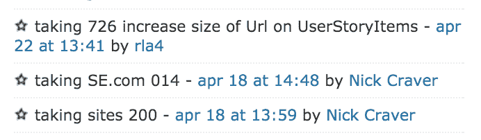</picture>T6】](/blog/content/SO-Deployment-Stars.png)

而这里的本地`%Repo%\StackOverflow.Migrations\`文件夹: [<picture><source type="image/webp" srcset="/blog/content/SO-Deployment-Migrations.webp"> <source type="image/png" srcset="/blog/content/SO-Deployment-Migrations.png"> 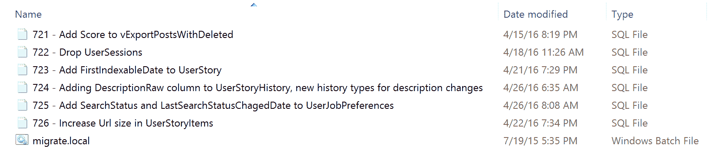</picture>](/blog/content/SO-Deployment-Migrations.png) 

你可以在聊天和本地看到 726 是最后一个迁移号码。所以我们会在 chat 中发出一条“拿 727——把 JSON 放到 SQL 里看看得罪了谁”的消息。这将要求下一次迁移，这样我们就不会与也在进行迁移的其他人发生冲突。我们只要输入一条聊天信息，一个机器人就能把它固定住。有趣的事实:当我说“使 web 2 离线”时，它也固定，但我们认为这很有趣，并拒绝修复它。这是我们的小玩具机器人:

[<picture><source type="image/webp" srcset="/blog/content/SO-Deployment-Pinbot.webp"><source type="image/png" srcset="/blog/content/SO-Deployment-Pinbot.png">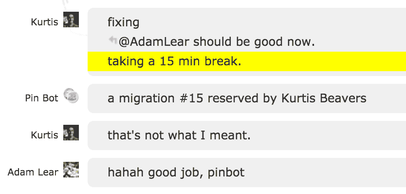</picture>T6】](/blog/content/SO-Deployment-Pinbot.png)

现在让我们添加一些代码——这里我们将保持简单:

一个`\StackOverflow\Models\User.cs`差异:


```
+ public string PreferencesJson { get; set; }
```


还有我们的新`\StackOverflow.Migrations\727 - Putting JSON in SQL to see who it offends.sql`:


```
If dbo.fnColumnExists('Users', 'PreferencesJson') = 0
Begin
    Alter Table Users Add PreferencesJson nvarchar(max);
End
```


我们已经通过在 SSMS 的本地问答数据库上运行测试了迁移工作，并且在它上面的代码工作正常。但是在部署之前，我们需要确保它作为迁移运行*。例如，有时您可能会忘记放置一个 [GO](https://msdn.microsoft.com/en-us/library/ms188037.aspx) 来分隔批处理中必须是第一个或者唯一的操作，比如创建一个视图。因此，我们在转轮中测试它。为此，我们运行您在上面截图中看到的`migrate.local.bat`。内容很简单:*


```
..\Build\Migrator-Fast --tier=local 
  --sites="Data Source=.;Initial Catalog=Sites.Database;Integrated Security=True" %*
PAUSE
```


注意:迁移器是一个项目，但是我们只是删除了。因为这是最简单、最容易移植的方法。

这个迁移者做什么？它命中我们的本地副本`Sites`数据库。它包含开发人员在本地运行的所有 Q & A 站点的列表，迁移器使用该列表来连接并并行运行针对所有数据库的所有迁移。下面是一个简单的安装和一个数据库的运行情况:

[<picture><source type="image/webp" srcset="/blog/content/SO-Deployment-Migration-Log.webp"><source type="image/png" srcset="/blog/content/SO-Deployment-Migration-Log.png">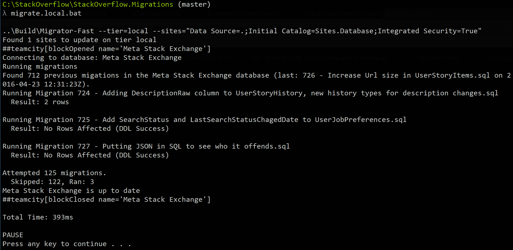</picture>T6】](/blog/content/SO-Deployment-Migration-Log.png)

到目前为止，一切顺利。我们有工作的代码和迁移，也有工作的代码…一些东西(与这个过程无关)。现在是时候带着我们的小代码宝宝，把它送到外面的世界了。是时候放飞小代码了，成为[freeee](https://youtu.be/LnlFDduJV8E?t=48s)！好了，现在我们兴奋了，典型的过程是:


```
git add <files> (usually --all for small commits)
git commit -m "Migration 727: Putting JSON in SQL to see who it offends"
git pull --rebase
git push
```


注意:我们首先检查我们的团队聊天室，看看是否有人正在部署。由于我们的部署非常迅速，这种情况发生的几率不会那么大。但是，考虑到我们部署的频率，冲突可能并且确实会发生。然后我们对负责的设计师大喊大叫。

关于上面的 Git 命令:如果命令行对你有用，就使用它。如果 GUI 对你有用，那就使用它。使用最适合你的工具，不要在乎别人怎么想。从古代的锤子到现代的 Git 安装，工具的全部意义在于节省用户的时间和精力。尽可能节省你的时间和精力。除非是 Emacs，那就马上咨询医生。

### 分支

我没有提到上面的分支，因为与许多团队相比，我们很少使用它们。大多数提交发生在`master`。一般来说，我们分支只是出于几个原因之一:

*   开发人员是新手，在早期我们需要代码评审
*   一个开发人员正在开发一个大的(或者有风险的)特性，并且想要一个一次性的代码审查
*   几个开发人员正在开发一个大功能

除了上面(通常很少)的情况，几乎所有的提交都是直接提交给`master`的，并在之后很快部署。我们不喜欢庞大的构建队列。这鼓励我们经常进行小规模到中等规模的提交，并经常进行部署。这只是我们选择的操作方式。我不建议大多数团队或任何团队这样做。做对你有用的事情。这对我们来说很简单。

当我们做分支时，合并总是人们感兴趣的话题。在绝大多数情况下，当合并到 master 中时，我们会压缩，这样回滚更改就很简单了。我们还保留最初的分支几天(对于任何主要的事情),以确保我们不需要引用那个*特定的*变化是关于什么的。也就是说，我们很实际。如果一个南瓜代表了开发者大量的时间投入，那么我们就吃掉合并历史，继续我们的生活。

### 本地 Git

好了，我们的代码被发送到服务器端的 repo。哪个回购？我们目前使用 [Gitlab](https://about.gitlab.com/) 作为仓库。差不多就是 [GitHub](https://github.com/) ，在本地托管。如果 Gitlab 的定价继续变得疯狂(注:我说的是“更疯狂”，不是“更贵”)，我们肯定会再次重新评估 [GitHub Enterprise](https://enterprise.github.com/home) 。

为什么要本地部署 Git 托管？为了便于论证，假设我们改用了 GitHub(我们确实评估了这个选项)。有什么区别？首先，构建速度较慢。虽然 GitHub 的 Git 协议实现要快得多，但延迟和带宽使得构建比本地拉 2x10Gb 要慢。但平心而论，GitHub 在*大部分*操作上(尤其是搜索和查看大 diffs)要远远快于 Gitlab。

然而，依赖 GitHub(或任何非现场第三方)对我们来说有一些严重的缺点。主要的缺点是依赖链。我们不仅仅依赖 GitHub 服务器在线(它们的正常运行时间相当不错)。我们依靠他们在线*并能够联系到他们*。就此而言，我们也依赖于我们所有的远程开发人员能够首先推送代码。在我们和构建所需的基本要素之间，有大量的交换、路由、光纤和 DDoS 表面积:**代码**。我们可以通过在本地服务器上极大地缩短依赖链。它也减轻了我们对第三方服务器上敏感代码的大多数安全担忧。我们没有任何 GitHub 安全问题或类似问题的内部消息，我们只是对这些事情格外小心。很简单:如果某样东西不需要离开你的网络，最好的安全措施就是不让它离开你的网络。

也就是说，我们的开源项目[托管在 GitHub](https://github.com/StackExchange/) 上，它运行得非常好。出于与上述相同的原因，关键的问题也会在 Gitlab 上进行内部镜像。我们对 GitHub 没有问题(他们很棒)，只有依赖链。对于那些不知道的人来说，甚至这个网站[也在 GitHub 页面上运行](https://github.com/NickCraver/nickcraver.github.com)…所以如果你在这个帖子中看到一个错别字，[提交一个 PR](https://github.com/NickCraver/nickcraver.github.com/pulls) 。

### 该构建系统

一旦代码在回购中，持续集成构建就接管了。这只是对由提交启动的构建的一个花哨术语。对于构建，我们使用[团队合作](https://www.jetbrains.com/teamcity/)。TeamCity 服务器实际上与 Gitlab 在同一个 VM 上，因为离开了另一个服务器，两者都没有用，这使得 TeamCity 对变更的轮询成为一种快速而廉价的操作。有趣的事实:由于 Linux 没有内置的 DNS 缓存，大多数 DNS 查询都是在寻找…本身。哦，等等，这不是一个有趣的事实——这实际上是一个痛苦的事情。

你可能听说过，我们喜欢让事情变得非常简单。我们的 web 层有额外的计算能力，所以…我们使用它。所有网站的构建都在 web 层本身的代理上运行，这意味着每个数据中心有 11 个本地构建代理。其他虚拟机上有一些额外的 Windows 和 Linux 构建代理(用于 puppet、rpm 和内部应用程序)，但它们与此部署流程无关。

像大多数 CI 构建一样，我们只是每隔一段时间轮询一次 Git repo，看看是否有变化。这种回购是沉重的打击，所以我们每 15 秒钟轮询变化。我们不喜欢等待。等待真糟糕。一旦检测到更改，构建服务器就会指示代理运行构建。

由于我们的回购量很大(我们包括 NuGet 包之类的依赖项，尽管[正在改变](https://github.com/NuGet/NuGetGallery/issues/3004)，我们使用 TeamCity 所说的[代理端结帐](https://confluence.jetbrains.com/display/TCD9/VCS+Checkout+Mode)。这意味着代理直接从存储库中获取内容，而不是默认的 web 服务器执行签出并将所有源代码发送给代理。在此之上，我们使用了 [Git 镜像](https://confluence.jetbrains.com/display/TCD9/Git#Git-AgentSettings)。镜像在代理上维护一个完整的存储库(每个 repo 一个)。这意味着代理第一次构建给定的存储库时，它是一个完整的`git clone`。然而，每次*过后*那就只是一个`git pull`了。没有这种优化，我们谈论的是一个`git clone --depth 1`，它获取当前的文件状态而没有历史记录——这正是我们构建所需要的。对于非常小的增量，我们已经推过(像大多数提交一样)一个`git pull`的 *only* ，这个增量将总是在网络上抓取所有文件。首次构建成本是一个显而易见的权衡。

正如我前面所说的，这个回购中有许多项目(都是相互关联的)，所以我们实际上是在讨论运行每个提交的几个构建(总共 5 个):

[<picture><source type="image/webp" srcset="/blog/content/SO-Deployment-Dev-Builds.webp"><source type="image/png" srcset="/blog/content/SO-Deployment-Dev-Builds.png">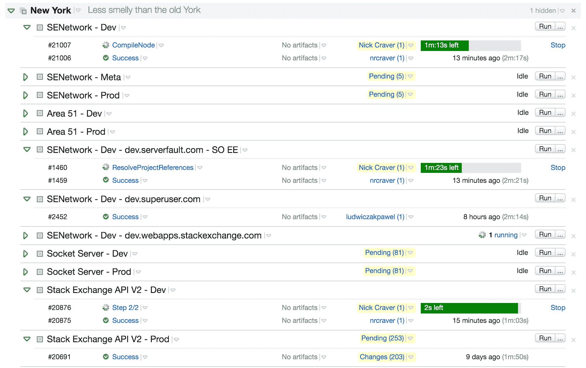</picture>T6】](/blog/content/SO-Deployment-Dev-Builds.png)

### 建筑里有什么？

好的……这个建筑实际上在做什么？让我们从最高层面看一下，并对其进行分解。以下是我们开发/CI 构建中的 9 个构建步骤:

[<picture><source type="image/webp" srcset="/blog/content/SO-Deployment-Dev-Build-Steps.webp"><source type="image/png" srcset="/blog/content/SO-Deployment-Dev-Build-Steps.png">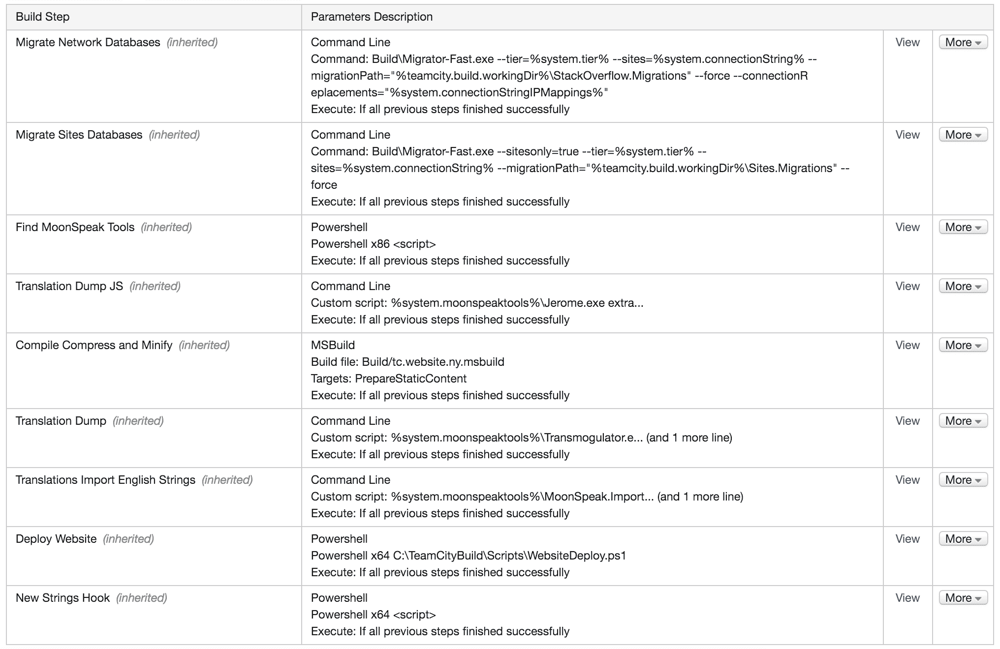</picture>T6】](/blog/content/SO-Deployment-Dev-Build-Steps.png)

下面是我们上面触发的构建日志的样子([你可以在这里](https://gist.github.com/NickCraver/d22d285e35ea6816bc4efe8e81ff152c#file-teamcity-dev-build-log-txt)看到完整版本):

[<picture><source type="image/webp" srcset="/blog/content/SO-Deployment-Dev-Build-Log.webp"><source type="image/png" srcset="/blog/content/SO-Deployment-Dev-Build-Log.png">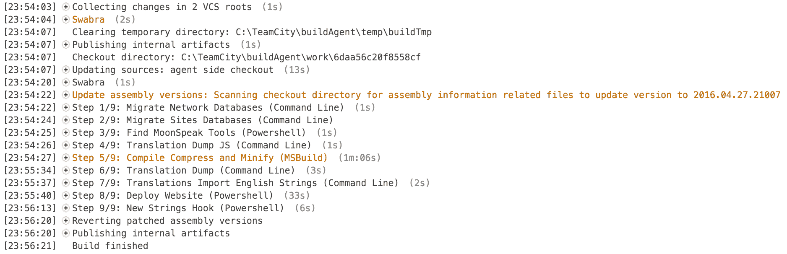</picture>T6】](/blog/content/SO-Deployment-Dev-Build-Log.png)

#### 步骤 1 和 2:迁移

前两步是迁移。在开发中，我们自动迁移“站点”数据库。这个数据库是我们的中央存储，包含站点的主列表和其他网络级项目，如收件箱。同样的迁移在生产中不会自动进行，因为“这个运行应该在代码部署之前还是之后？”是一个对半的问题。第二步是我们在本地运行的，只是针对 dev。在 dev 中，停机一秒钟是可以接受的，但这仍然不应该发生。在元构建中，我们迁移所有的生产数据库。这意味着堆栈溢出的数据库在代码前分钟*获得新的 SQL 位。我们命令适当地部署。*

这里重要的部分是**数据库总是在代码部署之前被迁移**。数据库迁移本身就是一个话题，也是人们感兴趣的事情，所以我稍后会在这篇文章中更详细地介绍它们[。](#database-migrations)

#### 第三步:寻找月球语言(翻译)

由于构建过程的结构和限制，我们必须定位我们的 Moonspeak 工具，因为我们不知道确切的位置(由于版本在路径中，它随着每个版本而变化)。好吧，什么是月语？Moonspeak 是我们本地化工具的[代号](https://meta.stackexchange.com/a/25529/135201)。别急，[我们稍后会深入报道](https://trello.com/c/GdywwBgb/24-localization-moonspeak-translations)。步骤本身很简单:


```
echo  "##teamcity[setParameter name='system.moonspeaktools' 
  value='$((get-childitem  -directory  packages/StackExchange.MoonSpeak.2*).FullName)\tools']"
```


它只是抓取一个目录路径并将`system.moonspeaktools` TeamCity 变量设置为结果。如果你对与 TeamCity 的构建互动的各种方式感兴趣，[这里有一篇文章](https://confluence.jetbrains.com/display/TCD9/Build+Script+Interaction+with+TeamCity)。

#### 步骤 4:翻译转储(JavaScript 版本)

特别是在 dev 中，我们用 JavaScript 运行所有需要翻译的字符串的转储以进行本地化。同样，命令非常简单:


```
%system.moonspeaktools%\Jerome.exe extract 
  %system.translationsDumpPath%\artifact-%build.number%-js.{0}.txt en;pt-br;mn-mn;ja;es;ru
  ".\StackOverflow\Content\Js\*.js;.\StackOverflow\Content\Js\PartialJS\**\*.js"
```


唷，那很容易。不知道为什么大家都讨厌本地化。开个玩笑，本地化在这里也很烂。现在，我不想深入探讨本地化，因为这本身就是一篇完整的(很长的)帖子，但这里有一些翻译基础知识:

在代码中，字符串由`_s()`(常规字符串)或`_m()` (markdown)包围。我们喜欢`_s()`和`_m()`。对于 JavaScript 和 C#来说几乎是一样的。在构建期间，我们通过分析 JavaScript(使用 [AjaxMin](https://www.nuget.org/packages/AjaxMin/) )和 C#/Razor(使用基于 Roslyn 的定制构建)来提取这些字符串。我们将这些字符串放入文件中，供翻译人员、我们的社区团队使用，并最终用于以后的构建。显然还有更多的方式在进行——但这些都是相关的部分。这里值得一提的是，我们对 Roslyn 未来版本中提出的 [Source Generators](https://github.com/dotnet/roslyn/blob/features/source-generators/docs/features/generators.md) 特性感到兴奋。我们希望在它的最终版本中，我们能够将 Moonspeak 的这一部分重写为一个更简单的生成器，同时尽可能地避免运行时分配。

#### 步骤 5: MSBuild

这是大部分奇迹发生的地方。这是一个单独的步骤，但在幕后，我们正在对 MSBuild 做一些不可描述的事情，我想我将…谈到这些事情。完整的`.msbuild`文件[在之前的](https://gist.github.com/NickCraver/b59ff38567b32936e2a3440e439d5d5c#file-build-msbuild)中。最相关的部分是对疯狂的描述:


```
THIS IS HOW WE ROLL:  
CompileWeb - ReplaceConfigs - - - - - - BuildViews - - - - - - - - - - - - - PrepareStaticContent  
                   \                                                            /|  
                    '- BundleJavaScript - TranslateJsContent - CompileNode   - '  
NOTE:  
since msbuild requires separate projects for parallel execution of targets, this build file is copied
2 times, the DefaultTargets of each copy is set to one of BuildViews, CompileNode or CompressJSContent. 
thus the absence of the DependesOnTarget="ReplaceConfigs" on those _call_ targets
```


虽然我们在 repo 中维护文件的一个副本，但在构建期间，它实际上分叉成两个并行的 MSBuild 进程。我们简单地复制文件，更改`DefaultTargets`，并在这里并行启动[。](https://gist.github.com/NickCraver/b59ff38567b32936e2a3440e439d5d5c#file-build-xml-L146)

第一个过程是用我们在 [StackExchange 中定制的基于罗斯林的构建来构建 ASP.NET MVC 视图。预编译](https://github.com/StackExchange/StackExchange.Precompilation)，[此处由 Samo Prelog 解释](https://stackoverflow.blog/2015/07/23/announcing-stackexchange-precompilation/)。它不仅构建视图，还通过`switch`语句插入每种语言的本地化字符串。在[下面一点](#localizationtranslations-moonspeak)中有一个提示。我们为本地化编写了这个过程，但是事实证明控制视图构建的速度和批处理允许我们比过去快得多。不过，有传言说最近那里的表现有所改善。

第二个过程是`.less`、`.css`、`.js`的编译和缩小，涉及几个组件。首先是`.jsbundle`文件。它们是简单的文件，如下例所示:


```
{  "items":  [  "full-anon.jsbundle",  "PartialJS\\full\\*.js",  "bounty.js"  ]  }
```


这些文件名副其实，它们只是为了以后使用而连接起来的文件包。这允许我们将 JavaScript 很好地划分到许多文件中，但是在构建的其余部分中，将它作为一个文件来处理。相同的 bundler 代码在本地作为 HTTP 处理程序运行，以便为本地开发动态组合。这种分享让我们尽可能地模仿生产。

在捆绑之后，我们有了包含 JavaScript 的常规旧`.js`文件。他们有字母，数字，甚至一些分号。它们很可爱。在那之后，他们通过了末日翻译器*。我们认为。没有人真正知道。这是黑魔法。实际上这里发生的并不相关，但是我们得到了`full.en.js`、`full.ru.js`、`full.pt.js`等等。插入适当的翻译。每个文件都有相同的`<filename>.<locale>.js`模式。我将和萨莫一起深入探讨一下[本地化帖子](https://trello.com/c/GdywwBgb/24-localization)(如果你好奇，就去投票吧)。*

 *JavaScript 翻译完成后(10-12 秒)，我们继续构建 Node.js 部分。注意:节点未安装在生成服务器上；回购协议里需要的东西我们都有。我们为什么要用 Node.js？因为它是 [Less.js](http://lesscss.org/) 和 [UglifyJS](https://github.com/mishoo/UglifyJS2) 的原生平台。曾几何时，我们使用 [dotLess](http://www.dotlesscss.org/) ，但是我们厌倦了维护这个分支，为了更快地吸收新版本，我们采用了节点构建过程。

`node-compile.js`是[也在要旨](https://gist.github.com/NickCraver/b59ff38567b32936e2a3440e439d5d5c#file-node-compile-js)中。这是一个简单的分叉脚本，它设置`n`节点工作进程来处理我们拥有的数百个文件(由于有数百个站点),主线程分发工作。相同的文件(例如测试版站点)会被计算一次，然后进行缓存，因此我们不会重复做一百次相同的工作。它还可以根据内容的散列在我们的 SVG URLs 上添加缓存中断器。由于我们也在应用程序级别为 CSS 提供了一个缓存中断器，所以我们有一个从下到上变化的缓存中断器，当有任何变化时，在客户端正确地进行缓存中断。该脚本可能会有很大的改进(我对此表示欢迎)，它只是在编写时最简单的工作并符合我们的要求的东西，自那以后不需要做太多改变。

注意:缓存破坏器计算的一个(完全无意的)好处是我们永远不会在 CSS 中部署不正确的图像路径。这种情况会变得更糟，因为我们找不到文件来计算哈希值…并且构建会失败。

node-compile 的全部工作是缩小`.js`文件(就地，不是类似于`.min.js`的东西)并将`.less`变成`.css`。完成之后，MSBuild 产生了运行一个漂亮的网站所需的所有输出。或者至少类似于堆栈溢出。请注意，我们有点奇怪，因为我们在许多站点主题中共享样式，所以我们一次转换数百个`.less`文件。这就是产生工作线程的原因——产生的工作线程数量取决于核心数量。

#### 步骤 6:翻译转储(C#版)

这一步我们称之为转换器。它将我们在 C#和 Razor 中使用的所有要本地化的字符串复制到`_s()`和`_m()`中，这样我们就有了发送给翻译器的总集合。这不是一个直接的提取，它是一些自定义属性的集合，这些属性是我们在上一步编译过程中翻译时添加的。这一步只是 JavaScript 的第 4 步中发生的事情的一个稍微复杂一点的版本。我们将文件转储到原始的`.txt`文件中，以备后用(并作为一种历史)。我们还在这里转储覆盖，在这里我们直接在我们的翻译人员翻译的之上提供覆盖*。这些是我们想要上游的典型社区修复。*

我意识到，如果不深入研究翻译系统是如何工作的，很多东西都没有意义——这将是未来文章的主题。最基本的是:我们从我们的代码库中转储所有的字符串，以便人们可以翻译它们。当它们被翻译后，它们将在下一个版本中用于上面的第 5 步。

以下是整个步骤:


```
%system.moonspeaktools%\Transmogulator.exe .\StackOverflow\bin en;pt-br;mn-mn;ja;es;ru
  "%system.translationsDumpPath%\artifact-%build.number%.{0}.txt" MoonSpeak
%system.moonspeaktools%\OverrideExporter.exe export "%system.translationConnectionString%"
  "%system.translationsDumpPath%"
```


#### 步骤 7:导入英语字符串

在本地化中要考虑的一件奇怪的事情是*最简单的*翻译方式是*而不是*特殊情况英语。为此，我们在这里专门蹲点一下。该死，我们已经搞砸了。但是，通过在构建时对它进行特殊处理，我们避免了以后必须对它进行特殊处理。我们输入的几乎每一个英文字符串都是正确的，只需要对多个字符串进行翻译覆盖(例如“1 个项目”对“2 个项目”)，因此我们希望立即导入添加到英文结果集中的任何内容，以便在第一次构建时就为堆栈溢出做好准备(例如部署新功能时不会延迟翻译器)。最后，这一步使用在第 4 步和第 6 步中为英语创建的文本文件，并将它们插入(到我们的翻译数据库中)英语条目。

这一步还会将所有新字符串发布到一个特殊的内部聊天室，提醒我们所有语言的翻译人员，以便他们能够尽快翻译。虽然我们不希望延迟新字符串的构建和部署(它们可能以英文形式出现，我们对此没有意见)，但我们希望将其最小化——所以可以说我们有一个警告管道。本地化延迟是二元的:要么等待所有语言，要么不等待。我们选择更快的部署。

这是对步骤 7 的调用:


```
%system.moonspeaktools%\MoonSpeak.Importer.exe "%system.translationConnectionString%"
  "%system.translationsDumpPath%\artifact-%build.number%.en.txt" 9 false 
  "https://teamcity/viewLog.html?buildId=%teamcity.build.id%&tab=buildChangesDiv"
%system.moonspeaktools%\MoonSpeak.Importer.exe "%system.translationConnectionString%"
  "%system.translationsDumpPath%\artifact-%build.number%-js.en.txt" 9 false
  "https://teamcity/viewLog.html?buildId=%teamcity.build.id%&tab=buildChangesDiv"
```


#### 步骤 8:部署网站

这就是我们所有努力的回报。好吧，构建服务器的工作真的很辛苦…但是我们得到了荣誉。我们在这里有一个目标:将我们构建的代码转化为所有目标 web 服务器上的活动代码。当你真的需要做一些简单的事情时，这就是你变得非常复杂的地方。要将更新的代码部署到 web 服务器上，您真正需要做什么？三件事:

1.  停止网站
2.  覆盖文件
3.  启动网站

就是这样。这是所有的主要部分。所以让我们尽可能地接近最愚蠢、最简单的过程。这是对该步骤的调用，这是一个 PowerShell 脚本，我们将它预先部署在所有构建代理上(带有一个构建),很少更改。我们对所有 IIS 网站部署使用相同的脚本集，甚至是基于 Jekyll 的博客。下面是我们传递给`WebsiteDeploy.ps1`脚本的参数:


```
-HAProxyServers  "%deploy.HAProxy.Servers%"  -HAProxyPort  %deploy.HAProxy.Port%  -Servers  "%deploy.ServerNames%"  -Backends  "%deploy.HAProxy.Backends%"  -Site  "%deploy.WebsiteName%"  -Delay  %deploy.HAProxy.Delay.IIS%  -DelayBetween  %deploy.HAProxy.Delay.BetweenServers%  -WorkingDir  "%teamcity.build.workingDir%\%deploy.WebsiteDirectory%"  -ExcludeFolders  "%deploy.RoboCopy.ExcludedFolders%"  -ExcludeFiles  "%deploy.RoboCopy.ExcludedFiles%"  -ContentSource  "%teamcity.build.workingDir%\%deploy.contentSource%"  -ContentSStaticFolder  "%deploy.contentSStaticFolder%"
```


我在这里的要点中包含了脚本[，为了完整起见，包含了概要中的所有相关函数。主脚本的主要内容在这里(下面的行被缩短了，但完整的版本在要点中):](https://gist.github.com/NickCraver/b59ff38567b32936e2a3440e439d5d5c#file-deployscripts-ps1)


```
$ServerSession  =  Get-ServerSession  $s  if  ($ServerSession  -ne  $null)  {  Execute  "Server: $s"  {  HAProxyPost  -Server  $s  -Action  "drain"  # delay between taking a server out and killing the site, so current requests can finish  Delay  -Delay  $Delay  # kill website in IIS  ToggleSite  -ServerSession  $ServerSession  -Action  "stop"  -Site  $Site  # inform HAProxy this server is down, so we don't come back up immediately  HAProxyPost  -Server  $s  -Action  "hdown"  # robocopy!  CopyDirectory  -Server  $s  -Source  $WorkingDir  -Destination  "\\$s\..."  # restart website in IIS  ToggleSite  -ServerSession  $ServerSession  -Action  "start"  -Site  $Site  # stick the site back in HAProxy rotation  HAProxyPost  -Server  $s  -Action  "ready"  # session cleanup  $ServerSession  |  Remove-PSSession  }  }
```


这里的步骤是*优雅地*更新网站所需的最少步骤，通知负载均衡器正在发生什么，并尽可能少地影响用户。事情是这样的:

1.  告诉[ha proxy](https://www.haproxy.org/)停止发送新流量
2.  等待几秒钟，让所有当前请求完成
3.  告诉 IIS 停止站点( [`Stop-Website`](https://technet.microsoft.com/en-us/library/ee790607.aspx) )
4.  告诉 HAProxy 该 web 服务器已关闭(而不是等待它检测)
5.  复制新代码( [`robocopy`](https://technet.microsoft.com/en-us/library/cc733145.aspx) )
6.  告诉 IIS 启动新站点( [`Start-Website`](https://technet.microsoft.com/en-us/library/hh867884(v=wps.630).aspx) )
7.  告诉 HAProxy 这个网站已经准备好了

请注意，HAProxy 并没有立即让网站重新上线。它将在 3 次成功轮询后完成，这是 HAProxy 中`MAINT`和`DRAIN`的关键区别。`MAINT`->-`READY`假设服务器瞬间启动。`DRAIN`->-`READY`呈下降趋势。前者对线程池的增长有着非常恶劣的影响，在事情加速发展的时候等待最初的重击。

我们对构建中的所有 web 服务器重复上述步骤。每台服务器之间也有轻微的停顿，所有这些都可以通过 TeamCity 设置进行调整。

以上是单个网站的情况*。实际上，这一步部署了两次。原因是比赛条件。为了获得最佳的客户端性能，我们的静态资产将头设置为缓存 7 天。我们只在缓存*改变*的时候破坏它，而不是在每次构建的时候。毕竟，您只需要获取新的 CSS、SVG 或 JavaScript，如果它们真的改变了的话。由于 [`cdn.sstatic.net`](https://cdn.sstatic.net/) 来自我们下面的 web 层，下面是由于滚动构建的性质*可能发生的情况:**

 *你点击`ny-web01`,得到一个全新的新版本的查询字符串。然后你的浏览器在`cdn.sstatic.net`点击我们的 CDN，比如说点击`ny-web07`…里面有旧的内容。哦，糟糕，现在我们已经用新的哈希缓存旧的内容很长时间了。那不行，那是硬重装修复，*之后*你就整肃 CDN 了。我们通过将静态资产预先部署到 IIS 中专门为 CDN 服务的另一个网站来避免这种情况。这样`sstatic.net`就在发布新散列的新代码发布之前，在一个滚动部署中获得内容。这意味着，有些人很有可能会获得带有旧哈希的新静态内容(如果他们错过了一段实际上改变了这个版本的内容)。最大的区别是(很少命中)问题会在页面重新加载时自动修复，因为只要新代码运行一分钟后，散列就会改变。这是一个更好的失败方向。

在这一步结束时(在生产环境中)，9 个 web 服务器中有 7 个通常处于在线状态并为用户提供服务。最后两个将很快完成自旋。对于 9 台服务器，该步骤大约需要 2 分钟。但是耶，我们的代码是活的！现在我们可以自由地再次部署我们可能刚刚发出的 bug 了。

#### 第九步:新的字符串挂钩

这个只针对开发人员的步骤并不特别有趣，但是很有用。它所做的就是调用一个 webhook，告诉它在这个构建中出现了一些新的字符串，如果有的话。hook 目标触发上传到我们的翻译服务，以缩短翻译的迭代时间(类似于上面的聊天机制)。最后是因为严格来说它是可选的，我们不希望它干扰。

就是这样。开发构建完成。收起[轮椅和剑](https://xkcd.com/303/)。

### 层

我们上面介绍的是用所有的东西构建的整个开发 CI。所有的翻译都是开发，因为我们只需要得到字符串一次。元构建和生产构建是这些步骤的一个简单子集。下面是一个简单的可视化示例，比较了不同层的构建步骤:

| 构建步骤 | 偏差 | 自指的 | 刺 |
| 1 -迁移站点数据库 |  |  |  |
| 2 -迁移问答数据库 |  |  |  |
| 3 -查找 MoonSpeak 工具 |  |  |  |
| 4 -翻译转储(JavaScript) |  |  |  |
| 5 - MSBuild(编译压缩和缩小) |  |  |  |
| 6 -翻译转储(C#) |  |  |  |
| 7 -翻译导入英语字符串 |  |  |  |
| 8 -部署网站 |  |  |  |
| 9 -新绳钩 |  |  |  |

这些层级实际上意味着什么？我们所有的开发站点都在 WEB10 和 WEB11 服务器上(在不同的应用程序池和网站下)。Meta 运行在 WEB10 和 WEB11 服务器上，具体来说就是 meta.stackexchange.com 的[和 meta.stackoverflow.com 的](https://meta.stackexchange.com/)和[的](https://meta.stackoverflow.com/)。生产(所有其他 Q & A 站点和 metas)像堆栈溢出都在 WEB01-WEB09 上。

注意:当有人通过各层时，我们会发出聊天通知。这是一个星期五的下午 5:17，我(不顾所有理智的判断)在做一些改变。不要在家里尝试这个，我是专业的。有时候。不经常。

[<picture><source type="image/webp" srcset="/blog/content/SO-Deployment-Chat.webp"><source type="image/png" srcset="/blog/content/SO-Deployment-Chat.png">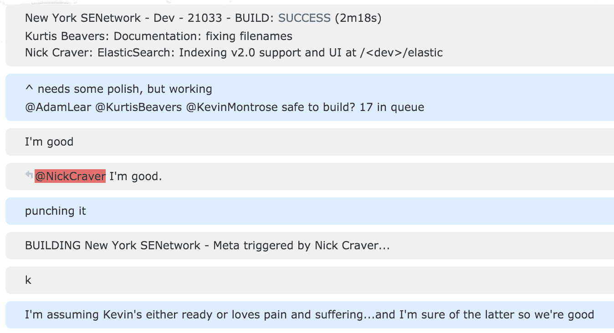</picture>T6】](/blog/content/SO-Deployment-Chat.png)

### 数据库迁移

看到了吗？我答应过我们会回来的。重申一下:如果需要新代码来处理数据库迁移，*必须首先部署*。但是在实践中，您可能会删除一个表，或者添加一个表/列。对于删除的情况，我们从代码中删除它，部署，然后用 drop 迁移再次(或稍后)部署。对于添加的情况，我们通常将它添加为可空的或在代码中未使用的。如果需要是`not null`，外键等。我们在以后的部署中也会这样做。

我们使用的数据库迁移器是一个非常简单的 repo，我们可以开源，但老实说，有几十个，而且“针对 n 个数据库的相同迁移”是相当具体的。其他的可能要好得多，我们的非常适合*和*我们的需求。迁移器连接到站点数据库，获取要运行的数据库列表，并对每个数据库执行所有迁移(并行运行多个数据库)。这是通过查看传入的迁移文件夹并加载它(一次)以及散列每个文件的内容来完成的。每个数据库都有一个`Migrations`表，记录已经运行的内容。看起来是这样的(降序):

[<picture><source type="image/webp" srcset="/blog/content/SO-Deployment-Migrations-Table.webp"><source type="image/png" srcset="/blog/content/SO-Deployment-Migrations-Table.png">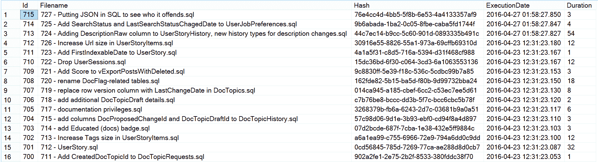</picture>T6】](/blog/content/SO-Deployment-Migrations-Table.png)

请注意，以上并不都是按照文件编号顺序排列的。那是因为 724 和 725 在一个分店待了几天。这不是问题，秩序没有保证。**每个迁移本身都被写成幂等的**，例如“如果列已经存在，就不要试图添加”，但是具体的顺序通常并不相关。要么它们都是每个特性的，要么它们实际上是按顺序排列的。迁移器使用`GO`操作符来分隔批处理，默认情况下在一个事务中运行所有迁移。可以用`.sql`文件中的第一行注释来改变事务行为:`-- no transaction --`。也许对迁移者最有用的解释是我为它写的 README.md。[这是要点](https://gist.github.com/NickCraver/b59ff38567b32936e2a3440e439d5d5c#file-sql-migrator-readme-md)。

在内存中，我们将已经运行的迁移列表与需要运行的迁移列表进行比较，然后按照文件顺序执行需要运行的迁移。如果我们发现文件名的散列与表中具有相同文件名的迁移不匹配，作为一种安全措施，我们会中止迁移。我们可以`--force`解决这个问题，在极少数情况下，迁移*应该*已经改变(几乎总是由于开发人员的错误)。所有迁移完成后，我们就完成了。

回滚。我们很少这样做。事实上，我不记得曾经做过。一般来说，我们通过这样的方法来避免它们:我们经常进行小规模部署。修复代码和部署通常比逆向迁移更快，尤其是在数百个数据库之间。我们还尽可能地让开发模拟生产，定期恢复生产数据。如果我们需要扭转某些情况，我们可以推动另一次迁移，抵消我们所做的一切，从而实现繁荣。尽管这个工具没有回滚的概念。能前滚为什么要后滚？

### 本地化/翻译(Moonspeak)

这将有自己的帖子，但我想暗示一下为什么我们在编译时做所有这些工作。毕竟，我总是强烈提倡简单(是的，即使在这篇 6000 字的博客文章中，我也没有忘记讽刺)。只有当你需要 T2 做更复杂的事情时，你才应该做更复杂的事情。这是其中一种情况，为了提高性能。 [Samo](https://twitter.com/m0sa) 做了很多工作来使我们的本地化尽可能少的受到**运行时**的影响。我们很乐意牺牲一点构建复杂度来实现这一点。虽然有诸如 [`.resx`文件](https://msdn.microsoft.com/en-us/library/ekyft91f.aspx)或[ASP.NET 核心 1.0](https://github.com/aspnet/localization) 中的新本地化选项，但大多数选项都分配了多余的空间，尤其是对于标记化的字符串。下面是我们的代码中字符串的样子:

[<picture><source type="image/webp" srcset="/blog/content/SO-Deployment-Translations-1.webp"><source type="image/png" srcset="/blog/content/SO-Deployment-Translations-1.png">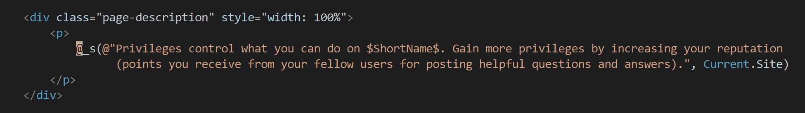</picture>T6】](/blog/content/SO-Deployment-Translations-1.png)

下面是编译后的代码行(通过反射器):[<picture><source type="image/webp" srcset="/blog/content/SO-Deployment-Translations-2.webp"><source type="image/png" srcset="/blog/content/SO-Deployment-Translations-2.png">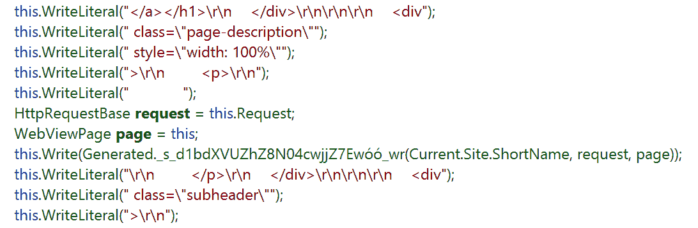</picture>](/blog/content/SO-Deployment-Translations-2.png)…最重要的是，编译后的实现: [<picture><source type="image/webp" srcset="/blog/content/SO-Deployment-Translations-3.webp"> <source type="image/png" srcset="/blog/content/SO-Deployment-Translations-3.png"> 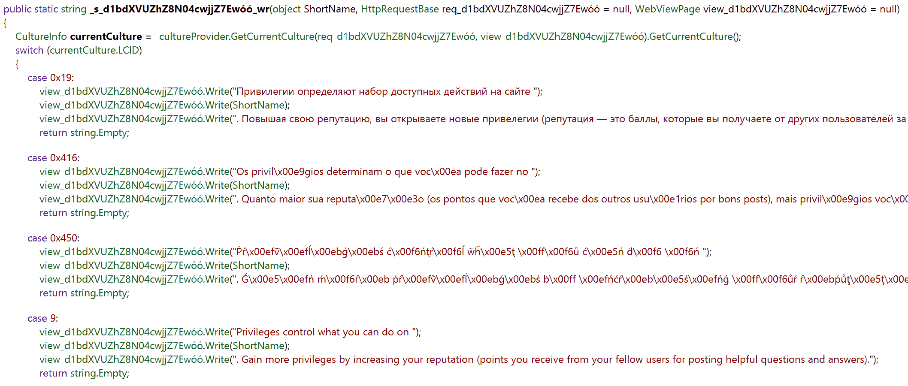</picture>](/blog/content/SO-Deployment-Translations-3.png) 

请注意，我们不是将整个字符串分配在一起，而是将片段分配在一起(大部分被拘留)。这看起来似乎是一件小事，但是从规模上来看，这是一个巨大的分配数量和垃圾收集器的大量时间。我敢肯定这只是提出了一大堆关于月语如何工作的问题。如果是的话，[去投票吧](https://trello.com/c/GdywwBgb/24-localization-moonspeak-translations)。这本身就是一个大话题，我只是想证明它在这里增加的编译时复杂性。对我们来说，这是值得的。

### 不破碎的建筑

我经常被问到的一个问题是，我们如何在不断推出新代码的同时防止中断。以下是我们遇到的一些常见问题以及我们如何避免它们。

*   缓存对象更改:
    *   如果我们有一个完全改变的缓存对象。这是一个新的缓存键，我们让旧的随着时间自然消失。
    *   如果我们有一个只在本地改变*(内存中)的缓存对象:什么都不做。新的应用领域不冲突。*
    **   如果我们有一个在 redis 中改变*的缓存对象，那么我们需要确保旧的和新的 [protobuf](https://github.com/mgravell/protobuf-net) 签名是兼容的…或者改变密钥。**
**   标签引擎:
    *   标签引擎在每次构建时重新加载(目前)。这是通过每分钟检查 web 层上的新构建散列来触发的。如果找到一个，应用程序`\bin`和一些配置将被下载到堆栈服务器主机进程，并作为一个新的应用程序域启动。这避免了部署到那些机器上的需要，并且保持本地开发设置简单(我们不在本地运行单独的过程)。
    *   这一点很快会有很大的改变，因为重新加载每一个版本是非常必要的。我们将很快转向更传统的“在 it 发生变化时部署”模式。可能使用 GPU。敬请关注。*   重命名 SQL 对象:
    *   “医生，我这样做的时候会痛！”
    *   “不要那样。”
    *   我们可以添加和迁移，但是实时重命名几乎肯定会导致某种中断。在 dev 之外我们不这么做。*   API:
    *   在新消费者之前部署新端点。
    *   如果改变一个现有的端点，它通常跨越 3 个部署:添加(端点)、迁移(消费者)、清理(端点)。*   bug:
    *   尽量不要部署 bug。
    *   如果你搞砸了，试着不要用同样的方式做两次。
    *   接受发生的事情，生活，学习，继续前进。*

 *这是我们部署过程的所有主要部分。但是和往常一样，在下面的评论中提出你的任何问题，你会得到一个答案。

我想花点时间感谢 Stack Overflow 的团队。我们一起建造这一切。很多人在这些博文发布前都会帮我审核一下，确保一切准确无误。帖子不短，有几个人在业余时间审查，因为他们只是在聊天中看到一个帖子，想帮忙。这些人在 Reddit、Hacker News 和其他地方的讨论中发表评论。他们回答出现的问题，或者把问题转给能回答的人。他们这样做是出于对社区的热爱。我非常感谢他们的努力，能和世界上最好的程序员和系统管理员一起工作是一种特权。我可爱的妻子 Elise 也抽出时间在这些视频上线前帮忙编辑。对你们所有人:谢谢。

下一步是什么？这个系列的工作方式是我按照社区最想知道的顺序写博客。通过[特雷罗董事会](https://trello.com/b/0zgQjktX/blog-post-queue-for-stack-overflow-topics)，看起来[监控](https://trello.com/c/1Oc9cC6u/11-monitoring)是下一个最有趣的话题。下一次，我们将学习如何监控 Stack 的所有系统。我将介绍我们如何监控服务器和服务，以及全世界用户看到的堆栈溢出的性能。我还将介绍我们正在使用和已经开发的许多监控工具；我们已经开源了几个大的。感谢你阅读这篇文章，这篇文章的结尾比我预想的要长，下次再见。*** 