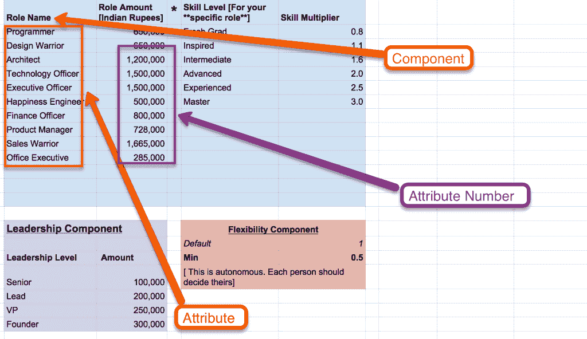
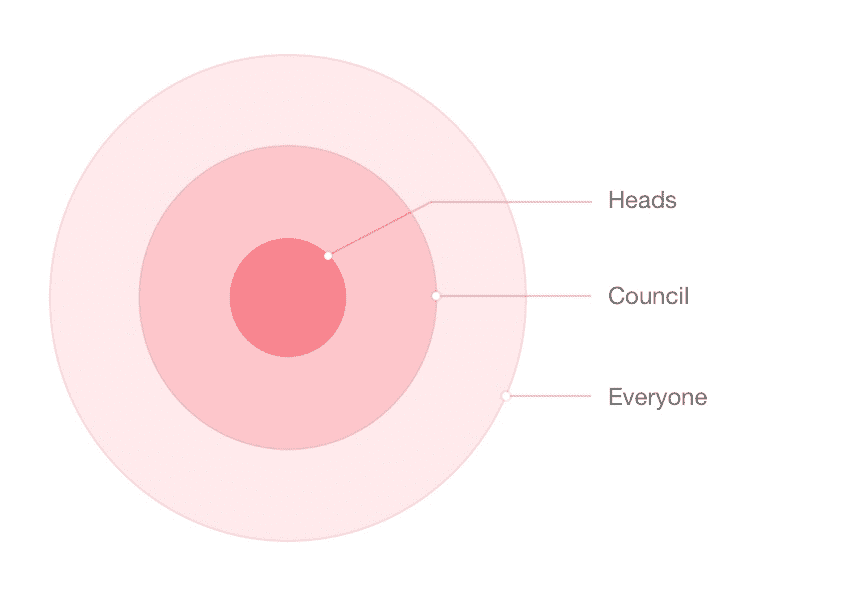
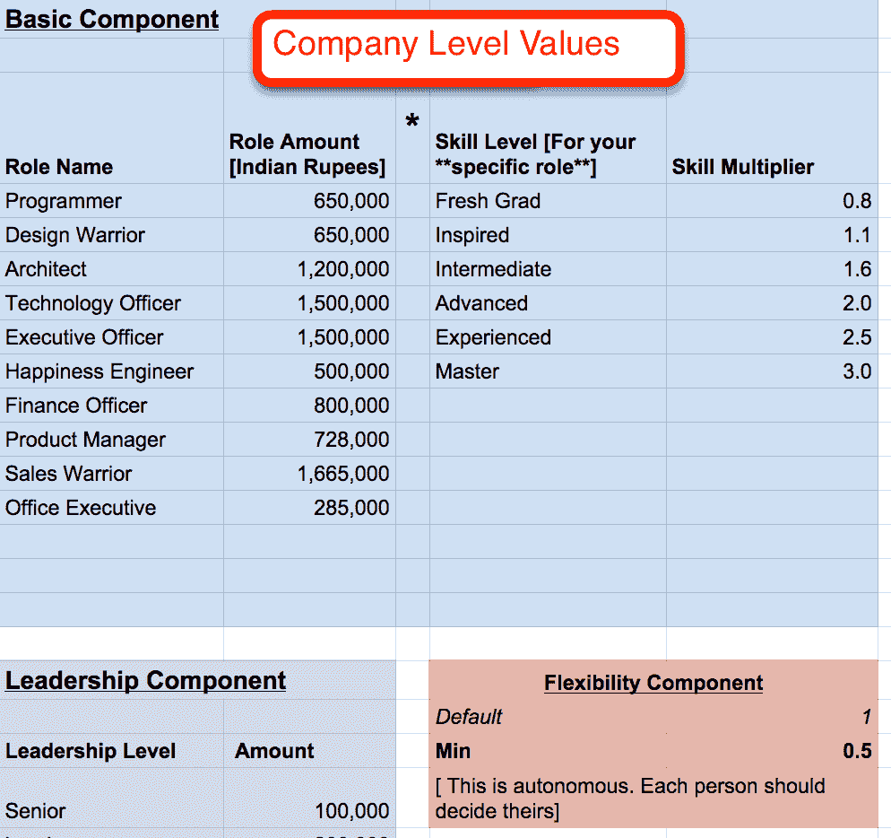
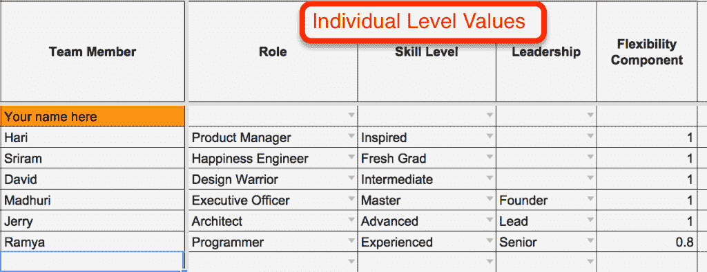

# 我们的开放(&自主)薪酬体系-背景故事[第一部分]

> 原文：<http://www.multunus.com/blog/2015/09/our-autonomous-salary-system-the-background-story-part-1/?utm_source=wanqu.co&utm_campaign=Wanqu+Daily&utm_medium=website>

# 我们的开放(&自主)薪酬体系-背景故事[第一部分]

[vaidy](/blog/tags/cap-vaidy)

2015 年 9 月 30 日

我们公司的几个人(也就是创始人)有一个不祥的责任，叫做“年度薪酬调整”。

我们害怕它。每年都是。

[图像信用](https://www.flickr.com/photos/paolomargari/)

*   它没有落入“创造性”任务的范畴。我们几乎没有从年复一年做同样的事情中学到任何东西。

*   关于我们的团队是否相信我们是公平的，我们几乎没有任何反馈。

*   这消耗了我们其他工作的大量时间。

我们想知道:与我们正在做的事情完全相反的是什么？

这些问题引起了我们的兴趣，以至于我们再也无法摆脱好奇心。所以在多年不敢做之后，我们终于咬紧牙关。

我们做了两件事:

*   我们把工资透明化了。我们所有的薪水现在都向公司内部的每个人公开。

*   我们使薪酬调整制度民主化。每个人都选择自己喜欢的薪水，然后试图从我们团队的其他人那里获得足够的支持来证明他们的期望。

如果你想知道这个系统是如何工作的，看看我们的[公开剧本](http://github.com/multunus/open-playbook)和[我们的公共电子表格模板](https://docs.google.com/spreadsheets/d/1MhoSHHSpOKYPM1Nx5n2XmjlK2ddouxL6byqEH0fZS2s/edit#gid=1267023075)。

这个帖子系列的重点是分享我们第一次这样做的经验。我们犯了很多错误，但也学到了很多。

最后，我认为我们已经成功地在 Multunus 开始了一场透明和自治的运动。从这个角度来看，这是一个“砰”的开始。:)

## 创建所有权

我们等了 7 年才推出这一系统，因为它涉及重大的社会和金融风险。

然而，打开局面的一个关键动机是，我们正在打造一家世界级的咨询公司。在像我们这样的工作场所，不了解情况的人几乎没有存在的空间。

整个团队需要了解我们业务中发生的事情。我们每个人都需要对公司有强烈的主人翁感。只有这样，我们所有人才能自信地在客户面前代表我们的公司。

创造这种主人翁感的一个关键因素是:信任。

## 建立信任

我们努力应对的一个关键挑战是在创始人和团队其他成员之间建立高度的信任感。这有点鸡和蛋的情况。哪一组应该首先表现出信任？

做对了没有奖励。创始人的主要责任是采取积极有效的措施来创造一个高度信任的环境。我们相信，这种姿态加上巨大的耐心将会在整个团队中全方位传播信任。

因此，我们做出以下决定:

*   越来越多地将通常被认为敏感和机密的信息透明化

*   将控制权分配给公司的每个人。这意味着公司的每个人都有责任做出重要的商业决策，而这些决策通常是在创始人或高管的控制之下

自主薪金制度是朝着上述方向迈出的第一步。

## 目标

对于我们正在构建的新薪酬体系，我们有以下目标:

*   大幅提高薪酬相关事宜的透明度。

*   为团队提供完全的控制权来选择他们自己的薪水。

*   培训团队开始使用我们的财务数据做出明智的薪酬水平决策。

*   保持整体开放——这样每个人都可以在过程的任何一步做出反应，如果他们有反馈或者想要改变。

*   在尽可能不影响我们日常运营的情况下执行流程。

## 风险

为了列出启动这种系统的风险，我们:

*   **研究了其他公司**:我们发现了很多非常好的文章(见最后的参考文献)——[尤其是这一篇](http://positivesharing.com/2006/08/the-case-against-open-salaries/)。在提供灵感和信心方面最有用的两家公司是:

*   [Buffer](https://open.bufferapp.com/introducing-open-salaries-at-buffer-including-our-transparent-formula-and-all-individual-salaries/) :都是因为他们激进的透明度(他们的工资都是公开的！)以及他们简单的薪资公式(我们以此为基础)。

*   Semco :代表里卡多·塞姆勒对平等工作场所的愿景。

*   **调查团队的情绪:**引入这种彻底的透明和自治的想法确实引发了一些恐惧和怀疑，但也引发了好奇和渴望。

通过研究和调查，我们发现了两大类风险:

1.  社会风险

2.  金融风险

## 社会风险

以下是我们考虑的主要社会风险:

*   **不公平感:**这通常是由薪酬确定过程中的高度主观性和模糊性造成的。我们引入了一个“薪资公式”，让这个过程更加客观。

*   **影响力和谈判技巧较高的人薪酬较高:**这在自治系统中是有可能的。我们引入了民主的制衡制度来降低这种风险。

*   低收入者的尴尬:这是一个关键问题。**

    *   **好处:**在“不太透明”的过去，我们付出了巨大努力来维护整个团队的薪酬公平。因此，从这个角度来看，公开工资并不是什么大事。

    *   **不太好的人:**但是我们担心我们团队中的某一组人(扮演特定角色)的薪酬比他们的同事低得多。虽然这本身并不是秘密，但在透明的环境中自尊心受损的风险仍然是一个重大风险。

    *   **解决方案:**

        *   我们决定不透露我们员工的现有工资。只有新修订的《自决》将对所有人开放。

        *   这种风险的根本原因是缺乏信心。解决方案是通过为我们的客户和社区创造巨大的价值来训练人们对自己的皮肤感到舒适并获得自信。我们也这么做。

    *   对某些人来说，薪水是个人的事:虽然我们很欣赏这个事实，但我们更看重的是团队中更高的信任度。我们也相信这是一种可以通过良好的指导而改变的观点。

## 金融风险

以下是金融风险列表:

*   **运营费用可能会失控** -潜在地影响业务的可持续性。

*   **公开我们的账目**:为了做到真正的透明，我们需要向公司的每个人公开我们的账目。这可能是一个潘多拉盒子——带来一系列全新的问题、担忧或对公司的怀疑。

这篇文章的其余部分将关注社会风险以及我们如何试图减轻它们。本系列的第 2 部分将详细介绍金融风险。

## 工资公式

我们采取的第一步是使用“工资公式”(与 Buffer 非常相似)标准化工资结构。这个公式将作为整个公司每个人工资计算的基础。这也是增加公平性的好方法。

缓冲工资公式有 3 个组成部分，分别对应“属性”和“属性号”:

*   **角色**和相应的基本工资

*   **技能等级**和相应的乘数因子

*   **领导成分**和相应的加法因子

我们添加了第四个组件:

*   **弹性系数**和相应的乘数系数。我们增加了这一点，以满足我们的一些员工的需求，他们喜欢工作时间较短。

[有关这些组件的更多详细信息，请参见我们的[开放式行动手册](http://github.com/multunus/open-playbook)

虽然上面的公式结构是一个很好的开始，但我们仍然需要确定哪些属性和属性编号对我们有意义。具体来说:

*   什么样的角色和匹配的基本工资对我们有意义？

*   我们应该选择什么样的技能水平和匹配的乘数因子？

*   我们应该选择什么样的领导级别和相应的数字？

*   灵活性因素如何发挥作用？

## 3 圈组织结构

我们知道需要多次迭代，直到我们有了适用于每个人的属性和属性编号的最终列表。

如前所述，我们还有另外两个目标:

为了实现这两个目标，我们创建了一个三圈组织结构:

**领导:**我们已经有了一个业务部门“领导”小组——每周开会讨论和规划公司的发展。

**委员会:**我们公司的一些团队成员已经在公司展示了一定的领导力，因此，我们邀请他们成立了“委员会”。

最后我们有了其他人。

> ***旁注**:我们更喜欢用圆圈而不是金字塔——因为这其实不是关于权威和控制——而是关于效率、实用主义和责任。中心的人比外围的人更有责任确保流程的成功。*

我们反复为每个组件插入数字，直到我们有了我们认为对每个人都有用的东西。负责人将首先为公式中的每个组成部分提出一些值，然后邀请理事会成员提供反馈。当领导和委员会同步时，我们准备让公司的其他人都参与进来，并获得他们的反馈。

## 混乱之夜

一天下午晚些时候，我们安排了一个 2 小时的马拉松会议，与大家见面。目标是确定每个人的号码，完成整个过程，继续我们的生活。

然而，这比我们预想的要困难得多。一片混乱。

## 僵局和关键经验

我们的目标是为全公司每个人的所有角色、技能水平和领导水平确定公式数。我们曾(天真地)假设人们会关注整个团队，而不会去发现这个公式会如何影响他们自己的数字。

在人们认为对公司每个人都好的东西和符合他们个人薪资偏好的东西之间，我们陷入了僵局。经过 6 个多小时反复修改数字的多次尝试，每个人都累了，回家了(真的很晚了！).

在这一点上，我们已经黔驴技穷了。事情看起来相当棘手。

然而，我们学到了以下 3 个关键点:

1.  重要的是要强调这样一个事实，即薪酬是个人创造的价值的直接衍生物。角色、技能和领导力是能够准确衡量这一点的工具。

2.  人们很难同时考虑公司和自己。

3.  民主制度需要某种层次的结构来引导这一过程，并帮助人们轻松快速地做出决策。

## 打破僵局——以牺牲一些透明度和自主权为代价

我们进行了以下更改，以实施上述学习内容:

1.  将公司和流程中的个人部分(详见下文)分开，使它们成为独立的步骤

2.  增加了一些简单的工具，使每个人都有可能有效地协调和集体决策

第二天早上，负责人聚在一起，提出了以下改变，以分离公司和个人级别的数字——尽管代价是显著降低透明度和自主权:

*   **第一步:公司级别数字的私下审查:**我们暂时取消了电子表格的可见性——因此在这一点上，它只对主管可见。然后，我们回顾并修改了属性列表和属性编号——牢记以下两个目标:

*   使用我们从之前的练习中收集的数据作为整个团队薪资偏好的关键指标

*   确保公司中每个人——包括角色、技能水平和领导——都保持公平

*   确保我们业务的可持续性

*   好消息是:我们已经完成了整个过程的一半，方程式的数字已经稳定了一些——足够的数据让我们有信心正确地感受到车队的脉搏。

*   **第二步:为每个公式组件选择个人级别:**我们隐藏了公司级别的公式编号，并要求委员会成员和公司的其他所有人按顺序选择他们(个人级别)的角色、技能、领导力和灵活性组件。

    *   这就确保了每个人都必须选择他们的角色、技能水平和领导价值观，而完全是基于这些因素的优劣，而不是基于最终计算出来的报酬。

    *   这需要代表我们团队的信念的飞跃，但是我们对团队中的任何人的想法都没有什么抵制。

*   **第三步:个人层面的民主:**一旦每个人都选择了各自的组成部分，我们就进入了第一个层面的民主:

    *   我们要求团队中的每个人从公司中至少 6 名角色、技能水平和领导水平分布合理的其他人那里获得投票，以表明对他们个人决策的支持。

    *   如果有人得不到支持，那么他们需要和其他人一起检查以找出原因。在这一点上，他们可以做一些常识性的事情——要么让其他人相信这些数字是有意义的，要么被说服改变他们自己的数字。

    *   这是一个神奇的时刻——因为在公司历史上，领导层第一次没有参与这些决策。是全队带动的。

    *   一旦每个人都获得了他们的数字所需的支持，我们就锁定电子表格以避免将来的更改。

*   **第四步:公布工资:**然后，我们向每个人公布公司级别的数字，然后在整个团队中应用公式数字。突然，团队里的每个人都能看到自己的工资了:)。

*   **第五步:工资民主:**在这一点上，我们要求每个人对他们看到的与自己名字相对的数字说“好”或“不好”。

    *   如果有一个“不确定”，那么他们还需要在开放的电子表格中陈述-为什么他们觉得数字不合适，他们期望多少，为什么批准他们自己的超驰对他们和公司都更好。

    *   再一次，如果他们可以在团队中获得足够的支持，那么覆盖将被批准。

## 结论

弄清这个过程是我们尝试过的更复杂的项目之一。但这也是:

*   一个令人满意的系统设计项目。我们的目标是创造简单易用的东西，我们在这方面已经取得了很大进展。事实上，在我们的[我们的开放剧本](https://github.com/multunus/Open-Playbook)中详细描述的过程比上面详细描述的版本更加精炼、透明和自主。这是我们今后打算使用的版本。

*   建立伟大文化的重要第一步。该项目引发了一系列持续改进，使我们的工作场所更加自主和透明。每隔几周，我们就会公开讨论一个“以前被认为是禁忌的”话题。我们就要到了:)。

## 参考

