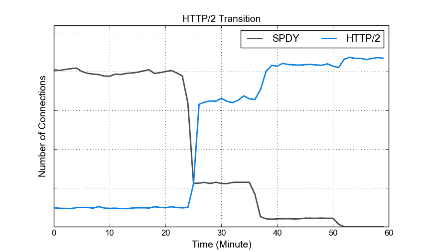
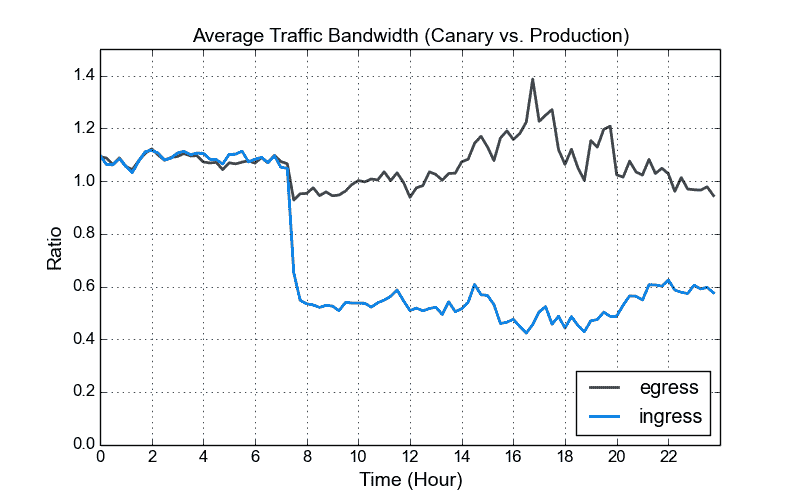
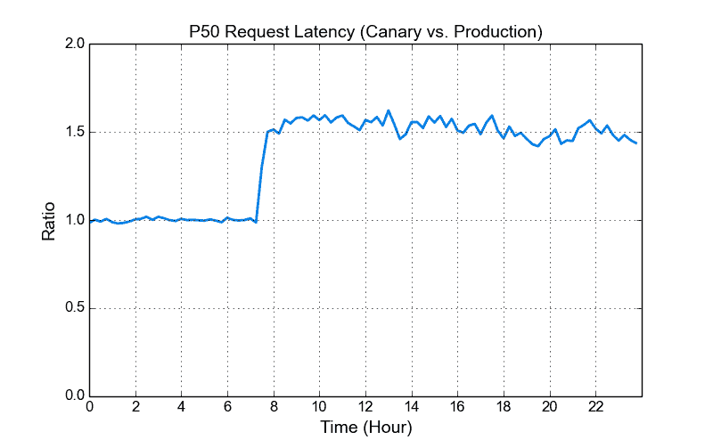
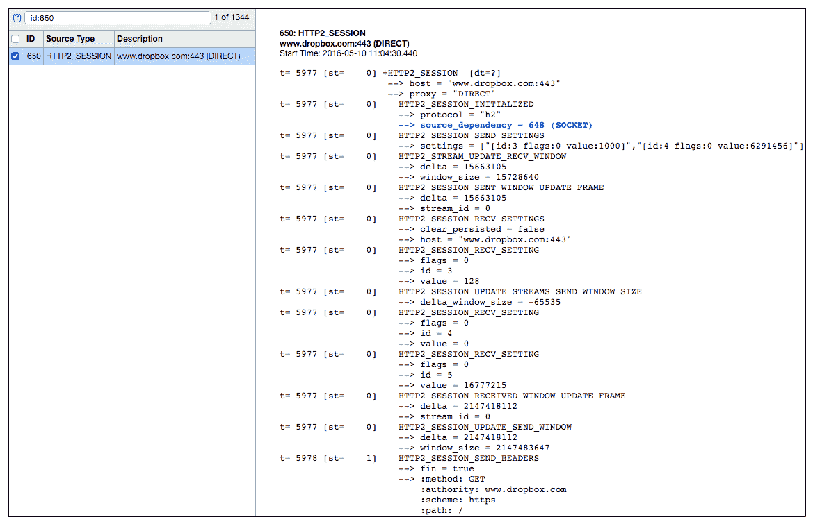
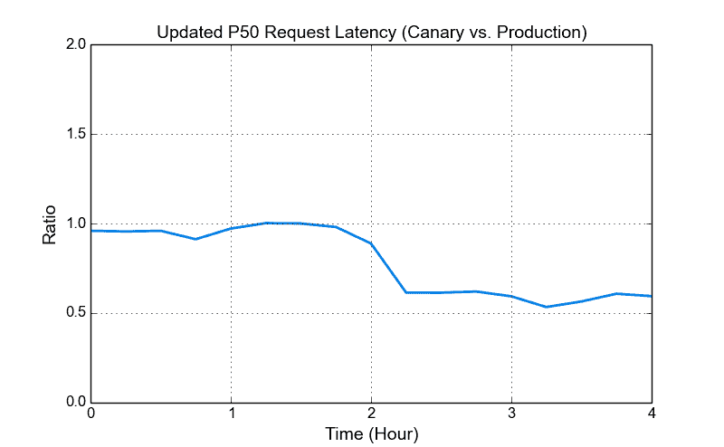

# 为 Dropbox web 服务启用 HTTP/2:经验和观察

> 原文：<https://blogs.dropbox.com/tech/2016/05/enabling-http2-for-dropbox-web-services-experiences-and-observations/?utm_source=wanqu.co&utm_campaign=Wanqu+Daily&utm_medium=website>

在 Dropbox，我们的流量团队最近升级了前端 Nginx 服务器，为我们的 web 服务启用 HTTP/2。在本文中，我们将分享我们在 HTTP/2 转换过程中的经验和发现。整体升级对我们来说很顺利，尽管也有一些可能对其他人有帮助的警告。

## 背景:HTTP/2 和 Dropbox web 服务基础设施

HTTP/2 ( [RFC 7540](https://tools.ietf.org/html/rfc7540) )是 HTTP 协议新的主要版本。它基于 [SPDY](https://www.chromium.org/spdy) ，与 HTTP/1.1 相比，提供了几项性能优化。这些优化包括更高效的报头压缩、服务器推送、同一连接上的流多路复用等。到今天为止， [HTTP/2 已经被各大浏览器](http://caniuse.com/#feat=http2)支持。

Dropbox 使用开源的 Nginx 来终止 SSL 连接，并为 web 流量执行第 7 层负载平衡。在升级之前，我们的前端服务器运行基于 Nginx 1.7 的软件，并支持 SPDY。升级的另一个动机是 Chrome 目前支持 SPDY 和 HTTP/2，但他们将在 5 月 15 日[放弃 SPDY 支持](http://blog.chromium.org/2016/02/transitioning-from-spdy-to-http2.html)。如果我们当时不支持 HTTP/2，我们的 Chrome 客户端就会从使用 SPDY 回到 HTTP/1.1。

## HTTP/2 升级过程

HTTP/2 升级对我们来说是一个简单而平稳的过渡。Nginx 1.9.5 增加了 HTTP/2 模块(由 Dropbox 共同发起)，默认情况下放弃了 SPDY 支持。在我们的例子中，我们决定升级到 Nginx 1.9.15，这是当时最新的稳定版本。

Nginx 升级包括对配置文件进行简单的修改。要启用 HTTP/2，需要将`http2`修饰符添加到`listen`指令中。在我们的例子中，因为 SPDY 之前是启用的，我们简单地用`http2`替换了`spdy`。

`Before  (SPDY): listen A.B.C.D:443 ssl **spdy**;` `After (HTTP/2): listen A.B.C.D:443 ssl **http2**;`

当然，您可能希望浏览完整的 [Nginx HTTP/2 配置选项](http://nginx.org/en/docs/http/ngx_http_v2_module.html)以针对特定用例进行优化。

至于部署，我们首先在 canary 机器上启用 HTTP/2 大约一周，当时我们还在生产中使用 SPDY。在验证了正确性并评估了性能之后，我们的 web 服务在整个车队中启用了 HTTP/2。

Smooth transition from SPDY to HTTP/2 (60 minutes of traffic)

上图显示了从 SPDY 到 HTTP/2 的平滑过渡。剩余的 HTTP/1.1 连接没有显示在该图中。大约在第 23、36 和 50 分钟，我们逐渐在所有前端 web 服务器上启用了 HTTP/2。在此之前，连接包括 canary 机器中的 HTTP/2 流量和生产机器中的 SPDY 流量。正如您所看到的，几乎所有的 SPDY 客户端最终都迁移到了 HTTP/2。

在 canary 机器上启用 HTTP/2 之后，我们密切监视了性能。我们的观察包括证明 HTTP/2 有效性的性能数据，以及一些警告，因为大多数 HTTP/2 实现仍然相对较新。

我们已经看到，由于更高效的报头压缩( [HPACK](https://http2.github.io/http2-spec/compression.html) )，入口流量带宽显著降低。

Reduced ingress traffic bandwidth (24 hours of traffic)

上图显示了 canary 和生产机器之间平均(每台机器)流量带宽的比率，其中 HTTP/2 仅在 canary 机器上启用。每台金丝雀或生产机器从负载平衡器接收的流量大致相同。可以看出，在我们启用 HTTP/2 后，入口流量带宽显著降低(接近 50%)。值得注意的是，虽然我们之前在所有金丝雀和生产机器中启用了 SPDY，但由于相关的安全问题，我们没有打开 SPDY 头压缩( [CVE-2012-4929](http://cve.mitre.org/cgi-bin/cvename.cgi?name=cve-2012-4929) 又名犯罪)。至于出口流量，没有显著变化，因为报头通常只占响应流量的一小部分。

**更新:在最近的 [Nginx 1.11.0 版本](http://hg.nginx.org/nginx/rev/ce94f07d5082)中解决了 POST 请求延迟增加和拒绝流错误的问题。**应用此更改后更新的 P50 请求延迟的数字在本文末尾。

【POST 请求的延迟增加。当我们在 canary 机器上启用 HTTP/2 时，我们注意到平均延迟增加了。下图显示了 canary 和生产机器之间 P50 请求延迟的比率。我们调查了这个问题，发现延迟的增加是由 POST 请求引起的。经过进一步研究，这种行为似乎是由于 Nginx 1.9.15 中的特定实现造成的。相关讨论可以在 [Nginx 邮件列表线程](http://mailman.nginx.org/pipermail/nginx-devel/2016-May/008211.html)中找到。

Increased P50 request latency (24 hours of traffic)

请注意，我们在这里看到的增加的 P50 请求延迟比率(大约 1.5 倍)取决于特定的流量工作负载。在大多数情况下，开销大约是我们额外的一次往返时间，并没有对我们的关键性能产生太大影响。但是，如果您的工作负载包含许多小的延迟敏感的 POST 请求，那么增加的延迟是升级到 Nginx 1.9.15 时要考虑的一个重要因素。

小心为所有东西启用 HTTP/2，尤其是当你不控制客户端的时候。由于 HTTP/2 仍然相对较新，根据我们的经验，一些客户端/库和服务器实现还不完全兼容。例如:

*   在 Nginx 1.9.15 中，如果客户端试图在确认连接设置帧之前发送数据帧，可能会收到拒绝 POST 请求的流错误。我们已经看到了 Swift SDK 的这个问题。值得注意的是，在部署期间监控 Nginx 错误日志是至关重要的，这个特定的错误消息需要将错误日志的严重性提高到 INFO。
*   Chrome 没有正确处理无错误的 RST 流，导致 Nginx 1.9.14 出现问题([chrome Issue # 603182](https://bugs.chromium.org/p/chromium/issues/detail?id=603182))。Nginx 1.9.15 中包含了一个变通方法。
*   Nghttp2 在没有窗口空间的情况下没有发送 END_STREAM，在前面提到的 [Nginx 邮件列表线程](http://mailman.nginx.org/pipermail/nginx-devel/2016-May/008211.html)中也有讨论。

因为我们的 API 用户可能使用各种第三方 HTTP 库，所以我们需要在为我们的 API 启用 HTTP/2 支持之前执行更广泛的测试。

CloudFlare 已经对 HTTP/2 调试工具做了一个[不错的总结。此外，我们发现 Chrome net-internals 工具(在 Chrome 的 chrome://net-internals/#http2 上可以找到)很有帮助。下图是 net-internals 向 www.dropbox.com](https://blog.cloudflare.com/tools-for-debugging-testing-and-using-http-2/)的[打开一个新的 HTTP/2 会话时报告的帧交换截图。](http://www.dropbox.com/)

Screenshot of net-internals when opening a new HTTP/2 session

总的来说，我们平稳地过渡到了 HTTP/2。以下是这篇文章的一些要点。

*   在 Nginx 中启用 HTTP/2 很简单。
*   由于报头压缩，入口流量带宽显著降低。
*   由于 Nginx 1.9.15 中特定的 HTTP/2 实现，增加了 POST 请求延迟。
*   在启用 HTTP/2 时要小心，因为实现还不完全兼容。
*   Canary 验证和 Nginx 错误日志检查有助于尽早发现潜在问题。

我们希望这篇文章对那些有兴趣为他们的服务启用 HTTP/2 或者对网络感兴趣的人有所帮助。我们也希望在下面的评论中听到你的反馈。

**更新:在最近的 [Nginx 1.11.0 版本](http://hg.nginx.org/nginx/rev/ce94f07d5082)中解决了 POST 请求延迟增加和拒绝流错误的问题。**下图显示，在 canary 机器中应用更改后，P50 请求延迟比率(canary 与生产)有所下降。请注意，在该图中，当我们升级到 nginx 1.9.15 以支持 HTTP/2 时，生产中的 P50 请求延迟增加了。

Reduced P50 request latency ratio after applying the change (4 hours of traffic)

供稿人:Dmitry Kopytkov、Dzmitry Markovich、Eduard Snesarev、Yuan 和 Kannan Goundan

你喜欢与交通相关的东西吗？Dropbox 有一个全球分布的边缘网络，万亿比特的流量，每秒数百万次的请求，以及一个位于加利福尼亚州山景城的小型团队。[流量团队正在雇佣 SWE 和 sre](https://www.dropbox.com/jobs/listing/1233364?gh_src=f80311fa1)来处理 TCP/IP 数据包处理器和负载平衡器、HTTP/2 代理以及我们内部基于 gRPC 的服务网格。不是你的菜？我们还为[在三藩市、纽约州、西雅图、特拉维夫和世界各地的其他办事处招聘各种工程职位](https://www.dropbox.com/jobs/teams/engineering?gh_src=f80311fa1#open-positions)。