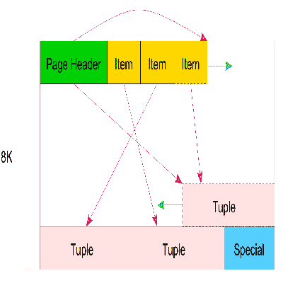
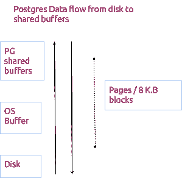
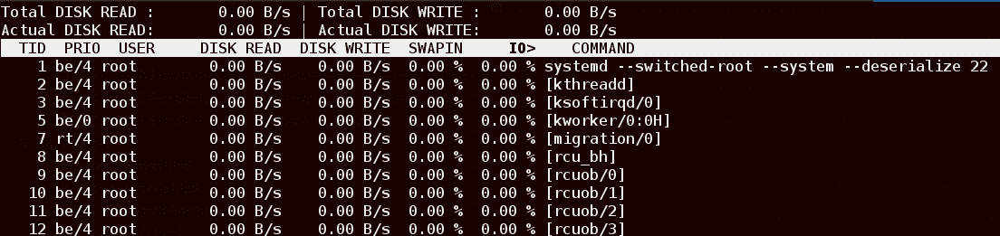

# 了解 Postgres 中的缓存-深入指南| Madusudanan

> 原文：<http://madusudanan.com/blog/understanding-postgres-caching-in-depth?utm_source=wanqu.co&utm_campaign=Wanqu+Daily&utm_medium=website>

# 理解 Postgres 中的缓存——深入指南

Originally Posted On : *16 May 2016* *Last Updated : *03 Aug 2016* ** * *

## 贮藏

缓存可以被认为是调优数据库系统性能的一个重要方面。

虽然这篇文章主要关注 postgres，但它可以很容易地与其他数据库系统进行比较和理解。

*索引*

 ***不同的计算机组件以不同的速度运行。我们人类极其不擅长理解计算机所能理解的规模的数字。

看下面的表格(取自[这里](http://blog.codinghorror.com/the-infinite-space-between-words/))我们可以有一个想法。

这些数字是人类规模的近似值。

| 访问类型 | 实际时间 | 近似时间 |
| 1 个 CPU 周期 | 0.3 纳秒 | 1 秒 |
| 一级缓存访问 | 0.9 纳秒 | 3 s |
| 二级缓存访问 | 2.8 纳秒 | 9 s |
| 三级缓存访问 | 12.9 纳秒 | 43 岁 |
| 主存储器访问 | 120 纳秒 | 6 分钟 |
| 固态磁盘输入/输出 | 50-150 μs | 2-6 天 |
| 旋转磁盘输入输出 | 1-10 毫秒 | 1-12 个月 |
| 互联网:旧金山到纽约 | 40 毫秒 | 4 年 |
| 互联网:旧金山到英国 | 81 毫秒 | 8 年 |
| 互联网:SF 到澳大利亚 | 183 毫秒 | 19 年 |

在数据库系统中，我们主要关心的是磁盘 I/O。

与固态硬盘相比，磁盘在随机 I/O 方面表现不佳。

大多数 [OLTP](https://en.wikipedia.org/wiki/Online_transaction_processing) 工作负载都是随机 I/O，因此从磁盘获取数据可能会非常慢。

为了克服这个问题，postgres 将数据缓存在 RAM 中，这可以极大地提高性能。即使在固态硬盘的情况下，RAM 也要快得多。

几乎所有的数据库系统都有缓存的一般概念。

 **在我们继续之前，有必要了解一些术语。

我建议从 [postgres 物理存储](http://rachbelaid.com/introduction-to-postgres-physical-storage/)开始阅读。

一旦你完成了这些，inter db 是另一个更深入的。特别是关于堆元组的部分。

关于这一点的官方文档也是[可用的](https://www.postgresql.org/docs/current/static/storage.html)，但是这有点难以理解。

不管内容是什么，postgres 都有一个称为页面(8KB 大小)的存储抽象。下图给出了一个大概的想法。



这种抽象是我们将在这篇文章的其余部分处理的。

 **Postgres 缓存以下内容。

*   列表数据

    这是表格的实际内容。

*   指数

    索引也存储在 8K 块中。它们存储在与表数据相同的位置，见下面的[存储区](#MemoryAreas)。

*   查询执行计划

    当您查看查询执行计划时，有一个称为规划阶段的阶段，它主要选择最适合查询的计划。Postgres 也可以缓存计划，这是基于每个会话的，一旦会话结束，缓存的计划就会被丢弃。这可能很难优化/分析，但通常不太重要，除非您正在执行的查询非常复杂和/或有很多重复的查询。

    文档很好地解释了这些细节。我们可以查询`pg_prepared_statements`来查看缓存了什么。请注意，它在所有会话中都不可用，并且仅对当前会话可见。

在本文中，我们将进一步详细探讨如何缓存表数据和索引。

 **Postgres 有几个配置参数，理解它们的含义非常重要。

对于缓存，最重要的配置是 [shared_buffers](https://www.postgresql.org/docs/current/static/runtime-config-resource.html#GUC-SHARED-BUFFERS) 。

在 postgres 源代码内部，这被称为 NBuffers，所有的共享数据都存放在内存中。

shared_buffers 只是一个 8KB 块的数组。如上所述，每个页面内部都有元数据来区分自己。在 postgres 从磁盘中取出数据之前，它首先在 shared_buffers 中查找页面，如果找到了，它就从那里返回数据，从而避免了磁盘 I/O。

 **将数据放入缓存和从缓存中取出数据的机制是由时钟扫描算法控制的。

它是为处理 OLTP 工作负载而构建的，因此几乎所有的流量都在内存中处理。

下面详细说说每个动作。

*缓冲分配*

 *Postgres 是一个基于进程的系统，即每个连接都有一个自己的本机操作系统进程，它是从 postgres 根进程(以前称为 postmaster)中派生出来的。

当一个进程请求 LRU 缓存中的一个页面时(每当通过典型的 SQL 查询访问该页面时都会这样做)，它请求一个缓冲区分配。

如果该块已经在缓存中，它将被固定，然后被返回。锁定过程是下面讨论的增加使用计数的一种方式。当使用计数为零时，页面被称为解除锁定。

只有当一个页面没有空闲的缓冲区/槽时，才会进行缓冲区驱逐。

*缓冲区驱逐*

 *决定哪些页面应该从内存中清除并写入磁盘是一个经典的计算机科学问题。

简单的 LRU(最近最少使用的)算法在现实中效果不佳，因为它没有先前运行的记忆。

Postgres 跟踪页面使用计数，因此如果页面使用计数为零，它将被从内存中清除并写入磁盘。当页面变脏时，它也会被写入磁盘(见下文)。

不管本质细节如何，缓存算法本身几乎不需要调整，而且比人们通常认为的要聪明得多。

 **我们一直在讨论选择查询，那么 DML 查询会发生什么呢？

很简单，它们被写到相同的页面上。如果存在于内存中，则将它们写入内存，或者从磁盘中取出，然后写入内存。

这就是脏页概念的由来，也就是说，一个页面已经被修改，还没有被写入磁盘。

在我们继续之前，还有一些功课/研究要做，特别是关于[墙和检查站](http://www.interdb.jp/pg/pgsql09.html)。

WAL 是一个重做日志，它基本上跟踪系统中发生的任何事情。这是通过将所有更改分别记录到 WAL 日志中来实现的。Checkpointer 是一个进程，它定期将所谓的脏页写入磁盘，并由时间设置控制。之所以这样做，是因为当数据库崩溃时，它不需要从头开始重放一切。

这是页面从内存中被逐出的最常见的方式，LRU 逐出在典型的场景中几乎不会发生。

 **解释是理解幕后发生的事情的一种很好的方式。它甚至可以判断有多少数据块来自磁盘，有多少来自 shared_buffers，即内存。

下面的查询计划给出了一个例子，


```
performance_test=# explain (analyze,buffers) select * from users order by userid limit 10;

  Limit  (cost=0.42..1.93 rows=10 width=219) (actual time=32.099..81.529 rows=10 loops=1)
    Buffers: shared read=13
    ->  Index Scan using users_userid_idx on users  (cost=0.42..150979.46 rows=1000000 width=219) (actual time=32.096..81.513 rows=10 loops=1)
          Buffers: shared read=13
  Planning time: 0.153 ms
  Execution time: 81.575 ms
 (6 rows)
```


共享读取，意味着它来自磁盘，并且没有被缓存。如果查询再次运行，并且缓存配置是正确的(我们将在下面讨论)，它将显示为共享命中。


```
performance_test=# explain (analyze,buffers) select * from users order by userid limit 10;

  Limit  (cost=0.42..1.93 rows=10 width=219) (actual time=0.030..0.052 rows=10 loops=1)
    Buffers: shared hit=13
    ->  Index Scan using users_userid_idx on users  (cost=0.42..150979.46 rows=1000000 width=219) (actual time=0.028..0.044 rows=10 loops=1)
          Buffers: shared hit=13
  Planning time: 0.117 ms
  Execution time: 0.085 ms
 (6 rows)
```


从查询的角度来看，这种方式非常方便地了解缓存了多少，而不是摆弄 OS/Postgres 的内部。

 **对于这样的缓存来说，顺序扫描(即当没有索引时，postgres 必须从磁盘获取所有数据)是一个问题领域。

由于单次 seq 扫描可以擦除缓存中的所有数据，因此处理方式有所不同。

它不使用普通的 LRU/时钟扫描算法，而是使用一系列总共 256 K.B 大小的缓冲器。下面的计划显示了它是如何处理的。


```
performance_test=# explain (analyze,buffers) select count(*) from users;

  Aggregate  (cost=48214.95..48214.96 rows=1 width=0) (actual time=3874.445..3874.445 rows=1 loops=1)
    Buffers: shared read=35715
    ->  Seq Scan on users  (cost=0.00..45714.96 rows=999996 width=0) (actual time=6.024..3526.606 rows=1000000 loops=1)
          Buffers: shared read=35715
  Planning time: 0.114 ms
  Execution time: 3874.509 ms
```


再次执行上述查询。


```
performance_test=# explain (analyze,buffers) select count(*) from users;

  Aggregate  (cost=48214.95..48214.96 rows=1 width=0) (actual time=426.385..426.385 rows=1 loops=1)
    Buffers: shared hit=32 read=35683
    ->  Seq Scan on users  (cost=0.00..45714.96 rows=999996 width=0) (actual time=0.036..285.363 rows=1000000 loops=1)
          Buffers: shared hit=32 read=35683
  Planning time: 0.048 ms
  Execution time: 426.431 ms
```


我们可以看到，正好有 32 个数据块移入内存，即 32 * 8 = 256 KB。这在[src/back end/storage/buffer/README](https://github.com/postgres/postgres/blob/master/src/backend/storage/buffer/README#L208)中有解释

 **Postgres 作为一个跨平台的数据库，非常依赖于操作系统的缓存。

shared_buffers 实际上是在重复操作系统的工作。下面给出了数据如何通过 postgres 流动的典型情况。



起初这很混乱，因为缓存也是由 OS 和 postgres 管理的，但是这是有原因的。

谈论操作系统缓存需要另一个帖子，但是网上有许多资源可以利用。

请记住，操作系统缓存数据的原因和我们上面看到的一样，即我们为什么需要缓存？

我们可以将 I/O 分为两种类型，即读取和写入。更简单地说，数据从磁盘流向内存进行读取，从内存流向磁盘进行写入。

*上面写着*

 *对于读取，当您考虑上面的流程图时，数据从磁盘流向操作系统缓存，然后流向 shared_buffers。我们已经讨论了页面如何被固定在 shared_buffers 上，直到它们变脏/被解除固定。

有时，操作系统缓存和 shared_buffers 可以保存相同的页面。这可能会导致空间浪费，但请记住，操作系统缓存使用的是简单的 LRU，而不是数据库优化时钟扫描。一旦页面命中 shared_buffers，读取就永远不会到达操作系统缓存，如果有任何重复，它们很容易被删除。

实际上，在两个内存区域中堆叠的页面并不多。

这就是为什么建议小心地调整 shared_buffers 的大小的原因之一。使用硬性规定，比如给它最大份额的内存或者给得太少，都会影响性能。

我们将在下面详细讨论优化。

*写道*

 *写操作从内存流向磁盘。这就是脏页概念的由来。

一旦页面被标记为脏，它将被刷新到操作系统缓存，然后写入磁盘。在这种情况下，操作系统可以更自由地根据传入的流量来调度 I/O。

如上所述，如果操作系统缓存较小，则无法对写入进行重新排序和优化 I/O。这对于写入繁重的工作负载尤为重要。因此，操作系统缓存大小也很重要。

 **与许多数据库系统一样，没有简单有效的配置。PostgreSQL 附带了一个为广泛兼容性而非性能而调整的基本配置。

数据库管理员/开发人员有责任根据应用程序/工作负载来调整配置。然而，postgres 的人有一个很好的文档来说明从哪里开始

一旦设置了默认/启动配置。我们可以进行负载/性能测试，看看它的表现如何。

请记住，初始配置也是针对可用性而不是性能进行调整的，最好总是进行试验，以获得更适合所考虑的工作负载的配置。

 **> 如果你不能测量某样东西，你就不能优化它

有了 postgres，有两种方法可以衡量。

*操作系统*

 *虽然对于 postgres 在哪个平台上工作得最好还没有普遍的共识，但是我假设您使用的是 linux 操作系统家族中的某个平台。但是这个想法有点类似。

首先，有一个名为 [Io top](http://guichaz.free.fr/iotop/) 的工具可以测量磁盘 I/O。与 top 类似，这在测量磁盘 I/O 时可以派上用场。只需运行命令`iotop`来测量写入/读取。



这有助于深入了解 postgres 在负载下的表现，即有多少命中磁盘，有多少来自 RAM，这取决于所产生的负载。

直接来自 postgres

直接从 postgres 监控某些东西总是比通过 OS 途径更好。

通常，如果我们认为 postgres 本身有问题，我们会进行操作系统级监控，但这种情况很少发生。

有了 postgres，我们可以使用几个工具来衡量记忆方面的表现。

*   [解释](https://www.postgresql.org/docs/current/static/sql-explain.html)

    默认值是 SQL explain。比任何其他数据库系统提供更多的信息，但是有点难以理解。需要练习来适应。不要错过几个有用的标志，特别是我们之前看到的缓冲区。

    查看以下链接，深入了解解释。

*   [查询日志](https://www.postgresql.org/docs/current/static/runtime-config-logging.html)

    查询日志是了解系统内部情况的另一种方式。

    我们可以使用 log_min_duration_statement 参数，只记录跨越特定持续时间的查询，或者称为慢速查询日志，而不是记录所有内容。

*   [自动解释](https://www.postgresql.org/docs/current/static/auto-explain.html)

    这是您可以做的另一件很酷的事情，它会自动记录执行计划和缓慢的查询。对于不需要手动运行 explain 的调试非常有用。

*   [Pg stat 报表](https://www.postgresql.org/docs/current/static/pgstatstatements.html)

    以上方法虽好，但缺乏统一的观点。

    这是 postgres 本身内置的一个模块，但默认情况下是禁用的。

    我们可以通过`create extension pg_stat_statements`来实现这一点

    一旦启用了这个功能，在运行了大量的查询之后，我们就可以启动如下所示的查询。


```
 SELECT
    (total_time / 1000 / 60)::decimal as total_minutes,
    (total_time/calls)::decimal as average_time,
    query
  FROM pg_stat_statements
  ORDER BY 1 DESC
  LIMIT 100;
```


提供了大量关于查询所用时间及其平均值的详细信息。

这种方法的缺点是需要一定的性能，所以一般不建议在生产系统中使用。

*   [PG 缓冲缓存](https://www.postgresql.org/docs/current/static/pgbuffercache.html)和 [PG fincore](http://pgfoundry.org/projects/pgfincore)

    如果你想更深入一点，那么有两个模块可以直接深入 shared_buffers 和 OS cache 本身。

    需要注意的一点是，explain (analyze，buffers)只显示来自 shared_buffers 的数据，而不显示来自 OS 缓存的数据。

    *   PG 缓冲区缓存

        这有助于我们实时查看共享缓冲区中的数据。从 shared_buffers 中收集信息，并将其放入 pg_buffercache 中以供查看。

        下面是一个示例查询，它列出了前 100 个表以及缓存的页数。


```
 SELECT c.relname,count(*) AS buffers
    FROM pg_class c INNER JOIN pg_buffercache b
    ON b.relfilenode=c.relfilenode INNER JOIN pg_database d
    ON (b.reldatabase=d.oid AND 
    d.datname=current_database())
    GROUP BY c.relname ORDER BY 2 DESC LIMIT 100; 
```


*   PG fincore

    这是一个外部模块，提供操作系统如何缓存页面的信息。这是相当低的水平，但也非常强大。

*   [Pg 预报警](https://www.postgresql.org/docs/current/static/pgprewarm.html)

    这是一个内置模块，可以将数据加载到 shared_buffers/OS 缓存或两者中。如果您认为内存预热是问题所在，那么这对于调试非常有用。

还有几个，但我列出了最流行和最容易使用的，以了解 postgres 缓存和一般。有了这些工具，再也没有因为内存问题而导致数据库运行缓慢的借口了******************************  ************我偶尔写博客，主要写软件工程之类的东西。如果你有兴趣关注新的博客文章，你应该在我发布文章的时候关注我的推特。你也可以使用 [RSS 源](/atom.xml)，或者甚至通过下面的电子邮件订阅。

如果你喜欢这篇文章，你可以在下面的网站上分享/讨论/投票。************