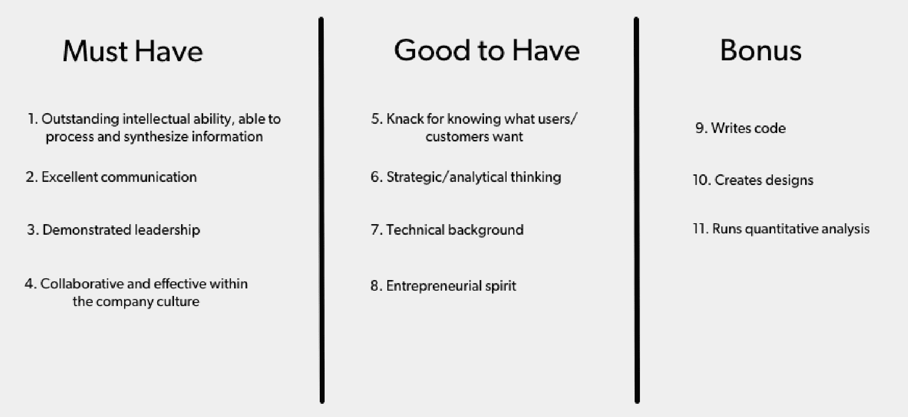

# 寻找、审查并结束最佳产品经理|第一轮评审

> 原文：<http://firstround.com/review/find-vet-and-close-the-best-product-managers-heres-how/?utm_source=wanqu.co&utm_campaign=Wanqu+Daily&utm_medium=website>

**[托德杰克逊](https://www.linkedin.com/in/toddj0 "null")** 一直是硅谷一些最优秀公司的产品组织的一部分，从谷歌到脸书到 Twitter，在它收购了自己的初创公司后，[封面](http://blog.coverscreen.com/ "null")。现在，他是 **[Dropbox](https://www.dropbox.com/ "null")** 的产品和设计副总裁，在他的职业生涯中，他与数百名产品经理合作过，并雇佣了数十名产品经理。

杰克逊在 Twitter 时，该公司调查了其工程、产品和设计团队，询问他们对彼此专业领域的想法和了解。虽然每个人都清楚工程师做什么(写代码)，并且大多数人可以描述设计师的职责，但不到一半的受访者知道产品经理实际上做什么。这似乎是产品团队，尤其是作为产品管理总监的杰克逊应该深究的事情。(不出所料，事实证明，项目经理们完全知道其他人在做什么)。

当他问更多的人他们认为经前综合症有什么作用时，他意识到每个人都有不同的答案。“我认为这是因为项目经理的角色需要有目的的灵活性，几乎是通过设计，”他说。“项目经理基本上位于 UX、技术和商业的中心。你可能听过这句话:“项目经理是他们产品的首席执行官。”我认为这是非常准确的，但这也意味着他们必须做好许多不同的事情，而好的事情非常难找到。"

在这次采访中，杰克逊解释了初创公司如何定义他们需要的项目经理类型，寻找候选人，问正确的面试问题——也许最重要的是，说服他们来为你工作。

# 怎样才能成为一名优秀的产品经理？

最好的产品经理做三件事:

阐明成功的产品是什么样的。

召集团队来建造它。

迭代它，直到他们得到它的权利。

做好这一点——不管你在做什么或者在什么环境下工作——都需要一系列特定的品质。杰克逊将它们分为三类:必须具备的品质、必须具备的品质和额外品质:

杰出的智力和综合信息的能力都有助于项目经理确定一个成功的产品是什么样的，以及它将如何在市场上取得战略成功。在公司文化中，出色的沟通、领导力和有效性是清晰表达产品愿景并让其他人兴奋地投入时间和精力所必需的。“我从未见过一个真正伟大的产品经理不具备必备的四种品质，”杰克逊说。

在 Good To Have 专栏中，技术背景和企业家精神将帮助项目经理获得他们需要的忠诚度和可信度，以激励工程师和设计师做出最好的工作。分析和战略思维对于持续的、聪明的迭代是必要的。像 Dropbox 这样的知名科技公司，大多只会雇佣 A 栏和 B 栏都有覆盖的 pm。

额外的功能，如编写代码、创建模型和运行自己的分析，可能是你在早期雇员或小团队中寻找的。他们会让你的人均生产率最大化。在大公司，你倾向于有更多的人专门从事这些工作，所以项目经理通常不需要。有他们总是好的。在公司的生活中，他们有时比其他人更重要。杰克逊说，应该为第一次雇佣产品付出额外的努力。

他说:“对于大多数公司来说，这个关于项目经理应该是什么样的人的定义可能有 70%是正确的。”。“但如果你是一家拥有庞大销售团队的 SaaS 公司，你可能会想到一个与 40 人社交应用公司不同的原型。”因此，思考一下你公司的项目经理成功的核心是什么，然后再考虑一下哪些更具“选择性”的属性是为你的行业和产品量身定制的。实际写清单。当你开始与候选人交谈时，看到它在视觉上的布局会有很大的不同。

# 寻找合适的候选人

当你搜索一个项目经理时，你会得到主动申请人和推荐人的组合，但在 LinkedIn 上自己寻找候选人也是一个好主意。后者会让你更好地了解谁有什么样的经验，以及这些经验是如何映射到你需要这个角色的人去做的事情上的。

虽然没有一个成功的项目经理原型，但 Jackson 认为有一些项目经理角色可以很好地工作。以下五个匿名的简介都是他个人认识的优秀产品经理的代表，展示了可以成为优秀项目经理的多元化背景。“寻找不同的经历和背景很重要，”杰克逊说。“你的用户和顾客可能是不同的人群，所以你的员工也应该如此。这实际上可能是相对于其他公司的一大竞争优势，这些公司在招聘方面过于僵化或千篇一律。”

# **经典选择**

这是一份有着更为传统的 PM 背景的简历:

乔治亚理工学院、布朗大学、莱斯大学或伊利诺伊大学的计算机科学本科学位，这些学校都有很好的计算机科学课程

在大学里建立了一个非盈利的社区暑期项目

一家大型科技公司的产品经理，从事面向广告客户的产品，然后是视频产品

“我喜欢这里丰富的经验，”杰克逊说。“在面向广告商和出版商的产品以及面向消费者的搜索和发现视频产品方面有丰富的工作经验。此外，她还主动创办了一个非营利组织。这是一个你肯定想与之交谈的人。”

# 新秀

奥林学院机器人本科学位

技术史课程的助教

一家大型科技公司的产品管理实习生

“每当你与没有全职工作经验的人交谈时，这是一个非常高风险、高回报的前景。所以你必须尽力寻找他们能力的证据。我在这里看到的第一个迹象是，他们去了奥林学院，有些人可能没有听说过，但我知道声誉产生伟大的产品经理，”杰克逊说。“我认识的去奥林的项目经理都非常专业，但也很有创意。他们的助教工作是人文学科的一部分。这是一个技术背景与创造性的面向用户的经验相结合。绝对值得一个电话。”

# 管理咨询难民

埃默里大学心理学学位

一家初创公司的数据分析师，开发搜索技术，包括网页抓取和文档处理工具。

一家知名咨询公司的高级商业分析师

杰克逊说:“如今，你会经常看到这样的简介——那些想从咨询或金融行业进入科技行业的人。“他们中的许多人会成为出色的产品经理，因为他们具有分析思维和战略思维。但你必须确保他们对技术和解决用户需求有真正的热情。此外，他们是愿意与工程师和设计师有效地合作，还是仅仅提供指示，并假设他们的指示会被遵循？这是我在招聘这种背景的人时看到的两个最常见的陷阱。”

这份简历的理想版本包括这份简历样本所具备的内容:一些技术领域的工作经验。技术背景是一个很好的解决问题能力的指标，也是一个建立事物的愿望。但即便如此，一些咨询公司的文化还是让人们习惯于通过武力或命令控制的方法来领导，而不是通过兴奋和影响。“当你与这些候选人交谈时，一定要问他们是如何领导的——你希望听到他们谈论他们是如何以身作则的。”

# 工程师/设计师转型为项目经理

成功的 SAAS 公司的高级技术人员

一家小型创业公司的软件工程师，专注于生产力软件

她在 LinkedIn 的总结中表示，她“对可用性非常感兴趣，喜欢与用户直接互动。”

“我喜欢这种类型的简介，因为你知道如果这个人真的拥有你想要的产品技能，他们将会非常适合与团队中的工程师或设计师一起工作，”杰克逊说。“如果某人的全部经历都是在工程领域，你应该寻找她是产品思想家的其他迹象。这是个人总结，但不是每个工程师都会这么说。”

在缺乏对产品的明确兴趣或体验的情况下，你要寻找这个人走上陡峭的学习曲线并快速成长的证据。她是否自学了新的编程语言来完成一个项目？他在一个组织中迅速上升了吗？这些行动表明他们有足够的企业家精神来灵活地转变为产品角色。

# 营销人员/业务开发转项目经理

加州州立大学国际商务和营销学位

联合创始人，专注于开发社交广告和产品的初创公司

大型科技公司的业务和企业发展

“这可能是一个挑战，因为许多伟大的营销和商业开发人员可能会让你眼花缭乱——他们真的很擅长谈论技术产品，但你必须小心，”杰克逊说。“他们真的能造东西吗？他们过去建造过什么吗？”

比方说，他们在上一个公司领导的交易中，他们必须了解技术和产品集成，这将是一个积极的指标。此外，作为联合创始人，此人从零开始构建和推出产品。

“你可以看到，计算机科学学位并不总是必需的，”他说。“但它确实有帮助。如果他们没有技术背景，那么他们应该在过去的职位中有令人印象深刻的创业经历。”

Todd Jackson, Dropbox's VP of Product and Design

# 理想的面试过程

典型的项目经理面试有三个阶段:电话面试或喝咖啡，一对一的面对面招聘循环，以及小组陈述。

筛选过程主要是寻找相互适合的人。如果你在为一家初创公司招聘员工，大约一半的时间应该用来说服这个人来和团队的其他人交谈。你所追求的人的能力，以及你的创业公司可能不为人知的事实，意味着你大多处于推销模式。

当谈到一对一的招聘循环时，你选择包括谁取决于你公司的规模。

假设你在一家不到 100 人的小公司。你会希望顶级项目经理候选人与你的创始人、团队中的其他项目经理(如果有的话)、你的工程主管、设计主管和业务主管交谈。

比方说，如果你在一家超过 500 人的大公司，规则会改变。您希望这些候选人与您的产品副总裁、团队中的其他两到三名项目经理、工程主管、设计主管和业务主管进行交流。

这些利益相关者可能会每天与这个人互动，他们会阐明他们经历和个性的不同方面。在所有这些对话中，目标都应该是看这个人在多大程度上符合以下标准:

智力

沟通

领导力

公司文化中的有效性

知道用户想要什么

战略/分析思维

技术背景

企业家精神

下面，杰克逊列出了一些他认为在亲自面试产品管理候选人时最有价值的问题，他认为好的答案听起来像什么，以及应该让你暂停的回答。

**问题 1** (产品感):说出一个你认为设计得特别好的产品——最好是非电子产品。告诉我是什么让它设计得很好。(测试智力、沟通以及他们是否知道客户想要什么。)

*弱答*:表面的或者俗套的东西。“如果他们不谈论很多细节，说一些轻松的话，比如‘我的电动牙刷太棒了，它赢得了一堆设计奖’，那就是对他们的打击。”

*好答案*:首先，候选人会兴奋地谈论他们欣赏的产品，并且会表现出来。“我听到的最好的答案之一是关于儿童微型浮板滑板车——我记得候选人非常兴奋地告诉我所有的细节:‘我最近注意到我侄女的滑板车设计得多么周到。这是你最近看到很多孩子骑的迷你滑板车。它的前面有两个大的聚氨酯轮子，后面有第三个小轮子，所以它可以顺利地通过裂缝和颠簸，防止面部植物。此外，它没有转向的车把，而是采用了“倾斜转向”的设计，这对于孩子来说非常直观，教他们如何通过转移体重来转向。它还非常容易组装和拆卸——基本上只是两个部分扣在一起。”"

特别强的候选人会从用户的角度看待产品，谈论它解决的问题。在上面的例子中，“候选人谈到了产品的用户(孩子)与产品的客户(父母)实际上是如何不同的，以及所有的产品设计和营销分支，我认为这是非常有见地的。”候选人会有很多话要说，而且说话时会非常热情，尤其是那些能提供完美和愉快体验的小细节。“这就是你如何知道一个充满激情的产品人员和一个只想找份工作的人之间的区别。”

为了更上一层楼，你可以接着问这样一个问题:“你会改进它的哪些方面？”或者“如果你是生产这种产品的公司的首席执行官，你想卖出 10 倍的产品，你会怎么做？”寻找关于产品市场的有根据的猜测或合理的假设，目标购买者是谁，市场如何扩大，生产的限制等等。这些是推动产品下一个最佳步骤的要素，而不应该只是一个随机的想法。

*注意*:PM 考生准备这个问题可能比较容易。你可以通过限制他们选择的空间来确保他们站着思考。例如，该示例必须是物理或非电子产品或他们家中的产品。

问题 2 (技术技巧):尽可能详细地告诉我，当我在浏览器中输入 yahoo.com 并按下回车键时会发生什么。(测试智力、沟通能力和技术背景。)

*无力的回答*:他们的反应可能是初步的或混乱的。你可能会得到这样的回答，“我看到雅虎主页了，对吗？”

*好答案*:类似于“你的浏览器生成一个 HTTP 请求。DNS 查找获得主机的 IP 地址。服务器接收请求，检查 cookies 以查看您是否登录，并最终生成包含您应该看到的内容的 HTTP 响应。您的浏览器接收响应，解析 DOM 并开始呈现页面。加载 CSS、图片和 Javascript 来修改页面。”

最强的候选人可以很详细地回答这个问题，花大约五分钟时间带你完成这个过程。对于产品经理来说，这是一个很好的设定水平的问题，这样你就可以看到他们在技术上的立场。他们不必击中发生的每一个动作。特别要注意那些声称自己在过去几年中做过程序设计，但对这个问题一无所知的候选人。这绝对是一个危险信号。

如果你认为候选人可能已经准备好了这种类型的问题，你可以通过在他们回答的不同阶段训练他们的细节来混淆它。或者你可以问他们类似的关于 iOS 或 Android 编程基础的问题，如果他们有很多移动经验的话。

**问题 3** (领导力):说说你与团队中的工程师和设计师意见相左的一次经历。你做了什么？(测试公司文化中的沟通、领导力和有效性)

*弱答*:会有指指点点的典故，或者提到责备。他们的反应通常是消极的，你可能会看到自我意识的下降，伴随着防御性的上升。比起坚持事实，他们更关心掩饰他们在冲突中的角色。

*好答案*:他们会通过诊断冲突的根本原因来展示领导力。他们会表现出谦逊。“一位候选人告诉我，她无法与她的工程和设计团队就某个功能达成一致——他们都想开发这个功能，而她不想。她说，‘好吧，让我们设定时间限制。我们会实施这个想法，但如果四周内没有回报，我们会把它改成另一个想法。我认为这是避免交通堵塞的好办法。“候选人知道什么时候该反击，什么时候该反对和承诺。

如果一个候选人在回答的最后说了他们从这种情况中学到了什么，以及他们如何将这些经验应用到未来，那么他应该得到额外的加分。

**问题 4:** 自动驾驶汽车的所有含义是什么？(考验战略分析思维和创业精神。)

*无力的回答*:无聊、草率或没有条理的回答。他们可能会抛出一些显而易见的答案，比如出租车司机失业，或者自动驾驶大型钻机。但是他们不会深入到其他行业的连锁反应中去，这些连锁反应将会创造出一个全新的商业浪潮。他们会留在因果的内圈。

好答案:展示你的远见和想象力，他们会为你描绘一幅可能发生的画面。说不定汽车座椅会围着茶几排成一圈呢！没有人会再拥有汽车，这意味着没有人会再有车库。“有一天，我得到了一个惊人的答案:‘谷歌将开源自动驾驶汽车的软件，这样任何制造商都可以像他们提供 Android 一样制造它们，’”杰克逊说。“我不知道这是真是假，但我认为这很有创意。”

最重要的是，答案应该打包在某种组织框架中。也许他们会说司机的生活会发生怎样的变化，然后是汽车工业，然后是城市规划。想法应该在主题中呈现，而不是作为自由联想的混乱。

**问题 5:** 你觉得产品管理的哪个方面最没意思？

软弱的回答:抱怨做琐碎工作(如记笔记、安排会议)并暗示这些事情有失身份的首相。

*好答案*:一个优秀的项目经理知道他们需要在背后领导，并且他们喜欢扮演无名英雄的角色。候选人不必说他们喜欢棘手的细节，但他们应该因为承认 PM 工作的肮脏部分以及为什么为团队服务和完成他们支持的任务很重要而得到加分。

**问题 6:** 你为什么想在这家公司工作，或者做这个产品？

*无力的回答*:“X 行业/公司受到很多议论。每个人都在谈论它。现在真的很热。”

*好答案*:对行业、公司或项目有明确的热情。寻找他们想要做什么以及如何让事情变得更好的具体想法和计划。这说明他们真的做足了功课，对公司有了深入的思考。特别是，保持你的眼睛为长期思考去皮，这表明对行业或产品类型的承诺。例如，这个人是在谈论机器人或无人机在 5 年或 10 年后会是什么样子吗？还是他们现在只说机器人和无人机有多刺激？以下是一些例子:

我一直想在 X 行业工作，在过去的几年里，我做了 Y 和 Z 的工作，为这次职业转移做准备。

X 公司因为 y 而拥有巨大的竞争优势。

我使用产品 X 已经有一段时间了，我真的很喜欢功能 y。我认为功能 Z 真的可以提高增长/参与/盈利，原因如下...

你想要的是对空间感兴趣的人，而不仅仅是这一个机会。

# 小组演示

当一个候选人通过了所有的一对一面试后，你应该停下来评估一下。如果他们不匹配，你有机会为每个人节省大量时间。因此，在进入下一阶段之前，要确保双方都很合适(并且每个人都同样兴奋):小组演示。

“我喜欢邀请应聘者来办公室，围着一张 8 到 10 人的会议桌做演讲，”杰克逊说。“这是一种很好的方式，可以看到他们在群体活动中表现如何，他们如何表达自己的想法，以及他们表达自己的方式有多清晰。”

他给他们的提示相当复杂:

*PART 1* :过去两年推出的什么产品或服务，你认为特别具有革命性？该产品为其客户改善了什么？它是精心设计的吗？该产品将如何影响其行业的市场条件和竞争环境？

*第 2 部分*:确定产品中可以改进的三个方面。解释你将如何改变产品来解决这些问题，以及你将如何测试这些改变是否有积极的影响。

候选人被要求用 15-20 张幻灯片演示一个小时。

“我看过一些非常棒的演示，”杰克逊说。“一个真正令人难忘的是关于 [Class Dojo](https://www.classdojo.com/ "null") ，这是一个教育软件。候选人实际上建立了一个类似道场教室的环境，所以当我们提出好问题时，小组中的所有人都得到了金星。这真的很有娱乐性和互动性。但实际上你是在观察这个人的思维有多深。他们交流的流畅程度如何？展示很重要。最重要的是，他们如何在现场处理 Q & A，因为项目经理必须能够处理持续不断的难题。”

*底线*:你想要做代言人的项目经理。他们必须能够每天代表他们自己、他们的工作和他们团队的工作。他们的工作将是良好的沟通。他们必须思路清晰，思维有条理，行动敏捷。

# 关闭候选人

一旦你有了一个你爱的候选人，失去他们会是一个悲剧。结尾就像体操运动员坚持落地。这才是最终真正重要的。具有讽刺意味的是，亲密过程始于你与一个人交往的最开始。

首先也是最重要的一点:你需要与所有候选人保持频繁的沟通和联系。他们永远不应该感到困惑或不确定自己的立场。亲自动手。不要把这件事委托给招聘人员。保持参与和可用。没有什么比有人觉得你的公司不关心他们更损害求职者的体验了。

这似乎是显而易见的，但有一些专门针对经前综合症的结束技巧。

“我喜欢思考项目经理大脑中的奖励中心，”杰克逊说。“我能想到的有几个重要因素:有影响力、取悦用户、使命感、自主权、获得认可、财务成果、学习/成长等。根据我的经验，与其他学科相比，项目经理往往更关心影响和自主权。”

这是独特的。工程师经常被真正有趣的技术挑战所激励。设计师可以被工艺和社区感所激励。在对经前综合症很重要的奖励中心中，有一个对候选人来说更突出。每个人的情况都不一样，但是你要弄清楚最有影响的因素是什么。你甚至可以要求候选人按照重要性的顺序排列它们。

一旦你知道是什么驱动了他们，详细描述这将如何在他们在你公司的角色中体现出来。例如，如果自主性是最重要的，谈论他们将有机会独自领导项目。如果用户愉悦是最重要的，那就谈谈过去那些受到热烈欢迎的版本。如果影响是最重要的，那就谈谈他们将要做的事情如何推动整个公司目标的实现。

“如果你能诚实地向他们描述如何得到他们最想要的奖励，你就会接近一些优秀的候选人，”杰克逊说。“只要确保兑现你的承诺。比雇佣最好的项目经理更重要的是留住他们。”

