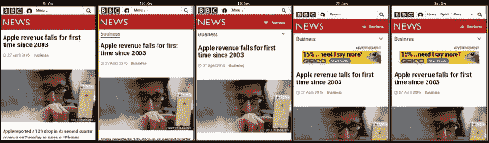

# 我们的最佳实践大大降低了移动网络的性能

> 原文：<http://molily.de/mobile-web-performance/?utm_source=wanqu.co&utm_campaign=Wanqu+Daily&utm_medium=website>

## 序

几年前，网络开发者妮可·沙利文做了一个很有影响力的演讲，名为[我们的(CSS)最佳实践正在杀死我们](http://www.stubbornella.org/content/2011/04/28/our-best-practices-are-killing-us/)。Sullivan 是第一个为可预测、可维护的大规模 CSS 建立规则的人。

在她 2011 年的演讲中，Sullivan 认为，当时被认为是最好的 CSS 实践实际上阻碍了我们的发展。借助 OOCSS，她发起了一场运动，最终导致了 Bootstrap 和 Foundation 这样的框架，以及像 [SMACSS](https://smacss.com/) 、 [BEM](https://css-tricks.com/bem-101/) 、 [CSS 模块](https://github.com/css-modules/css-modules)和 CSS-in-JS 这样的方法论。今天在前端开发中，我们试图创建可重用和封装的组件。沙利文帮助形成了拥有这种“乐高积木”的想法。

在本文中，我不会谈论结构化 CSS，但我想借用我们的最佳实践有时可能会伤害我们的想法，并将其应用于移动 web 开发。

## 移动网络:令人沮丧的用户体验

如今，移动网络访问无处不在，对数百万人来说，这是第一次也是唯一一次网络体验。我每天都用一部功能强大的智能手机通过 EDGE 或 HSPA+连接上网。但是总体用户体验令人沮丧。无论是作为用户还是开发者，我都发现移动浏览器不可靠，而且比桌面浏览器慢。为了提高性能和减少数据使用，我主要使用基于代理的浏览器，如 [Opera Mini](http://www.opera.com/de/mobile/mini) 和 [UC 浏览器](https://en.wikipedia.org/wiki/UC_Browser)。

有很多文章都在讨论为什么移动网络如此糟糕。有些人指责移动网络浏览器，有些人指责创造者、网络开发者或广告商。他们都是对的。整个行业都有责任。网站运行缓慢，反应迟钝，因为它们过于臃肿:缓慢的广告脚本，大型图像和视频，太多的自定义字体，巨大的 JavaScript 和 CSS 框架，其中只有 10%被使用。

其中一些错误可以通过基本的性能优化随时修复。其中一些需要在概念和设计阶段加以预防。其中一些需要用定制的代码替换通用代码，这对于较小的站点来说是不可行的。

## 当前绩效目标和方法

在低带宽、高延迟的移动互联网连接上，与有线、高带宽、低延迟的连接相比，网站加载缓慢。但是主要的问题不是一个页面完全加载所需的时间。这是页面在加载时*的行为方式。*

[响应时间](https://www.nngroup.com/articles/response-times-3-important-limits/)和输入反馈对用户界面的感知性能影响最大。因此，网站应针对 **[时间进行优化，以首次渲染](http://www.websiteoptimization.com/speed/tweak/start-render/)** 。从请求开始到第一次呈现到屏幕的持续时间应该尽可能的短。用户应该在几秒钟内看到一些东西。而且第一次出场要接近最后出场。这就是[速度指数](https://sites.google.com/a/webpagetest.org/docs/using-webpagetest/metrics/speed-index)测量的内容。

虽然“首次渲染时间”是一个至关重要的性能指标，但仅仅渲染是不够的。网页不是静态图片，而是交互界面。因此，更好的性能度量是第一次有意义的交互的时间。在与网站互动之前，用户需要等待多长时间？

很多心思都放在优化 **[关键渲染路径](https://developers.google.com/web/fundamentals/performance/critical-rendering-path/?hl=en)** 上。主要的优化方法是推迟加载对第一次渲染不重要的内容。这通常会导致大多数内容、样式和行为都是延迟加载的。

## 用户交互的中断

当用户看到页面的第一个屏幕或者开始非视觉地阅读页面时，他们就会开始与之互动。他们将向下滚动并激活按钮和链接。他们假定这些控制已经起作用，并假定这些控制或多或少是稳定的。

不幸的是，对于大多数移动网站来说，情况并非如此。在第一次渲染之后，内容被改变和移动。新内容不仅在末尾添加，而且在中间也添加。最常见的例子是图像、视频、菜单、侧栏、交互式小工具和广告横幅。自定义字体也会影响整体布局。

这些内容的改变不仅会迷惑用户，打断当前的交互，还会导致的布局重排。这是对元素位置的计算开销很大的重新计算。对于用户来说，这种回流被体验为“页面在跳跃”。

如果用户已经向下滚动并且内容被添加到当前滚动位置之上，这尤其令人沮丧。浏览器试图通过让它们的滚动行为更加智能来防止这种“跳跃”。

## 正在扼杀我们的最佳实践

那么为什么手机网站表现这么差呢？在我看来，开发人员遵循最佳实践。如果不加考虑地应用它们，这些实践可能会杀死我们:

1.  渐进增强和不引人注目的 JavaScript
2.  非阻塞、异步 JavaScript
3.  非关键内容的延迟加载

渐进增强的基本思想是根据每个网络设备的能力来对待它们。渐进式改进有助于专注于网站的核心功能，从而提高网站的性能。

虽然我是渐进增强的强烈支持者，但我认为我们的理解还不完整，我们的实践需要不断改进。渐进增强似乎被误解了:增强是在用户观看的加载时间内*应用的。*

当用户[骑着滑板](http://blog.crisp.se/2016/01/25/henrikkniberg/making-sense-of-mvp)时，它突然变成自行车，然后变成摩托车，然后变成汽车。这并不是说用户不喜欢驾驶汽车，而是当他们刚刚学会玩滑板时，当你很快就把它拿走时，他们会生气。

“不引人注目的 JavaScript”是一个十年前的技术，我已经在之前的文章中批评过 T2。当 JavaScript 向现有的、自给自足的 HTML 结构添加额外的行为时，它被认为是“不引人注目的”。一旦 JavaScript 开始运行，它就会改变 HTML DOM 并添加行为。不可避免地，这导致了重要的内容变化和回流。

在具有快速互联网连接的台式计算机上，内容在第一次渲染后仅几毫秒就发生变化。但在手机上，用户会看到几秒钟的非 JavaScript 版本，并可能与之互动，直到 JavaScript 明显切换到增强版本。

在过去的十年里，[我们教会了](/javascript-asynchron/) web 开发人员以异步、非阻塞的方式加载脚本。一个基本的 web 性能规则说“[包括顶部的样式表，HTML 代码底部的脚本](https://developer.yahoo.com/performance/rules.html)”。

当外部 JavaScripts 被放置在页面底部或标记有 [async/defer](https://developer.mozilla.org/en/docs/Web/HTML/Element/script) 时，代码可能在第一次呈现后的任何时候被执行*。在移动设备上，JavaScript 驱动的下拉菜单、粘性元素和交互式小部件直到第一次渲染后 10 秒才出现是很常见的。*

## 移动网络性能指南

在手机上网占主导地位的时代，其中一些做法正在造成危害。有些本身是好的，但应用时不加考虑。我并不是建议完全抛弃它们，而是针对移动时代进行修改。我整理了一些指南来更新我们现有的规则。

1.  **使用但质疑懒加载**

    重要的是要认识到内容的延迟加载和小部件的延迟初始化是一把双刃剑。它同时改善和削弱了用户体验。明智地选择随后加载和按需加载的内容。

2.  **识别关键代码，忘记经验法则**

    “样式表在顶部，脚本在底部”的规则对于复杂的网站是没有用的。确定最重要的内容和交互性所需的 HTML、CSS 和 JavaScript。这段关键代码应该会阻止第一次渲染。为了提高性能，样式和脚本甚至可以内联到 HTML 中。

    大多数 CSS 并不重要，因为它不会对最初几个屏幕上的内容进行样式化。它可能会影响另一个页面上的内容，所以没有必要以阻塞的方式加载它。

    特定的 JavaScript 应该被认为是关键的，比如主导航的代码。这个小脚本应该同步加载，这样用户就看不到脚下的主导航转换。

3.  **不要中断用户交互**

    当加载额外的内容或行为时，多次呈现页面的各个部分是没有问题的。但是每次渲染都要呈现一个*可用且稳定的界面*。用户交互不应被中断。当用户与其交互时，特定的界面控件不应该改变。

4.  **无回流**

    比起*改变已经可见的*内容，我更喜欢*添加*内容。不应该有影响现有内容的重排。实现这一点的简单方法是在页面底部添加内容。这与自然的自上而下的阅读顺序配合得很好。

5.  **支持滚动并固定高度**

    页面加载时应该可以滚动，并且不应该被篡改。避免滚动位置跳跃。内容应该延迟加载到固定高度的占位符中，通常是在用户到达滚动位置时。保留空白空间(例如用于广告)或显示标题和加载指示器(例如用于部分、侧栏和小工具)。

6.  **衡量&提高速度指数**

    在页面加载过程中，第一个屏幕不应有显著变化。确保[速度指数图](https://sites.google.com/a/webpagetest.org/docs/using-webpagetest/metrics/speed-index)显示视觉完整性早期急剧上升至 90-95%，然后稳定上升至 100%。

## 案例研究:BBC 新闻文章页面

我无法展示一个实现这些准则的复杂站点。但是既然我已经编译了它们*ex negative*，我想提出一个值得改进的例子。

如今，大多数复杂的新闻网站显示的加载性能对用户并不友好。让我们来看看 **[这个性能测试](http://www.webpagetest.org/result/160516_8J_19YF/)** 的一篇 [BBC 新闻文章](http://www.bbc.com/news/business-36146336)用 webpagetest.org。测试设备是一台摩托罗拉 E，带有模拟“慢速 3G”连接的移动浏览器。这种慢速连接允许彻底调查负载行为。在更快的连接中，将会有相同的事件，但是顺序更快。

### 描述:回流，回流，回流

站点的加载性能最好在[幻灯片视图](http://www.webpagetest.org/video/compare.php?tests=160516_8J_19YF-r:1-c:0)中查看，并由[观看视频](http://www.webpagetest.org/video/view.php?id=160516_2e47309e6744523e53b8994af5911e0c8e602bfd)。

[T2】](/assets/perf-bbc.png)

[放大电影片段](/assets/perf-bbc.png)

1.  第一次渲染发生在 8 秒钟后。文章文本已完全加载，用户可以开始阅读。
2.  十秒钟后，类别被插入到标题和文章标题之间，导致重排。
3.  两秒钟后，类别转换为下拉菜单。
4.  灰白色屏幕持续 8 秒。我没有在我的智能手机上看到这个。我猜这只是一个我要忽略的测试工件。
5.  在标题和类别导航之间插入广告横幅，导致重排。
6.  大约在同一时间，一个节菜单被添加到标题的占位符空间中，不会导致重排。
7.  五到六秒钟后，一个用于浏览其他 BBC 网站的下拉菜单被加载。它取代了一个菜单按钮，菜单按钮只是一个简单的链接到页面的页脚。
8.  在我的 real mobile Chrome 上，页面完全加载后会弹出一个整页广告。

### 评估:惰性加载过度

BBC 新闻网站显然针对首次渲染时间进行了优化。它延迟加载图片、导航工具和广告。一些延迟加载是以不引人注目的方式实现的，其他的会导致回流和用户中断。

这个网站的初衷是好的，但不幸的是结果却很糟糕。整体性能和可用性受延迟加载的影响大于它带来的好处。尤其是这三种惰性加载的导航方式令人困惑，影响了性能。两个广告的加载方式很烦人。

我推荐这些行动要点:

*   消除视觉混乱。关注核心内容和核心导航技术。
*   最小化延迟加载。使用不会导致回流和不会中断用户交互的延迟加载技术。
*   将两个冗余的导航部件合并为一个。类别导航包含部分导航。
*   让跨站点导航保持原样:到现有页脚的简单链接。
*   避免浮华的广告。使用占位空间的主要横幅。避免弹出横幅或使用不太侵扰的间隙。

我很想听到你的反馈！给[molily@mailbox.org](mailto:molily@mailbox.org)发邮件或者[在推特上给我发消息:@莫利利](https://twitter.com/molily)。