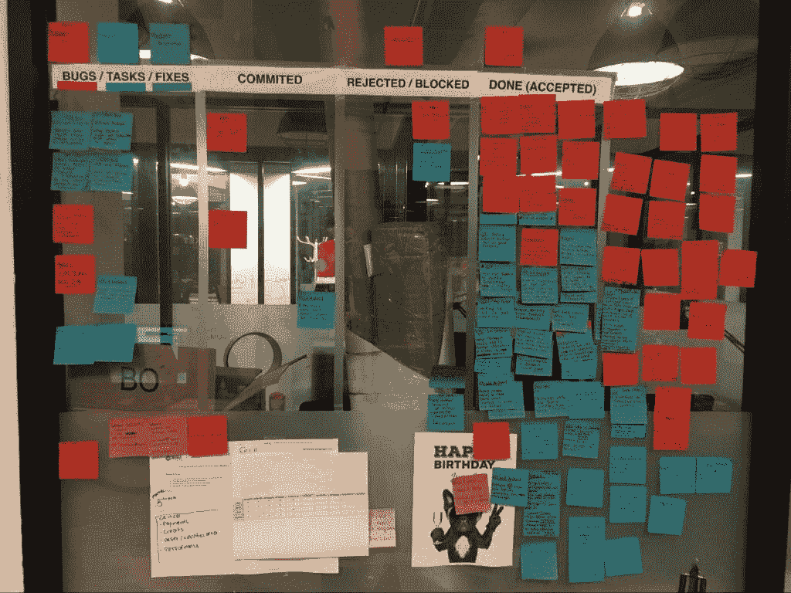

# 与外包开发人员一起构建产品的 7 课——注意产品

> 原文：<http://www.mindtheproduct.com/2016/04/7-lessons-building-product-outsourced-developers/?utm_source=wanqu.co&utm_campaign=Wanqu+Daily&utm_medium=website>

如果你曾经听说过那些试图与外包开发人员一起开发产品的人的故事(或者如果你自己尝试过)，你可能知道这有多么麻烦和令人沮丧。

可悲的现实是，外包开发的坏名声并非完全不公平，但外包开发的产品经理也要为此承担很大责任。可能你得到了你所付出的，但是同样可能的是，你带着明显不一致的期望进入一个外包的开发项目。

在海外或与外部团队一起开发软件产品可能是最不赚钱的软件开发方式之一，很大程度上是因为以这种方式编写的大量代码需要在后期被重写。然而，在正确的管理、沟通和战略环境下，外包开发可以获得很高的利润，这也是事实——和所有事情一样，关键在于准确理解问题所在。

就雇佣的总成本而言，外包开发比本地/内部开发要便宜得多，因此存在巨大的价值机会。然而，只有当明确外包开发如何适应验证产品的策略时，更重要的是，当有一个明确的长期策略(设计良好的路线图或商业计划)来说明演进产品的成本时(例如:代码重构、过渡稳定性等)，这才是正确的。)

因此，更具体地说，你可能会决定花费内部开发人员花费的一半来将概念原型投入市场。以后可能需要做大量的代码重构，当你把这个项目转移到一个内部团队时，可能会有一些慢下来，但是你已经廉价地验证了你的市场。或者，一旦原型代码完成了验证工作，您可以直接扔掉它，并在内部从头开始构建更易于维护的代码！

我最近领导了一个正在海外开发的产品，我们在创纪录的时间内成功推出了该产品的三个版本，并在此过程中学习了许多工作实践！

## 了解外包团队

一方面，与外部团队合作的许多挑战与与内部团队合作(或建立内部团队)没有太大的不同。主要的区别在于沟通、领域知识以及你和你的外部团队对彼此的投入程度。

当与内部开发人员一起工作时，你可以尝试将招聘、“本地化”和从团队中获取价值的过程分开。另一方面，当与外部团队合作时，您实际上是将所有这些阶段压缩到一个项目中，或者最多压缩一个时间框架。

也就是说，以下是关于如何利用外包开发团队，并从他们的工作中获得最大回报的七条经验:

### 1)雇佣一个开发公司或基于参考的个人开发者，而不是谷歌搜索

寻找优秀的外部开发人员(无论他们是在海外还是在不同的城市)是一个巨大的挑战。最好的方法是在你的人际网络中寻找推荐人。无论何时你发现有人愿意推荐一个开发者，询问他们的优点*和缺点*的信息。也许有人写了史诗代码，但不是一个伟大的沟通者——这可能对你有用，但只有当你意识到技能的平衡。诚实、平衡的评估至关重要。

### 2)测试你的开发者几个星期

当你雇佣外包开发人员时，表现不佳的可能性是合理的。这可能是因为文化、技能，甚至是领域知识的缺乏阻碍了他们理解你所要求的东西的能力。试着给他们一个小的热身项目，作为后期开发的补充。

这一点很重要，因为你越早发现不适合，就越好。如果没有合适的人选，那就终止合同，找另一个开发商。

### 3)学会只关注重要的事情

你需要明白，在外部发展的时候，你得到的通常会比你期望的要少。可悲的是，这似乎是这种模式的自然结果，也许是因为许多公司没有你可能在像素完美的 UI 修复和润色方面的投资水平。

调整您的期望，使它们与您实际投资的开发相匹配，并将您的精力集中在最关键的组件和功能上。

### 4)不要将你的官僚作风引入他们的开发流程

外部开发人员通常不关心你的 Pivotal Tracker/JIRA/Trello+Slack 设置。不要要求他们学习如何使用你的管理工具，因为他们要么不会，要么不会做好。毕竟，这不是你付钱给他们的目的。

相反，问问他们喜欢什么样的沟通和跟踪方法，并接受这个工具或系统，不管它是什么。你会发现学习这个对你来说更容易，而不是相反。

### 5)习惯 QA 角色

当与外包开发公司合作时，总是有高标准质量保证的承诺。可悲的是，这种承诺通常在某种程度上无法实现。确保质量的唯一方法是自己进行测试。

当接收构建或新版本时，关注软件的关键组件。不要仅仅因为某些功能在上一个版本中可以工作，就认为它可以工作。东西会坏掉。测试一切！

### 6)专业一点，或者至少找一个专业的人来帮你

仅仅因为你在外部开发你的软件并不意味着你没有技术能力。事实上，在进行外部开发时，你比以往任何时候都需要更多的技能。这种情况的主要原因是*而不是*典型的玩世不恭的原因，用技术术语被当成傻瓜，这样开发人员就可以证明他们的延迟是正当的。

事实上，原因很简单——外包开发人员不像您一样理解您的业务逻辑，因此他们需要精细的、高度技术性的文档，这样他们才能实现您的要求。

> 当 X 发生时，我需要该软件进行支付

…不一定能让你有所成就。

> 我需要你写一个向这个 API 发出请求的脚本，然后我需要你在这个数据库字段中存储响应

更有可能得到你想要的东西。

### 7)跟踪项目！

这可能是我们学到的最重要的一课。跟踪您的项目增加了成功的机会，并帮助您加速开发过程。跟踪的全部目的是对产品状态和可行的后续步骤有一个清晰的了解。这对于任何团队配置来说显然都是必要的，但当你与公司以外的团队合作时，这就变得*绝对必要*。

我发现跟踪外包项目的最好方法之一是使用我为自己的一些外包项目设计的受敏捷启发的图表。该图表有 4 个主要栏:

*   问题:这是你积压工作的起点。您在构建审查中确定或发现的所有 bug、任务或修复都在这里。通常，在从开发人员那里收到新的构建和/或发布之后，这个专栏就会充满新的问题。
*   **Committed:** 在这一栏中，你把所有已经提交给开发者修改的东西，无论是通过电子邮件还是他们自己的项目管理工具。通常我会写一封下午的电子邮件，他们会在早上看到我发现的所有问题，并为第二天添加这些问题。
*   **拒绝&完成:**当开发人员发送一个版本或构建版本时，他们总是会发送一组描述什么被修复和/或添加的发布说明。在此基础上，对发送的内容进行审查，在发布中处理的所有问题都从已提交转移到已拒绝或已完成。
    当某件事被拒绝时，这意味着该问题需要重新提交，直到它被解决。

通过遵循这个简单的跟踪方法，无论你的开发团队在哪里，你都可以对你的项目的状态和进展有一个清晰的概念。

## 最后的想法

与外部团队开发软件产品，尤其是海外团队，可能非常具有挑战性。也就是说，有时有预算约束和参与限制，使得不可能在内部开发这些产品，所以你没有太多的选择。

同样，外包开发可以帮助实现特定的目标，这些目标可以在以后代表巨大的投资回报。最相关的例子是开发一个未经测试的想法的 MVP。

在这些情况下，清楚地知道如何进行，以及如何为团队提供支持和结构，可以决定成功和失败的区别。拥有一个清晰的框架和一套如上所述的指导原则至少可以增加成功的机会，并减少由外包开发团队开发产品带来的负面影响。在你开始外包项目之前，确保你有类似的东西，如果你有任何其他确保这类项目成功的建议，我很乐意在评论中听到！

#### 关于

Juan J. Ramirez 是一位经验丰富的产品经理和 UX 专家。他在加州圣巴巴拉的 Procore Technologies 公司担任手机 UX 设计师。此前，他是 Seconds.com、Contactive(已被 Fuze 收购)和 Usuallee 的产品经理。他拥有卡内基梅隆大学的医学工程硕士学位。他在自己的祖国哥伦比亚 CESA 商学院获得了工商管理学士学位。联系他:[LinkedIn](https://www.linkedin.com/in/juanjoseramirez)/ [Twitter](https://twitter.com/whoisjuan)/ / [www . whois Juan . me](http://whoisjuan.me)。