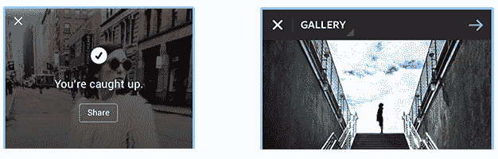
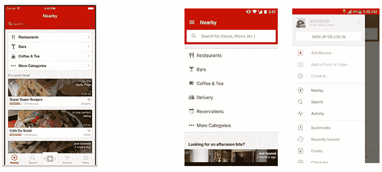
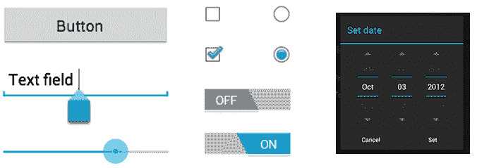
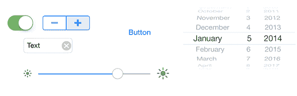
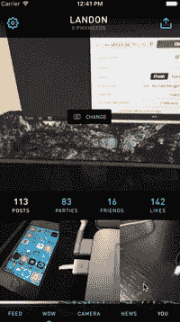
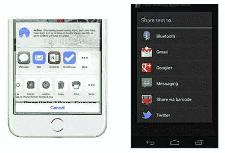

# 为什么把一个 iOS 设计移植到 Android 上不会成功

> 原文：<http://martiancraft.com/blog/2016/05/porting-ios-design-to-andoid/?utm_source=wanqu.co&utm_campaign=Wanqu+Daily&utm_medium=website>

在我从事 Android 开发的四年中，无论是大项目还是小项目，都有一个共同的问题:设计。即使在有专门的 UX/用户界面设计师的团队中，或者在 iOS 驱动 Android 设计的团队中，我发现自己一遍又一遍地做着同样的事情:倡导以正确的方式做 Android。让一个应用程序的外观、感觉和功能在 Android 上保持原生是很重要的。

很多时候，当我把这个问题传达给项目领导时，我会得到同样的回答:“没关系，没什么大不了的。”我在这里告诉你这很重要——我想通过一些例子告诉你为什么。

## 从用户的角度来看

### 硬件后退按钮是一个东西

iOS 上的导航是通过 UI 按钮在应用中完成的，而 Android 上的导航是通过 UI 控件和设备上的硬件按钮完成的。很多时候，应用程序必须知道用户在 Android 上点击了后退按钮。按后退按钮通常会将用户带回到上一页。然而，在异常情况下，必须对 UI 和应用程序流进行讨论。例如，如果应用程序有几个登录屏幕，并且在完成登录后，用户不需要或不想返回到开始登录时，讨论是为了确定如果 Android 用户在这种情况下点击后退按钮会发生什么。app 应该把用户带到哪里？这不是 iOS 用户面临的问题——所以这是 Android 导航流的一个新的设计挑战。

为了在 iOS 应用中向后导航，用户通常会寻找一个返回箭头，或者可以使用边缘滑动。这就是按下软/硬件后退按钮的目的，就像 iOS 中的软件后退按钮一样。

一些应用程序设计需要一个“X”按钮来离开页面或模式。虽然这在视觉上很吸引人，甚至是 iOS 所必需的，但是这个按钮不应该出现在 Android 用户界面上。Android 用户自然直观地敲击硬件返回键来退出一个没有按钮的对话框，所以在设计上不需要引入“X”或者关闭键。

X 按钮的例子，用于退出一些不需要的知名社交 Android 应用程序(Twitter 和 Instagram)的页面。

Slack 通过修改设计来保持对平台的忠实，从而得到了正确的结果。

iOS(左)vs Android(右)

### iOS 导航模式可能会让 Android 用户感到沮丧

对于设计师、开发人员和产品负责人来说，考虑到 iOS 和 Android 在导航模式和屏幕转换方面有不同的原生标准，并了解这些方面的最新信息非常重要。谷歌的材料设计文档在详细描述屏幕过渡使用方面做得非常好，并且将适当的导航模式应用到你的应用程序中。

Android 用户习惯于某些导航和 UI 模式。大多数应用程序坚持并保持用户体验与 Android 的用户界面模式一致。

iOS 导航通常使用底部标签栏来导航整个应用程序。对于 Android 用户来说，这与标准设计语言不一致，乍一看可能会让用户感到沮丧。最好不要使用底部的标签栏选项，而是在 Android 的标准汉堡图标下显示导航选项。一个很好的例子是 Yelp 是如何对其移动应用程序做到这一点的。(*从 Android N 开始，谷歌正在引入底部导航。然而，还没有发布日期，何时将提供给公众。*)

Yelp iOS 带有底部导航选项(左)，Android 带有汉堡图标下的导航选项(右)。

如果 Android 是你公司的一个重要平台，你需要雇佣熟悉 iPhone 和 Android 设计语言的设计师。平台差异不仅是事物的外观，还包括 app 的结构和流程的差异。设计师需要花一些时间通过 Android 设备的实践经验来熟悉 Android 平台。

## 从开发人员的角度来看

### 标准 iOS 控制的自定视图

通常，设计师希望每个元素在不同平台上看起来都一样，这需要额外的开发工作来实现与 iOS 相同的默认设计。更复杂的用例是默认控件，如单选按钮、复选框、切换按钮等，它们需要自定义视图实现来获得正确的“iOS”外观。一个例子是日期选择器。Android 用户通常不熟悉老虎机卷轴式日期选择。自定义视图可能会变得复杂，这增加了工作负载和复杂性，并疏远了您在 Android 上的应用程序设计——所有这些都对 Android 用户有负面影响。

标准 Android 控件

标准 iOS 控制

### iOS/Android 动画并非生而平等

iOS 动画框架似乎是在考虑动画的情况下构建的平台。相比之下，Android 动画框架似乎是事后才构建的。Android 的动画框架远不如 iOS 强大。一个非常相似的比较是 iOS AV Foundation，它是 Android 的摄像头和位图 API 的飞跃。如果设计中需要动画，UX 的设计师需要和开发商坐下来，看看在项目的时间框架内可以实现什么。

我以前的一个项目有一个复杂的个人资料页面，其中包括您的个人资料图片和其他信息。该页面需要一个粘在列表视图上的标题，沿着挤压/缩放/淡化你的个人资料图片(见 gif 视觉)。动画可以使用内置的 iOS 框架在较高的层次上完成。Android 需要通过扩展/定制所提供的核心视图组件来实现更深层次或更低层次的方法。不知道我的 iOS 版花了多长时间，但我肯定我花了更长的时间在 Android 上实现这个效果。我喜欢这个挑战，一切都很顺利，但是它不像 iOS 开发那样简单快捷。

### 分享经验

iOS 使用 share sheet，允许开发者在一定程度上定制 share sheet 菜单。很多时候，设计师会希望这种分享体验尽可能准确地移植到 Android 应用程序中。Android 通过调用任何可以共享内容类型的应用来处理共享体验。没有必要花时间为你的 Android 用户创造独特的分享体验。

定制体验在世界上有自己的位置，然而，标准几乎总是要走的路。坚持标准可以为产品团队节省时间，因为他们不必为定制的共享体验而劳神费力，而且你的应用程序用户也不必花费额外的时间来学习你独特的共享体验。

### 正确的 Android 方式

这并不是说 Android 开发更难——与 iOS 相比，Android 只是在设计和开发上有所不同，需要从一开始就考虑到这一点。我鼓励产品所有者和设计师向有经验的 Android 开发者寻求建议，这将有助于避免项目期间不必要的开发周期。项目经理和利益相关者必须考虑到，当事情正确完成时，Android 产品的时间表可能与 iOS 的时间表功能匹配，也可能不匹配。

对你的客户来说，正确地做事比简单地模仿 iOS 上的做法更好。

投资 Android 需要耐心和对平台的良好理解。请记住，Android 至少拥有美国智能手机市场 50%的份额，如果做得正确，你不仅会获得 Android 客户群的关注，还会赢得他们的喜爱。不要为了在设计上省钱而放弃一半的智能手机市场。Android 用户总是会注意到。

