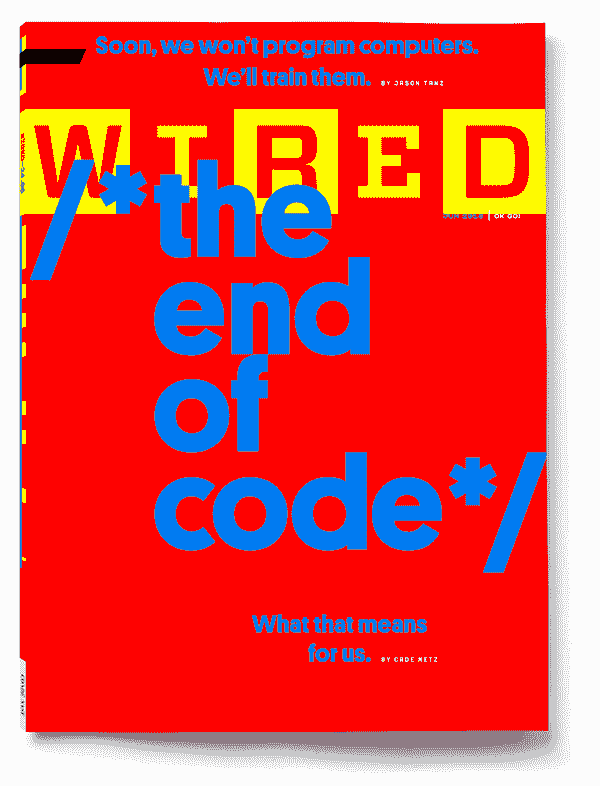

# AlphaGo 背后的人工智能可以教会我们如何成为人类

> 原文：<https://www.wired.com/2016/05/google-alpha-go-ai/?utm_source=wanqu.co&utm_campaign=Wanqu+Daily&utm_medium=website>

由凯德·梅斯于 2016 年 19 月 5 日

# AlphaGo 背后的人工智能可以教会我们如何成为人类

Aja Huang 将手伸入一个由磨光的黑色石头制成的木碗中，看也不看，将拇指放在中指和食指之间。透过金属框眼镜，他把黑石放在棋盘上一个几乎空无一物的地方，就在一块白石的左下方。在围棋术语中，这是一个“肩撞”，从侧面，远离游戏的其他行动。

在桌子对面，过去十年中最好的围棋手李·塞多尔(Lee Sedol)愣住了。他看着棋盘上呈扇形散开的 37 颗石子，然后站起来离开了。

在大约 50 英尺外的解说室里，迈克·雷蒙正在通过闭路电视观看比赛。雷德蒙是唯一一位达到九段棋手级别的西方围棋选手，九段棋手是围棋的最高级别。他和李一样震惊。“我真的不知道这是一个好的举动还是一个坏的举动，”雷德蒙对在线关注游戏的近 200 万人说。

[June 2016\. Subscribe now.](https://subscribe.wired.com/subscribe/wired/103354?source=AMS_WIR_MAG_CARVEOUT&pos_name=AMS_WIR_MAG_CARVEOUT)

“我认为这是一个错误，”另一位英语评论员克里斯·加洛克说，他是美国围棋协会的交流副总裁。

几分钟后，李走进了比赛室。他坐下来，但没有碰他的白色石头碗。一分钟过去了，然后又是一分钟——总共 15 分钟，在比赛开始的两个小时里，球员们可以参加每场比赛。最后，李拿出一块石头放在棋盘上，就在黄下的那块黑色的上面。

黄的移动在比赛中仅是第 37 步，但李再也没有从这一击中恢复过来。四小时二十分钟后，他失败了，辞职了。

但黄并不是这场围棋比赛的真正赢家。他只是在执行命令——在他左边的平板显示器上传达，它与首尔四季酒店附近的控制室相连，并与分散在世界各地的谷歌数据中心内的数百台计算机联网。黄只是动了一下手；游戏背后的大脑是一个名为 [AlphaGo](https://www.wired.com/tag/alphago/) 的人工智能，它正在击败人类有史以来设计的最复杂的游戏中最好的玩家之一。

在同一个房间里，另一位围棋专家在观察——三届欧洲冠军范辉。起初，第 37 步也让他困惑。但是他和 AlphaGo 有一段历史。他比任何人都更像是它的陪练。在五个多月的时间里，范用这台机器玩了数百个游戏，让它的创造者看到了它哪里出了问题。范输了一次又一次，但他逐渐理解了 alpha go——就像任何人能够理解的那样。范认为，那次撞肩不是人的动作。但是经过 10 秒钟的思考，他明白了。“太美了，”他说。“太美了。”

在这场五局三胜的系列赛中，AlphaGo 现在以 2 比 0 领先于李，通过代理人，领先于人类。Move 37 表明 AlphaGo 不仅仅是重复多年的编程或通过蛮力预测算法。这是 AlphaGo 证明它*理解*的时刻，或者至少看起来以一种与真实事物难以区分的方式模仿理解。从李坐的地方看，AlphaGo 展示了围棋选手可能称之为直觉的东西，即不仅像人一样，而且以无人能及的方式下一盘漂亮的棋的能力。

但不要为李·塞多的失败哭泣，也不要为人类哭泣。李不是烈士，第 37 招也不是机器开始无情地控制我们弱小心灵的时刻。恰恰相反:第 37 步是机器和人类最终开始共同进化的时刻。