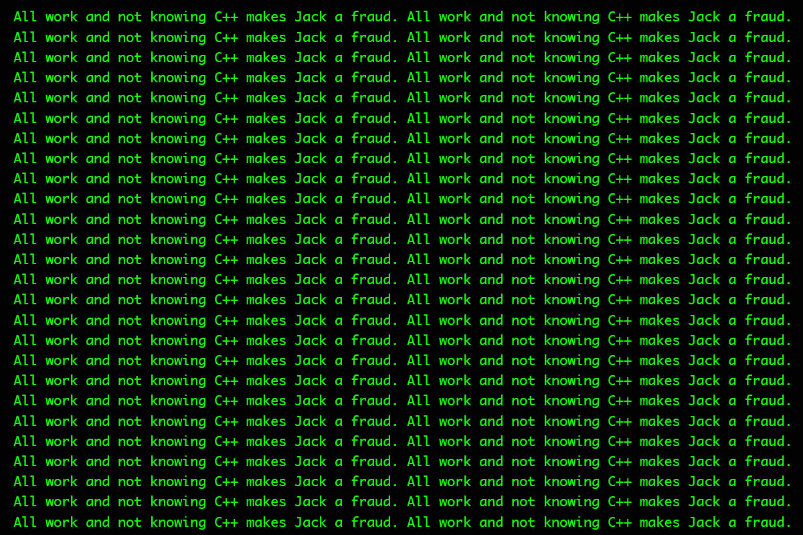

# 如何少担心自己是个糟糕的程序员

> 原文：<http://www.stilldrinking.org/how-to-worry-less-about-being-a-bad-programmer?utm_source=wanqu.co&utm_campaign=Wanqu+Daily&utm_medium=website>

我刚刚遇到了冒名顶替综合症的另一种表现形式，即“我真的是一名开发人员还是一名优秀的谷歌员工？”

我看的答案没说到点子上，所以我要把这个乱七八糟的东西分解一下，因为太多人没有好的理由害怕。

### 信息容易找到的事实并不会让你变笨

这是我经常听到的故事之一，我认为它是虚构的，但事实或虚构的，重点是:当被问及他的电话号码时，爱因斯坦查了一下，说他为什么要记住他能在两分钟内找到的东西？

在 80 年代，书呆子的标志是拥有一本百科全书。你甚至不需要阅读大部分内容:我家最令人印象深刻的百科全书是 1937 年的，关于纳粹党的条目有两段暗示这没什么大不了的。我只是知道了有史以来最不可思议的错误信息之一——从我用来获取信息的一件事情中学到的——让我加入了聪明俱乐部。因为在那个时候，有趣的信息很难获得，而仅仅是去寻找它的冲动会让你成为一个书呆子。

现在，即使是最无知的平民也可以获得他们想要的任何信息，书呆子精英们已经退却，并宣称有一些基本的大脑功能，使他们能够比其他人更好地驾驭信息洪流。正如所有最吸引人的谬论一样，这个概念中有一个真理晶体管:人们很容易觉得自己比那些使用互联网寻找疫苗与蜥蜴相关文章的人更优越。但是，当你浪费了一整天的时间与一个错误作斗争，然后才想起搜索堆栈溢出时，你也很容易感到自卑，在那里你发现五个人在三年前就解决了这个问题，其中两个人认为不是生来就知道答案的人是白痴。

新的民粹主义信息检索引擎可能会让你因为使用任何人都可以使用的东西而感到软弱，但这是一种可怕的精英主义情绪，你应该连同你所有秘密的同性恋恐惧症一起消灭。

### 忘掉这些关于热爱工作的废话

我一直最喜欢的工作是洗碗。我很擅长这个，我可以自动驾驶，让我的大脑自由思考。最精彩的部分？如果我在一天结束后为一家 400 家顶级餐厅清洗了 2000 个盘子，看起来很憔悴，没有人让我坐下来，问我为什么对我的擦洗技术没有更大的热情。

如果热爱你的工作是不可协商的先决条件，文明就会崩溃。我肯定有人在他们的 for 循环中找到了精神上的满足感，对 i++和++i 之间的速度差异进行了基准测试，感谢上帝，因为有人必须对我们的核制导系统进行编程。我们其他人只是祈祷“调试”邮件文件夹中未读警告的数量不会上升得太快，以至于我们不得不处理它。

在过去的日子里，在他们拿走马提尼午餐和张贴励志海报之前，关于工作的重要部分不是你喜欢它；重要的是你没有讨厌它，也没有让你的同事讨厌它。既然他们已经成功地向渴望高薪职位的一代人推销软核快乐工作色情，我们的雇主告诉我们在平安夜把手机放在手边是没问题的。对于一些程序员来说，让其他人讨厌他们的工作和他们自己是可以的，因为，嘿，那个人喜欢他所做的事情，如果你不喜欢，那是你自己的错，因为你没有在周六晚上手淫来学习递归教程。

### 你赢不了与销售的自信竞赛

现代创业公司以最糟糕的方式召唤出高功能的冷漠。因为这项技术是由真正热爱基于磁带的黑客技术的人创造的，我们有一堆由销售部门和技术部门组成的公司，因为每一项其他工作都外包给了由另一家由销售部门和技术部门组成的公司运营的网站。如果你从事销售，热爱或假装热爱你的工作是这份工作不可或缺的一部分。这就是销售额的来源。如果你从事技术工作，你的工作就是让事情运转起来，为了完成这项工作，你可以想多苦就有多苦，因为你卖的唯一产品就是你实现 Stripe api 的能力，没有人会因为这种事情的发生而过于兴奋。

你所有的公司会议都由有吸引力、目光明亮的销售人员组成，与疲惫的开发团队形成对比，他们希望会议结束，因为他们已经在想他们需要多长时间才能弄清楚竞态条件错误，他们知道这不是真正的竞态条件，因为它从来都不是狼疮。

这个你不用担心。也许你有社交能力，有魅力，眼睛明亮，也许你没有。这与你的工作无关。

### 忽略吊坠

当然有人会说，“每个程序员都应该知道 x。”

我不知道 x 的任何值。冒泡排序？我想这与吉尼斯和竖琴有关。b 树？听起来像常青树。哈希表？我学的是 PHP 编程，所以过了两年才知道哈希表和数组的不同。当 OkCupid 雇佣我的时候，我不知道散列表和数组的区别。在 OkCupid 卫生纸机的评判主义面前，上帝自己都颤抖了，但他们还是给了我一份工作。

无论你从事什么样的编程工作，都会有大量你不懂的编程。如果你设法学会了宇宙中的每一种编程语言，一些 12 岁的俄罗斯孩子会嘲笑你不知道如何超频你的 CPU。与此同时，一个韩国小孩会黑掉你的 PS4 账户，而一个美国人喝下一杯拿铁咖啡，问你为什么不关闭 b 系列。当你要求法国运营人员停止在服务器室吸烟时，她只会朝你吐口水。

现在做 STEM smart 有点酷，因为一种特定逻辑问题解决方法的特定应用使普通白人能够获得中上阶层的收入，同时使商学院毕业生比人类文明史上任何人都更富有。由于第一代泡沫时代的首席技术官成长过程中没有太多性生活，但肩上扛着一大堆微芯片，他们无意中创造的文化是一种痴迷于应用数学的能力的文化，不管他们认为数学应该以什么模糊的方式应用，其他人都可以去自杀。

如果他们需要，很好。当你生活在谷歌或 Vim 之前，你需要一些东西来支撑你度过发现你的 Amiga 不记得你的周年纪念日的黑暗时刻，因为你没有周年纪念日，而且可能永远也不会。

编程是新的，最初的约翰·麦克莱恩斯(John McLanes)还活着，还指责我们其他人懒惰。但是编程现在是一项和其他工作一样的工作，因为你需要做的一切来满足你的 BizDev 团队都可以学习，而不需要对 Thag 的 Move Things Better Octagon 的原型进行逆向工程。

### 面试是地狱，克服它

你将带着你认为的神秘知识的聚宝盆走进任何给定的面试，几乎从你的泪腺中挤出来，以提高半英里半径内的财产价值。很多时候，你会走出面试，想要放弃并以饲养豚鼠为生。每个人都知道其他人不知道的事情，我们大多数人最终都会处于另一个人根据我们知道的很少有人知道的事情来决定我们未来就业的位置。

所有的面试过程都是有缺陷的。只要我们缺乏一种算法，根据一点点近乎随机的输入来预测候选人的工作能力，而不是成为一个混蛋，这些方法就会有缺陷。面试是一个冒着五万美元风险却没有避孕套的约会。不管是什么职业，声称只要几个人认真思考，问题就可以解决，这是一种傲慢的浪费。

确切地说，没有人知道到底发生了什么，但是很多人通过维持他们这样做的假象来获得薪水和点击。他们中的一些人会面试你，你对此无能为力。当它开始给你冒名顶替综合症时，珍惜它，因为任何没有冒名顶替综合症的人都是傻瓜。

### 赚钱

你上周拿到薪水了吗？如果是这样，很好。你走在了曲线的前面。你从事编程工作吗？什么事？好吧，上周的薪水使你超过了世界上 80%的工薪阶层，更不用说那些找不到工作的人了。如果你下周拿到薪水，你就不是骗子。

当你看到一堆腐烂的意大利面条组件将可用的能量送向毫无意义的死亡时，你的老板看到的是一个标有“电脑高手”的黑匣子。他们把钱放进去，事情发生了，瞧！一种能让他们赚更多钱的产品出现了。你可能会把自己比作泰斯拉的梦遗，并希望自己有阿达·洛芙莱斯十分之一的先见之明，但你不应该，你也不是。还不如在 11 世纪的挪威长出第一把胡子，然后假设自己是托尔。你不是索尔。你是那个留在船上繁衍后代的诗人，因为其他人都死了。

如果你对指针和 3D 图形方程有困惑的性感觉，那就给你力量:你出生在一个直接尊重你的一代，并且以一种令人毛骨悚然的方式间接地崇拜你。如果你只是需要一份工作，并且能够并且愿意接受计算机比旅鼠笨得多的事实，那么你就拥有了保持信息时代运转所需的一切。