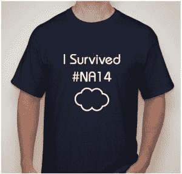

# SalesForce 中断:SaaS 棺材上的一颗钉子？泽尔托

> 原文：<http://www.zerto.com/blog/dr/salesforce-outage-one-more-nail-in-the-coffin-of-i-can-trust-my-saas-provider/?utm_source=wanqu.co&utm_campaign=Wanqu+Daily&utm_medium=website>

* * *

*Zerto 的产品专家 Keith Taylor*

很少有像 SalesForce #NA14 事件这样的停机事件。但是，当您的服务被全球数百万用户所依赖时，当您的一个数据中心停机时，根本没有办法逃脱审查，更不用说它离线近 20 小时，并且您会丢失客户近 4 小时的数据！[T2】](https://www.zerto.com/wp-content/uploads/2016/05/Salesforce-Outage.jpg)

我相信现在我们都知道这个故事的背景。但是，万一你想入非非(绝对是双关语)，我们将回顾导致无数文章、迷因甚至 t 恤产生的问题。

5 月 9 日日下午 5:47 左右(PDT ), sales force 华盛顿数据中心的一部分停电，导致#NA14 实例无法访问。该团队确定原因是断路器故障(尽管它在 2016 年 3 月通过了负载测试)。

决定执行站点切换并故障转移到芝加哥的另一个数据中心。这项工作已经完成，当天晚上 7 点 39 分发布了“解除警报”。然而，不久之后，工程师们开始注意到性能下降，并迅速升级为全面的服务中断。后来发现，这是由于存储阵列中的固件缺陷导致写入时间显著增加，进而导致数据库开始超时，最终一次写入没有完成，导致文件差异和数据库群集故障。

这就是真正的问题所在，导致数据库故障的文件差异被复制回华盛顿数据中心，而与此同时，芝加哥的备份没有及时完成，因此也不能用作恢复点。在多次尝试恢复芝加哥的服务失败后，SalesForce 团队决定使用华盛顿的备份来恢复。不幸的是，在站点切换到芝加哥之后，这没有被更新，所以这导致了在 5 月 10 日凌晨 2:53 到 6:29(PDT)之间输入的所有客户数据的丢失。

**没有云**

#NA14 事件凸显了许多企业对利用云和 SaaS 模式优势的担忧。我们似乎太容易忘记的是，云最简单的形式就是别人的电脑。

当我们使用云服务时，我们实际上放弃了对我们自己的平台、服务、数据和安全的控制，并将所有这些事情的责任交给了某个人，当事情发生问题(完全无法支持正常性能)时，他不必处理后果。

依赖第三方提供关键任务服务可能有点冒险。当我们寻求利用 SaaS 平台时，有许多风险需要考虑，但通过制定适当的合同和控制措施、政策和程序，我们应该能够管理这些风险。

确保您的提供商的运营弹性和可靠性措施不仅足够，而且符合您自己的高标准。安全措施、备份和/或灾难恢复流程、硬件质量和软件更新应用的责任–所有这些都需要评估潜在风险，并以某种方式加以保证。

许多组织，尤其是医疗保健、金融和保险或公共事业部门的组织，会有法律要求来确保其服务提供商采取适当的强有力的控制措施来保护和确保其客户数据的可用性。在某些控制数据保存或传输位置的国家/地区，可能还存在地理限制。

还需要考虑供应商本身作为一个运营业务实体的生存能力——金融风险、政治问题，甚至提起刑事诉讼的可能性(尽管可能性很小)—都应考虑在内。如果您的 SaaS 提供商在这些方面完全失败，他们可能会根据您的合同协议允许您取回数据。但即使这样，企业仍会遭受将数据传输到替代基础架构的停机时间。

这些只是你可能面临的任何 SaaS 供应商的一些潜在风险。但这里的要点只是让你思考一下——有时当我们不直接关注某件事情时，我们会忘记充分考虑底层操作的稳健性。有时——这可能更糟——我们只是因为企业的规模或范围就认为自己是安全的。

**吸取的经验教训**

自 2008 年金融危机以来,“大到不能倒”一词成了银行业的同义词。许多金融机构非常清楚地表明，这根本不是真的。其实越大摔得越重。作为企业和消费者，我们对这些机构寄予了过度的信任，相信它们会以有利于客户利益的方式行事和运营，而不是为了自身的盈利。

现在的问题是——我们是否已经吸取了教训，并对我们的 SaaS 供应商提出了足够的要求？

* * *