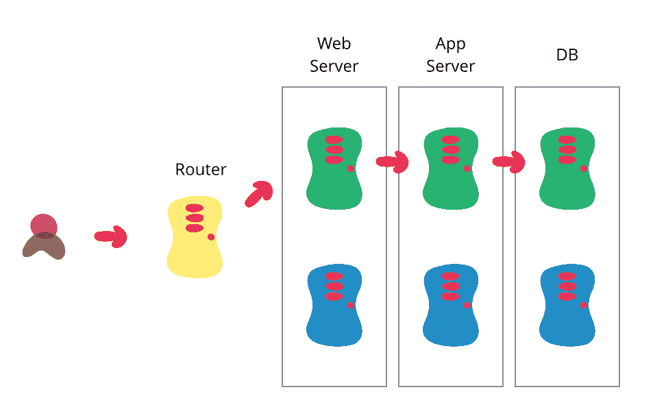

# blue green 部署

> 原文：<http://martinfowler.com/bliki/BlueGreenDeployment.html?utm_source=wanqu.co&utm_campaign=Wanqu+Daily&utm_medium=website>

我和我的同事敦促客户实现的目标之一是完全自动化的部署过程。自动化部署有助于减少软件“完成”和实现其价值之间的摩擦和延迟。Dave Farley 和 Jez Humble 正在完成一本关于这个主题的书- [连续交付](/books/continuousDelivery.html)。它建立在许多通常与[持续集成](/articles/continuousIntegration.html)相关的想法之上，推动软件快速投入生产并让其发挥作用的能力。他们关于蓝绿色部署的部分引起了我的注意，因为这是一种未被充分利用的技术，所以我想我应该在这里对它做一个简要的概述。

自动化部署的挑战之一是切换本身，将软件从测试的最后阶段转移到实际生产中。为了最大限度地减少停机时间，您通常需要快速完成这项工作。蓝绿色部署方法通过确保您有两个尽可能相同的生产环境来做到这一点。在任何时候，其中一个(例如蓝色)都是活动的。当你准备一个新版本的软件时，你在绿色环境中做最后阶段的测试。一旦软件在绿色环境中工作，您就切换路由器，以便所有传入的请求都进入绿色环境——蓝色环境现在是空闲的。

蓝绿色部署还为您提供了快速回滚的方法——如果出现任何问题，您可以将路由器切换回您的蓝色环境。在绿色环境运行时，仍然存在处理丢失的事务的问题，但是根据您的设计，您可以将事务提供给两个环境，以便在绿色环境运行时将蓝色环境作为备份。或者，您可以在切换之前将应用程序置于只读模式，在只读模式下运行一段时间，然后切换到读写模式。这可能足以解决许多悬而未决的问题。

这两个环境需要不同，但尽可能相同。在某些情况下，它们可以是不同的硬件，也可以是运行在相同(或不同)硬件上的不同虚拟机。它们也可以是一个单独的操作环境，该环境被划分为单独的区域，两个存储片具有单独的 IP 地址。

一旦您将绿色环境投入使用，并且对其稳定性感到满意，您就可以使用蓝色环境作为下一次部署的最终测试步骤的准备环境。当您准备好下一个版本时，您可以像之前一样从绿色切换到蓝色。通过这种方式，绿色和蓝色环境会定期在活动的上一个版本(用于回滚)和下一个版本之间循环。

这种方法的一个优点是，它的基本机制与让热备用工作所需的机制相同。因此，这允许您在每个版本上测试您的灾难恢复过程。(希望你比你有灾难更频繁的释放。)

基本的想法是有两个容易切换的环境之间切换，有很多方法来改变细节。一个项目是通过弹跳网络服务器而不是在路由器上工作来实现切换的。另一种变化是使用相同的数据库，为 web 和域层制作蓝绿色开关。

使用这种技术，数据库经常是一个挑战，特别是当您需要更改模式以支持软件的新版本时。诀窍是将模式更改的部署与应用程序升级分开。因此，首先应用一个[数据库重构](/books/refactoringDatabases.html)来更改模式以支持应用程序的新版本和旧版本，部署它，检查一切都工作正常，这样就有了一个回滚点，然后部署应用程序的新版本。(并且当升级已经停止时，移除对旧版本的数据库支持。)

这种技术已经“存在”很久了，但是我没有看到它被经常使用。丹尼尔·特霍斯特·诺斯和杰兹·亨布尔·T2 的模糊组合想出了这个名字 T3。

## 承认

Illustration by Ketan Padegaonkar

## 更新

2015-06-05:正如《黑客新闻》所注意到的，该页面今天获得了更多的页面流量。所以我加了一段关于数据库变化和进一步阅读的部分。

