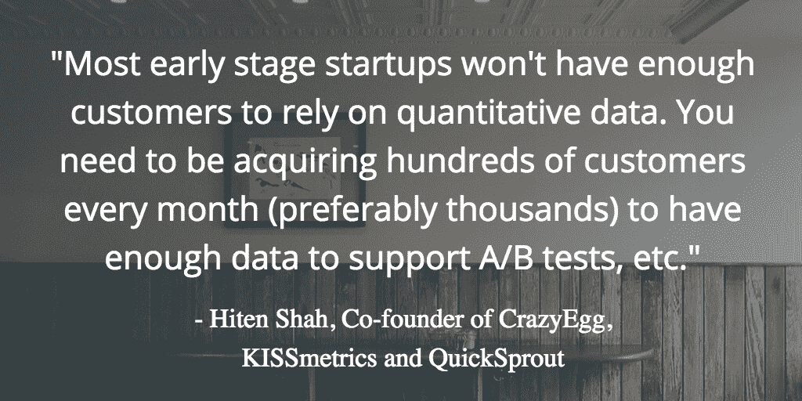
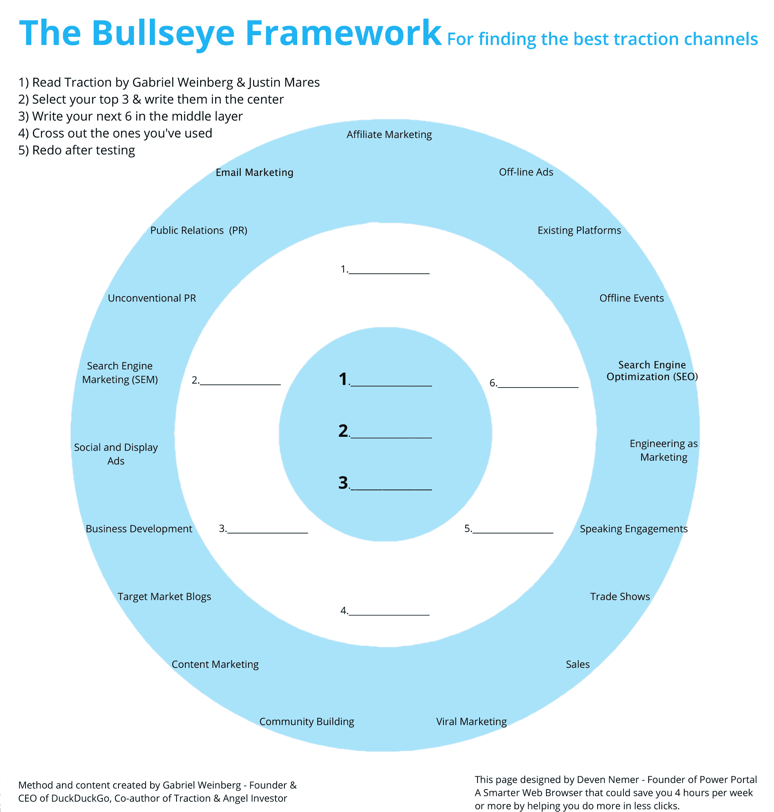
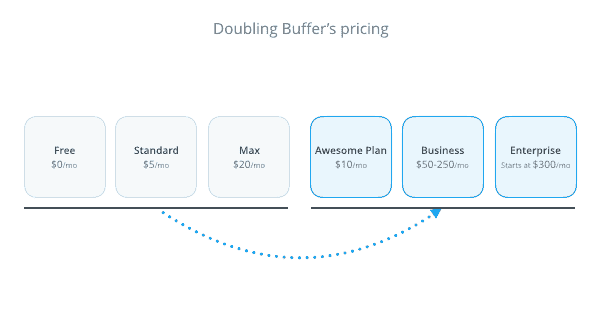
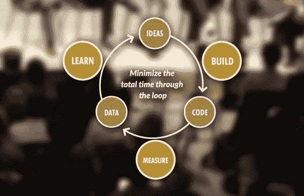
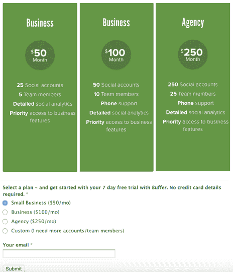
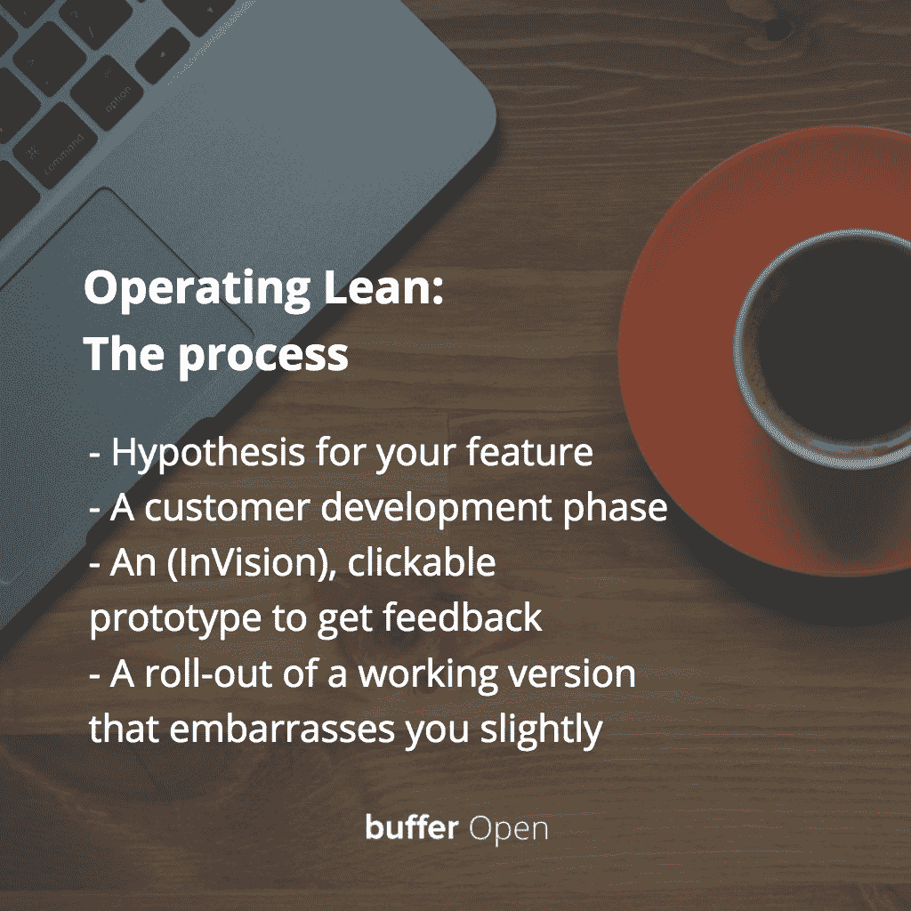
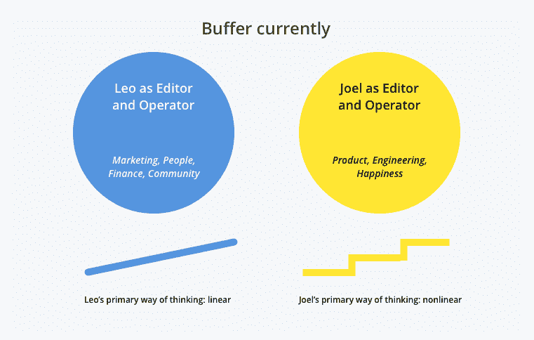
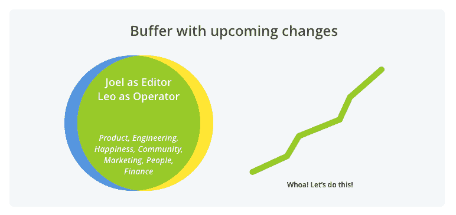

# 这些是 Buffer 从成长到 1000 万美元的 10 大教训

> 原文：<https://open.buffer.com/top-10-learnings-growing-to-10-million-arr/?utm_source=wanqu.co&utm_campaign=Wanqu+Daily&utm_medium=website>

在五年半的缓冲期内(哇！)，我们很幸运地跨越了许多里程碑—300 万注册用户，90 多名团队成员，以及最近 1000 万美元的年度经常性收入(ARR)。

在这段旅程中，我们非常感谢社区的支持，以及在每一步中收集新知识的机会。

这些教训有些是我们轻而易举得到的，有些则是我们历经艰辛才得到的。

我们发现了智囊团、数据和客户研究的价值。我们接受了寻求不同意见的想法。我们依靠自己的力量成长。

当我回顾过去五年半在 Buffer 的工作时，我意识到我们学到了一些帮助我们继续前进的重要事情。我很乐意与你分享这份清单，激励和鼓励你踏上征程！以下是我在通往 1000 万美元的缓冲旅程中最大的 10 个收获。

## 1.和你的合伙人一起尝试每周策划一次

投资于我的联合创始人乔尔和我之间的关系——在我们已经在创业公司做的工作之上——是非常有益和有用的。

当我和其他创始人谈及此事时，他们有时会告诉我，“作为联合创始人，我们已经在一起呆了这么长时间，我们什么都知道！”

我发现这是一个很容易陷入的陷阱，我也曾经这样想过一两次。然而，我坚信我们的每周策划已经帮助我们解决了如此多的问题，否则我们不会有。

以下是我们如何设置每周策划的快速浏览:

*   我们大约花 1-2 个小时，最好是在感觉不太忙的时候。乔尔和我通常在星期五见面。
*   我们每人谈论 10 分钟我们的成就。这些可以是“我发布了这个功能”或“我这周去了 3 次健身房。”作为企业家，我们经常不庆祝我们的成就，这可能会导致倦怠。即使还有很多事情要做，花一点时间想想什么事情进展得很好，这是很有价值的。
*   我们每人花 40 分钟进行挑战。我们试图真正潜入水中，而不是停留在水面上。我发现这里有一个有用的考虑，那就是避免试图解决彼此的问题，而是简单地倾听。
*   最后，我们互相分享反馈。这有助于确保那些可能困扰你的事情不会堆积。

## 2.避免过早被数据分散注意力

我们生活在一个数据无处不在的时代，有很多很好的建议告诉我们如何更好地利用数据。然而，我发现在某些情况下这可能是巨大的时间浪费，尤其是在你创业的早期。

我很喜欢我们的导师 KISSmetrics 的 Hiten Shah 的这句话。他是一个销售分析和数据软件的人，所以如果他主张你不要这样做，我觉得这是双重鼓励。

> ***“大多数早期创业公司不会有足够的客户来依赖量化数据。你需要每月获得数百个(最好是数千个)客户，以获得足够的数据来支持 A/B 测试等。”*T3】**

CrazyEgg、KISSmetrics 和 QuickSprout 的联合创始人希滕·沙阿

将你目前关注的一些定量数据替换为定性数据(例如，与你的客户进行一些面对面的讨论)。

## 3.问这五个问题，以便更好地向顾客学习

> ***“你需要了解客户的行为方式，以及他们需要什么。换句话说，关注他们的问题，而不是他们建议的解决方案。”*T3】**

辛迪·阿尔瓦雷斯

我发现，在实践中，与客户交谈并学会做好这件事是极其困难的。Buffer 花了我们很长时间才制定出一个好的流程。

这里有一个简单的方法，只需五个简单的问题，就能立即从你的客户那里学到很多东西。这些来自辛迪·阿尔瓦雷斯的《精益客户开发》一书，我强烈推荐这本书。

1.  告诉我你今天是如何做 _________ 的…
2.  你是否使用任何[工具/产品/应用/技巧]来帮助你完成 ________？
3.  如果你可以挥动魔杖，做任何你今天不能做的事情，那会是什么？别管有没有可能，随便什么都行。
4.  上次你做 ___________ 时，在开始之前你在做什么？一旦你完成了，之后你做了什么？
5.  关于 _ _ _ _ _ _ _ _ _ _ 还有什么我应该问的吗？

我们每天都会问这 5 个问题，以确保我们从客户那里获得有价值的见解。

这里真正的关键是，你不会看到任何引导性的问题。重要的是不要有“如果……你会喜欢吗？”或者“你会用这个吗……”可能会误导或影响客户回答的问题类型。

魔杖问题是我最喜欢的问题之一。每个人都喜欢成为魔术师。有时问这个问题可能有点不合适，但我发现它可以激发客户的创造力，甚至可能将讨论引向新的方向。

## 4.将您的数据保存在内部，以获得更大的灵活性

在 Buffer，我们在数据方面经历了一次大起大落。

我们从构建内部工具，到使用事件跟踪软件，再到构建内部工具，再到使用第三方分析工具。在所有这些来来回回中，我们学到的一件事是至少要把你的数据存储在家里，即使你把它发送到其他地方。这看起来像是白费力气，但事实并非如此。

我们发现，当我们使用分析软件，并向他们提供我们的数据时，我们经常认为我们自己并不需要它。事实是，不管软件有多好，它永远不会是只为你的产品定制的软件。您仍然会有查看数据的方式，而这些方式是第三方软件无法提供的。在我们的情况下，这可能会阻止你做出一些非常重要的决定。

> **Buffer 的数据之旅**
> 2010-11 年:Joel 构建的内部数据工具
> 2012 年:尝试各种第三方事件跟踪工具(KISSmetrics、Mixpanel)
> 2013-14 年:重新构建所有内部数据工具
> 2015-2016 年:过渡到使用 Looker

对我们 Buffer 来说，明智地使用数据是最困难的事情之一。我们经常更换工具，我们最近向一个叫做 [Looker](https://looker.com/) 的工具的过渡，目前感觉是我们目前拥有的最可持续和长期的策略。

## 5.靶心练习:加倍下注的一个渠道

我们有时会觉得我们想要使用“我们正在做每件事，我们将会看到什么坚持”的策略。作为一个处于成长初期的小公司，这可能是一个巨大的干扰。

在 Buffer，我们在第一年左右采用了单一的营销策略，在我们的案例中是内容营销，这是我们最好的决定之一，目的是不要让我们的业务过于分散。

如果你正在寻找适合你的渠道，我推荐“靶心练习”

由 Gabriel Weinberg 开发，他是 DuckDuckGo 的创始人和 T2 牵引的作者，有三个步骤让你找到一个有效的营销渠道。

首先，写下所有可能的营销渠道。然后，把它缩小到三到四个频道，在那里你可以运行便宜而快速的测试，每次不超过几个星期。然后选择一个你认为有效的策略。

**如何找到有效的 1 个渠道:**

*   **外环:**什么是可能的——集思广益，找出所有 19 个牵引通道
*   **中环:**什么是可能的-推广 3-4 个最有希望的想法并进行测试
*   **内环:**什么在起作用——只关注正在起作用的一个通道

你真正寻找的是早期的可重复性；你希望能够尽可能多地重复一个过程，并从中获得回报。这是尽早快速建立势头的最佳方式。

这就是你如何将一个个小成功层层叠加，最终创造出我们所说的**营销飞轮**。在营销飞轮中，个人努力的总和将大于个人努力的总和。

## 6.在你最重大的决定上，向至少两位导师寻求相互矛盾的建议

这对我自己来说是特别重要的一课，因为我的操作方式与此完全相反。我从某人那里听到一些建议，我被吸引住了。我想马上着手做那件事。

但这可能会适得其反，不利于你找到自己的路，建立一个真正的企业。

有很多重大的决定要做。

*   你现在应该筹集资金吗？需要多少？
*   你应该开发新产品吗？
*   你应该雇用那个人担任那个角色吗？

对于每一个决定，与有相同观点的人交谈，然后立即寻求其他人的意见，如果你知道他或她可能有不同的想法。你可能会对可能形成的不同观点和想法感到惊讶。

## 7.当你增加价值时，经常尝试改变你的价格

我们经常如此专注于我们的日常工作，以至于我们很容易忘记新功能给我们的产品增加了多少价值。价格变化往往始于我们头脑中的巨大障碍。我们预计会有反弹，或者突然之间没人会再付钱给我们。

因此，在定价方面存在心理障碍。然而，根据我们的经验，我们还没有发现这种情况。

这是一些我们在 Buffer 所做的价格变动的真实数据。一个特别的例子是，当我们把最便宜的套餐从每月 5 美元变成 10 美元时，转换率没有变化。我们的收入一天比一天翻了一番。

作为一个警告，我们通常喜欢祖父所有现有的客户，所以在这里记住这一点很重要。

## 8.对你构建的每个特性使用精益启动方法，尤其是发布后

在创业界有一个非常奇怪的现象。我曾经和希滕·沙阿讨论过这个问题。我想他甚至为此取了一个特别的名字。

这是一条定律:“创业公司使用精益创业方法一次，然后就再也不会了。”

我不太确定这是为什么——也许是因为我们认为一旦我们遵循它一次，我们就拥有了在我们头脑中建造什么的所有知识。

在 Buffer，我们艰难地认识到我们并不了解它。在 Joel 成功地使用精益启动方法推出 Buffer 之后，我们继续开发了许多功能，却没有与客户讨论或以任何有意义的方式进行验证。这造成了大量的浪费。

这就是我们如何找回精益创业的魔力。当我们在 Buffer 开发一款面向大型企业的新产品时，我们称之为 Buffer for Business，我们再次对它进行了严格的训练。

回想我们是怎么做到的，还是有点尴尬。这是我们该产品的第一个定价页面——它实际上是一个 Wufoo 页面，人们在这里选择一个计划，给我们他们的电子邮件，然后我们将手动开始试用，并让他们设置。

我们回去采访客户，建立 MVP 等等。Buffer for Business 现在占 Buffer 总收入的 45%多一点。

从那以后，我们在 Buffer 将精益创业方法制度化，我们有四个人全职做客户开发，每周总共约有 30 个电话。

我们为我们正在构建的任何东西创建一个流程，该流程将包括以下内容。

1.  可能无效的功能假设。
2.  构建任何东西之前的客户开发阶段。
3.  一个可点击的原型来获得反馈，即使我们觉得有些东西是有效的。
4.  以及一个让我们有点尴尬的工作版本的推出。

## 9.当你得到出售的机会时，列出你可能错过的个人成长经历

在 Buffer，我们在过去的五年里收到了四份认真的邀请。没有一个是容易解决的。

当你考虑报价时，列出一份清单，如果你出售的话，你可能会把这些经历留在桌子上。

我们经常考虑现在销售能赚多少钱，而不是将来能赚多少钱。但有时，在这两种情况下思考个人成长可能是一个更有力的指标。

如果我们出售，这些是我们可能会错过学习的一些东西:

*   如何服务成千上万的客户
*   如何放下一个人
*   如何聘用关键岗位和培养领导者
*   如何收购另一家公司
*   如何筹集更多资金
*   如何从黑客攻击中恢复

在 Buffer，我们经常谈论想要成为一个有价值的人，在那里我们可以为他人提供建议并发挥作用。这通常只有在你有很多这样的经历时才有可能。

> “不要想着赚一百万美元，开始想想为一百万人服务吧。”

–HubSpot 创始人兼首席技术官 Dharmesh Shah

## 10.开始更好地发挥你的优势，停止研究你的弱点

在最近一次针对缓冲管理者(我们称我们的管理团队为“管理者”)的面对面静修中，我们得出了一个结论:作为一个领导团队，我们花了很多时间来提出我们的弱点，而不是充分利用我们的优势。

我们回顾了过去的一年，虽然我们实现了许多令人难以置信的目标和成就，但道路上也有一些坎坷，事情并不完全是我们希望的那样。这导致了一些坦诚的对话和我们目标的重新调整，以及对优势的关注，这导致了团队大部分人员的重组。

例如，我擅长执行项目并取得成果，而乔尔的强项是深入思考和解决问题。**这导致了我们的编辑/操作员模型:**

拥抱你的优势会给你更多前进的动力，让你在团队中更加有力地前进。

为了进一步说明，我的联合创始人乔尔最近也做了一个很棒的推特风暴:

## 期待更多的成长和学习

当我回顾和展望我们尚未发现或完成的所有课程时，我对所有的起起落落充满感激。迈向 1000 万美元的旅程的确是独一无二的，我希望这些经验能在你的公司成长过程中帮助你。

<iframe src="https://www.youtube.com/embed/PokypSiakr8" frameborder="0" allowfullscreen="allowfullscreen">VIDEO</iframe>

([感谢 SaaStr 的视频！](https://www.saastr.com/buffer-coo-leo-widrich-top-10-learnings-going-to-10-million-video-transcript/))

我有幸在 2016 年 SaaStr 年会上就这个话题做了一次演讲。我演讲的完整视频嵌在底部。你可以继续阅读完整的回顾或[跳到视频](#talkvideo)。

## 轮到你了

这些有没有让你惊讶或突出的？你在工作、职业或公司中学到的最大的教训是什么？

*图片来源: [Unsplash](http://www.unsplash.com) ，[扎皮尔](https://zapier.com/blog/acquire-customers/)，[精益创业](http://theleanstartup.com/)*

