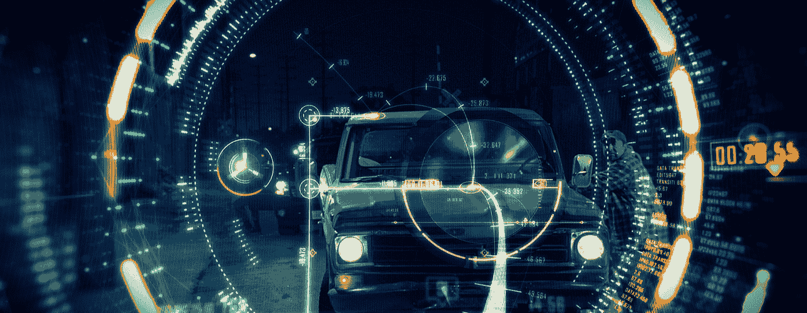

# 关于梦幻用户界面+Subtraction.com 的对话

> 原文：<https://www.subtraction.com/2016/06/02/a-conversation-about-fantasy-user-interfaces/?utm_source=wanqu.co&utm_campaign=Wanqu+Daily&utm_medium=website>

作为谷歌的用户界面工程师，Kirill Grouchnikov 将真实世界的用户界面带入生活，但他将相当一部分空闲时间用于探索*幻想*用户界面的世界——这是一种视觉设计工作，在流行的电影和电视节目中驱动屏幕、投影、全息图(以及更多奇异和幻想的技术)。在他的网站[推动像素](http://www.pushing-pixels.org/fui/)上，Grouchnikov 记录了大量对设计师的采访，这些设计师为《饥饿游戏》、《火星救援》、《复仇者联盟:奥创时代》、《金刚:特工》等创造了虚拟界面。每一次对话都是对支持幻想叙事的设计的独特挑战的深入审视。作为一个忠实的电影爱好者和一个工作设计师，我发现这些对话既迷人又有启发性；它们揭示了与传统界面设计者并无不同，但也完全不同的工作过程。我最近在 Grouchnikov 上扭转了局面，询问他从调查这么多幻想 UI 设计从业者中学到了什么，以及他对这项工作对设计职业和整个世界的影响有什么想法。

### 你是如何开始对这种用户界面设计感兴趣的？它是在你对“真正的”用户界面设计产生兴趣之前还是之后？

基里尔·格鲁奇尼科夫:这是从 2011 年的某个时候开始的，那时我爱上了《创:遗产》。除了发生在现实世界中的第一个介绍部分，我对电影中的一切都很着迷。我想知道更多关于它是如何制作的，所以我给布拉德利“格蒙克”蒙克维茨发了电子邮件，他为它做了一些视觉效果，这导致了[这篇文章](http://www.pushing-pixels.org/2011/06/01/visual-effects-of-tron-legacy-and-beyond-conversation-with-gmunk.html)。这不是一个关于屏幕图形本身的采访，因为在那部电影中没有太多的屏幕图形。

但在我的脑海中，我一次又一次地回到它，我开始寻找致力于屏幕图形和幻想 UI 的网站——[假 UI](http://fakeui.tumblr.com/) 、 [HUDS+GUIS](http://www.hudsandguis.com/) 、[界面爱情](https://ilikeinterfaces.com/)、[科幻界面](https://scifiinterfaces.wordpress.com/)、 [Kit FUI](https://www.noteloop.com/kit/fui/) 以及最近 Reddit 上的 [r/fui 社区](https://www.reddit.com/r/fui)。我想更深入地挖掘制作这些界面的过程:屏幕上显示什么，放弃什么，决策背后的探索，商业公司和研究实验室的现实世界中人机交互的进步如何进入电影故事的世界，以及幻想用户界面如何反过来进入现实世界的探索。

最后一部分和我的工作很接近——在工程和实现方面做用户界面。我喜欢幻想的用户界面和交互可以播下“如果”的种子如果我们能像《少数派报告》里那样挥挥手会怎么样？什么可行，什么不可行？如果我们能够超越平面屏幕，对复杂数据的全息表示进行操作，会怎么样？如果我们可以抛弃几十年来鼠标和键盘“告诉”机器做什么的方式，并找到一种不那么抽象的方式，会怎么样？这就是我喜欢《她》、《前玛奇纳》或《钢铁侠》等电影的原因他们不必准确预测未来，但他们可以暗示这些互动可能会走向何方，并在新一代设计师和工程师中播下这些种子。

Cantina Creative 的视觉 f/x 卷轴，他们为许多受欢迎的电影创作了幻想用户界面。

### 我想谈一谈幻想融入现实的那个方面，但首先，你对这些电影设计的方式有什么了解？设计师在构思它们时有没有共同的过程？

当我与从事这些作品的人交谈时，有些主题似乎在一次又一次地重复。

设计梦幻界面的整个过程与我们在现实生活屏幕上设计界面的过程有一定的相似之处。幻想设计是为了支持故事，就像真实设计是为了支持产品一样。你有定义电影整体视觉语言的人——导演和制作设计师，也许还有电影摄影师。然后，它经历迭代，从探索和想法开始，然后逐渐接近每个人都满意的外观——给定整个项目的时间框架和预算。

几乎每一次采访中出现的最重要的事情是屏幕图形在那里支持故事。你只有这么多时间(大约几秒钟)来简洁地说出具体的点，然后继续下一个镜头。你很少有机会在 UI 上花费大量的时间。毕竟，你在片场有高薪演员，所以你的屏幕时间最好花在他们身上。顺便提一下，这是半透明监视器和全息图发挥良好的地方——允许导演在同一个画面中同时拥有图形和人脸。但是我跑题了。

因此，像一个巨大的红色横幅闪烁着“拒绝进入”是必要的。你必须快速传达观点，而不是要求观众在巨大的电影屏幕上找到小通知。

最后，人们渴望在屏幕上出现一些新鲜的东西。这是电影业创造性的一部分；不要重复已经做过的事情，即使你正在做一个已经建立的系列的下一部分。在这里，设计师可能会去寻找实验室正在探索的新东西，或者可以被尘封的旧东西，或者从自然界借来的东西，比如《普罗米修斯》或《木星:上升》中的弯曲元素。

### 在“拒绝访问”的例子中，你从这些设计师如何平衡讲述故事的合理性和逼真性中学到了什么？当然，讲故事是有层次的，我认为很多 UI 设计师看电影时，经常会看到一些明显不切实际的东西，这让我们失去了体验。

我认为这是三个相互交织的东西之间的平衡。我个人不认为任何特定的故事太“离谱”只要它建立了一个一致的宇宙，并且没有打破它为自己设定的规则，我就愿意相信那些规则。只有当剧本出现完全没有根据的转折或跳跃时——再一次，在剧本本身建立的规则框架内——它才把我带出来，我开始用更批判的眼光看待事物。

第二件事是，我们在屏幕上看到的一切都需要支持故事，首先也是最重要的。我不希望一个角色在与他们的设备交互时被卡在一堆加载屏幕上。对于我们今天拥有的技术来说，这可能不太合理，但故事需要继续发展，而不是停留在任何“应该”阻碍它的不完美上。再说一次，我很乐意跳过这些不完美，只要它们在特定故事中设定的宇宙范围内是微不足道的。

这让我想到了最后一点:让科技与故事发生的时间相匹配。因此，如果像《普罗米修斯》、《湮没》或《无垠》这样的电影在未来足够长的时间里发生，我认为我们作为观众需要做好准备，接受比我们今天先进几个数量级的技术。打个尴尬的比方，想象一下向艾伦·图灵展示一部关于当今设备的纪录片。老实说，我不知道他会发现我们今天认为理所当然的东西有多可信。另一方面，漫威宇宙或《碟中谍》和詹姆斯·邦德系列的界面不能有太大的飞跃。这些电影中的动作发生在今天，唯一的区别是预算和人物的才能。在这样的电影中，设计师不能真正超越我们今天所拥有的边缘，我认为这是设计和屏幕背后的决策过程中的因素之一，也是技术本身的写照。

### 推进这个故事还有另一个方面，这是我在过去二十年里经常看到的；通常，电脑界面是情节的支柱。当紧张的时刻依赖于进度条到达 100%或什么的时候，我总是犹豫不决；这真的感觉编剧没有真正做好他或她的工作，为主角创造一个合理的引人注目的戏剧挑战。随着这些用户界面变得越来越精致，视觉效果越来越惊艳，你对剧本越来越依赖它们来讲述故事有什么看法，否则这些故事将依赖于传统的剧情发展。

我得说，糟糕的写作一直存在，远在计算机界面出现之前。依赖于在最后一秒传输一些数据的紧张时刻过去是依赖于英雄在炸弹爆炸前的最后一秒切断正确的电线的紧张时刻，或者依赖于英雄在被保安看到前一秒躲进某个随机的门的紧张时刻，当我们的英雄处于爆炸半径的边缘时，一场爆炸摧毁了整个星球，以及无数其他类似的时刻。

我们正在见证一场前所未有的爆炸——至少在我看来是这样——世界各地的人们都可以使用的消费技术。很难想象故事片或电视节目中讲述的发生在现代的故事没有一两个屏幕。这些故事必然反映了我们生活的世界，我认为一个没有科技的故事需要以某种方式来证明这个决定。

好的作品很难创造出紧凑的情节，没有空白或未经证实的“信仰跳跃”,而且一直都很难。总的来说，技术，尤其是设备及其屏幕，确实更多地被用来掩盖这些差距。当然，对我们来说，当有人谈论使用 Visual Basic 创建 GUI 界面来跟踪 IP 地址时是很可笑的。但我认为，40 年前，想出这句台词的作家也会想出类似的手法来推进故事，依靠加油站店员的一些随机提示或被滥用的比喻“杀手总是在葬礼上出现，所以我们会在这里抓住他们。”

对我来说，最糟糕的是《独立日》中的高潮场景，一个人造的计算机病毒能够摧毁所有的外星飞船。编写和制作这部电影的同一个人正在制作即将到来的续集，但我希望这次我们能看到一些不那么无能的东西。

### 这是一个公平的观点，总是有糟糕的写作。我想不同之处在于，在模拟时代，很少有人真的需要拆除炸弹。然而今天，每个人每天都在使用手机、笔记本电脑，谁知道是哪种屏幕。因此，屏幕作为一种情节设计更为人们所熟悉，但似乎许多电影克服这种日常性的方式是试图让它们看起来更荒诞，而不是试图让它们看起来更可信。在某种程度上，我觉得每个人都从“少数派报告”中学到了错误的东西，这份报告做出了真正一致的努力来打造看似合理的界面。其他电影制作者只是在没有研究或理论基础的情况下制作了一些夸张的 ui。我是不是想多了？

你见过多少次有人——好人或坏人，视情况而定——拍摄桌面显示器甚至笔记本电脑屏幕，暗示这是销毁硬盘上所有信息的方式，而硬盘却完全没有受到这些子弹的伤害？或者更糟的是，在我们这个一切都在云端的时代，一开始就没有必要损害这些屏幕。

我想说的是，屏幕本身只是我们周围信息的表面表现。正如你所说，它们可能看起来很花哨，有点夸张，但这是像素级的修饰，使它们看起来更适合制作的整体视觉效果。我认为，这些屏幕或情节线设备试图做的大部分事情是暗示操作这些屏幕的人或组织可以获得的技术能力。这就是我之前所说的:许多领域令人难以置信的技术进步，以及这些进步对大众消费市场的可用性。

如果你看一部 1998 年的电影，比如《国家的敌人》,以及它向我们展示的卫星追踪能力，那在当时是相当令人印象深刻的。当时，GPS 在军用设备(PPS)和民用设备(SPS)的精度上有很大差异；公开可用的信号在 100 米的范围内有故意的误差。这个限制在电影上映两年后被取消了(也就是相关性与因果性)，现在几乎没有人会对能够在不费力地使用折叠地图的情况下导航感到印象深刻。当然，现在手机销量以亿计，每个人都可以通过手机信号塔的三角定位信号来追踪。这不再令人印象深刻，所以这是一个从剧本作者那里拿走拐杖的例子。

我不认为这里的问题是屏幕有多可信，而是这些屏幕所体现的技术有多可信。所以你会谈论《钢铁侠》中 J.A.R.V.I.S .的人工智能引擎，或者《她》中萨曼莎的人工智能引擎，或者在任何数量的动作电影中通过建筑物的 3D 旋转线框的热扫描来跟踪坏人，甚至是电视上低预算程序犯罪剧中臭名昭著的缩放-旋转-增强序列。接口位只是屏幕背后技术的体现。类似 J.A.R.V.I.S .的软件是否即将被消费者广泛使用？当然有很多公司都在从事这方面的工作。

当我们看着我们周围的设备，看到所有令人讨厌的东西，然后看到那些令人讨厌的东西在故事片中不存在，我认为这是相当可信的。因此，像不需要每天晚上给手机充电，或者在无人驾驶的道路上行驶时手机信号很强这样的事情就可以被忽略了。当我们看着我们周围的设备，看到那些功能比我们现在所看到的仅仅向前推进了几步，这也是相当可信的。特别是随着最近国家级监控项目的曝光，作为一名观众，我毫不惊讶地看到类似的技术在邦德、伯恩或其他类似的间谍行动惊悚片中向前迈进了几步。

### 好了，让我们来谈谈这些幻想界面是如何融入现实的。你举“国家的敌人”这个例子，有两年的先见之明。《少数派报告》和《她》以及《钢铁侠》电影中的 J.A.R.V.I.S .都经常被认为非常有影响力。这些幻想的 ui 实际上是在推动现实世界的想法，还是只是运气好？设计这些幻想界面的设计师们意识到这种“生活模仿艺术”的循环了吗？

《少数派报告》无疑受益于那些试图预测 2054 年世界及其技术的令人印象深刻的研究。我可以说，这部电影是迄今为止最有影响力的，因为它自上映以来引发了多少现实世界的研究。

“她”和“钢铁侠”中的人工智能引擎似乎比现在机器学习和信息分析领域正在发生的事情领先几年。你看看领先的技术公司正在开发的语音识别和辅助技术，似乎电影中基于语音的界面的描绘依赖于这些真实的技术进步。至于人工智能能力本身，在 80 年代和 90 年代有很多过度承诺和交付不足。然后你会看到 AlphaGo 在一场短短几个月前还被机器视为遥不可及的比赛中击败了世界上最好的人类棋手之一。当然，这仍然不是可以可靠地充当你的伴侣或顾问的通用人工智能，并且目前仍然在科幻小说的领域中。

当一部电影正确地描述了几年前的技术发展时，你可以称之为先见之明或运气。但是对于每一部这样的电影，你都有一些像《剪草人》一样的东西，它们是在围绕虚拟现实的炒作浪潮中制作的。这个行业花了几十年的时间才达到我们可以真正开始大规模讨论增强、虚拟或混合现实的状态。即使是现在，从硬件和软件的角度来看，也不清楚什么是“正确的”交互模型。

正如我之前提到的，我喜欢电影如何在我们的头脑中播下思想的种子。为电影和电视节目设计的人从现实世界中获取想法的种子，并从这些种子中构建他们的界面。然后流向相反的方向。那些种子已经通过突变和结合的过程发展成我们没有的东西，现在在人们的头脑中种下自己的种子，他们问自己“如果会怎样？”如果我可以在屏幕上安装一个摄像头来跟踪我的手指、眼睛或我的整体手势，会怎么样？这能实现什么？在未来的五年、十年甚至二十年里，这将如何发展？

自称未来主义者的人对我们 50 年后的处境做了很多宏伟的预测。它们听起来很吸引人，但在我们到达之前也完全无法证实。回到 1973 年，摩托罗拉制造了 DynaTAC，并向我展示了一个有记录的、正确的预测，即我们现在处于移动设备的完全统治地位和令人难以置信的多功能性。在一些电影中，艺术模仿生活，或者至少将生活向前推进了几步。一些电影可能是如此有影响力，以至于激发人们将他们的艺术带入生活的兴趣。

1973 年在摩托罗拉开发出第一部手机的马丁·库珀说，他的灵感来自《星际迷航》中的通信设备然后，现实世界的技术进步了几十年，才发展到现在一切都只是一块玻璃的阶段，这让人想起了《星际迷航》中的另一种设备——平板电脑。如果你看看同一个电视节目中的通用翻译器，技术几乎已经存在，结合了语音识别，机器翻译和语音合成。当(而不是如果)整个堆栈完美运行时，它将只是从我们现有的移动设备发展而来的某种通用设备的一小部分。所以从某种意义上来说，生活不是模仿艺术，而是被艺术所启发，并把它带到我们以前连做梦都没有想到的地方。

### 那么“生活模仿艺术”是评判奇幻 ui 的最佳方式吗？正如你所说，这项工作的首要任务是支持叙事，但随着时间的推移，更可信的是那些似乎保持其体面的人——或者换句话说，最不可信的人只是开始看起来荒谬甚至可笑。我们应该如何评价这项工作？

“评估”有点过了。我不知道你是否真的想把虚拟用户界面简化成一个单一的数字，比如汽车的 MPG 或者信用风险的 FICO 评分。它有太多的方面了。我认为最重要的是它需要支持叙事。在电影和电视节目中讲故事的其他方面也是如此。如果有任何东西，我是说任何东西，让你脱离了故事，那就是糟糕的工艺。所有的东西都需要融合在一起，这也是在做得好的电影和电视剧中让我如此惊讶的地方:看到几十个甚至几百个人聚在一起做这件事。

然后，就像你说的，有些事情会一直伴随着你。特别引人注目的东西，无论是原版《星球大战》三部曲中的《帝国进军》，还是《公民凯恩》的电影摄影，或是《少数派报告》中的奇幻 ui。你也可以说很多时候这些东西是永恒的，至少在几十年的时间范围内。考虑到技术世界发展的速度，这确实是一件罕见的事情。他们不必准确预测我们周围的技术，而是像你说的那样，呈现一些不仅在他们出生的特定电影世界中可信，而且在我们周围的世界中可信的东西。我当然不介意在我的生活中有一个 J.A.R.V.I.S。或者至少体验一下拥有这样一个智能实体会是什么样子，能够自己判断它的用处。

### 展望未来，很多人预测虚拟现实将成为一种可行的电影叙事形式。如果一个人买了它，它将如何影响制作幻想用户界面的工作？当可以从任何角度甚至在任何距离体验时，制作可信但仍然是假的东西似乎更加困难。

你好像在读我的心思，因为我最近一直在想这个问题。显然，在过去几年中，人们对增强现实、虚拟现实和混合现实产生了浓厚的兴趣。目前，它的大部分精力似乎都集中在探索游戏行业的世界上。我对这个特别的房间不太感兴趣，因为当我的孩子出生后，我就搬走了。一天中没有足够的空闲时间在游戏和电影之间分配，所以我选择了电影！

我一直在思考早期制作电影和用这种媒介讲述故事的经历，思考人们最初是如何把他们从舞台戏剧中所了解的东西运用到电影中的。你有长时间不间断的拍摄，相机不会移动，不会平移，不会变焦。这就像一个坐着不动的观众在看一场戏剧表演。可以说，电影制作人花了几十年和几代人“出生”在电影媒体中，找到了一套全新的工具来讲述电影故事。有些东西对观众不起作用，有些东西可能需要一点实验和时间来完善，以便观众可以理解某些捷径和某些方法来传达特定的意图。

老实说，我不知道虚拟现实是否会成为未来“电影式”讲故事的重要组成部分。回顾过去十年，3D 被誉为媒体的未来。但它被滥用得如此之多，以至于我们作为观众非常警惕看到 3D 贴纸几乎是事后才想到的，作为一种在票价上增加几美元而不会增加任何实质性体验的方式。

我希望大工作室能给虚拟现实多一点时间和耐心。这两者都需要大量的词汇来用一种能让你感受到这种经历的方式来讲述故事。你的问题是关于幻想的用户界面和屏幕图形，但这只是讲述一个故事的整个过程中很小的一部分。毫无疑问，将会有很多错误的开始，人们渴望赶上虚拟现实的潮流，他们只会采用现有的讲述故事的方式，并将它们原样应用到这个新的世界。如果有太多的这种东西，在它有机会发展成为一种全新的讲故事的方式之前，这整个东西就会死掉。

但是，如果它以一个较慢的速度发展，也许从较短的作品开始，那么我希望在我的一生中，我将能够体验以一种与我们现在所习惯的完全不同的方式呈现的故事。这并不意味着它必须完全取代我们现在所拥有的——即使经过一个世纪的电影，舞台剧仍然非常活跃。它可能不是类似“虚拟现实电影”的东西；在完全独立的名字下会是完全不同的体验。如果发生这种情况，用户界面的呈现方式也将随之发展。你知道，谁知道在未来几十年里，我们与机器和信息互动的方式会发生什么？也许我们会有屏幕——矩形的、任意形状的、半透明的、透明的。也许它将全部是全息图，也许我们周围的每个表面都是屏幕，也许会有一些突破，没有屏幕。也许一个屏幕只是一个日日夜夜都在计算的不必要的中介。

因此，当我们在电影院获得真正的虚拟现实体验时，幻想用户界面将沿着“她”和*的路线被暗示，在那个时候*将对当前世界完全自然，因为屏幕将很久不见了。老实说，这离未来太遥远了。

+