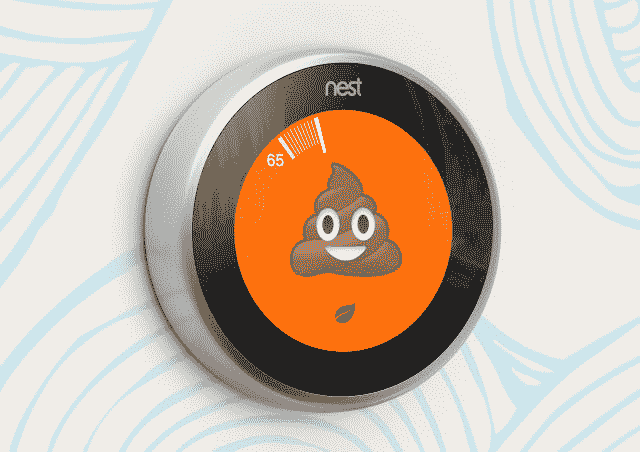
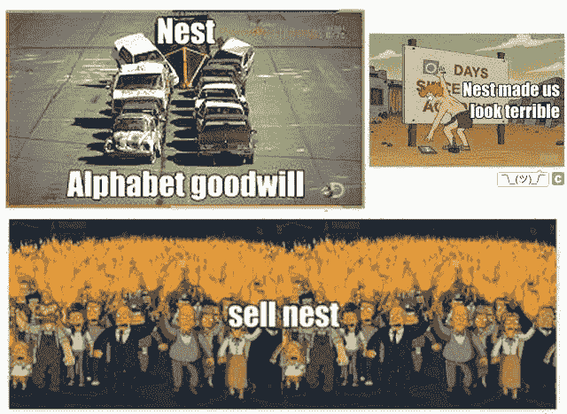

# Nest 在 Alphabet 的时间:没有结果的“几乎无限的预算”

> 原文：<https://arstechnica.com/gadgets/2016/06/nests-time-at-alphabet-a-virtually-unlimited-budget-with-no-results/?utm_source=wanqu.co&utm_campaign=Wanqu+Daily&utm_medium=website>

罗马迪奥/ nest

Nest 首席执行官托尼·法德尔(Tony Fadell)没有被正式“解雇”，但感觉确实如此。Nest 和 Alphabet 宣布法德尔[将“转型”](http://arstechnica.com/business/2016/06/tony-fadell-leaves-nest-marwan-fawaz-to-be-ceo/)成为 Alphabet 的顾问，这让 Nest 和法德尔陷入了负面报道的海洋。就在过去的几个月里，Nest 不得不处理关于“[员工出走](http://arstechnica.com/gadgets/2016/03/report-google-is-building-an-amazon-echo-clone-nest-has-a-security-system/)”的报道，Dropcam 联合创始人、即将离职的 Nest 员工 Greg Duffy 的一系列[公开侮辱](https://medium.com/@gduffy/the-dropcam-team-b9e81f44f259#.3vwi8tfez)，甚至谷歌据称不想与 Nest 合作一个联合项目的消息，以及该公司决定[远程禁用](http://www.businessinsider.com/googles-nest-closing-smart-home-company-revolv-bricking-devices-2016-4?r=UK&IR=T) Nest 已弃用的 Revolv 设备的附带影响。Alphabet 和 Nest 似乎都知道关于法德尔“转型”的公告看起来很糟糕:这个消息是在周五下午发布的，这是公司倾倒他们希望没有人注意到的坏消息的流行时间。

很难对将法德尔从 Nest“转移”出去的决定提出异议。当谷歌在 2014 年 1 月收购 Nest 时，人们的预期是，谷歌资源和资金的大量注入将增强 Nest 的实力。Nest 从谷歌收购时的 280 名员工发展到今天的 1200 名员工。在 Nest 成为“一家谷歌公司”的第一年，它利用谷歌的资源以 5.55 亿美元收购了网络摄像头制造商 Dropcam，并为智能家居中心公司 Revolv 支付了未知金额。达菲表示，在 Alphabet 内部，Nest 获得了“几乎无限的预算”。Nest 最终过渡到了一家字母表公司，就像谷歌一样。

作为所有这些投资的回报，Nest 交付的很少。Nest Learning 恒温器和 Nest Protect 烟雾探测器在谷歌收购之前就已经存在，并且都在谷歌(以及后来的 Alphabet)旗下进行了小规模升级。收购 Dropcam 一年后，Nest 发布了 [the Nest Cam](http://arstechnica.com/gadgets/2015/10/review-nest-cam-watches-over-your-home-so-you-dont-have-to/) ，这基本上是一个更名的 Dropcam。在谷歌/Alphabet 的两年半时间里，员工人数翻了两番，5 亿美元的收购产生了少量的年度更新和更名设备。仅此而已。

## 对谷歌来说太慢了

实际上，将产品推向市场是 Nest 最大的问题。深入研究有关 Nest 的报道，你会发现这 1200 名员工正忙于无数从未面世的产品。

2015 年，Nest 发布了其“

[Nest Audio Team](http://techcrunch.com/2015/03/10/nest-rumored-to-be-moving-into-audio-as-it-expands-further-into-the-home/)

。该团队将负责“为 Nest 产品开发音频路线图”。”行业观察家怀疑音频团队正在制造一款智能蓝牙音箱，但谷歌抢先了一步

[Google Home](http://arstechnica.com/gadgets/2016/05/google-assistant-and-google-home-amazon-echo-but-from-google/)

，亚马逊 Echo 风格的蓝牙音箱和语音助理设备。根据一份来自的报告

[The Information](https://www.theinformation.com/inside-tony-fadells-struggle-to-build-nest?unlock=04a21c&token=B0S3_hNXsYi4djdl6djdVQ)

当 Nest 发现 Google Home 时，它要求与 Google 合作这个项目。Nest 的请求被拒绝了。我们只能猜测原因——也许 Nest 在谷歌内部的声誉与此有关？

**更新:**这件作品上线后，Nest 发言人联系了 Ars。Nest 声称，它没有被谷歌禁止从事 Google Home 项目。该公司表示，Home 将能够控制 Nest 产品，“类似于[其]与亚马逊 Echo 的集成”，但无法向我们提供其他功能或更深层次集成的更多信息。

同一份报告还发现了一个代号为“燧石族”的巢穴安全系统该设备应该使用 Nest 的低功耗“线程”通信标准。它听起来像一个标准的智能家居中枢，将结合其他两个正在开发的 Nest 产品:一个名为“Pinna”的门传感器和一个名为“凯希”的存在传感器《燧石族》在 Nest 开发了三年，报告称它“被删除或修改了很多次，一名前员工开玩笑地称它为‘墓碑’。”该报告引用了因“燧石族”的失败而责怪法德尔的现任和前任员工，称“法德尔先生已经几次改变主意，到底要不要引入一个中心，以及这个中心应该如何设计。"

《摩登原始人》似乎是 Nest 对谷歌来说太慢的又一个例子。信息报告说

[Google's OnHub](http://arstechnica.com/gadgets/2015/08/google-onhub-review-googles-smart-home-trojan-horse-is-a-200-leap-of-faith/)

“路由器”执行了 Nest 的燧石族曾经打算执行的一些功能。谷歌甚至在设备中包含了一个休眠线程收音机。谷歌似乎没有等待 Nest，而是自己走了出来。

然后是 Nest 继承的所有 Dropcam 项目，从未变成任何东西。Dropcam 开发了一款名为“Tabs”的传感器产品，可以通过使用 Dropcam 作为中枢来检测人的移动或门的开关。这款产品已经发布很久了，实际上[宣布](http://mashable.com/2014/05/06/dropcam-people-dropcam-tabs/#882f14JXVkq9)的发布日期是“2014 年夏天”。Nest 取消了标签，转而支持自己的“Pinna”传感器。《信息报》的报道称，Nest 认为“Pinna”比 Dropcam 的努力“更进一步”。那是一年半以前的事了，Nest 的解决方案仍然没有出来。Dropcam 也曾计划打造其广受欢迎的相机的户外版，报道称 Nest 也取消了这一计划。

即使按照法德尔自己的标准，谷歌的收购似乎也没有给 Nest 带来巨大的胜利。在出售后不久接受彭博采访时，法德尔被问及此举对 Nest 意味着什么。“对我们来说，这是为了更快地走向世界，”法德尔说。“[我们的产品是从]96 个国家进口的，如今我们甚至不在这些国家销售。我们可以看到这些设备正在连接，但我们无法足够快地到达那里。对我们来说，与谷歌合作，我们可以获得资源，使我们能够更快地在世界各地移动这些产品。”在谷歌收购之前，Nest 在三个国家出售。在谷歌和 Alphabet 的两年半时间里，Nest 仅仅扩展到了[四个国家](https://nest.com/support/article/In-which-countries-are-Nest-Products-available)。

现有产品的性能也是一个问题。那份信息报告指出，“2014 年的销售额低于谷歌和 Nest 的预期。”Recode 报告称，Nest [也未能实现其 2015 年销售预算](http://www.recode.net/2016/3/30/11587388/nest-2015-sales-budget)。

**更新:** Nest 声称，自推出以来，其收入每年都以“超过 50%的速度”增长，但 Nest 的发言人既没有证实也没有否认它没有达到内部收入目标。

## 字母表中最丑的字母

<iframe type="text/html" src="https://www.youtube.com/embed/BpsMkLaEiOY?start=0&amp;wmode=transparent" frameborder="0" allowfullscreen="">视频</iframe>

谷歌员工布拉德·菲茨帕特里克(Brad Fitzpatrick)与 50 万 YouTube 观众分享了他的 Nest Protect 体验。

除了在开发新产品上遇到麻烦，Nest 还一直是其母公司不良公关的来源。

2014 年 4 月，在谷歌收购几个月后，Nest [停止了其 Protect 烟雾探测器](https://nest.com/letter-from-the-ceo/)的销售。原来“巢波”功能——一种通过在探测器下挥动你的手来让探测器静音的方法——可能是由火灾引发的。2014 年 5 月，美国消费者产品安全委员会发起了全面的[召回](http://www.cpsc.gov/en/Recalls/2014/Nest-Labs-Recalls-to-Repair-Nest-Protect-Smoke-CO-Alarms/#remedy)。客户可以通过升级禁用 Wave 功能，也可以退还 130 美元的设备。保护烟雾探测器后来被放回市场与波禁用。

很少看到一家公司的员工公开倾销其产品，但在 2015 年 2 月，谷歌员工(也是 LiveJournal 的创始人)[布拉德·菲茨帕特里克](https://plus.google.com/app/basic/stream/z130fpzyfmf1f35ik04cdr5wuxqfyphy0jw)就这么做了。他在 YouTube 上分享了一段他保护巢穴经历的“恐怖视频”。整整五分钟，菲茨帕特里克价值 650 美元的烟雾探测器无缘无故地不停尖叫，无法静音。菲茨帕特里克在社交媒体上警告说:“不要买 T2 鸟巢 T3 烟雾报警器。”。“他们虚惊一场，是[不可收拾的废物](https://twitter.com/bradfitz/status/566072337020112896)。“如果这个视频很烦人，你可以停止播放或者静音，”他说，“但是你不能停止一个真正的巢穴保护。”在这个获得 50 万点击量并被几家新闻媒体转载的视频中，谷歌员工最终将吵闹的烟雾探测器倒入一个隔热的冷却器中以消除噪音。

[The Information 的【2016 年 3 月关于未来 Nest 产品的报告包括 Nest 首席执行官托尼·法德尔和前 Dropcam 首席执行官格雷格·达菲之间的一场丑陋的交锋。据报道，在达菲离开 Nest 之前，他告诉法德尔“我认为你像一个暴君一样管理着这家公司，它阻碍了所有的进步。”在报告中，法德尔公开诋毁 Dropcam 的员工，称他们“没有我们希望的那么好”，并且 Dropcam 是“一个非常小的团队，不幸的是，它不是一个非常有经验的团队。”(声明一下，Dropcam 比 Nest 大一岁。)](https://www.theinformation.com/inside-tony-fadells-struggle-to-build-nest?unlock=04a21c&token=B0S3_hNXsYi4djdl6djdVQ)

据 Recode 报道，谷歌员工将这些图片发布到谷歌内部的留言板上。

2016 年 4 月，Nest 宣布将关闭其在 2014 年收购的智能家居公司 Revolv 的智能家居中心的服务器。Revolv 是 Z-Wave、Wi-Fi 和 Insteon 的枢纽。Nest 从未开发出能触及这种功能的产品。[愤怒的客户](https://arlogilbert.com/the-time-that-tony-fadell-sold-me-a-container-of-hummus-cb0941c762c1#.ewqoqxi6p)被 300 美元的砖块卡住，没有升级的途径。一天后，Nest 回应称，它正在与客户合作，“确定最佳解决方案，包括赔偿。”如今，Nest 的 FAQ 向 Revolv 客户提供“购买 Revolv hub 的退款”

同样是在 4 月，Reddit 上的一篇声称来自 Nest 工程师的([已被删除](https://twitter.com/CaseyNewton/status/717127794858156032))帖子称，该公司处于“死亡观察”状态。工程师描绘了一幅鸟巢内部的凄凉景象。“人们在角落里睡着，在浴室里哭泣，”帖子说。“熟练的工程师可以看出环境是有害的，所以我们用大多数不合格的人才来填补空缺。”不管这个帖子是真是假，它像病毒一样传播开来，引发了对 Nest 的又一轮负面报道。

根据 Recode 的一份报告[，托尼·法德尔在 4 月份的谷歌全体会议上回应了所有的负面新闻。会议似乎进行得并不顺利——据报道，随后谷歌员工在公司内部留言板上对 Nest 表示不满。他们发布消息说“0 天以来，Nest 让我们看起来很糟糕”，有人发布了《辛普森一家》电影中*的火炬和干草叉场景，标题是“卖掉 Nest”*](http://www.recode.net/2016/4/19/11586230/google-memegen-nest)

## 待售:一家被谴责的智能家居公司？

由于对该公司的信心处于历史最低点，谷歌似乎已经放弃了等待 Nest。Alphabet 的主要部门现在正凭借谷歌 OnHub 和谷歌 home 等产品进军智能家居领域。那么，Nest 将何去何从？Alphabet 有没有尝试打捞 Nest？Nest 会被出售吗？

随着法德尔的离去，Nest 的新任首席执行官是马尔万·法瓦兹(Marwan Fawaz)。Fawaz 目前是安全公司 ADT 的技术顾问委员会成员，也许他的工作是让 Nest 的“燧石族”安全产品问世。报道称，Alphabet 一直在向 Nest 施压，要求其在今年发行《摩登原始人》。

此前在谷歌，Fawaz 在 2012 年负责摩托罗拉的“家庭”业务——机顶盒和电缆调制解调器部门。在他的监管下，摩托罗拉的家庭部门以 23.5 亿美元的价格卖给了 Arris。在法瓦兹自己的 [LinkedIn 页面](https://www.linkedin.com/in/marwanfawaz)上，他只描述了自己在摩托罗拉的角色是“管理 T4 的并购交易，以及将业务剥离给 Arris Communications，Inc .。”法瓦兹自己的话，加上谷歌国内部门短短六个月的生命周期，表明出售该部门是他的主要关注点。

Fawaz 正在为 Nest 制定类似的计划吗？他现在是不是在 Nest 智能家居的草坪上敲着“待售”的牌子？法德尔本人表示，Alphabet 正在进入一个“财政纪律时代”，Alphabet 最近似乎正在对其公司进行“大扫除”。据报道，机器人公司 [Boston Dynamics](http://arstechnica.com/gadgets/2016/03/google-reportedly-puts-boston-dynamics-up-for-sale/) 已经准备出售，安迪·鲁宾建立的整个机器人部门[似乎](http://arstechnica.com/gadgets/2013/12/google-robots-former-android-chief-will-lead-google-robotics-division/)[也岌岌可危](http://arstechnica.com/gadgets/2016/01/alphabets-robot-division-gets-retooled-as-part-of-x-research-lab/)。窝在砧板上了吗？

从来没有人说过 Alphabet 的所有赌注都是确定无疑的。Alphabet 是一个充满公司的公司。有时候，公司会失败。