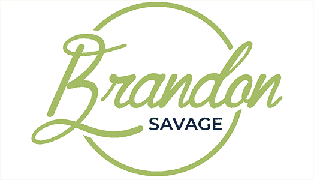

# BrandonSavage.net 为什么我写、维护和使用我自己的框架(你也应该这样)-BrandonSavage.net

> 原文：<http://www.brandonsavage.net/write-maintain-use-framework/?utm_source=wanqu.co&utm_campaign=Wanqu+Daily&utm_medium=website>

# 为什么我要编写、维护和使用我自己的框架(你也应该这样)

***注意:**这篇文章的建议是为非常高级的读者准备的。虽然内容应用广泛，但并不建议每个人都创建和维护自己的框架，除非你确切地知道自己在做什么。*

对于 PHP 社区中的许多人来说，我们的身份和我们使用的框架以及驱动我们产品的语言一样紧密相连。不管是好是坏，我们经常将我们的职业生涯与一个特定的平台联系在一起，我们在这个平台的社区和文化以及它的支持工具上花费了大量的精力。

然而，工具转瞬即逝，比它们下面的语言更是如此。无数的框架在 PHP 中来来去去。无数更多的人将崛起，受欢迎，并逐渐消失。这是事物的本性。

这没问题。因为重要的不是我们使用什么样的框架，而是我们在工作中所遵循的基本原则。

框架代表了一种固执己见的软件开发方式。它们代表了特定维护者对于软件应该如何的范式，而用户(正确使用框架的人)出于义务或协议接受了这一哲学。无论哪种方式，他们都采纳了特定维护者哲学的观点。

因为公认的范例会改变，所以流行的框架也会改变。

在花了几年时间寻找我可以使用的最佳框架之后，我意识到对我来说真正重要的不是“正确的”范例，而是“正确的”实践。就在那时，我意识到我需要开发、维护和使用我自己创建的框架，一个符合我所珍视的原则的框架，而不是我在那个特定时刻发现有用的范式。

说实话，我甚至有点不好意思把我的骨架代码称为“框架”。它没有实现自己的大部分核心功能；事实上，大部分核心行为来自于我从别人那里采纳的包。这些打包的内容包含了我认为有用的最佳实践。我的“框架”是胶水代码，以一种有用的、内聚的方式将这些包绑定在一起。

这就是我们编程的时代的美妙之处。整合不同的包并创造新的东西是很容易的。你不需要采用任何特定框架或包库的整体。相反，你可以从一个地区吸收一点，从另一个地区吸收一点。当我开始从事 PHP 工作时，这是不可想象的。但是现在作曲家使这成为可能。

我专注于接受对我来说重要的原则和实践，而不是单一框架制定者的观点和范例。对我来说，这很有效。

归根结底，最重要的是你的代码是可读的、可维护的和正确的。从长远来看，当今流行的范例并不重要，但可读性、可维护性和正确性永远重要。

现在是我们停止寻找“完美”框架的时候了，而是开始关注最佳实践以及如何利用它们为我们带来优势。

我很自豪能够构建、维护和使用我自己的框架。

Brandon Savage 是《掌握面向对象 PHP T2》和《PHP 实用设计模式 T4 T5》的作者

Posted on 5/25/2016 at 8:00 am
Categories: [PHP](https://www.brandonsavage.net/category/php/)

* * *

> **Patrik** wrote at **5/25/2016 9:44 am**:
> 
> 你试过 nette 框架(nette.org)吗？我觉得有很多好点子可以用，可以单独用它的部分。例如，模板系统 latte 具有 IMHO 最佳上下文感知转义。在阅读了这个 FW 源码和文档后，我理解了一些 OOP 原则，例如依赖注入。

> **[David Négrier](https://github.com/container-interop/service-provider)** wrote at **5/26/2016 3:16 pm**:
> 
> 嗨，布兰登，
> 
> 完全同意，尽管胶水代码写起来肯定很乏味。我正在尽我所能减少粘合代码，尝试定义一个标准来将东西放入容器中(这样，包维护者就从粘合代码的一部分开始负责)。
> 
> 这归结为标准化的服务提供者，我相信这可以减少框架中的代码量。如果你有时间看的话，我很想收集一些反馈:[https://github.com/container-interop/service-provider](https://github.com/container-interop/service-provider)

> **[Caryn](http://mercroot.com/)** wrote at **5/29/2016 11:45 pm**:
> 
> 这更多的是一个概念，而不是仰视他人，使用他们的作品而不是你自己的。例如，如果我说，伙计们，我做了一个类似 laravel 的框架，但是 x 和 y 更简单，十有八九社区的反应会是“不要重新发明轮子，使用现有的东西”

* * *

###### 版权和副本 2022 由布兰登萨维奇。保留所有权利。