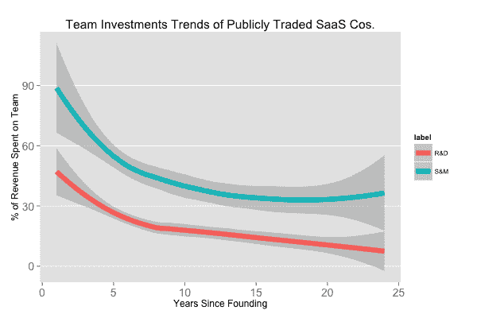
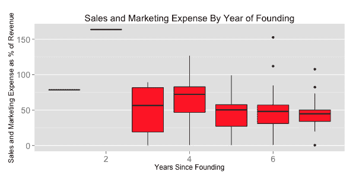
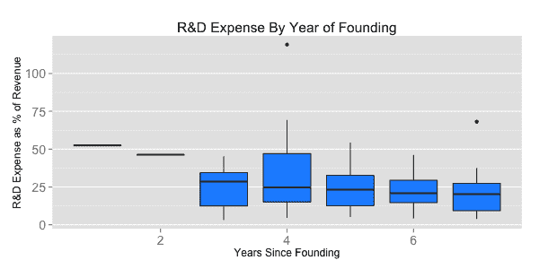

# @ttunguz 的《十亿美元 SaaS 创业公司中工程师与销售人员的比例》

> 原文：<http://tomtunguz.com/saas-spend-allocation-benchmarks/?utm_source=wanqu.co&utm_campaign=Wanqu+Daily&utm_medium=website>

受到有限预算的限制，同时寻求尽可能快的增长，初创公司的创始人必须决定如何平衡增长他们的工程团队与销售和营销团队。为了给这些决策提供信息，我对 36 家 SaaS 上市公司的销售和工程团队从成立到上市的相对规模进行了基准评估，通常是在 7 年后。

上图以蓝绿色显示了平均销售和营销分配，以红色显示了研发投资。在这些创业公司的早期，销售和营销薪酬消耗了大约 90%的收入，慢慢下降到 45%。工程占总收入的 50%，随着收入的增加，这一比例也在下降，更多的收入被作为利润或重新投资到业务的其他地方。

一般的创始团队倾向于 [2 人](http://tomtunguz.com/founders-with-cs/)，其中一人是工程师。当一家公司成立时，销售/营销与工程师的比例是 1:1。第一年后，SaaS 上市公司的这一比例将增加到 2:1 (S & M:R & D)。

| 自成立以来的年份 | one | Two | three | four | five | six | seven |
| 百万美元收入中值 | Two point six | Three point five | Eleven point three | Twenty-five point two | Fifty-five point two | Sixty-nine point six | Ninety-eight point one |
| 销售:工程比率 | One point five | Three point five | Two | One point seven | One point nine | Two point four | Two point one |
| 样本量 | one | one | five | nine | Twelve | Sixteen | Eighteen |

上表显示了更详细的数据，包括每年的样本量。只有 LogMeIn 在他们的 S-1 中提供了关于成立后头两年的数据，所以那里的数据质量是有问题的，但从我的经验来看并不是非常不准确。

对于那些寻求更多细节的人，下面的方框图显示了销售和营销以及研发的分布情况。他们讲述了一个相似的故事，但揭示了不同公司之间的差异。

 

## 关于分析的注释

首先，这些比率不是成功的秘诀，只是为决策提供信息的数据。每个企业都因其服务的行业、走向市场的策略以及客户获取流程的特殊性而有所不同。

其次，这些计算中使用的销售和营销支出是这些公司在其 S-1 和 10k 中提供的，其中包括所有媒体采购、活动预算和其他营销支出。这些初创公司都没有在财务报表中列出营销支出。但通常情况下，总收入的 15%左右花在营销和公关上，我粗略估计媒体支出占总收入的 7%，这将使 S&M/R&D 比率比上面列出的下降约 15%。

第三，这些公司把所有的工程支出都集中在一起，研发也是如此。我假设这些业务的所有 R&D 都是产品开发，即使 SaaS 公司的管理团队决定开发无人机项目或其他与当前业务相关的项目是谨慎的。