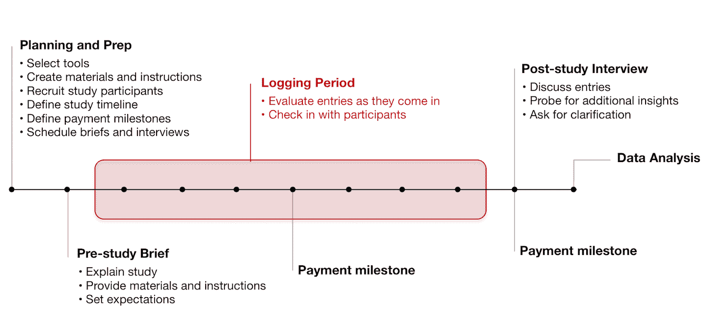
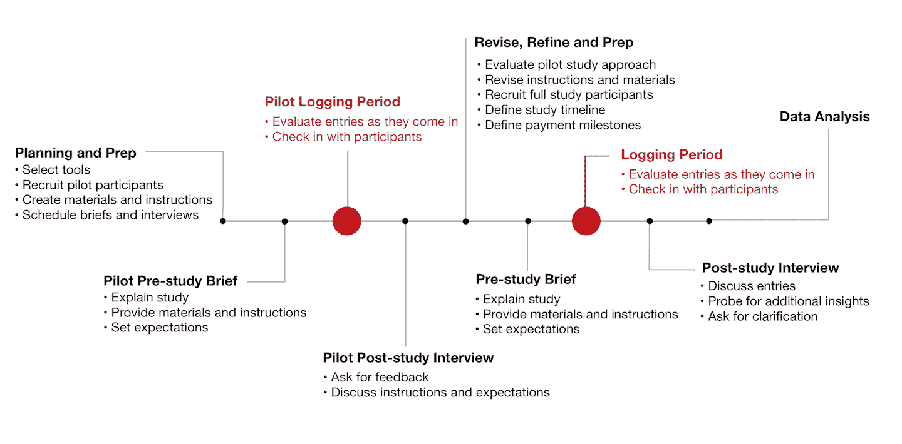

# 日记研究:理解长期用户行为和体验

> 原文：<https://www.nngroup.com/articles/diary-studies/?utm_source=wanqu.co&utm_campaign=Wanqu+Daily&utm_medium=website>

日记研究是一种研究方法，用于收集关于用户行为、活动和经历的定性数据。在日记研究中，数据是由参与者纵向自我报告的，也就是说，在很长一段时间内，从几天到一个月甚至更长。在规定的报告期内，要求研究参与者写日记，记录有关所研究活动的具体信息。为了帮助参与者记住填写他们的日记，有时会定期提示他们(例如，通过每天或在一天中的特定时间接收通知)。

为日记研究收集数据的背景和时间段使它们不同于其他常见的用户研究方法，如调查(旨在收集用户在所研究的场景背景之外的习惯和体验的自我报告信息)，或可用性测试(产生关于特定时刻或实验室环境中计划的一组受限交互的观察信息)。它们是“穷人的实地研究”:它们不太可能提供像真正的实地研究那样丰富或详细的观察结果，但它们可以作为一个体面的近似值。

## 何时进行日记研究

如果您正在寻找对用户行为和体验的上下文理解，那么很难在实验室环境中适当地创建场景来收集这种见解。日记研究有助于理解长期行为，例如:

*   **习惯** —用户在一天中的什么时候使用产品？他们是否以及如何选择与他人分享内容？
*   **使用场景** —用户以什么身份参与产品？他们的主要任务是什么？他们完成长期任务的工作流程是怎样的？(这些[场景可以在流程的后期用于用户测试](https://www.nngroup.com/articles/task-scenarios-usability-testing/)。)

*   **态度和动机** —是什么激励人们去完成特定的任务？用户的感受和想法如何？
*   **行为和认知的变化** —一个系统有多可学？随着时间的推移，客户的忠诚度如何？他们在与相应的组织接触后如何感知一个品牌？

*   **客户之旅** —当客户使用电子邮件、电话、网站、移动应用程序、信息亭、社交媒体和在线聊天等不同设备和渠道与您的组织互动时，典型的[客户之旅和跨渠道用户体验](https://www.nngroup.com/courses/cross-channel-user-experience/)是什么样的？多个服务接触点的累积效应是什么？

日记研究的重点可以从非常广泛到非常有针对性，这取决于所研究的主题。日记研究通常侧重于以下主题范围之一:

*   **产品或网站** —了解一个月内与网站(如内部网)的所有互动。
*   **行为** —收集关于用户行为的一般信息(例如，智能手机使用、大学生网络访问模式)
*   **一般活动** —了解人们如何完成一般活动(例如，通过社交工具分享信息或在线购物)
*   **特定活动** —了解人们如何完成特定活动(例如，购买新车或计划度假)

## 方法学

日记研究通常由五个阶段组成:

1.  **计划与准备**。定义研究的重点和你需要了解的长期行为。定义时间表，为参与者选择工具以报告数据，招募参与者，并准备说明或支持材料。
2.  **预习简介**。提前花时间让参与者准备好登录。为每位参与者安排一次面对面的会议或电话会议，讨论研究的细节。浏览报告期的日程或日历，并讨论期望。讨论他们将使用的工具，并确保每个参与者都熟悉该技术；开始前回答他们可能有的任何问题。
3.  **测井周期**。为了支持有效的活动日志记录，**提供了一个简单的框架。**尽可能具体地说明你需要参与者记录哪些信息，但不要压制你无法计划的自然变化和差异。(发现意外毕竟是做用户研究的主要原因之一。)创建清晰详细的日志说明。向用户提供示例日志条目，以帮助他们理解您需要他们提供的详细程度。(但要确保你不会让参与者偏向你碰巧提供的那些类型的条目。
    研究人员通常采用两种技术来收集参与者的日记数据。
    *   **原位测井** —这种方法是收集数据最直接的方法。要求参与者记录相关活动发生时(或现场)的信息。当参与者参与相关活动时，他们必须立即报告有关该活动的所有重要细节。由于这种方法要求参与者在事件发生时花时间报告这些信息，因此这种方法最适合在您预计不会出现大量日志条目的情况下，或者在现场记录不会对参与者的日常活动产生不利影响的情况下使用。现场记录最好由能够处理结构化长格式文本输入的渠道和设备提供支持，例如电子邮件、网络形式的调查问卷、传统的纸质日记或数字客户洞察工具，如 FocusVision 或 7daysinmylife。音频或视频日记对参与者来说也是很好的工具，但输出可能需要转录以供分析。
    *   **片段技术** —另一种流行的、侵入性较小的日志记录方法是**片段技术。**使用这种技术，参与者只需在活动发生时记录一些简短的信息片段。然后，在每天结束时，或者当参与者有时间时，他们通过提供关于活动的额外细节来阐述每个片段。这种两步技术确保相关信息在被遗忘之前被原位捕获，但不需要参与者在捕获时提供大量细节，这在某些情况下可能是侵入性的和不自然的。研究参与者向研究人员报告片段的常见渠道包括电子邮件、短信、Twitter 或脸书。这些信道对于简短形式的通信来说是广为人知的。鼓励与会者在活动发生时使用手机进行报道，因为这些设备是可以使用的。可以使用上述渠道和工具对报告片段进行扩展，以获得更深入的报告。考虑要求参与者通过填写关于他们每个人的问卷来扩展他们的片段。这将使您能够获得关于每个片段的具体和一致的见解。
4.  **研究后访谈**。研究结束后，评估每位参与者提供的所有信息。计划一次后续采访，详细讨论日志。提出试探性问题，以发现完成故事所需的具体细节，并根据需要进行澄清。请参与者就其参与研究的经历提供反馈，以便您可以在下次调整您的流程。
5.  **数据分析**。因为日记研究是纵向的，它们产生了大量的定性数据。重温你的研究问题，然后深呼吸，挖掘你收集的所有丰富的见解，找到答案。评估您在整个研究中针对的行为。它们是如何随着时间的推移而进化和变化的？是什么影响了这些行为？如果你的研究重点是围绕一个特定的产品或服务关系，看看整个顾客旅程。构建[客户旅程图](https://www.nngroup.com/training/course/1450/journey-mapping/)，从客户的角度帮助你了解端到端的用户体验。

### 激励参与者

在整个研究过程中，需要参与者的参与才能获得所需的见解。计划与参与者联系，或根据需要定期提醒(每天或每隔几天)。对于参与并创造适当片段的参与者，认可他们的努力，并要求他们继续努力。对于参与度较低的参与者，给予鼓励或主动回答他们可能提出的任何问题，让他们步入正轨。让参与者提前知道你将在整个研究过程中与他们联系，并就联系方式达成一致，这样你就可以给予鼓励或要求澄清，而不会过度打扰。

日记研究需要参与者投入时间和精力。为了确保你从参与者那里得到你所需要的参与程度，提供一个能让他们保持参与的激励。这个补偿通常比你为 60 分钟可用性测试提供的要多得多。将激励与研究期间所需的工作量相结合。当参与者达到特定的里程碑(例如，3 天的日志记录)时，考虑拆分总激励并提供较小的分期付款，以在整个研究期间保持他们的积极性。

在最近的一项日记研究中，来自美国不同地区的受过大学教育的参与者，我们付给每个参与者 275 美元。在记录期之前，用户必须完成在几台个人设备上安装软件的预分配任务，记录 2 周的片段，为每个片段填写网络表格问卷，并参加两次电话会议(研究前简报和研究后访谈)。随着用户在整个研究过程中达到特定的里程碑，激励措施被分为 3 个阶段，以保持参与者始终参与其中。这项研究的完成率为 90%。

*Timeline of activities that take place throughout a typical diary study.*

## 日记研究的更多建议

*   **计划适当的报告期。**确保你的研究时间足够长，能够收集到你需要的信息，但是要小心设计一个非常长的研究。如果你的研究太长，随着研究的进展，参与者可能会变得不那么投入，这可能导致数据不太准确。

*   **招募专用用户**。因为日记研究需要更长时间的参与，所以在招聘过程中要格外谨慎。让用户预先知道所涉及的内容和对他们的期望。问一些筛选性的问题，这将有助于你衡量在研究期间你将从他们那里得到的承诺水平，并确保他们在整个研究期间都是可用的。
*   **当数据进入**时，掌握数据。如果你正在以数字方式获取数据，或者数据一进来就马上进行评估。这样，当参与者对活动记忆犹新时，您可以提出后续问题，并根据需要提示更多细节

*   进行试点研究。日记研究可能需要相当多的时间来计划和进行，所以先进行一个简短的[试点研究](https://www.nngroup.com/articles/pilot-testing/)会很有帮助。试点研究不需要和真正的研究一样长，也不是为了收集数据进行分析。它的目的是测试你的研究设计和相关材料。练习向试点参与者做简报和汇报的流程。尝试你的日志材料，以确保它们是可以理解的。调整你的指示和方法，以确保你得到你需要的数据。询问试点参与者对材料和日记学习体验的反馈，并进行相应的调整。

*Rehearse your study and test your materials by adding a short pilot study to your overall timeline.*

## 结论

虽然日记研究可能比其他用户研究方法需要更多的时间和精力，但它们可以产生关于客户实时现实生活行为和体验的宝贵信息。如果你正在寻找有机的行为洞察，并且你不能在实验室中创建一个有效的场景，或者你不能从一个单独的调查中获得你需要的数据，不要将研究强行融入这些方法中。日记研究可以让你了解用户的行为和经历。

