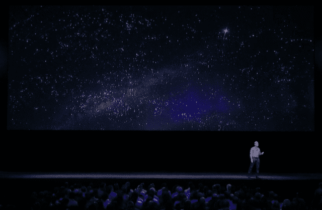

# 微软和苹果加倍下注——本·汤普森的策略

> 原文：<https://stratechery.com/2016/microsoft-and-apple-double-down/?utm_source=wanqu.co&utm_campaign=Wanqu+Daily&utm_medium=website>

多年前，微软抢了苹果 Keynote 的风头(这种事情通常是反方向的)，但这正是昨天发生的事情，前者以 262 亿美元收购 LinkedIn，盖过了苹果在其年度全球开发者大会(WWDC)上令人印象深刻但反复发布的公告。然而，尽管在期望(零对高)和反应(“什么？！?"相对于“有道理”)，这个消息有一定的对称性:双方都在加倍押注自己的策略，谁这样做的风险最大，这是有争议的。

#### 微软收购 LinkedIn

微软收购 LinkedIn 最令人惊讶(在许多方面也令人鼓舞)的一点是，它出人意料:一家以残酷的董事会政治而臭名昭著的公司不仅在无人知晓的情况下完成了其历史上最大的收购，而且实际上对签署意向书的新闻搁置了一个月！诚然，这意味着将信息限制在极少数人手中，但过去两年有大量证据表明，至少在最高管理层，首席执行官塞特亚·纳德拉领导下的微软比前任首席执行官史蒂夫·鲍尔默领导下的任何时候都更加专注和一致。

史蒂夫·鲍尔默领导了微软上一次最大的收购，即 2013 年对诺基亚的收购，这笔交易从第一天[就毫无意义](https://stratechery.com/2013/the-deal-that-makes-no-sense/)(这是纳德拉反对的[)。不过，就理解这一点而言，那笔交易或许是最好的起点。](http://www.bloomberg.com/news/articles/2014-03-05/microsoft-s-nadella-manages-legacy-of-ballmer-board-split)

上个月，我惊讶于纳德拉(T2)如何巧妙地扼杀了 Windows Phone 业务(或者更准确地说，让 Windows 自己发现这个平台从一开始就已经死亡)。然而，这项业务的逐渐结束，以及 Windows 向有效的“维护模式”的持续转变，为微软的研发预算——约占收入的 13%——打开了空间，那么 LinkedIn 为什么不呢？抛开收购价格不谈，当谈到微软对未来的投资时，LinkedIn 正好陷入了 Windows Phone 的空白，这是一项具有实际上升空间的业务。

我确实相信微软极大地放大了优势:例如，如果 LinkedIn 的[销售导航器](https://business.linkedin.com/sales-solutions/sales-navigator)销售给 100%的微软动态 CRM 用户群，这笔交易的很大一部分将被支付；另一方面，在与 Salesforce(传闻中的竞争对手[最有可能的候选人](http://www.bloomberg.com/news/articles/2016-06-13/morgan-stanley-scores-with-microsoft-deal-surpassing-goldman))、甲骨文和 SAP 的持续竞争中，Dynamics 现在成为一个更有吸引力的产品。当然，微软的 Office 产品与 LinkedIn 的整合程度更深，比两家不同的公司更有吸引力(当是同一家公司时，隐私问题更容易解决！).

不过，我认为，有一个更深层次的好处会改变微软生产力业务的发展轨迹。我以前曾经写过微软的企业方法如何被云从根本上颠覆:当兼容性和易于集成不再是 IT 购买者的控制因素时，微软对锁定和足够好的用户体验的关注是不够的，值得称赞的是，它的 Azure 和 Office 365 部门已经拥抱了一个将在所有设备上赢得用户体验的未来，而不仅仅是微软控制的设备。然而，谁将拥有身份的问题——以前是微软企业锁定的关键(由于活动目录)——一直是一个开放的问题。

这笔交易的潜在变革之处在于，未来微软将继续专注于企业，同时将业务重心从公司转移到员工身上。我已经写了[很长时间](https://stratechery.com/2015/aggregation-theory/)关于拥有最终用户的重要性，但是我们最终用户有[多重身份](https://stratechery.com/2013/multitudes-social/)，其中之一是我们的职业生活，这是 LinkedIn 几乎没有受到挑战的图表。换句话说,“it 消费化”——这是鲍尔默青睐的一个口号——它不仅涉及在 IT 产品中创造令人信服的用户体验，还涉及将企业用户视为消费者:通过 LinkedIn，微软可以与其最终用户建立直接关系，这种关系远远超出了首席信息官的范围，并开辟了大量机会，这些机会不仅是以前无法获得的，而且在首席信息官的重要性比以往任何时候都低、员工经常更换工作的世界中也是至关重要的。微软的定位不是让每一个新员工都从零开始，而是提供一种粘合剂，让企业员工无论身在何处都能保持联系。

而且，不管怎样，微软得到了一笔交易:我认为 LinkedIn 2 月份的股票下跌是合理的，但事实仍然是，微软正在以 6 个月前不可想象的价格收购这家社交网络，并且证明之前股价合理的优势仍然存在:LinkedIn 比脸书以外的任何人都更了解其用户——当涉及到我们的职业生活时，他们知道得更多。这是世界上最有价值的数据。

对这笔交易最明显的批评是机会成本:否则这 260 亿美元会花在什么地方？即使有了这笔交易，微软的生存威胁依然存在:为什么一家新公司会购买他们的任何产品？这次收购并没有以某种方式解决这个问题，比如说，Dropbox 和 Slack 的结合会(两种口味在一起会更好，而且谁也[不卖](https://stratechery.com/2016/amazon-echo-expand-the-nest-failure-microsoft-and-slack/))，但话说回来，微软[的钱比他们多得多](https://stratechery.com/2014/daily-update-violate-privacy-like-professional-microsoft-acquires-acompli-amazons-kiva-cleverness/) : LinkedIn 为他们的生产力业务搭建了一座桥梁，通往一个以最终用户而不是公司为中心的新世界，它甚至可能让微软不可避免的竞争产品领先一步。想象一下:微软可能会让 LinkedIn 成为所有基于业务的交互(聊天、电子邮件等)的中央身份存储库，而不是简单地将 Active Directory 迁移到云中，并且这是一个在最终用户的职业生涯中持续存在的身份，因为它是由用户管理的，而不是由他们的临时雇主管理的。这确实令人兴奋，尽管可能令人震惊，但我认为这值 260 亿美元。

更广泛地说，这必须被视为对 Windows 是微软的焦点这一观念的最后一击；直到 2014 年,我还主张公司应该分拆，原因很简单，因为“Windows 优先”的文化根深蒂固，但纳德拉在重组和重新定位公司方面做得非常出色，未来 Windows 是微软服务产品的众多客户之一，如果普通员工还不清楚，现在肯定是了。微软在云计算和生产力上下了双倍的赌注，现在有 260 亿个理由相信他们。

#### 苹果在 WWDC

与此同时，苹果在 WWDC 的声明可能最引人注目的是它们*没有*包括的内容，包括没有提到安卓上的 [iMessage，除了传闻中和急需的增量改进之外，没有关于 Siri 的重要讨论(即使在那里，也有些有限:Siri 的 API 只对应用程序的子集开放)。](https://stratechery.com/2016/wwdc-preview-line-files-for-ipo-yahoo-twitter-snapchat-and-messaging/)

相反，主题是关于增强和深化完整的苹果生活方式带来的价值:现在你的手表可以解锁你的 Mac，你的桌面可以在你的 iPhone 上使用。你可以用 iPhone 在 Mac 的浏览器中付款，还可以通过苹果电视从锁屏上控制你的房子。是的，Messages 得到了一个巨大的更新，我对此非常兴奋(明天我会深入回顾 keynote)，但它的功能只有在你给其他 iPhone 用户发消息时才可用:付钱或被排除在外。

同样值得注意的是*没有*宣布的新东西:苹果[允许用户删除预装应用](https://support.apple.com/en-gb/HT204221)，虽然没有关于定义新的默认应用的消息，但如果苹果这样做，该公司将通过让谷歌和微软等服务公司增强 iPhone 的使用体验，使其硬件优势更加引人注目。

当然，从理论上来说，这种增强从长远来看会削弱苹果，因为它浪费了公司利用其硬件优势锁定服务的能力，但鉴于 T2 对文化力量的信念，我不确定这是一件坏事；史蒂夫·乔布斯的[建议](http://www.nbcnews.com/id/12974884/)听起来很真实:

> 我认为如果你做了某件事，结果很好，那么你应该去做其他更好的事情，而不是在这件事上纠结太久。想想接下来会发生什么。

对于苹果来说，下一步几乎肯定应该由该公司最擅长的事情来指导:整合硬件和软件，提供如此引人注目的用户体验，以至于消费者继续自我选择进入公司自己的轨道，而不是在它无法控制的平台上建立基础设施。

不过，这也是让我对该公司的声明感到紧张的原因。首席执行官蒂姆·库克(Tim Cook)在主题演讲的开头强调，“为什么我们要做我们在苹果做的事情。”

> [T2】](https://i0.wp.com/stratechery.com/wp-content/uploads/2016/06/Screen-Shot-2016-06-14-at-6.04.37-AM.png?ssl=1)
> 
> 我们的北极星一直致力于通过创造改变世界的伟大产品来改善人们的生活。

不过，一些产品公告，如照片和 Siri 的增强，似乎更关心隐私的绝对观点，而不是最佳的最终用户体验；毫无疑问，我重视隐私，但一切都是有得有失。在什么情况下，苹果对隐私的激烈辩护会从原则立场转变为不与谷歌照片或 Alexa 竞争的便利理由？或者，换句话说，原则什么时候变成了在用户体验上没有竞争力的借口，而用户体验一直是苹果存在的最大差异？

#### 苹果对微软

苹果的主题演讲值得注意的是，它在公司擅长的方面下了双倍的赌注:提供更好的体验，前提是你支付苹果的硬件利润。在这方面，他们的声明呼应了微软的决定，加倍拥有专业的生产力和服务。然而，不同之处在于时机:微软(终于)转向了他们本应在十年前采用的方法，尽管这耗费了公司大量时间并增加了他们的风险，但令人兴奋的是看到他们更接近战略的开始而不是结束。对苹果来说，问题是他们在这个光谱上处于什么位置:以硬件为中心的战略能推动增长多长时间，苹果愿意在多大程度上改变其文化，以确保利用新的机会，而不仅仅是保持现有的东西？

或者这并不重要:周一最大的新闻可能是 Snapchat 发布广告 API。世界在继续，价值在上升，对“每日故事”的关注往往是一个跟踪指标。

### *相关*