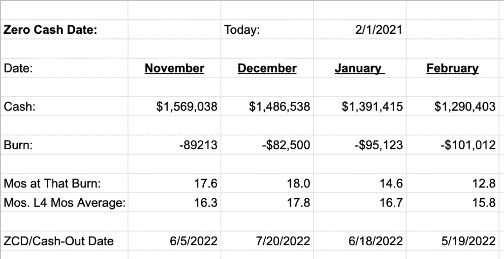

# 了解并分享你的零现金约会

> 原文：<https://www.saastr.com/knowing-and-sharing-your-zero-cash-date/?utm_source=wanqu.co&utm_campaign=Wanqu+Daily&utm_medium=website>

如果你没有可预见的正现金流，那么你在 SaaS 的初创企业最重要的运营指标之一就是你的**零现金日(“ZCD”)**。

你会听到很多关于 SaaS 指标的说法，但这个并不经常出现。它应该，而且应该非常接近核心指标列表的顶部。

[

<noscript></noscript>](https://saastr.wordpress.com/2012/11/09/knowing-and-sharing-your-zero-cash-date/last-dollar-road1/) 

以你目前的消费水平，你的零现金日期是最有可能耗尽现金的日期。

许多初创企业并不虔诚地跟踪这一点，或者没有 100%的把握，同样重要的是，不要总是与你的每一位投资者——以及你的员工——分享这一点。

在我的第一次创业中，我没有仔细跟踪它，但它是我在 Adobe Sign/echosing 的第一个投资者的第一个指标。有充分的理由。一旦我非常仔细地跟踪它，我发现它非常有用。它让公司的每个人和所有投资者(包括 F&F)都明确了我们的跑道是什么，以及我们必须展示客观成功的时间。

**你的 ZCD 没有什么好隐瞒的，**它应该每 30-60 天左右改变一次，这取决于收入的来源和支出的流向。我认为有一个主要的 ZCD 也是可以的，你可以用它作为公司的核心指标，也可以用一个更保守的指标来做你自己的规划。

至少，让*每个人*都了解 ZCD 是什么，让我减轻了很多压力。这样，我们都可以直观地了解我们正在建设什么，支出的大致限制是什么，以及它们为什么存在。直到我们的现金流为正数。团队明白你目前的现金可能无法持续到永远。没关系。他们是刚起步的人。让他们知道。

[

<noscript></noscript>](https://docs.google.com/spreadsheets/d/1Qweu3O5Fh6n7HBSYk0eOzJtPd3l9l453zcE8L0SZO9E/edit?usp=sharing) 

**如果你*有任何*计算上的困难，只需取你过去 3-4 个月的平均实际现金消耗率——你银行对账单上的现金支出额——然后除以银行里剩余的现金量** 。这通常就足够了，只需要几分钟。你不需要一个首席财务官，或一个控制器，或任何人来做这件事。

关于这种快速简单方法的更多信息，请点击此处:

(注:更新的 SaaSr 经典帖子)

2021 年 1 月 19 日发布