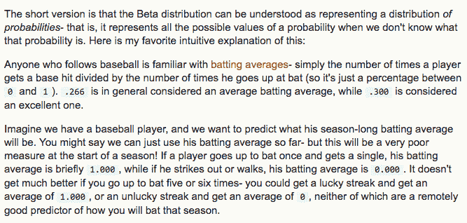
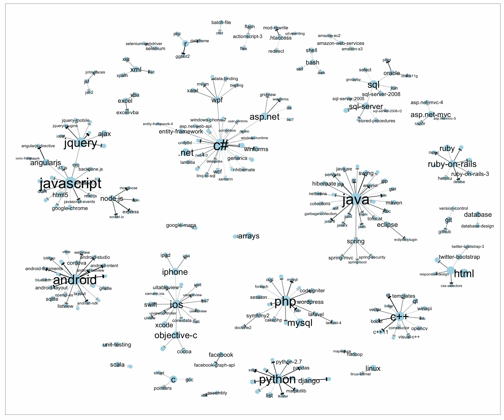
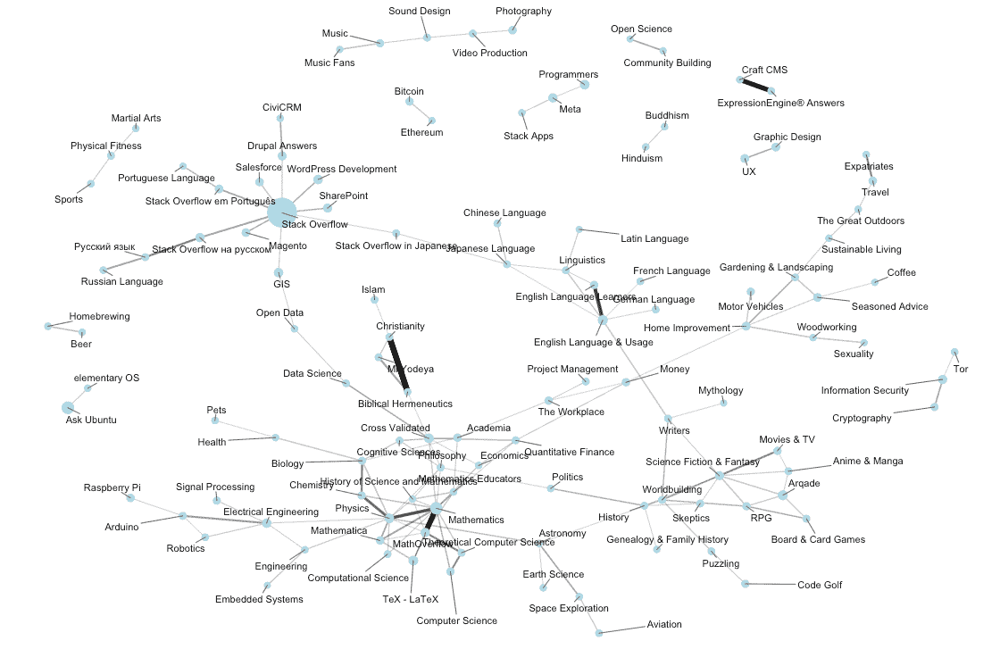

# 在 Stack Overflow 担任了一年的数据科学家，解释了差异

> 原文：<http://varianceexplained.org/r/year_data_scientist/?utm_source=wanqu.co&utm_campaign=Wanqu+Daily&utm_medium=website>

2013 年 1 月的一天，我发现自己在互联网上浪费时间。

这不是一个好主意:我和其他攻读博士学位两年半的人一样忙。我必须完成一份关于酵母遗传学研究的报告，我和一位 NYU 合作者的论文已经落后了几个月，一些剩下的本科生研究更是落后了。我的个人生活也很忙——我刚从以色列旅行回来，刚刚开始学习巴西柔术和慢跑。

但是有一天我在浪费时间回答一个陌生人关于 beta 分布的问题。这个问题是关于交叉验证，开发商 Q &的统计姐妹网站一个网站堆栈溢出。那时，我已经在 Stack Overflow 上活跃了一年，在 Cross Validated 上也有一个不太频繁的回答者:这当然是我最喜欢的*浪费时间的方式。*

当时，我有一个有点可爱的想法，用棒球统计数据来解释贝塔分布——这个答案后来变成了[这篇文章](http://varianceexplained.org/statistics/beta_distribution_and_baseball/)和[这个系列](http://varianceexplained.org/r/beta_binomial_baseball/)。

我在博士期间做了很多我引以为豪的事情，还做了很多被遗忘或不重要的事情。但就对我职业生涯的影响而言，这个答案是我最开心的工作。

### 堆栈溢出一年

上周四(6 月 16 日)是我作为数据科学家在 Stack Overflow 工作一周年的日子。

在我加入之前一个月左右，我完成了我的博士学位，跳槽到一家科技公司对我来说是一个相当大的变化。就在几个月前，我还计划继续从事学术研究，尤其是在计算生物学领域。我开始申请博士后奖学金，甚至没有考虑过申请“行业”工作。

是什么改变了我的想法？它始于 2015 年 1 月，当时 Jason Punyon 发现了我(当时才两岁)关于测试版的帖子:

当时我非常确定我正在进入学术界，但我不想错过参观 Stack Exchange 办公室和会见产品背后的一些人的机会。基本上，我只去了一次办公室就改变了主意，几周后，经过面试，我得到了这个职位，并签了字。

### 我一直在做的一些事情

人们知道 web 开发人员是做什么的，但是数据科学家是做什么的呢？([我不是唯一一个被问到这个问题的人。](http://www.wsj.com/articles/what-data-scientists-do-all-day-at-work-1457921541)

以下并不是我唯一在做的项目，但它们可能会让我对我一直在做的事情有所了解。

#### 设计、开发和测试机器学习功能

在我们的产品中使用机器学习的最突出的例子是[Providence；我们为用户匹配他们感兴趣的工作的系统](https://kevinmontrose.com/2015/02/04/providence-matching-people-to-jobs/)。(例如，如果你访问的主要是关于栈溢出的 Python 和 Javascript 问题，你最终会得到作为广告的 Python web 开发工作)。我与数据团队的工程师([凯文·蒙特罗斯](https://kevinmontrose.com/)、[杰森·普尼恩](http://jasonpunyon.com/)和[尼克·拉森](http://stackoverflow.com/users/178082/nick-larsen))一起设计、改进和实现这些机器学习算法。([这里有一些关于系统架构的更多信息，是在我加入](http://jasonpunyon.com/blog/2015/02/10/providence-architecture-and-performance/)之前构建的)。例如，我们努力在地理上接近用户的工作和技术上匹配良好的工作之间取得平衡，并确保用户获得各种工作，而不是一遍又一遍地看到相同的工作。

这个过程中有很多涉及到设计和分析 A/B 测试，特别是关于改变我们的定位算法、广告设计和其他因素，以提高点击率(CTR)。这个过程在统计学上比我预期的更有趣，在某些情况下，让我发现了我用来分析生物实验的方法的新用途，在其他情况下，鼓励我学习新的统计工具。事实上，我的关于将贝叶斯方法应用于棒球击球统计的[系列的大部分内容实际上是我用来分析跨广告活动的 CTR 的方法的一个几乎不加掩饰的版本。](http://varianceexplained.org/r/beta_binomial_baseball/)

#### 学习很酷的东西

我不再是学术科学家了，但这并不意味着我对从数据中得出结论不感兴趣。Stack Overflow 有一个软件开发生态系统的鸟瞰图——数百万的问题、用户和每日访问者。我们能从这些数据中学到什么？

首先，通过观察标签是如何一起使用的，我们可以发现自然的技术集群:

这让我们可以自动地将框架和包分类到它们所属的更高级的语言和集群中，完全不需要手工注释。

但它实际上只向我们展示了标记如何在特定的编程问题上共同出现，而不是它们如何在相同的项目中使用(例如，C#和 SQL Server 可能不总是出现在相同的问题上，但它们经常作为相同技术堆栈的一部分使用)。为此，我可能会查看另一个数据源，Stack Overflow Careers profiles，并查看哪些技术倾向于被相同的开发人员使用:

我喜欢这种不仅通过严格的类别，而且通过“技术生态系统”来划分标签的方式这种理解不仅限于编程技术。Stack Exchange 网络包含大量问答网站。通过观察哪些社区倾向于拥有相同的活跃成员，我们可以类似地创建一个我们的站点如何相互关联的网络:

(不是我做的都是网络，只是一些一看就比较有意思的例子)。

为什么要花时间做这样的分析呢？有时他们可以直接为产品特性做出贡献。例如，定量地理解技术集群可以让我们改进驱动 Providence 目标的[开发者类型](https://kevinmontrose.com/2015/01/27/providence-machine-learning-at-stack-exchange/)的模型。从商业角度来看，其他见解也是有价值的。我与销售、营销和社区团队一起工作，解释他们的数据并帮助他们做出决策。

但是我本质上也对学习和可视化这种信息很感兴趣；这是让这份工作变得有趣的原因之一。我在这里的第二年的一个计划是公开分享更多这些分析。在之前的一篇帖子[中，我观察了哪些技术是最两极分化的](http://varianceexplained.org/r/polarizing-technologies/)，我期待着尽快分享更多类似的帖子。

#### 开发数据科学架构(内部 R 包)

我喜欢用 R 来学习关于我们数据的有趣的东西，但我的长期目标是让我们的任何工程师都可以轻松地这样做。当我加入的时候，我是公司里第一个使用 R 的人，但是这种情况已经持续了一年。r 仅仅是一种*直接与数据打交道并回答有趣问题的非常好的方式。(当才华横溢的软件工程师打开 Excel 做折线图的时候让我很难过！)*

为了这个目标，我一直专注于构建可靠的工具和框架，人们可以将它们应用于各种问题，而不是“一次性”的分析脚本。(在 StitchFix 上有一篇杰夫·马格努松写的关于这些普遍挑战的很棒的帖子)。我的方法是建立**内部 R 包**，类似于 [AirBnb 的策略](https://medium.com/airbnb-engineering/using-r-packages-and-education-to-scale-data-science-at-airbnb-906faa58e12d#.nd6f8ay5i)(尽管我们的数据团队比他们的要年轻和小很多)。这些内部包可以查询数据库和解析我们的内部 API，包括使各种安全和基础设施问题对用户不可见。

这也包括构建 R 教程和编写“入职”材料。作为一个例子，[我公开了一个教程](http://rpubs.com/dgrtwo/190325)，它介绍了用于查询我们数据库的内部 **sqlstackr** 包。这也是一个通用的 dplyr/tidyr/ggplot2 介绍，我发现它比将一个开发者链接到一个通用的 dplyr 教程更有用(因为这是我的同事们肯定会感兴趣的数据！)我的希望是，随着数据团队的成长，随着更多的工程师学习 R，这个包和指南的生态系统可以成长为一个真正的内部数据科学平台。

### 学术界和工业界

数据科学家有一个流行的定义:

这个版本是积极的，但值得注意的是，反过来也是正确的:在研究生院，我比我实验室的其他人更少了解统计学，在我的新工作中，我比我的同事更少了解软件工程。那么转变过程如何呢？

#### 了解更多关于统计的知识

有很多关于“程序员需要学习统计学”的戏剧性文章。的确，我比我的同事有更多的统计经验和培训(也是第一个在任何领域获得博士学位的人)。但这并没有妨碍我的工作。

首先，我注意到在许多重要领域，这种差距正在缩小。我见过的解释 A/B 测试的开发人员已经意识到 p-hacking 和多重假设测试的危险，以及效果大小和置信区间的重要性。特别是数据团队已经在努力传播良好做法。需要更多时间来适应的差距更多的是“使用泊松而不是线性回归”或“知道什么时候使用对数标度”。

更重要的是，我发现当我提出统计问题时，开发人员非常愿意倾听和学习，我觉得到目前为止我的工作关系已经建立了相互信任。这是我的经验没有真正反映出[“程序员需要学习统计学”](https://zedshaw.com/archive/programmers-need-to-learn-statistics-or-i-will-kill-them-all/)文章的一个例子，这篇文章把开发人员描绘成过于自信的狂热者。在这方面，我们可能是一个不同寻常的职能工程部门(我从其他公司听到过更糟糕的故事！)，但也有可能软件开发行业的态度在过去六年里发生了变化，统计的重要性得到了更广泛的认可。

我怀念的研究生院的一个方面是从别人那里学习统计学。我周围的人比我知识丰富得多，在实验室会议和研讨会上，我接触到了许多有用的统计理论和方法。如果我犯了错误，我也可以指望别人来接住。我目前接受的大部分统计教育必须是自我驱动的，我需要对我的工作非常谨慎:如果我在报告中使用了不恰当的统计假设，其他人不太可能会指出来。

#### 对软件工程了解较少

我长期以来一直关注编程实践，多年来我一直在使用 GitHub 并为开源 Python 和 R 项目做出贡献，但为一家科技公司工作确实代表了某种转变。我是一个终生的 Mac 用户，在过去的几年里，我一直在使用 r。Stack Overflow 是建立在微软的技术之上的，特别是 C#、ASP.NET 和 SQL Server，在我加入之前，公司里没有人使用过 r。我[不喜欢语言战争的某一方](http://varianceexplained.org/r/polarizing-technologies/)，但我确实对这种变化对我意味着什么感到紧张。

事实证明这也不是很大的障碍，尤其是我发现我可以完全在苹果电脑上的研发中为公司做出很多贡献。我欠了 [RSQLServer](https://github.com/imanuelcostigan/RSQLServer) 和 [jTDS 驱动](http://jtds.sourceforge.net/index.html)的开发者很多；多亏了他们，我可以很容易地从 RStudio 查询我们的数据库。我有一个一直开着 Visual Studio 的 Parallels 窗口，但是我发现大多数时候我甚至不需要使用它。我有时会将代码推向生产(通常与广告定位实验有关)，但这并不是摩擦的来源。在软件工程的许多领域，我对*的了解比我的同事少得多*，包括前端网页设计和网站可靠性工程，但就像在任何公司一样，我最终与这些担忧完全绝缘。

### 其他变化

**离开生物学研究**。这可能是我最担心的变化。八年来(包括我本科学位的大部分时间)，我的研究一直专注于生物学。花了几个月的时间研究其他问题，我才意识到，老实说，**我对生物学问题从来没有那么大的热情。**

生物学提出了许多有趣的计算和统计问题，生物信息学中也有许多令人兴奋的工作。但当我完成一项生物分析时，我会以我没有知识或兴趣来解释自己的结果(比如说，一百个基因在刺激下改变了表达)而告终。(即使在多年研究酵母基因组之后，我也只能说出少数基因的名字)。相比之下，我是 Stack Overflow 的长期用户，我对软件开发人员生态系统的状态有着普遍的兴趣，所以我看到一个类似于上述网络的结果，我可以立即判断它是否有意义。处理我真正感兴趣的数据感觉很不一样。

写作:这是我低估的一个优势。我在我的学位期间写了很多东西，主要是为了期刊文章和我的论文，事实是，写那种正式的语言会让人觉得*很不自然。在过去的一年里，我的大部分写作都是为了内部报告、文档或博客帖子，在这些地方，我可以非正式地、交谈式地写作(试着将[我的论文](http://arks.princeton.edu/ark:/88435/dsp01hd76s238c)的语言与这个博客上的任何帖子进行比较)。我有一些剩余的研究正在试图发表，因此很难回到为期刊文章写作的心态。*

### 和我一起工作的人

我有一种奇怪的幽默感，我的许多推文都涉及一个虚构的“Dev ”,作为喜剧陪衬，要么是嘲笑工程文化，要么是嘲笑我自己在这方面的经验不足。

以防不明显，这些推文的每一条都是明目张胆的谎言。首先，这些交流都没有发生。但更重要的是，他们并不能代表我合作过的开发人员。这家公司聪明、能干、有爱心的员工是我在这里工作最喜欢的部分之一。

有很多值得列举的(当然是数据和广告服务器团队的所有成员)，但我将只列举几个作为例子。Jason Punyon 是最初发现我在测试版上的帖子的开发者。Jason 是一名优秀的工程师，在这里工作六年后，他积累了大量有用的产品知识。真正让我印象深刻的一个方面是他将关心数据与关心用户结合起来的方式。

几个月前，我进行了一项实验，证明在招聘广告上显示薪资范围有很大好处(在未来的帖子中会有更多相关内容)，并在公司内部分享了实验结果。我很乐意分享我学到的一些结论。但杰森采纳了这些结果，并付诸行动，开始推动所有雇主(包括我们自己)在招聘清单上提供薪资信息。他之所以这样做，是因为他认真对待数据，认为数据可以指导他的选择，也应该指导公司的决策。作为我们产品的用户和普通人，他也关心开发人员，并认为他们有权提前了解工资信息。我很自豪能和他一起工作。

有很多工程部门以外的人让我印象深刻，特别高兴能和[社区团队](http://meta.stackexchange.com/questions/99338/who-are-the-community-team-and-what-do-they-do)一起工作。例如，[塔林·普拉特](https://blog.stackoverflow.com/2015/06/pivoting-into-a-new-career-please-welcome-taryn-pratt-bluefooted-community-manager/)(又名[蓝脚](http://stackoverflow.com/users/426671/bluefeet))在我开始之前几个月加入了这个团队。在我来这里工作之前，我为 Stack Overflow 社区做了贡献，但是与 Taryn 的贡献相比，这根本不算什么。多年来，她一直是一个积极的回答者和版主，包括回答了> 3500 个问题，投出了>22000 面有用的旗帜(！！).

虽然 Taryn 不是这里的开发人员，但她拥有出色的技术经验和技能(大多数社区经理都是如此)。她将这些技能(尤其是 SQL)用于帮助堆栈溢出社区。在这种背景下，她最近开始学习 R，因此她可以应用统计、数据驱动的方法来分析和理解问答活动中的模式。在她和团队中其他人的帮助下，我非常兴奋地看到数据科学可以为社区做出什么贡献。

### 我给研究生的建议是:创造公共物品

在我被雇佣一段时间后，我了解到了更多关于杰森推特背后的故事，关于联系我的内部对话是突发奇想开始的。

我觉得自己很幸运能拥有现在的工作，看到这一点让我感到更加幸运。我被雇用的情况可能太反常了，以至于我无法从中获得任何建议。但如果我想给仍在读研的人提些建议，我会想到以下几点:公共工作不是浪费时间。

当我读研究生时，我最关心的是发表论文；在我看来，这是获得成功学位的标志，也是对我的职业生涯唯一重要的事情。我最终公布了我所在领域的博士人数的大致中间值(你可以在这里找到他们)。我很高兴我这样做了，但老实说，如果我少出版甚至不出版它们，我的生活将很难有所不同。但是我确实知道，如果我没有发布关于 beta 发行版的帖子，我的生活会有所不同，如果我没有开始回答堆栈溢出的问题，我的生活会更加不同。

期刊文章是创造公共作品的一种方式，但远不是唯一的方式:它们审查起来很慢，而且在提交之前需要“完美”。我认为有一种危险的态度，认为它们是公开工作的唯一途径，因此学术界的许多好工作被搁置多年或完全消失，因为它不完全是一篇论文(当然我的博客文章没有一篇符合作为期刊文章提交的资格)。所以我会说，如果你有一些有趣的东西，但不完全是论文，那么就把它写成博客帖子，或者堆栈溢出答案，或者 GitHub 上的开源项目。*只要在那里得到一些东西！*

正如我在开始时说的，我真的很高兴我回答了关于 beta 分布的问题。它给了我机会去开发一个对我的编程知识和生产力有很大帮助的产品。我和建造它的人一起工作，他们至今一直给我留下深刻的印象。一年下来，这是我能要求的最好的工作。

嗯，几乎是最好的。

* * *

<footer role="contentinfo">

### 大卫·罗宾逊

Heap 的数据科学家主管，在 r。

[*Email*](mailto:admiral.david@gmail.com) *[Twitter](http://twitter.com/drob) [*Github*](http://github.com/dgrtwo) *[*Stack Overflow*](http://stackoverflow.com/users/712603) *#### 订阅

#### 被推荐的***  *****在栈溢出做数据科学家一年**发表于<time datetime="2016-06-20T18:00:00+00:00">2016 年 6 月 20 日</time>。*** </footer>