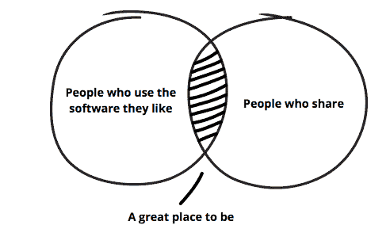
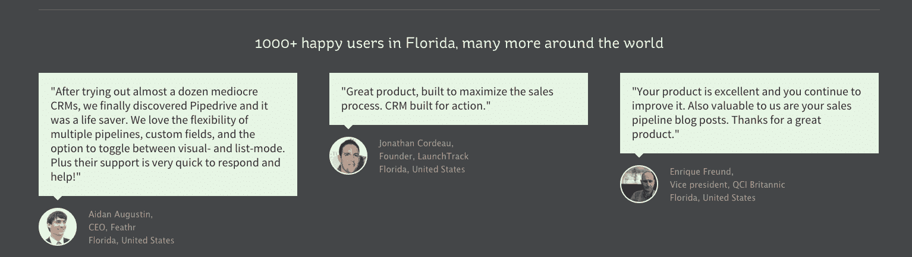

# 10 个非常实用的创业营销技巧|

> 原文：<http://purde.net/2016/06/10-practical-startup-marketing-tips/?utm_source=wanqu.co&utm_campaign=Wanqu+Daily&utm_medium=website>

[T2】](http://purde.net/2016/06/10-practical-startup-marketing-tips/speed-limit-sign-10541/)

听起来像 clickbait，对吧？一个“列表”，一些有问题的事实被松散地拼凑在一起，只为了让你去参观。但是，如果我自己这么说的话，这实际上是基于近十年技术营销的十个坚实的营销技巧。

我把它们写了下来，因为在与正在以这样或那样的方式营销初创企业的人的交谈中，它们都被证明是有价值的。他们在这里，没有特定的顺序。

## **#1。在短时间内与大量客户交谈。**

**【与客户交谈】*可能是知晓率与实际使用率最低的建议，即。每个人都知道这一点，但似乎没有人做得足够多。让我先说一下:当你开始与一家新公司或客户群合作时，至少要在短时间内与几十个客户交谈一次。*

 *大约 1 年半前，作为客户角色练习的一部分，我在 3 周内与近 40 名客户进行了一小时的交谈，虽然结果很有用，但经历这一过程更有用。这大大提高了我在 Pipedrive 的产品和我们的客户之间建立联系的能力。现在，我可以将我们发布的新功能与客户日常生活中的特定地方联系起来。当我查看产品使用统计数据或市场研究幻灯片时，这些对话的特定片段会跃入脑海，并有助于将数据变为现实。(为我们的博客找到三个真正有见地的案例研究也有实际的额外好处。)

这里有一个实用的提示。问题*我应该与多少客户交谈*的答案是:继续与更多的客户交谈，直到你听到的故事开始彼此相似。如果你有一个同质的用户群，正确的数字可能是 10，但在大多数情况下，目标是 25 左右是安全的。

并且做成双面的，让邀请人和被邀请人都在交易中有所收获。在 Pipedrive 的推荐计划中，被推荐的人可以获得一个月的额外试用期，如果被邀请的用户订阅，邀请者可以获得 Pipedrive 积分作为奖励。没有什么特别吸引人的地方，但每个月都会增加可预测数量的新客户，几乎不需要任何管理。[点击](http://purde.net/2013/10/how-you-cant-influence-the-majority-of-referrals-and-why-its-ok/)了解更多关于推荐计划的信息。

*一旦超过 1000 名用户或客户。

Illustration from the tell-a-friend page of Pipedrive.

## **#3。不要指望新闻稿**。

早期科技媒体关系中的新闻稿不一定是坏的；它们并不是获得保险的有效途径。相反，找到你所在领域的相关记者和博主，直接与他们接触，推销要简洁、个性化，重点是帮助他们写一个好故事(而不是帮助你获得关于你的产品或服务的所有细节)。

新闻稿有两个用处。写一个有助于微调你想说的话，并产生一个人为的截止日期，为你与你的博客候选人名单的交流增加一种排他性和紧迫感。(*“我们将在下周三宣布我们的融资，但很乐意在本周向您发送所有细节”*)。

获得媒体报道还有很多，而且[那里有关于它的好文章](http://onstartups.com/tabid/3339/bid/80121/How-To-Get-Media-Coverage-For-Your-Startup-A-Complete-Guide.aspx)，但是不依赖新闻稿是一个好的开始。

## **#4。尽早建立一个电子邮件列表。**

电子邮件是最好的营销渠道。它是高效的，高度可跟踪的，99%在你的控制之下。当你处于非常早期的阶段时，建立一个感兴趣的人的电子邮件列表会使它更容易启动。在后期阶段，它非常适合扩展内容营销。

在 Pipedrive，我们投入了相当多的时间和金钱来分发我们创建的内容。随着社交算法比唐纳德·特朗普的观点更频繁地变化，电子邮件是迄今为止让人们阅读和分享我们博客帖子的最可预测和最有效的渠道。

了解关于[自动化电子邮件营销](https://outfunnel.com/automated-email-marketing-guide/)的更多信息

## **#5。尽早定义价值主张。**

这个有点像*“我希望我能早点这么做”*对我来说。在 Pipedrive 的早期，我们试图锁定该产品的关键信息，但没有取得很好的效果。我们有太多潜在的方法来讨论 Pipedrive，但没有足够的验证来选择一个。所以我们(读:我)有点放任自流。这并不是说我们什么都没有:有几个不错的描述，我们在网站上做了大量的 AB 测试，以找到转换最好的一个。此外，我们有适度的媒体预算，公司的人数只有几十人，所以信息倾向于有机传播。总而言之，这看起来并不是最紧迫的事情。

然后 Pipedrive [筹集了 A 轮融资](https://techcrunch.com/2015/05/14/pipedrive-series-a/)，团队和营销预算开始快速增长，我们迫切需要一个清晰的价值主张。我们完成了这项工作，并在内部进行了社会化，但我们真的应该早一两年花时间来做这件事。

## **#6。使用特定地理元素定制您的网站。**

如这里的、这里的和这里的所记录的，Pipedrive geo 根据国家和美国较大的州来确定站点的元素。来自迈阿密的网站访问者看到的推荐与来自加利福尼亚或德国的不同。

自从我们发布这个以来，我们已经在几个方面改变了我们的网站，但早在一天，这个“黑客”有两位数的转换提升。

[T2】](http://purde.net/2016/06/10-practical-startup-marketing-tips/pipedrive-customer-gallery/)

## **#7。做关键词研究。**

[关键词研究](http://purde.net/2015/06/keyword-research-for-startups/)是一个回答以下问题的练习和持续过程:

*   制作什么内容来实现特定的业务目标
*   总体上和在特定的登录页面上使用什么语言
*   链接建设工作的重点在哪里

回答的问题列表还不错，对吧？

我一次又一次地看到，如果没有一个坚实的关键词库，产生的内容就有点像在远离公路的地方建一个加油站。除非你的模型能处理“病毒式”传播的内容，否则投资关键词研究是明智之举。

## **#8。早早开始付费营销**。

在 Pipedrive，我们一有那么多闲钱，就开始尝试每月 1000 美元的广告预算。虽然这种影响在早期几乎看不到，但这有助于开始学习。后来，当我们有钱投资广告时，我们知道哪些渠道推动新业务，以及不同渠道和关键词的生命时间价值(LTV)是什么。

## **#9。在 CPA/CPC 明显低于 Adwords 等主要平台的地方，想办法获得合格的流量。**

与前一个技巧相关，Adwords 通常是现有产品类别的逻辑起点，因为购买意图和可观的搜索量都在那里。许多创业公司面临的挑战是，如果你为一次点击支付 10 美元或更多，如果你的漏斗尚未优化，你没有真正的客户流失和 LTV 数据，你没有类似于在诺曼底养鹅的资金，那么很难让经济学发挥作用。(这可能有点小众化，但男人必须时不时地冒险。甚至是无用的风险。)

好消息是，几乎总是有一些频道拥有同样合格的流量，但收费更合理，因为他们正处于增长模式和/或由于良好的搜索引擎优化而获得廉价的流量。

只要搜索与你相关的关键词，看看哪些网站会出现在谷歌的第一页。

## **#10。与同领域的其他人交谈。**

最好的技巧和精确的统计数据很少在这样的公开博客帖子中分享。有时候，知道你需要什么的人并不是那种写博客或演讲的人。因此，我养成了一个习惯，与我所在领域的营销人员联系，安排 40-60 分钟的通话来交换意见。有时我会通过自我介绍来做，但根据我的经验，即使是冷冰冰的 Twitter 或 LinkedIn 外联也能达到 50%以上的命中率。与花在书籍、博客和播客上的时间相比，与活跃的从业者交谈的有用性比例为 1:10，所以这种似乎永远不需要花时间去证明的事情，是一件非常明智的事情。

这些是我觉得足够相关的 10 个建议来分享。我没能实现每月写一篇像样的文章的新年决心，但我已经超过了去年的文章数量，所以我可能会认为这次失败最终是成功的。

PS。如果你正在寻找更多的[营销建议](https://outfunnel.com/8-marketing-recommendations-from-industry-insider/)，看看这篇文章。*