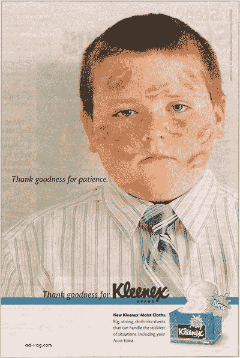

# 为什么品牌是下一个重要的创业能力

> 原文：<http://tomtunguz.com/branding/?utm_source=wanqu.co&utm_campaign=Wanqu+Daily&utm_medium=website>

世界上最有价值的品牌可口可乐值多少钱？778 亿美元。这相当于该公司市值的 45%。

通常情况下，赢家通过品牌在市场中创造优势。这些品牌唤起了消费者的情感:信任感(Visa)、渴望感(Nike)和冒险感(RedBull)。如果品牌足够强大，它会取代通用术语:纸巾/面巾纸，互联网搜索/谷歌，玻璃清洁剂/Windex。

在硅谷，我们倾向于相信更好的产品会赢得市场。在 Blue Bottle Coffee 或 YCombinator 无意中听到关于品牌建设——品牌属性、价值和定位——的对话是不常见的。相反，我们的交流更多地集中在技术上，最近则是设计上。

但在接下来的几年里，营销、品牌和定位，所有在硅谷不受重视的学科都将变得明显更加重要。随着进入壁垒在云技术的推动下不断下降，初创公司之间的竞争将会加剧，那些通过最佳信息传递触及目标客户群、打造最有效品牌的初创公司将会胜出。

我们知道讲故事将是一大优势。看看每一个商品行业，看看品牌的价值。耐克生产跑鞋。面巾纸生产纸巾。但是他们每个人都卖别的东西——他们卖的是一种理念。耐克卖的是优秀:“就这么干。”面巾纸卖的是“照顾家庭”

有现金意识的初创公司应该将投资限制在可衡量的营销策略上，这是合乎逻辑的。但是，随着创业公司规模的扩大，以及技术商品化的速度越来越快，品牌建设投资应该成为企业营销工作的一个关键部分。

最终，品牌可能会成为公司价值的一半，成为市场上真正的差异化因素。那没什么可轻视的。