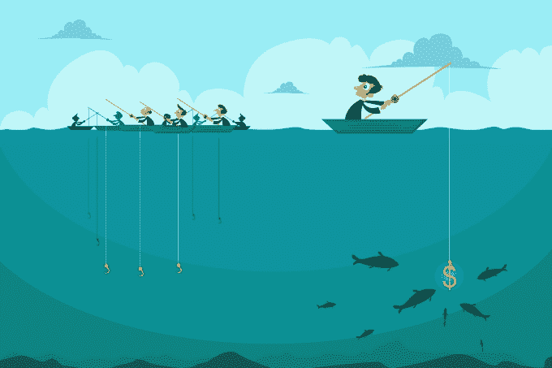

# 苹果新的应用商店广告 TechCrunch 会让富人更富吗

> 原文：<https://techcrunch.com/2016/06/26/will-the-rich-get-richer-with-apples-new-app-store-ads/?utm_source=wanqu.co&utm_campaign=Wanqu+Daily&utm_medium=website>

柳文欢·卡尼尔是移动归因分析平台的联合创始人兼首席执行官

[AppsFlyer](http://www.appsflyer.com/)

。

More posts by this contributor

苹果在 App Store 上展示的赞助搜索广告被其同时开放和改进订阅服务所掩盖。但是对于一般的开发商或出版商来说，广告对他们的生意会有更直接的影响。

在苹果完成一段时间的免费测试之前，付费广告不会开始。在此期间，应用商店出版商应该仔细观察，预测付费广告将如何影响他们的收购策略。多了一个花钱的渠道，大型出版商会进一步占据主导地位吗？印度能找到新的立足点吗？苹果只是想增加收入，还是在努力改善长期停滞不前的应用商店体验？

有一种愤世嫉俗的观点认为，苹果只是为了收入而创造付费广告:在 iOS9 中，苹果启用了广告拦截器，仅仅几个月后，随着 iPhones 和 MAC 的销量下降，它现在开始将赞助广告作为一个强大的新收入来源。其他愤世嫉俗者将谴责 App Store 现在是一个付费游戏环境，迫使开发者甚至以自己的名字或应用程序名称竞标，除非他们希望看到竞争对手绑架显然属于他们的流量。

但这些观点过于简单，而且适得其反。不管苹果的意图是什么，我们知道赞助广告对一些开发者来说将是一个好处和机会。问题是:哪些？

**大型开发商和出版商的案例**

根据我们对用户行为的了解，用户在其他搜索结果列表上看到一个大广告(初始模型[此处](https://developer.apple.com/app-store/search-ads/))时，可能会简单地点击广告，而不会看到有机的结果。这种行为可能会在 App Store 上加剧，App Store 主要显示在屏幕空间极其有限的手机上。除非更多的客户突然进入应用商店，否则很难想象广告不会在某种程度上降低有机流量。

因此，对于那些依赖有机流量作为增长策略的人来说，搜索广告可能是另一个致命的打击。

绝大多数开发商现在面临的情况是，为了发展，付费营销实际上是必不可少的。有钱投资收购活动的开发商可以直接投资赞助广告。

从苹果的角度来看，更加偏袒大型开发者可能不是一件坏事。有 200 万个应用可用，市场已经饱和了。通常，更好的产品将是那些收入更高的产品，这些收入可以反过来投资到应用商店搜索中。总而言之，付费广告可能有助于将拥挤的应用商店归结为更少、更好的产品。

另一方面，从用户的角度来看，收入最高的应用并不总是最好的应用。这在免费应用和付费应用之间尤其如此——盈利良好的免费应用总是赢家，即使付费应用更划算。

**独立企业和中型开发商的案例**

尽管大公司的收购预算看起来令人生畏，但印度公司已经在苦苦挣扎。一种新的广告形式不会损害中小型公司的收购努力，实际上可能会有所帮助。

印度人长期以来面临的一个问题是，他们觉得苹果没有采取什么措施来支持他们或改善应用商店。但是赞助广告只是趋势的一部分。菲尔·席勒不仅已经接任 App Store 的负责人，审核时间也从一周多下降到了两天(T1)，苹果也更加努力地与开发者沟通，正如广告公告所示。

对于小开发者来说，App Store 广告可能也是一个比脸书和其他公司的第三方广告更有竞争力的地方。像品牌广告商这样的外部力量不会出现来抬高价格，小开发商应该能够专注于他们自己的子类别内的竞争，因为广告是基于搜索词提供的。

最后，面向印度和大型出版商的广告将由苹果公司从 App Store 创意中自动生成。如果不需要专注于创意，印度公司将与他们更大的竞争对手平起平坐——竞争的唯一要求将是跟踪和衡量来自赞助搜索的用户的能力，以及这些用户是否有很高的终身价值。和谷歌一样，小批量的用户价格可能会更低。

对于那些拥有好产品和最小预算的人来说，如果他们明智地投资于付费搜索，并不断衡量他们的结果——然后加倍投资于证明 ROI 为正的策略——他们仍然可以成功。app store 搜索的本质涉及强烈的用户意图，因此即使游戏规则发生变化，较小的开发者仍然可以获得有价值的忠实用户。

**应用商店整体改善的案例**

但最乐观的观点是，无论是大公司还是小公司，都不会战胜对方。App Store 不一定是零和游戏。

今天，它只是碰巧出现零和游戏，由大型开发商主导，他们在复杂的广告和 ASO 上有大量的预算，并多年来保持着最高的票房排名。停滞不前不符合任何人的利益，就像几年前 Zynga 在脸书的统治地位以及随后该平台的停滞不前所显示的那样。

不管停滞是否是错误的，研究已经表明大多数用户不会寻找和下载新的应用程序。向 App Store 注入资金应该会给苹果带来强大的动力，增加打开 App Store 的用户数量，以及它已经采取的其他改进措施，如改善特色列表，增加类别和更频繁的更新。

因此，对于开发者来说，对苹果新广告唯一合理的反应是乐观和购买意向。Google Play [在 2015 年](https://adwords.googleblog.com/2015/07/launching-search-ads-on-play.html)增加了搜索广告，没有产生重大影响；在利润更丰厚的应用商店，大多数开发者应该能够找到一种方法来测试、衡量并最终受益于新广告。苹果对其商店越来越多的关注对各方都有好处，包括用户。