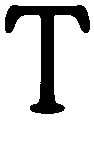

# “另一边”并不傻。有没有可能我们对人体器官的看法是错误的

> 原文：<https://medium.com/@SeanBlanda/the-other-side-is-not-dumb-2670c1294063?utm_source=wanqu.co&utm_campaign=Wanqu+Daily&utm_medium=website>

# “另一边”并不愚蠢

## 有没有可能我们并非事事都是对的？

Photo: beastfromeast/Getty Images

*这个故事是《互联网时光机***的一部分，是一本关于 2010 年代网络生活的作品集。**

*  T 这里有一个我喜欢在一群信任的朋友中玩的有趣游戏，叫做“争议观点”规则很简单:在有争议的观点之后，不要谈论分享的内容，也不允许“争论”——只能问为什么那个人会有那种感觉。意见可以从“我认为詹姆斯·邦德电影被高估了”到“我认为唐纳德·川普会成为一名出色的总统”*

*通常，有人会用“哦，我的上帝！我不知道你是那种人！”这实际上是“我以为你在我的团队里”的另一种说法*

*在心理学中，认为每个人都和我们一样的想法被称为“错误共识偏差”当我们看到电视收视率时，这种偏见经常表现出来(“这些看 NCIS 的人到底是谁？”)或者在政治上(“我认识的人都是为了更严格的控枪！这些不同意的落后乡巴佬是谁？!")或者民调(“这些人是谁投票给本·卡森的？”).*

*在网上，这意味着我们可能会被朋友的观点蒙蔽，或者更广泛地说，被美国的观点蒙蔽。随着时间的推移，这变成了一种潜意识的信念，认为我们和我们的朋友是理智的，有一个疯狂的“另一面”必须被嘲笑——另一面只是不“明白”，显然没有“我们”聪明但是这种自以为是的社交媒体行为是适得其反的，它是以实际微妙的话语为代价的自我强化，如果我们想认为在线话语是富有成效的，我们需要超越这一点。*

*Illustration: Tom Gauld/Twitter[Source](https://twitter.com/tomgauld/status/571994690289061888?lang=en)*

*正在出现的是最糟糕的回音室，里面的人越来越相信每个人都认同他们的世界观，当他们不认同时，他们的队伍在壮大。这就像时钟一样:一个事件发生了，然后当一个非社交媒体同行群体公众以一种意想不到的方式对新闻做出反应时，你的社交媒体圈被震惊了。然后，他们嘲笑对方“脱离现实”或“愚蠢”*

*弗雷德里克·德波，我最喜欢的作家之一，在他的文章《越过酷人联盟》中提到了这一点。他写道:*

> *[互联网]鼓励人们打破工作生活、社交生活和政治生活之间的任何界限。“嘿，那个在推特上谈论我喜欢的电视节目的人也不喜欢不公正，”随着时间的推移，这变成了“我可以通过他们喜欢的电视节目来识别盟友。”事实上，你可以从蕾哈娜的视频中挖掘政治内容，以这种模糊的互联网方式，人们在蕾哈娜的音乐中看不到政治内容的感觉不是站在你这边的。*

*当有人表示他们不“站在我们这边”时，我们的第一反应是逃跑或认为他们愚蠢而不予理会。可以肯定的是，有些仇恨的、种族主义的人不值得你的一个突触释放少量的电流。相反，我指的是那些实际上相信一个复杂问题的相反观点的人，他们这样做是出于真正的、深思熟虑的原因。或者至少，有和你一样好的理由。*

*Illustration: [Esquire/NBC News poll](http://www.esquire.com/news-politics/a40693/american-rage-nbc-survey/?utm_source=nextdraft&utm_medium=email)*

*这不是一个“政治正确”的问题。这从根本上否定了这样一种可能性，即认为与你想法不同的人可能是对的。这是一种偏好，将另一面视为一张纸板，而不是他们实际上复杂的个人。*

*与真正的求知欲相反的是分享 *Slate* 或 *Daily Kos* 或*福克斯新闻频道*或 *Red State* 链接。这些网站的存在几乎完全是为了提供分享的内容，这样朋友们可以互相拍拍对方的背，嘲笑对方。看另一边！如此愚蠢，无法以我的方式看待这件事！*

> *这是一种偏好，将另一面视为一张纸板，而不是他们实际上复杂的个人。*

*分享嘲笑对方漫画的链接并不意味着我们更加见多识广。这表明我们宁愿做自鸣得意的混蛋，也不愿考虑其他观点。这表明我们更愿意向朋友展示我们和他们一样，而不是试图去理解那些不一样的人。*

*你不可能认为自己是一个好奇的人，并以这种方式参与社交媒体。我们不能认为自己“感同身受”只是为了转过身去贬低那些不同意我们的人。*

*在推特和脸书上，这意味着我们会优先分享那些会获得我们同行认可的东西，而不是那些实际上，你知道，真实的东西。我们分享的东西忽略了更广泛的现实，选择性地分享信息，或者只是一个彻头彻尾的谎言。错误信息如此猖獗，以至于《华盛顿邮报》《T2》停止发布其互联网事实核查专栏，因为人们似乎并不关心事情是否属实。*

> *揭穿网络假货曾经需要一些研究，现在只需点击“关于”或“免责声明”页面。相信恶作剧的意愿曾经似乎来自诚实的无知或误解，但现在通常不再是这样了。像“[凯西·安东尼在卡车里发现碎尸](https://www.washingtonpost.com/news/the-intersect/wp/2015/09/25/what-was-fake-on-the-internet-this-week-casey-anthonys-death-and-chipotles-911-ad/)”这样的标题通过老式的幸灾乐祸——甚至是仇恨——传播开来。*
> 
> *…*
> 
> *现在机构的不信任度如此之高，认知偏见如此之强*总是*，以至于上当受骗的人通常只对消费符合他们观点的信息感兴趣——即使它明显是假的。*

*正如德布尔所说，解决办法是，“你必须愿意牺牲你精心策划的社交表现，愿意和与你不同的人一起工作。“换句话说，你得认识到对方是由实际存在的人构成的。*

*但是我想更进一步。我们都应该抱着这次我们可能错了的真实可能性来对待每一个问题。*

*难道你，媒体的读者和 Twitter 的超级用户，像我一样，时不时会遭受这种痛苦吗？有没有可能我们并不是事事都对？那些住在和你不一样的地方的人，看表明你不看和读你不读的书，他们有和你一样有效的观点和信仰体系？也许你看不到整个画面？*

*认为政治正确已经失控？在 Twitter 上关注许多伟大的社会活动家。认为美国对枪支的立场令人费解？阅读 31%的美国人拥有枪支的故事。这并不是说另一方是“正确的”,而是他们可能有真正的理由这样认为。只有理解了这些原因，才能进行真正的讨论。*

> *难道你，媒体的读者和 Twitter 的超级用户，像我一样，时不时会遭受这种痛苦吗？有没有可能我们并不是事事都对？*

*任何一个辩论俱乐部的老手都知道，如果你不能让对手明白你的观点，你就没有真正抓住问题。我们可以哀叹政治僵局和分裂的媒体。但是，除非我们真诚地努力去理解那些与我们不同的人，否则我们不会真正取得进步。如果你不尊重别人的立场和观点，你也不会说服任何人和你有同样的感受。*

*下次当你和你不同意的人讨论时的一个挑战:不要试图“赢”不要试图“说服”任何人你的观点。不要通过向同龄人嘲讽来得分。相反，试着“输”。听他们说完。请他们说服你，并意味着它。没有人会告诉你的环保主义者朋友，你只是在你哥哥支持水力压裂法后问了一些后续问题。*

*或者，下次你觉得必须在社交媒体上分享关于时事的链接时，问问自己为什么要这么做。是因为这个链接揭示了你没有考虑到的信息吗？或者它证实了你的世界观，提醒你的智力队友圈子，你不在另一边？*

*我恳求你去寻找你的对立面。当你听到有人引用不支持你观点的“事实”时，不要认为“那不可能是真的！”相反，考虑一下，“嗯，也许那个人是对的？我应该调查这件事。”*

*因为拒绝真正理解与你意见相左的人是一种智力上的懒惰，更糟糕的是，这通常比你指责对方所做的还要糟糕。*

