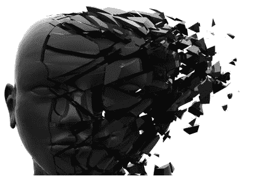

# 我们数字自我的阴暗面:互联网如何改变我们的思想和行为

> 原文：<http://www.theemotionmachine.com/the-dark-sides-of-our-digital-self?utm_source=wanqu.co&utm_campaign=Wanqu+Daily&utm_medium=website>

我们的“数字自我”会一直存在，但重要的是要意识到它会助长夸大妄想、自恋、冲动、侵略以及其他消极和危险的人格特征。

**This content is for **Monthly, Yearly, and Lifetime** members only.
[Join Here](https://www.theemotionmachine.com/wp-login.php?action=register)**