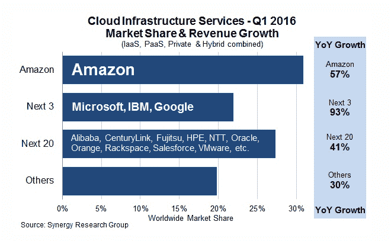

# AWS 如何诞生 TechCrunch

> 原文：<https://techcrunch.com/2016/07/02/andy-jassys-brief-history-of-the-genesis-of-aws/?utm_source=wanqu.co&utm_campaign=Wanqu+Daily&utm_medium=website>

关于 AWS 的形成有很多故事，但我们只知道这些:10 年前，Amazon.com 的云基础设施服务部门——亚马逊网络服务——作为 Amazon.com 的一项副业，低调推出。今天，[凭借自身实力成为了一家非常成功的公司，销售额高达 100 亿美元](https://www.sec.gov/Archives/edgar/data/1018724/000119312516530910/d168744dex991.htm)。

事实上，[根据 Synergy Research](https://www.srgresearch.com/articles/gang-four-still-racing-away-cloud-market) 的数据，自推出以来的十年中，AWS 已经发展成为地球上最成功的云基础设施公司，占据了超过 30%的市场份额。[这比它的三个最接近的竞争对手——微软、IBM 和谷歌——加起来还要多](https://www.srgresearch.com/articles/gang-four-still-racing-away-cloud-market)(而且相差很大)。

你可能不知道的是，AWS 的想法可以追溯到 2000 年，当时亚马逊是一家与今天大不相同的公司，只是一家努力解决规模问题的电子商务公司。这些问题迫使该公司建立一些坚实的内部系统来应对它正在经历的高速增长——这为后来的 AWS 奠定了基础。

从一开始就在华盛顿的 AWS 首席执行官 Andy Jassy 最近在 DC 华盛顿的一次活动上发言，解释了这些核心系统是如何在从 2000 年开始的三年时间里根据需要发展起来的，在他们知道之前，没有任何真正的规划，他们已经具备了成为 AWS 的业务的条件。

## 创建内部系统

这可以追溯到 2000 年，当时该公司希望推出一项名为 merchants 的电子商务服务，以帮助塔吉特百货(Target)或马克斯潘塞(Marks & amp；amp；Schmidt)等第三方商家在亚马逊的电子商务引擎上建立在线购物网站。事实证明，建立一个外部开发平台比他们想象的要困难得多，因为像许多初创公司一样，当它在 1994 年推出时，并没有真正为未来的需求做好规划。他们没有创建一个有组织的开发环境，而是在不知不觉中创造了一个混乱的环境。这使得将各种服务分离出来，形成一个对第三方有用的集中开发平台成为一个巨大的挑战。

> 所以在 2000 年左右，我们悄无声息地变成了一家服务公司，一点也不张扬。<cite>安迪·贾西，AWS 首席执行官</cite>

那时，该公司向建立 AWS 业务迈出了第一步，将这些乱七八糟的东西整理成一套记录良好的 API。虽然它使 Merchant.com 的开发更加顺利，但它也很好地服务于内部开发人员，并且它为内部开发工具的更有组织和更有纪律的方式打下了基础。

“我们希望所有内部团队从那时起以一种分离的、API 访问的方式进行构建，然后亚马逊内部的所有内部团队都希望能够以这种方式消费他们的内部开发团队服务。所以在 2000 年左右，我们悄无声息地变成了一家服务公司，一点也不张扬。

几乎在同一时间，该公司发展迅速，并雇用了新的软件工程师，但他们仍然发现，尽管增加了人员，他们并没有更快地构建应用程序。当时任亚马逊首席执行官杰夫·贝索斯的幕僚长贾西深入研究这个问题时，他发现了一个持续的抱怨。管理团队预计一个项目需要三个月的时间，但仅仅是构建数据库、计算或存储组件就花了三个月的时间。每个人都在为一个单独的项目构建自己的资源，没有考虑到扩展或重用。(我想你能猜到这是怎么回事。)

亚马逊的内部团队需要一套通用的基础设施服务，每个人都可以访问这些服务，而不必每次都重新发明轮子，这正是亚马逊开始构建的东西——这时他们开始意识到他们可能有更大的东西。

## 一个完美的可怕的想法

杰西讲述了 2003 年在杰夫·贝索斯家的一次高管务虚会。在那里，高管团队进行了一次确定公司核心竞争力的练习——他们预计这次练习会持续 30 分钟，但最终花了相当长的时间。当然，他们知道他们有能力提供广泛的产品选择，他们擅长履行和运送订单，但当他们开始挖掘时，他们意识到他们有这些其他的技能，他们没有考虑过。

> 回想起来，这似乎是显而易见的，但在那个时候，我不认为我们曾经真正内化了这一点。<cite>安迪·贾西，AWS 首席执行官</cite>

Jassy 回忆说，随着团队的工作，他们意识到他们也变得非常擅长运行基础设施服务，如计算、存储和数据库(由于之前阐明的内部需求)。此外，他们在根据需要运行可靠、可扩展、经济高效的数据中心方面已经变得非常熟练。作为像亚马逊这样的低利润企业，他们必须尽可能地精简和高效。

就在那时，他们甚至没有完全阐明它，就开始形成 AWS 可能是什么的想法，他们开始想知道他们是否有一个额外的业务为开发者提供基础设施服务。

“回想起来，这似乎是显而易见的，但在那个时候，我不认为我们曾经真正内在化，”杰西解释说。

## 互联网的操作系统

他们并没有一个“啊哈”的时刻，但他们确实开始建立在务虚会上开始的最初想法的基础上——在 2003 年夏天，他们开始将这套服务视为互联网的某种操作系统。请记住，这仍然是他们推出 AWS 的三年前，所以这是一个需要时间来烘烤的想法。

> 我不认为我们中的任何人有胆量预测它会发展得如此之大或如此之快。<cite>安迪·贾西，AWS 首席执行官</cite>

“如果你相信公司将在基础设施服务的基础上从头开始构建应用程序，如果存在正确的选择(服务)，我们相信如果存在正确的选择，他们会这样做，那么操作系统就变成了互联网，这与(过去)30 年的情况真的不同，”Jassy 说。

这引发了一场关于这个操作系统的组件以及亚马逊如何帮助构建它们的新讨论。随着他们的进一步探索，到 2003 年秋天，他们得出结论，这是一个绿色的领域，运行互联网操作系统所需的所有组件都还没有建立起来——在这一点上，我想象他们的眼睛亮了起来。

“我们意识到我们可以贡献互联网操作系统的所有关键组件，因此我们开始追求更广泛的使命，这就是今天的 AWS，它真正允许任何组织或公司或任何开发者在我们的技术基础设施平台上运行他们的技术应用。”

然后他们就开始这么做了——剩下的，正如他们所说的，就是历史了。几年后，该公司推出了他们的基础设施即服务(这个术语可能直到后来才出现)。这个想法的形成需要时间，但今天它是一个非常有利可图的行业。

AWS 于 2006 年 8 月推出了[亚马逊弹性计算云，率先将现代云基础设施服务推向市场。令人惊讶的是，过了好几年，竞争对手才做出回应。因此，他们控制了大量的市场份额，至少目前如此。请放心，一些非常富有的竞争对手，如微软、谷歌、IBM 和其他公司正在瞄准他们。](https://aws.amazon.com/about-aws/whats-new/2006/08/24/announcing-amazon-elastic-compute-cloud-amazon-ec2---beta/)

当被问及是否预见到他们已经取得的成功时，杰西谦虚地说，“我不认为我们中的任何人有胆量预测它会发展得如此之大或如此之快。”

但考虑到该公司是如何小心翼翼地为后来的 AWS 奠定基础的，你不得不认为他们在这里看到了别人没有看到的东西，一个他们认为可能是巨大的想法。事实证明，他们看到的正是计算机的未来。