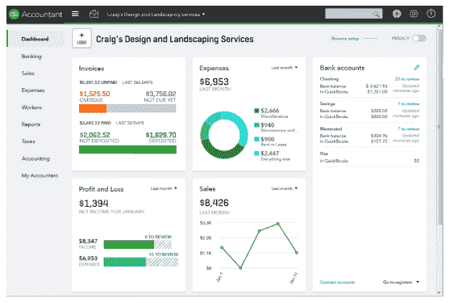
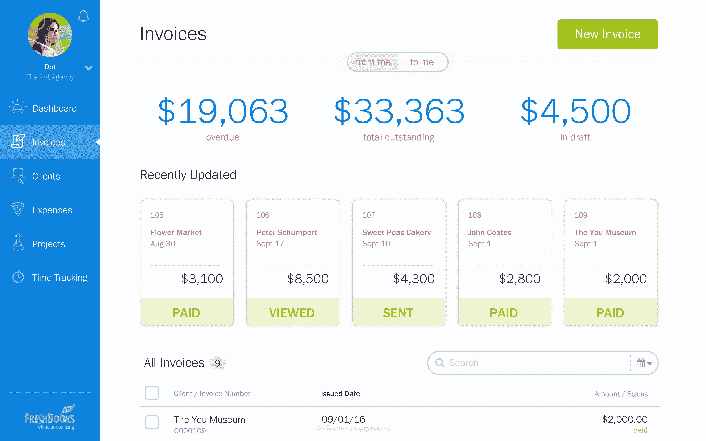
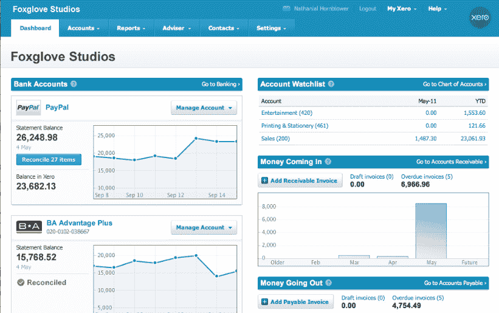
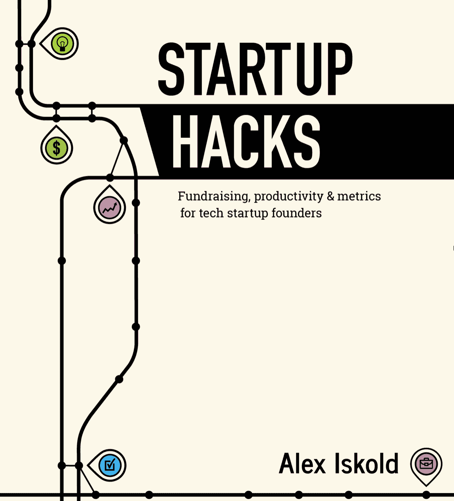

# 2021 年最佳创业会计软件——亚历克斯·伊斯科尔德

> 原文：<https://alexiskold.net/2016/07/02/what-is-the-api-for-your-startup/?utm_source=wanqu.co&utm_campaign=Wanqu+Daily&utm_medium=website>

购买会计软件是企业主普遍的决定。拥有这种类型的计划可以确保你拥有最好的工具来管理你的财务和公司的其他方面，节省时间和金钱。

购买这种类型的软件有很多好处，这就是为什么在最终决定买什么之前进行研究是很重要的。这篇文章将帮助您找到适合您的业务需求的会计软件，通过探索它提供的几个不同的东西。

## 我们的前 5 名最佳会计软件

*   Quickbooks
*   新书
*   鑫元鸿（台湾公司名
*   Sage 云
*   波浪

## Quickbooks

QuickBooks 是北美 20 多年来最畅销的会计软件，帮助 190 个国家的 500 多万家小型企业轻松准确地跟踪财务状况。

只需一次登录，您就可以访问运营和发展业务所需的一切，从管理库存、跟踪销售税率、计算工资单、向客户开具发票(和收款)、在线支付账单等等，因此您可以专注于最重要的事情:运营业务。此外，QuickBooks Online 有业界最佳的服务和支持作为后盾，因此您可以放心地在云上进行会计工作。

### QuickBooks 功能

*   在一个地方查看您的所有数据:工资单、发票、账单、付款等，所有这些都是实时的。
*   自动跟踪您开展业务的所有州和县的销售税，并即时获取税率更新。
*   通过客户、供应商、员工和物品卡片获得您业务的 360⁰视图，这样您就可以全面了解对您的底线至关重要的一切。
*   通过智能自动化节省时间，包括重要事件的自动通知或按时支付账单的提醒。

## 新书

今天许多企业需要依靠会计软件来保持他们的账簿有序。近年来，会计软件变得更加先进和易于使用。Freshbooks 是领先的会计软件公司之一，为忙碌的企业家提供强大的功能。

Freshbooks 是一个基于云的软件，它有几个功能来帮助用户管理他的簿记和会计。该软件可以让你跟踪你的业务和个人支出。此外，它还提供了一些高级功能，允许您快速生成有关业务任何方面的报告。

### Freshbooks 功能

*   轻松支付和银行整合。设置银行账户整合和在线信用卡支付只需点击几下，即可在 Freshbooks 中设置您的账户。此外，该软件可以与领先的银行账户集成，这使得跟踪所有交易变得容易，而不必手动更新电子表格或其他应用程序。这些功能都很容易设置。
*   多用户支持。Freshbooks 是一个可以被多个用户同时访问的网站。只要您拥有创建该帐户的用户的权限，就可以从不同的位置访问该帐户，以跟踪其交易、查看报告和其他功能。
*   易于访问。在工作时间内，通过一台计算机或移动设备与互联网连接，该应用程序是毫不费力的。您只需输入您的登录信息，它就会自动为您打开，让您随时随地按需访问。此外，系统会记住您在之前的会话中输入的内容，因此几个月后就没有必要每次都登录了。
*   便捷的功能。该应用程序还附带了几个功能，有助于简化您的企业和个人帐户。例如，它提供了旅行日志、发票模板、费用跟踪、发票和时间跟踪等功能。所有这些功能都旨在让您轻松跟踪您的财务状况，而无需经历手动记录的麻烦，如果管理不当，手动记录会变得不太有条理。
*   移动无障碍。Freshbooks 是唯一一家通过其网站提供移动应用的会计软件公司。当您需要在旅途中访问您的帐户，而不需要在台式机或笔记本电脑上进行呼叫时，此功能非常方便。

## 鑫元鸿（台湾公司名

Xero 是一款旨在简化财务管理的会计软件。它帮助企业管理他们的财务，支付员工和账单，并收取客户欠他们的钱。借助 Xero，您可以实时监控企业的财务状况，并生成报告以提高企业运营的透明度。

Xero 可以在 web、Android 和 iOS 平台上使用，也可以在 Windows 上使用。它可以免费下载和设置，但你需要一个公司帐户才能开始。Xero 不提供月费或季费；该公司只对续订收费，所以一旦你注册了，你就可以开始了。

## Xero 功能和规格

*   在线会计软件。
*   有吸引力的，易于使用的界面。
*   基于云的财务管理系统，可在任何连接互联网的设备上运行。
*   适用于 Windows、Mac OS X、Android 和 iOS 平台；作为在线应用程序提供
*   免费设置和使用；你需要一个公司帐户才能开始
*   费用报告包括验证费用和批准费用支付所需的所有详细信息，使审查和批准费用变得更加容易。批准的报告可以通过电子邮件从您的 Xero 帐户自动发送。
*   购物车与主要在线购物目的地的集成使您可以通过 Xero 的商家网络快速接收付款。你甚至可以从移动设备上接单；只需扫描商品的条形码，它们就会在 Xero 中直接添加到您客户的发票上。

## Sage 云

Sage 50cloud 会计软件是一个多用户会计软件包，可以有效地管理您的企业和个人纳税申报。您可以使用该应用程序通过扫描或手动输入信息来提交您的纳税申报表。

该计划自动计算和指导您不同的计算选项，包括扣缴，工资，HRA，等等。如果您从您的 Chase Quickpay 帐户导入 excel 文件或在线上传银行对账单，您甚至可以导入存档的申报表。

Sage 50cloud 可轻松记录所有资产的可定制折旧时间表中的交易。Sage 50cloud 还包括内置的 Quickbooks 集成，以便您可以轻松地将数据传输到这款流行的会计软件和任何其他主要软件中。

### Sage 云的主要特性

*   美国的客户支持团队为 Sage 50cloud 提供支持。
*   该程序支持 Mac 和 PC 用户。
*   Sage 50cloud 兼容 Quickbooks 和 Quickbooks Enterprise，以及 Microsoft Office 套件(Word、Excel、Outlook)。此外，该应用程序允许为每个客户帐户创建带有不同选项和报告的定制报告。
*   如果您想要将信息传输到您选择的会计软件，您可以将数据从应用程序导出到 excel 文件格式的文件中。这使您可以轻松地将数据导入 Quickbooks 或其他主要会计软件平台，以便处理和报告结果。

## 波浪

Wave 会计软件是一款简单易用、功能强大的会计软件。功能和丰富的特性使其成为小型企业和大型公司的可靠选择。

提供全面的财务跟踪、一致的报告工具、简化的流程和可定制的仪表板，管理任何规模公司的全部预算。Wave 安装和使用起来也毫不费力。

其直观的界面、内置的工资单、集成的客户管理功能和强大的报告工具意味着您可以减少管理财务的时间，因此您可以专注于照顾您的客户。此外，有了 Wave accounting 软件，你可以从任何有互联网连接的地方访问你的数据。

你所需要的只是一个互联网浏览器和一个互联网连接。您还可以连接到允许您发送电子邮件、管理时间表、使用清单等的其他应用程序。

### Wave 主要功能

Wave 是一款简单但功能强大的会计软件。它提供全面的财务跟踪，因此您可以查看您的开支，削减开支和管理整个企业的预算。

您可以将库存成本直接记录到会计分类账中。按客户(企业、公共部门、教育机构)、产品类型和日期范围对销售进行分类，然后针对流程的任何部分或公司的任何部门创建定制报告。

Wave 有一个时间表特性，所以你不必担心保存不同时间系统的记录，比如工时或计费时间。

## 什么是会计软件？

会计软件自动执行特定的发票开具和费用跟踪任务，同时以电子格式维护所有交易的准确历史记录。该程序的硬拷贝版本仅在您需要参考旧报告时才是必需的。此外，你可以使用会计软件来跟踪你的收入和支出，这就是它的名字。

最好的会计软件程序是用户友好的，所以你不必是一个专家来使用这个程序。此外，您可以通过更改字体、颜色甚至程序的外观来定制这些软件程序，以满足您的需求。

## 会计软件的类型

有几种不同类型的会计软件，你可以为你的企业购买。最受欢迎的类型是一个完整的包，包括一整套模块和办公室，用于开具发票、费用跟踪、管理报告等。

其他三种类型包括预算、集成办公套件和独立模块。预算软件适用于那些希望记录收入和支出的小企业。集成办公套件非常适合需要在一个位置管理多个模块(如工资单、销售订单处理和库存跟踪)的大型公司。

## 会计软件的好处

购买会计软件有很多好处。最常见的好处是，它是一个完整的模块包，一旦购买就无法配置或更改。

会计软件的其他好处包括上传报告的速度，从任何计算机访问这些报告的便利性，以及可以轻松比较不同公司的财务记录。它还可以帮助您跟踪员工和采购情况，从而使您的企业更有效地运营。

三个最重要的好处是提高效率、准确性和安全性。会计软件允许您以电子方式存储信息，而不是保留支票和发票等可能被放错地方或损坏的文件的物理副本，从而帮助您的企业更高效地运营。

会计软件的准确性是一个极好的好处，因为它通过使用程序的内置函数和公式来执行某些计算，帮助您避免在财务报告中出错。使用计算程序时确保数据安全是另一个好处，因为您不必担心任何人在没有适当安全设置的计算机上访问数据。

## 哪些企业使用会计软件

任何需要跟踪员工和财务状况的企业主都将从会计软件中受益。小企业和大企业都使用会计软件来记录他们的日常活动。使用会计软件的企业类型有制造商、批发商、银行、零售商、专业服务公司、非营利组织和特许经营者。

## 常见会计软件功能

所有会计软件都有几个标准功能。第一个特性是上传发票和采购订单的能力。上传文档允许您对这些项目使用特殊格式，如类别，以便您可以轻松跟踪它们。

第二个功能是计算收入和支出的能力，允许您轻松地创建报告，显示您的企业在特定时期的财务活动。第三个特性是能够通过对每条信息使用标签来组织数据，从而有效地管理数据。

您也可以通过网络服务器在线访问您的会计数据。这允许您远程更新程序。当您出于某种原因需要更新业务中的财务记录时，此功能非常有用；而不是手动更新您的数据。

如果你正在寻找健全的会计软件，你应该考虑该软件提供的功能。在做出最终决定之前，请看看这个列表:

*   在线计费功能允许您在线发送发票和生成报告。这节省了时间，并有助于保持纸张成本，因此您的公司将能够利用税收季节，而不是必须跑遍整个城镇。
*   内置的工资单功能让您的员工可以通过简单的流程直接从他们的计算机上提交他们的考勤卡，这样您的企业就可以在合规截止日期之前完成工作，并避免罚款或处罚。
*   通过在线支付功能，开具发票将变得更加高效。例如，您可以处理信用卡支付以及电子支票支付。这就省去了你打印大批量发票的需要，并希望他们能按时支付。
*   通过手机进行工资管理对那些不经常在办公室的企业主来说是一个巨大的好处。有了工资管理，你可以添加或编辑员工信息，并输入工资单，即使你在家或外出与家人吃饭。
*   在线备份功能允许您随时跟踪重要数据。例如，大多数会计软件系统每天都会自动备份您的会计数据，如果需要，还可以将数据恢复到原始位置。
*   如果你有自动付款计划的客户，自动计费功能是非常有价值的。您可以登录并查看付款到期时间，收到有关付款的电子邮件通知，并跟踪当天收到或已支付的发票，以确保您掌控自己的资金。
*   工作流自动化功能可帮助您保持井然有序，即使您有很多业务要做。例如，您可以在一天中的任何时间看到哪些工作分配给了哪些员工，因此在谁在做什么方面不会有任何误解。
*   提供费用报告，向用户显示他们一天花了多少钱。费用报告可以让你看到谁花了多少钱，出于什么目的，这样就不会混淆谁负责支付什么。

## 不同业务使用会计软件的优势

使用会计软件的制造公司将受益于简化库存控制的能力。在会计软件中，你可以为你的产品创建一个数据库，并记录你的库存中有多少不同的项目。这是有益的，因为它可以让您轻松跟踪您的库存，并根据销售历史记录查看什么卖得最好。

服务公司也受益于这种类型的软件，因为他们可以通过使用费用跟踪功能来跟踪他们的时间和费用。他们还可以使用我们的费用报告轻松创建发票来跟踪他们的收入，而无需在该计划的发票模块中手动输入信息。

此外，特许经营者受益于这种类型的软件，因为他们可以很容易地为他们所有的特许经营创建一个数据库，并跟踪教学特许经营的增长和损失。

## 如何选择会计软件

选择适合您公司的会计软件可能是一个困难的决定。首先，你要确保你选择了一个与你的计算机兼容的程序，并且有你需要的模块来运行你的业务。

选择计划的第一步是评估你的业务需求。例如，如果您只需要跟踪财务的一个方面，如库存，那么与您必须管理公司财务活动的所有方面相比，您有更多的选择。

选择一个可以轻松查看你的财务活动的程序；一个好的程序会有很好的图形功能，帮助你理解你公司的经济活动。还有，你要选择一个界面简单易用的程序，不包括很多功能。

选择软件后，还有许多其他因素需要考虑，如价格、功能和客户支持。此外，一些程序允许您使用其他来源的程序，以便在使用会计软件时更加注重成本。

## 常见问题解答

### 会计用哪些软件？

一些用于会计的软件有 QuickBooks Online、LivePlan、PeopleSoft 和 Oracle。这个软件是专业跟踪资金和交易数据的绝佳方式。有些软件还为小公司提供工资单。

### Quicken 和 Quickbooks 哪个好？

QuickBooks 比 Quicken 更好，因为它有一个更简单的用户界面，并且提供了更大的灵活性。QuickBooks 还有许多不同的功能来管理您的日常活动，如库存管理、销售和工资审核以及流程自动化。

然而，虽然 QuickBooks 比 Quicken 更灵活，但后者确实有更多种类的插件。对于专门针对小企业而不是大公司的会计，我推荐使用 Quicken，它可以免费下载。

### Quickbooks 值这个钱吗？

Quickbooks 是您小型企业所需的一体化会计软件。它被世界上一些最大的品牌使用，像耐克和麦当劳。然而，许多小企业没有使用它，因为他们负担不起这个昂贵的软件。Quickbooks 有许多功能可能对您的业务有所帮助，但如果您不知道如何或何时使用它们，它们也会令人困惑和不知所措。

我叫亚历克斯·伊斯科尔德，是 2048 Ventures 的创始人兼管理合伙人，这是一家初审风险投资公司。我是 100 多家早期公司的投资者。Startup Hacks 是我多年来为创始人写的博客文章的集合。

这个页面按照主题组织成一个简单的索引，这样你可以滚动浏览。如果你正在寻找档案，请访问[最近的文章](https://alexiskold.net/recent/)。

我希望你能找到这个页面，和有帮助的主题。请随时在 alex @ 2048 dot vc 给我留言反馈，并让我知道你希望我写的其他创业话题。

## 筹款

### 管理投资者

### 风险投资和业务介绍

### 指标和关键指标

### 产品和营销

### 生产率

### 创始人、团队、竞争

### 加速器