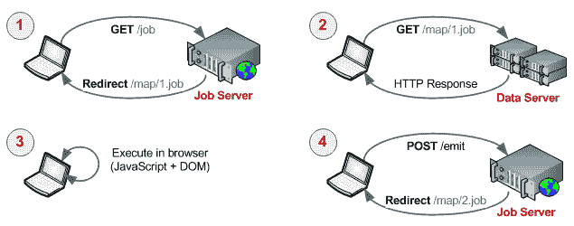

# 协作地图-在浏览器中缩小-igvita.com

> 原文：<https://www.igvita.com/2009/03/03/collaborative-map-reduce-in-the-browser/?utm_source=wanqu.co&utm_campaign=Wanqu+Daily&utm_medium=website>

# 浏览器中的协作地图缩小

由[伊利亚·格里戈利克](/)于**2009 年 3 月 3 日**

在沉浸于分布式计算和大型数据集领域之后，你不可避免地会欣赏到谷歌地图简化框架的优雅。它的*映射*、*发射*和*减少*相位的通用性和简单性使得它成为如此强大的工具。然而，虽然谷歌已经公开了这一理论，但底层软件实现仍然是封闭的源代码，可以说是他们最大的竞争优势之一( [GFS](http://labs.google.com/papers/gfs.html) 、 [BigTable](http://labs.google.com/papers/bigtable.html) 等)。当然，有大量的开源变体( [Apache Hadoop](http://hadoop.apache.org/core/) 、 [Disco](http://discoproject.org/) 、 [Skynet](http://skynet.rubyforge.org/) 等等)，但是人们不能不注意到理论的优雅和简单与痛苦的实现之间的脱节:定制协议、定制服务器、文件系统、冗余，等等！这就引出了一个问题，我们如何降低壁垒？

## 大规模协作计算

经过几次迭代、错误的开始以及与迈克尔尼尔森的精彩对话之后，一个明显的闪光点出现了: **HTTP + Javascript** ！如果您只需将浏览器指向一个 URL，就能为计算(地图简化)工作做出贡献，那会怎么样？当然，你的社交网络不会介意打开一个背景标签来帮助你处理一两个数据集！

我们可以使用久经考验的解决方案:HTTP 和您最喜欢的浏览器，而不是专注于高吞吐量的专有协议和高效的数据平面来分发和交付数据。碰巧的是，全世界的 Javascript 处理器(每个浏览器都可以运行它)比其他任何语言都多——一个完美的数据处理平台。

据传闻，谷歌的服务器群超过了六位数(并且增长迅速)，这是一个惊人的机器数量，但是召集一百万人贡献他们计算时间的一部分有多难呢？只要准入门槛低，我觉得一点都不牵强。诚然，计算的效率会低得多，但我们将有一个更大的潜在集群，这将使我们能够解决以前无法解决的一整类问题。

## 浏览器中的客户端计算

除了存储和分发数据，任何作业最昂贵的部分是 CPU 时间。然而，通过将数据分割成小的和可管理的块，我们可以很容易地构建一个基于 HTTP 的工作流，让用户的浏览器为我们处理这些:



整个过程由四个简单的步骤组成。首先，客户机通过向跟踪计算进度的作业服务器发出请求来请求加入集群。接下来，作业服务器分配一个工作单元，并将客户机重定向到一个包含数据和 Javascript map/reduce 函数的 URL。下面是一个简单的分布式字数统计示例:

```
<html>
  <head>
    <script type="text/javascript">

      function map() {
        /* count the number of words in the body of document */
        var words = document.body.innerHTML.split(/\n|\s/).length;
        emit('reduce', {'count': words});
      }

      function reduce() {
        /* sum up all the word counts */
        var sum = 0;
        var docs = document.body.innerHTML.split(/\n/);
        for each (num in docs) { sum+= parseInt(num) > 0 ? parseInt(num) : 0 }
        emit('finalize', {'sum': sum});
      }

      function emit(phase, data) { ... }
    </script>
  </head>

  <body onload="map();">
    ... DATA ...
  </body>
</html>
```

一旦页面被加载并且 Javascript 被执行(随着 [Javascript VM](http://ejohn.org/blog/javascript-performance-rundown/) [wars](http://code.google.com/p/nativeclient/) 执行的越来越快)，结果被发送回(POST)到作业服务器，并且循环重复直到所有的作业( *map* 和 *reduce* )被完成。因此，加入集群就像打开 URL 一样简单，分发由我们久经考验的 HTTP 协议处理。

## Ruby 中的简单作业服务器

最后一个缺失的部分是协调分布式工作流的作业服务器。事实证明，在 Sinatra web 框架的帮助下，只需要 30 行 Ruby 代码:

```
require "rubygems"
require "sinatra"

configure do
  set :map_jobs, Dir.glob("data/*.txt")
  set :reduce_jobs, []
  set :result, nil
end

get "/" do
  redirect "/map/#{options.map_jobs.pop}" unless options.map_jobs.empty?
  redirect "/reduce"                      unless options.reduce_jobs.empty?
  redirect "/done"
end

get "/map/*"  do erb :map,    :file => params[:splat].first; end
get "/reduce" do erb :reduce, :data => options.reduce_jobs;  end
get "/done"   do erb :done,   :answer => options.result;     end

post "/emit/:phase" do
  case params[:phase]
  when "reduce" then
    options.reduce_jobs.push params['count']
    redirect "/"

  when "finalize" then
    options.result = params['sum']
    redirect "/done"
  end
end

# To run the job server:
# > ruby job-server.rb -p 80
```

就是这样。启动服务器并在浏览器中键入 URL。其余的都是完全自动化和易于并行化的——只需要更多的浏览器就可以了！添加一些负载平衡，一个数据库，它可能只是足够疯狂，它可能实际工作。

第二部分，包括来自社区的注释和评论:[协作/群体计算注释](http://www.igvita.com/2009/03/07/collaborative-swarm-computing-notes/)

**Ilya Grigorik**

是一名网络生态系统工程师，著有《高性能浏览器网络》( O'Reilly ),是 Shopify 的首席工程师

[Twitter](https://twitter.com/igrigorik)

。