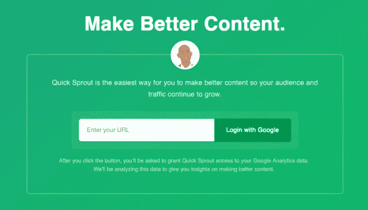
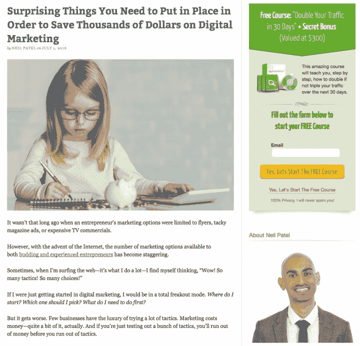
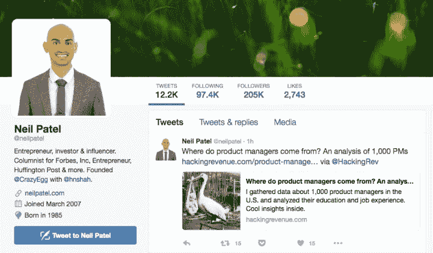
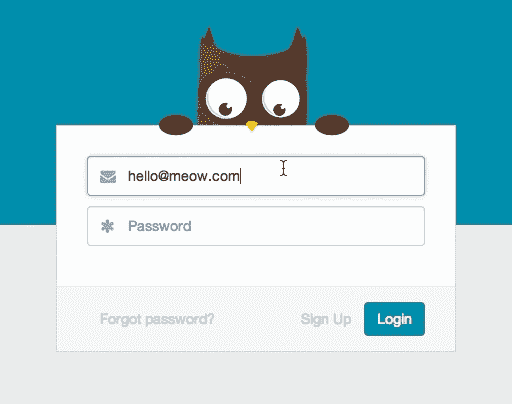

# 如何从无到有建立品牌

> 原文：<https://hitenism.com/build-brand/?utm_source=wanqu.co&utm_campaign=Wanqu+Daily&utm_medium=website>

# 如何从无到有建立品牌

在 Leo Widrich 作为 Buffer 联合创始人的最初几个月，他每天都会写两到三篇客座博文。他于 2011 年 1 月加入该公司，到 4 月份，他已经让他们的品牌出现在超过 100 个博客中。九个月内，他们已经在[注册了超过 10 万名用户](https://searchenginewatch.com/sew/how-to/2194396/how-guest-posting-propelled-one-site-from-0-to-100-000-customers)。

人们把 Leo 做的事情称为“[内容营销](https://hitenism.com/content-marketing-ebook/)”、“客户获取”和“[做不具规模的事情](http://paulgraham.com/ds.html)”，但这忽略了更大的图景。

在短短的九个月里，利奥将 Buffer 打造成了一个有意义的品牌！

## 品牌的重要性

> 当你从一个人的大脑中切割出一部分时，你就建立了一个品牌。

想想为什么亚马逊如此令人上瘾——他们拥有我们大脑的一部分。每当我们考虑购买几乎任何产品时，我们的第一想法是去亚马逊以最低的价格买到它。我知道我可以打开 app，轻点两下，过两天就有我家的了。

在早期，建立品牌意味着你开始获得直接的、无属性的访问者来访问你的网站。这些人访问你的网站没有任何原因，除了你已经在他们的大脑中挖了一小块。他们有一个想法，这促使他们直奔你的网站。

从长远来看，这意味着你的品牌传播开来。因为你在人们的头脑中有空间，人们在想你，这意味着他们会谈论你，告诉你的朋友。

这就是为什么建立你的品牌是如此重要。它让你摆脱“做不可扩展的事情”的单调，让你走向真正的成长。

要从零开始建立你的品牌，你需要两样东西:**新奇**和**重复**。

## 新奇

> 新奇:新的、原创的或不寻常的性质。

自 1999 年以来，37signals 一直在博客上记录他们在做什么，为什么要这样做，以及他们如何考虑建立自己的企业。当他们开始的时候，这是非常不寻常的。没有其他人分享他们如何平衡建筑产品与咨询，或者他们如何为他们的 SaaS 业务做 A/B 测试。

他们是 SaaS 的典型代表，通过分享、教育和帮助他人学习来创造品牌新鲜感。

下面是我们在 KISSmetrics 早期如何定义我们品牌的新颖性:

> 我们会分享任何人和每个人的营销分析内容，只要它是高质量和真正有用的。

我们通过乐于助人来定义我们的品牌，这使得我们的 Twitter 账户成为营销人员了解更多分析知识的首选。随着时间的推移，我们的推特粉丝增加到了 200，000 多人，全部是 100%有机的，没有花一分钱。

下面是 [Leo 如何定义 Buffer 品牌](https://blog.bufferapp.com/5-key-lessons-we-learned-from-pivoting-our-blog)的新颖性:

> 如何在 Twitter 上做好，有缓冲还是没有缓冲？

随着时间的推移，他们用科学的方法对待幸福和生产力，用激进的方法对待公司透明度，为品牌注入了更多的新鲜感。他们能够保持新鲜感并使之持久，因为它来自一个真实可信的地方。

为了打造品牌，不能只讲新奇。你必须把它付诸实践，为人们创造一种新奇的体验。

## 重复

要在某人的大脑中开拓空间，你需要一遍又一遍地进入他们的大脑，直到你在那里停留下来。你需要重复。

“内容营销”中的“内容”是这里的关键:

> 内容可以是推文、脸书帖子、博客帖子或任何可以重复制作和分发的内容。

内容的力量在于它可以扩展，无论是从可以消费单个内容的无限数量的人来看，还是从可以包装和生产内容的无数方式来看。这种规模创造了品牌的重复性。

当 Leo 谈到他的客座博文策略时，他强调了“[选择数量胜于质量](http://www.slideshare.net/leonhard1990/5-key-lessons-learnt-from-2-years-of-content-marketing/2-1_Pick_quantity_over_quality)的重要性换句话说:

> 人们经常高估品牌的实质，低估品牌的重复。

Leo 把内容限制得很窄，完全集中在如何在 Twitter 上做得更好。他把重点放在重复上，写了超过 150 篇客座博文，这使得 Buffer 成为使用 Twitter 最佳方式的权威。

在[快速萌芽](https://hitenism.com/a-new-year-a-new-company/https://hitenism.com/a-new-year-a-new-company/)，我们通过我的联合创始人尼尔·帕特尔建立了一个品牌。我们把他几乎一模一样的照片放在首页、博客的侧边栏、他的推特、他的个人网站等等。所有这些重复加起来会给人留下难忘的印象，并在人们的头脑中开拓出空间。

[T11】](https://i2.wp.com/hitenism.com/wp-content/uploads/img_0543.jpg?ssl=1)

### 更多建立品牌的重复例子

在 **[AdEspresso](http://adespresso.com/)** ，每个团队成员都在喝他或她的团队镜头里的浓咖啡。他们还在脸书和推特上使用相同的照片。

用联合创始人 Armando Biondi 的话说，是“[低强度频率](https://adespresso.com/academy/blog/from-0-to-1-2m-runrate-and-profitability-in-just-5-quarters-9-lessons-learned-in-creating-an-impossible-company/)建立了品牌和信心”，他认为这为他们带来了 0 到 100 万美元以上的年度经常性收入。

[T2】](https://i2.wp.com/hitenism.com/wp-content/uploads/img_0548.jpg?ssl=1)

在 [**自述**](https://readme.io/) ，他们把自己的 [owl 创业吉祥物](https://blog.readme.io/why-every-startup-needs-a-mascot/)放在网站的各个地方，他们在所有的社交媒体和与客户的交流中使用它，他们的办公室里到处都有。他们也使它变得有趣。

对于创始人 Greg Koberger 来说，这种重复意味着“我们的客户现在知道 Owlbert，但更重要的是，他们知道我们公司有点不同。”

## [T2】](https://i0.wp.com/hitenism.com/wp-content/uploads/img_0549.jpg?ssl=1)

## 建立品牌的最佳方式是从你开始

当你从零开始，你就是你能为你的企业建立的最好的品牌。这是一本让像杰森·弗里德、尼尔·帕特尔和利奥·维德里奇这样的人从零开始建立个人品牌和公司品牌的剧本。

*   新奇感是基于激励你创业的东西。
*   早期，**重复**很容易，因为你可以对你自己和你的故事重复。人们喜欢故事，他们总是想知道你为什么创业。

当你这样做的时候，你会把你的集体部落聚集在你周围，你会开始坐在人们的头上。通过重复和保持新鲜感，你可以开拓出越来越多的空间。

在你意识到之前，人们已经在行为上考虑你和你的生意了。因为他们在想你，他们在谈论你，和他们的朋友分享你的产品。

建立品牌不仅仅是分发印有你商标的免费赠品。而是创造故事。你的产品和你的公司的存在是为了给你的客户提供工作并帮助他们成功。

如今，SaaS 的工具和产品比以往任何时候都多。对于每一项需要完成的工作，都有大量的工具来填补这个空间。最终，你的品牌是你的公司和你的产品在客户心目中的区分。为了在当今拥挤的市场中竞争，品牌是你需要关注的。

### *相关*