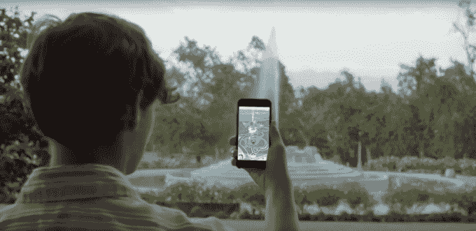

# 神奇宝贝 Go TechCrunch 的卓越机制

> 原文：<https://techcrunch.com/2016/07/11/the-brilliant-mechanics-of-pokemon-go/?utm_source=wanqu.co&utm_campaign=Wanqu+Daily&utm_medium=website>

如果你还没有看过，当你走在街上的时候，你很快就会看到了。你遇到的每一个热切地看着手机的人都可能正在玩这个国家最热门的游戏:精灵宝可梦 Go。

你可能认为它受欢迎是因为它的品牌。任天堂拒绝在智能手机上制作精灵宝可梦游戏的时间最长，最终屈服了，并将其心爱的特许经营权带到了小屏幕上。但在这一切中可能被忽略的是，尽管有无数的错误和无尽的服务器中断，游戏本身的设计非常好。如果你观察游戏循环的所有方面——参与度、留存率、病毒式传播和货币化——它几乎囊括了一切。Niantic 在游戏发展的每一个教科书式的点上都成功地打出了一个非常罕见、异常的本垒打。

这不是一件容易的事。iPhone 历史上只有少数游戏取得了类似的成功。最接近的类比可能是《《我的世界》》和《糖果粉碎传奇》,这两部电影不仅登上了 App Store 下载排行榜的榜首，还登上了票房排行榜的榜首。神奇宝贝——很像之前的《我的世界》——一经推出就登上了排行榜的首位。因此，根据应用商店的排名，它的立即成功不一定是前所未有的。

那么，是什么让这个游戏如此吸引人，而且从我们目前所看到的来看，可能非常容易上瘾呢？让我们把它分解成核心部分。

## 约会

一些最受欢迎的游戏有咬时间游戏环节。但是在 Pokémon Go 中，游戏时间基本上可以是玩家想要多长就多长，因为有一种持续的方法可以通过走到更多的中途站来增加游戏时间。这在游戏中真的很难做到。大多数会议时间被限制在一定的级别，或者用生命或能量来控制。对于 Pokémon Go 来说，有足够的摩擦来激励玩家潜在地付费以减少工作量来延长他们的游戏时间，但也为他们提供了在无需付费的情况下延长游戏时间的能力。

当我想到 Pokémon Go 中游戏环节的结构时，我经常会想到 PlayStation Vita 的一款名为 Persona 4 Golden 的角色扮演游戏。游戏中的整体时间单位是你的角色生活中的一天。根据一天中的时间——早上、下午和晚上——将会话分成小块，保存点分布在游戏的大部分区域。游戏的战斗部分也被分成不同的等级，玩家可以选择在任何时候离开地牢来保存游戏并结束游戏。与 Pokémon Go 一样，游戏的会话时间基本上可以延长到玩家想要的时间，同时仍然保持游戏的基本机制不变。在 Persona 4 Golden 的情况下，这种摩擦是不必要的，因为玩家已经购买了游戏，但对于 Pokémon Go 来说，它执行得非常好。

与其他设计精良的流行手机游戏一样,《精灵宝可梦 Go》提供了一个快速升级的游戏，该游戏提供了大量前期奖励，以吸引玩家进门并随手关门。抓住他们的注意力很重要，但也有多层奖励让玩家想留在游戏中。你可以收集物品来增强你的神奇宝贝的力量并进化它们，但是提升你自己的角色也很重要。游戏中有不同层次的货币沿着不同的时间曲线前进，每一层都有自己的速度和风格。通过这种方式，玩家可以在游戏的不同增量中获得奖励，而不会感到陷入了所有东西都在同一时间升级的困境。

在整个游戏过程中，游戏必须保持开放。这让你不会分心，转而使用其他应用程序。我发现自己在走路的时候会把手机放在口袋里，但是在戴着耳机的时候游戏会经常打开。每当有钟声响起，我就从口袋里拿出手机开始玩——无论是收集神奇球还是试图捕捉新的东西(或者为了体验而玩一些蹩脚的垃圾神奇宝贝)。游戏世界是充满活力和美丽的，使它看起来很容易和有趣。它充满了视觉刺激的天赋和闪光，标志着游戏的新元素。所有这些都让玩家想让他们的眼睛——或耳朵——粘在他们的手机上，随时准备在新的事情发生时使用它。

所有这些都是伟大的设计，甚至没有提到神奇宝贝已经建立起来的品牌资产。任天堂已经卖出了近 6000 万台 3DS。仅《神奇宝贝 X》&Y[一家的总销售额就接近 1500 万](https://www.nintendo.co.jp/ir/en/sales/software/3ds.html)。对于所有支持神奇宝贝的设备来说，这是一个令人难以置信的接近 25%的渗透率。如果任天堂在全球拥有近 25 亿部智能手机的情况下勉强达到这个数字(根据统计数据[，这就代表了一个惊人的安装基数。](http://www.statista.com/statistics/371889/smartphone-worldwide-installed-base/)

神奇宝贝已经是一个世界范围的现象，仅此一点可能就足以让玩家接触到其他玩家，并有机地听到它。Pokémon Go 目前也只支持最初的 150 个 Pokémon，这挖掘了玩家等待了近十年的未开发的怀旧情绪。

## 保留

一系列用户生成的游戏体验对于建立强大的保留是至关重要的，所有的部分都已经内置到 Pokémon Go 体验中。每个捕捉环节都是独一无二的——神奇宝贝球的角度不同，神奇宝贝的位置也不同，而且还有机会获得与现实世界相关的独特体验。你可能在你的脸书页面上看到过神奇宝贝坐在别人头上或腿上的截图。每个捕捉时刻都提供了一个独特的玩家会话，虽然许多都是相似的，但有一个诱人的机会来拥有一些真正独特的，真正令人兴奋的东西。

游戏中还存在一个用户生成内容的难以置信的粘性部分:实际行走。从理论上讲，玩家的每一步都是独一无二的。现实世界的环境不一样，碰到的人可能不一样，天气可能不一样，或者一天中的时间。游戏中的环境也不同，健身房不断变化，新的神奇宝贝在不同的时间间隔和不同的地方出现。每次步行也积极地让玩家参与到身体活动中，锻炼自然会激发你身体的积极感觉，为游戏体验增添一层额外的乐趣。

这是一个前所未有的流行游戏的新机制。对于大多数游戏来说，用户生成的游戏被限制在一个想象的宇宙中。这是《糖果粉碎传奇》的一个关卡，你可以得到幸运的爆炸饼干。在魔兽世界中，这是一场玩家对玩家的比赛，你会幸运地获得致命一击。这是命运的一轮，你只是着火，并不断得到爆头。但所有这些都发生在一个屏幕内，由一个控制器连接——不管那是一个真正的控制器还是一个触摸屏。

精通曲线也是平滑的——随着时间的推移，你建立了一个强大的神奇宝贝阵列，帮助你在游戏中进一步前进。游戏的结尾，就像普通的神奇宝贝游戏一样，是一个移动的目标，基本上总会有人比你略胜一筹。这给了玩家持续不断的激励，让他们继续沿着掌握曲线前进。

## 活力

同样前所未有的是 Niantic 对游戏的病毒循环的旋转。在 Pokémon Go 中，没有允许您通过邀请或联系朋友来延长游戏时间的功能。事实上，社交图谱在 Pokémon Go 中几乎不存在。相反，游戏中的社交图是现实世界社交图的补充版本的延伸。智能手机所有者看到有人在玩游戏，变得好奇，下载游戏并玩游戏——既与其他玩家互动，又激发其他潜在新玩家的好奇心。其余时间，你会在你的脸书 feed 上查看游戏中发生的事情的截图，或者在你设法抓住那只罕见的神奇宝贝时给朋友发短信。

你可以在互联网上的许多地方读到与 Pokémon Go 相关的人们随机互动的故事。我在旧金山散步时已经经历过这种情况，只是有一辆车经过时，其中一名乘客大喊街上有一个罕见的神奇宝贝(这是一个妙蛙草，供那些密切关注的人使用)。这是 Pokémon Go 体验的桌面赌注，也是让新玩家入门的原因。这种病毒式传播尤其强大，因为它不局限于现有的社交图。整个病毒循环以这样一种方式增强，即现实世界中的非关联互动可以带来新的玩家、下载，然后将该玩家货币化。

这就是为什么我认为这种对病毒循环机制的解释如此迷人，而且会如此成功。以前从来没有一个游戏以这样一种方式立即获得如此受欢迎，它定期与现实世界相交。很多人认为这是一种增强现实体验，在很多方面你都可以这样认为。但这不仅仅是一种用你的相机来玩的体验——这是一种跨越想象的宇宙和现实世界之间界限的体验。我认为应该用混合现实这个词来形容。“增强现实”这个词并没有给游戏足够的信任，因为它能够打破第四堵墙，并不断地让玩家在虚拟世界和现实世界之间移动。

如果 Niantic 决定实现神奇宝贝的其他重要方面，如交易，这也代表着游戏的巨大机会。在没有嵌入社交图的情况下，这款游戏已经变得非常流行。想象一下，如果它开始增加一个额外的玩家互动层，即使这只是发生在现实世界中。

## 货币铸造

难怪这款游戏已经登上了 App Store 最高票房排行榜的榜首。Pokémon Go 的货币化部分有很多内容，但同样，它几乎从每个角度吸引玩家付费。

你可以用更多的神奇球来延长游戏时间。你可以通过获得鸡蛋孵化器来加快你的成长曲线，进一步增加你的潜在神奇宝贝阵列，以进一步在游戏中取得进展。你可以通过购买熏香来提高参与捕获会话的速率。

诱惑模块也是如此，它不仅代表了游戏中的加速进展，也是进入《精灵宝可梦 Go》病毒循环的另一种方式。玩家聚集在各个区域——无论是为了捕捉神奇宝贝，还是为了积累他们的神奇宝贝库存——这增加了新的、好奇的玩家来发现游戏的可能性，而不依赖于应用商店或其他方法，如脸书应用安装广告。付费的用户为整个玩家社区做出了贡献，因为它给其他人带来了好处。

最重要的一点是，与大多数最受欢迎的手机和社交游戏不同，这款游戏是不受限制的。付给 Niantic 和任天堂钱只是让玩家进步更快，但并不妨碍他们整体的进步。玩家有机会以自己的速度在游戏中前进。俗话说，如果你想成功，你仍然需要去中国的慢船。

Niantic 在创造足够的摩擦方面做得非常好，在准确的时刻，它可以捕捉到货币化的机会。玩家不会感到被迫花钱，相反，当他们选择花钱时，他们会得到一种愉快的体验。那些令人瞠目结舌的视觉效果还在继续，他们不停地扔神奇宝贝球，他们不必等着看一些最强大的神奇宝贝游戏。

## 最后的想法

所有这一切共同创造了一个非常强大，粘性和加速的游戏循环，这是帮助游戏以如此令人难以置信的速度增长。但在这一切中还有另一个潜在的线索:在担心蚕食设备或市场其他部分的情况下，坚持特许经营的公司向移动设备扩张是一个好兆头。甚至《最终幻想》也在某种程度上通过《最终幻想记录持有者》进入了移动设备。该公司之前的游戏《Ingress》开创了许多这样的机制。但很难否认的是，Pokémon Go 这种规模的所有这些都让它成为了一种完全不同的体验。

在这款游戏取得巨大成功的早期，任天堂的市值增加了 90 亿美元。对于那些还没有完全进入智能手机生态系统的特许经销商来说，这是一个非常强有力的信号。这样做有一个很好的理由:如果 Statista 的 25 亿台设备的数字是准确的，它提供了如此巨大的机会，以至于它可能非常值得吃掉一些潜在的硬件销售。

这是广告市场在不久前面临的一个转变。谷歌不断受到将其广告收入转移到移动设备的需求的困扰，希望价值较低的广告可以在移动设备上换取更大数量的广告。脸书已经从其移动广告产品中建立了价值数千亿美元的业务。

视频游戏的忠实用户将面临同样的困境:你会为了智能手机用户的巨大数量而放弃硬件和游戏机的销售吗？当马里奥出现在你的手机上时，假设人们仍然会购买你的游戏机，这值得冒险吗？像任天堂这样的公司能提供跨越多种设备的一系列体验吗？在本周《神奇宝贝 Go》的大获成功中，答案是什么？目前看来，答案是肯定的。

唉，没办法把+A+B 混在一起了。快点，Niantic。