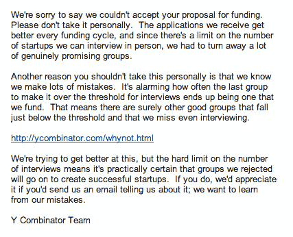
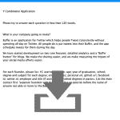

# 参见 Buffer 拒绝的 Y Combinator 应用程序

> 原文：<https://open.buffer.com/buffers-y-combinator-application/?utm_source=wanqu.co&utm_campaign=Wanqu+Daily&utm_medium=website>

当 Buffer 处于非常早期的阶段时，就在产品发布后几个月，我们申请成为久负盛名的 Y Combinator 加速器项目的一部分。

我们被拒绝了。

从那时起，我们就敏锐地意识到，这种经历是许多创业伙伴遇到过的，也是更多人最终将面临的。当 GiveIt100 的首席执行官 Karen Cheng[分享她被 Y Combinator 拒绝](https://medium.com/startup-lessons/135561d84ac6)的故事时，引起了读者的共鸣。拒绝的故事很少被人提起，这就是为什么我们想分享我们的故事。

像许多其他创业公司一样，我们将 Y Combinator 视为终极加速器项目，我们渴望申请。现在回头看看我们的应用程序(其全文出现在下面)，看到我们已经走了这么远真是令人羞愧，看到我们的一些回答也有点尴尬。例如，我们很乐意分享我们应用程序的月收入——来自 45 个付费用户的每月 280 美元。我想知道 Y Combinator 小组对此有何看法！

像 Y Combinator 这样的孵化器正在寻找改变世界的想法，明星云集的团队，或现实世界的牵引力。那时候，我们在这里不合适。但是我们确实收到了一封很好的拒绝信。以下是 Y Combinator 发给我们的内容:

申请这个机会对我和 Leo 来说都非常令人兴奋，但我们已经承诺了一个伟大的产品，不管 Y Combinator 的结果如何。我们明白加速器项目和资金不会让我们的产品变得伟大；我们的成功与我们的努力和想法息息相关。

我们的旅程最终包括了一个孵化器；2011 年 8 月，我们被 Angelpad 录取。随着我们不断申请这样的机会，我们终于到达了一个转折点，我们的产品符合孵化器的愿景和目标。如果你发现自己处于类似的位置，我会鼓励你继续申请。

如果你能从被拒绝的 Y Combinator 申请中学到什么[，我很乐意让你从我们的申请中学习。请看下面我们的申请，并以 pdf 格式](http://www.quora.com/Y-Combinator/Is-there-an-example-of-a-rejected-or-a-not-so-good-YC-application?srid=5gC&share=1)查看[。](https://buffer.com/resources/conteimg/wp-content/uploads/2014/03/BuffersYCombinatorApplication.pdf)

你有拒绝的故事要分享吗？我很想在评论中听到你的旅程。

## Buffer 的 Y 组合子应用

你的公司打算生产什么？

Buffer 是 Twitter 的一个应用程序，它可以帮助人们持续发微博，而不用整天呆在 Twitter 上。人们所做的只是将推文放入他们的缓冲区，应用程序会为他们安排白天的推文。

我们已经开始开发两个核心功能:详细的分析和博客的“缓冲按钮”。我们让分享变得更容易，让衡量你的社交媒体努力的影响变得更容易。

**请用一两句话告诉我们，除了这个创业公司之外，每个创始人建立或取得的最令你印象深刻的事情。**

乔尔:毕业后，我创办了一家创业公司，而不是去找工作。它拥有 6000 名用户，给我上了第一堂真正的创业课。许多错误导致了我如何接近 Buffer。

Leo:我提议商学院建立一个更好的反馈系统，尽管他们事先同意了，但在推出 MVP 直播后，我受到了被踢出局的威胁，因为以这种互动的方式为学生分享数据是不可接受的。

请告诉我们你，Joelg87，最成功地黑进一些(非计算机)系统对你有利的时候。

我在大学应用了 80/20 原则。有一种选择是，你可以通过做比推荐量更多的作业来获得额外的学分。我把日语作为我的额外课程，在我四年的学习中，有三年我以 76%的分数完成了学业，尽管我的平均成绩是 70%。

请告诉我们一个有趣的项目，最好是在课堂或工作之外，由你们两个或更多人一起创建的。如果可能的话，包括 URL。

缓冲区之前没有共享项目。

创始人彼此认识多久了，你们是怎么认识的？有没有哪位创始人没有见过面？

大约两年前，我们在一次企业家交流活动中相遇，从那以后，我们就互相交流想法。

你为什么会选择这个想法进行研究？你有这方面的专业知识吗？你怎么知道人们需要你做的东西？

–我想解决自己的问题，但对其他工具安排推文的方式感到沮丧。

–Leo 在奥地利创建了一家小公司，为 Twitter 的新用户提供学习中心。

–我们有 44 个人按月订阅 Buffer。

你做的东西有什么新的吗？人们求助于什么替代品，因为它还不存在(或者他们不知道它)？

–Buffer 取消了 twitter 用户通常需要采取的两个步骤来安排推文。第一个是设置每条微博的时间。第二个是去你在 Tweetdeck 或 Hootsuite 的账户，以便从那里安排日程。使用 Buffer，你只需点击你正在阅读的页面上的 Buffer 图标，就可以添加更多推文。

–如果用户目前没有使用 Buffer，他们会使用“正常的推文调度”，如 SocialOomph、Hootsuite、Tweetdeck 或其他大约 10 种类似的服务。

谁是你的竞争对手，谁可能成为竞争对手？你最害怕谁？

–目前，我们的竞争对手是上述应用程序。此外，还有 3 个更接近于缓冲性质的应用。他们是及时的，普拉吉奥和 14 街区。

–失去对客户需求的关注，专注于我们最害怕的人是我们最害怕的。

你对自己的业务有哪些了解是其他公司所不了解的？

我们的一位用户给我们发来了这样一条信息:“我非常欣赏贵公司的‘人性化’品质。我们在自己的公司也尝试这样做，原因正是我们喜欢与这类公司打交道。”

我们明白让客户满意是最重要的事情。

你将如何赚钱？你能挣多少？(我们知道您无法准确知道，但请给出您的最佳估计。)

–我们每月赚 280 美元

–我们从免费计划到付费计划的持续转换率为 4%

–通过有计划的推荐和附属计划，我们拥有强大的获取引擎

–我们一直专注于打造一款优秀的产品，没有过多考虑我们能赚多少钱。按照目前的增长速度，月收入在几万美元似乎是非常可以实现的。

如果你已经开始工作了，你工作了多久，写了多少行代码(如果适用的话)？

自 2010 年 10 月以来，我们一直在研究 Buffer。我们有一个功能齐全的产品，我们正在为此欢呼。

If you’re launched, what is your monthly growth rate (in users or revenue or both)?

目前我们有 1500 个用户，其中 45 个是付费用户。这给了我们每月 280 美元的收入。用户数量以每月 400%的速度增长。这是一张图表:

如果您有在线演示，网址是什么？(请不要密码保护；就用一个晦涩难懂的网址。)

[http://bufferapp.com](http://bufferapp.com)

**你将如何获得用户？如果你的想法是一个先有鸡还是先有蛋的问题，也就是说，在拥有大量用户之前，它对用户没有吸引力(例如，一个市场、一个约会网站、一个广告网络)，你将如何克服这个问题？**

我们有 3 个主要来源来获得用户:

–通过博客帖子(我们写了很多关于我们自己产品的评论，并提交给来宾发表或要求被评论)

–计划的转诊方案

–计划的附属计划

如果你已经注册了，你是什么时候注册的？谁是股东，各自拥有多少股份？如果你有融资，有多少，估值是多少？

我们还没有合并。

我们没有资金。

如果你还没有成立公司，请列出你打算给每位创始人的公司股份，以及你打算给其他人的股份。(这个问题对你和对我们一样重要。)

–Joel 在 10 月份创建了 Buffer，Leo 在 1 月份加入。Leo 将在 3 年内拥有 30%的份额。我们想在这方面得到一些建议。

如果我们资助你，哪位创始人会在接下来的一年里致力于这个项目(不上学，不做其他工作)？

两者

在 2011 年 6 月至 8 月期间，是否有任何创始人有其他承诺？

利奥将在六月初完成考试。

**是否有任何创始人对未来有承诺(例如，完成大学学业、读研)，如果有，是什么？**

Leo 从大学毕业后有一年的时间在 Buffer 上工作，直到 2012 年夏天。此后的继续是可选的。

你现在住在哪里？离开 YC 后，公司的总部会设在哪里？

我们现在都住在英国的伯明翰。我们计划把公司搬到美国，YC 之后的硅谷。

请告诉我们你们中的一个人发现的令人惊讶或有趣的事情。(答案不一定要和你的项目有关。)

我们设法给自己制造了一次拒绝服务攻击。我们有一个 Chrome 扩展，可以让人们添加推文，并向人们显示他们的缓冲区中还有多少推文。为了显示数字，扩展每 5 秒钟轮询一次服务器。在几百人安装了扩展后，我们发现服务器几乎停止了。经过一些调查，我们认为我们受到了攻击，甚至开始禁止我们自己用户的一些 IP！很高兴我们不是！

***

(图片鸣谢:[尼尔。](http://www.flickr.com/photos/31878512@N06/4901892610/))