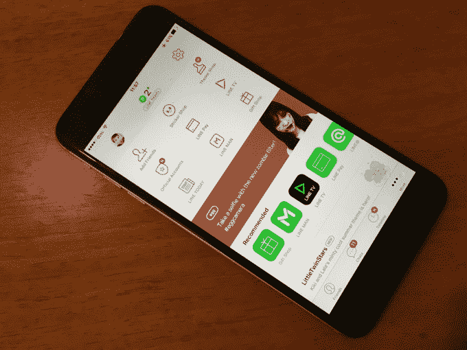

# 理解 Line，2016 年最大科技 IPO 背后的聊天应用 TechCrunch

> 原文：<https://techcrunch.com/2016/07/14/understanding-line-the-chat-app-behind-2016s-largest-tech-ipo/?utm_source=wanqu.co&utm_campaign=Wanqu+Daily&utm_medium=website>

来自日本的移动通讯应用程序 Line 今天将在 T2 上市，这是日美两国的首次公开募股，T4 可能会筹集高达 11.4 亿美元的资金。周四将在纽约、周五在东京上市，这将是今年迄今为止科技公司规模最大的一次上市。

然而，尽管如此，除了绝大多数用户所在的亚洲以外，人们对该公司及其面临的挑战知之甚少。

以下是你需要知道的。

首先，在基本层面上:

*   Line 是一款免费的消息应用，它超越了 WhatsApp 等基本服务，提供贴纸、社交游戏、视频通话和一系列其他连接到该服务的配套应用。

*   它由韩国互联网公司 Naver 全资拥有，该公司在 2011 年日本毁灭性的地震和海啸后开始提供这项服务。Naver 选择了日本，因为它意识到自己无法与韩国占主导地位的聊天应用 Kakao 竞争。Line 拥有近 2500 名员工，其中约 1000 人在日本。

*   Line 报告称，它在全球拥有 2.18 亿月度活跃用户，其中约三分之二位于其排名前四的国家:日本、泰国、台湾和印度尼西亚。

*   尽管 Line 在 2013 年和 2014 年通过大规模广告努力扩大其在欧洲和美国的用户群，但去年它将工作重点重新放在了亚洲和该地区新的增长机会上。

*   Line 目前有超过 35 款应用可供下载，包括其核心的消息应用、面向新兴市场的轻量级版本、社交游戏、日本和泰国的音乐流媒体服务、优步在日本的竞争对手以及卡通应用 Webtoons。它还在其最大的市场提供在线消息应用程序中的支付服务。

Line 没有 WhatsApp ( [超过 10 亿活跃用户](https://beta.techcrunch.com/2016/02/01/whatsapp-hits-one-billion-users-remains-in-search-of-revenue/))、Facebook Messenger ( [超过 9 亿活跃用户](https://www.facebook.com/zuck/posts/10102767482275131))或中国微信([接近 7 亿活跃用户](https://www.techinasia.com/wechat-697-million-monthly-active-users))那样庞大的用户群，但它因开创了一系列消息传递趋势而闻名，尤其是围绕货币化的趋势。

## 强项

2015 年，Line 的总销售额首次超过 10 亿美元，其中 40%以上来自其社交游戏的应用内购买。在线游戏累计下载量达到 6.28 亿次，其中 16 款游戏的下载量至少达到 1000 万次。

该公司拥有非常强大的用户网络。虽然可以说，如此多的活跃用户分布在四个市场是分销有限的一个负面信号，但这也有利于 Line，因为这意味着这些市场的用户比平时更活跃，因为他们的许多朋友和家人都使用 Line 应用程序。

Line 在文件中称，其 61%的月活跃用户每天都在使用该应用，但这一数字在 Line 的四个最大国家跃升至 73%。如此高的参与度让 Line 有机会将其应用转变为一个平台，超越聊天，包括服务和增值，而不仅仅是消息。这对于从消息中赚钱至关重要，因为仅仅将广告投入其中就会破坏用户体验，此外，它还建立了一条护城河，有助于将用户留在 Line 应用生态系统中，而不是竞争对手的应用中。

关于这一点:Line 是即时通讯应用中官方账户的先驱之一。因此，它不是向用户发送垃圾广告，而是让用户接收他们选择追随的品牌的推广信息。脸书对 Messenger 也遵循这一原则，[正如我在](http://thenextweb.com/asia/2014/05/08/chat-app-lines-increasing-revenues-show-twitter-how-it-could-develop-dms/)之前所写的那样， [Line 官方账户可以成为以一种新的、更直接的方式接触消费者并与之互动的强大途径](https://beta.techcrunch.com/2015/01/02/chat-apps-increasingly-important-for-brands/)。

该公司从这种广告模式中获得了可观的收入，占其销售额的 30%——其中还包括公司赞助的贴纸集，以便免费提供给用户。

与此直接相关的是，Line 开创了贴纸的先河。几年前，它们被亚洲以外的许多人视为一种有趣的时尚，但现在几乎每个应用都提供贴纸并从中赚钱。

对许多用户来说，Line 让贴纸变得更有意义，更具交流性，贴纸包的销售额——通常一打或两打贴纸包售价 2-3 美元——约占其总收入的四分之一。 [Line 去年从贴纸销售中获得超过 2.7 亿美元](https://beta.techcrunch.com/2016/06/13/chat-app-line-makes-over-270-million-a-year-from-selling-stickers/)，同比增长 38%。

## 脸谱网

当然，对 Line 来说并非一切都是美好的，该公司面临着一些严峻的挑战，它需要向投资者展示它有能力应对这些挑战。

让我们从房间里最大的大象开始:脸书。

脸书仍在制定计划，将 Messenger 转变为一个能像 Line 一样带来大笔收入的消息平台。—但这显然是 Line 面临的最大威胁。

在这个时代，消息应用几乎不可能“赢得”新市场。回到 2010 年或 2011 年，或许 Line 或其他公司可以通过当地营销、合作伙伴关系、名人等方式大举进军一个国家，以获得关注。

但是时代变了。

用户对消息应用的淘金热已经结束，大多数人都在朋友中选择聊天应用，大量转移这些网络具有巨大的挑战性。没有任何国家改变其消息应用选择的例子。例如，乐天(Rakuten)旗下的 Viber 应用程序是缅甸排名第一的聊天应用程序，只是因为它在 Line 和微信(WeChat)等公司专注于该国之前就已经流行起来。Line 和其他公司投入了大量资金在中国推广他们的应用，但发现很难与 Viber 在中国享有的现有网络效应竞争。

Viber 因在缅甸农村地区有限的 2G 连接上提供优质通话而广受欢迎，但它能够继续统治 supreme，这一事实表明，许多用户已经锁定了一个聊天应用。

然而，脸书是这个规则的例外。

这是因为这个每月拥有 16 亿活跃用户的社交网络保持着大量互联网用户的参与。这包括在亚洲使用 Line 或其他即时通讯应用的用户，尤其是 Line 正在寻求增长的东南亚地区。例如，在泰国，Line 是最大的聊天应用，而脸书实际上拥有更多活跃用户。

未来，当脸书决定在美国以外的国家和 Line 是最大聊天应用的国家以及 Line 认为可以增长的其他市场加强 Messenger 的努力时，这个持续的接触点可能是至关重要的。

正如我前面提到的，目前脸书仍在完善其 Messenger 战略，并非常关注西方，但它的服务覆盖了全球几乎所有的品牌、名人和有影响力的人，而且随着在全球越来越多的国家设有办事处，它可能会将 Messenger 变成 Line 所依赖的市场上的主要竞争对手。

Line 是第一家以脸书为最大竞争对手上市的公司。这是一个机会，大公司可能会有很大的兴趣，希望在信息领域分一杯羹，特别是在像东南亚这样有增长潜力的地方，但这也是一个巨大而明显的威胁。以后看莱恩和脸书对打会很有意思。

## 其他挑战

对 Line 来说，其他更直接的问题包括:

日本是世界上最赚钱的游戏市场，但 Line 近 90%的收入来自日本。几乎没有证据表明泰国、印度尼西亚(以及在较小程度上台湾)可以增长到可观的收入。(问问资金雄厚的电子商务公司 Lazada 就知道，[大大低估了在东南亚赚钱的挑战](https://beta.techcrunch.com/2016/04/14/spiralling-losses-show-lazada-desperately-needed-alibaba-investment/)，而[在资金耗尽](https://beta.techcrunch.com/2016/04/13/alizada/)后需要阿里巴巴的救助。)

*   对手机游戏的依赖

2015 年，游戏占 Line 收入的 40%，是其最大的单项收入。

游戏可以是高收入的，但它也受时尚和趋势的影响。Line 的游戏表现良好，但正如我们过去所看到的，仅仅一款游戏表现不佳就可能拖累该公司的收入。

Line 在一份文件中承认:“从历史上看，我们的大部分移动游戏收入都依赖于少量游戏，我们预计这种依赖将在可预见的未来继续下去。”。

如上所述，当赢家通吃，而你又不是老大时，你很难赢得新市场。鉴于消费者已经在很大程度上选择了聊天应用，Line 或任何其他即时通讯应用公司是否能在新的国家取得重大进展仍有待观察。显然，用户增长对任何上市公司来说都是至关重要的，正如 Twitter 目前的状况所示。

为了对抗脸书，Line 建立了自己的应用和服务网络，以增加与用户的互动，并释放新的收入机会。Line Pay、Line Taxi、Line Music、Line Man(送货)、Line TV，还没有真正实现，当然也不占重要收入。如果 Line 想发展成为一家公司并让投资者满意，这种情况需要改变。

Line 在 2014 年实现了盈利——净利润为 20.04 亿英镑，按照今天的汇率计算约为 1900 万美元——但其在新服务方面的投资导致去年亏损 79.72 亿英镑(7600 万美元)。由于扩张计划仍在酝酿中，它是否会在不久的将来摆脱赤字还有待观察。