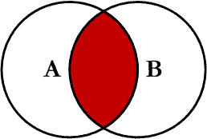
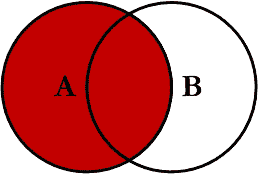
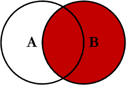
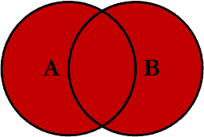
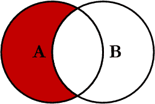
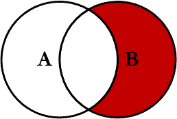
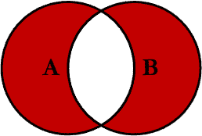
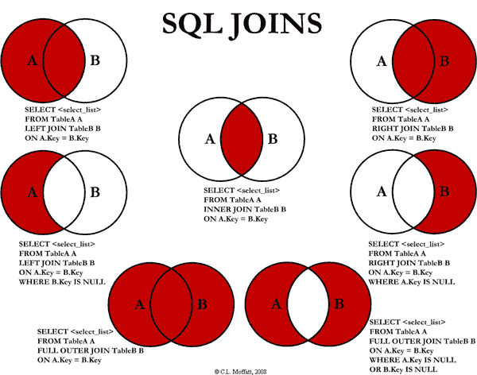

# SQL 连接的可视化表示- CodeProject

> 原文：<http://www.codeproject.com/Articles/33052/Visual-Representation-of-SQL-Joins?utm_source=wanqu.co&utm_campaign=Wanqu+Daily&utm_medium=website>

这只是一篇直观解释 SQL 连接的简单文章。在这篇文章中，我将讨论从两个关系表中返回数据的七种不同方式。我将讨论的七个连接是:内连接、左连接、右连接、外连接、左排除连接、右排除连接、外排除连接，同时提供每个连接的示例。

## 背景

我是一个非常视觉化的人。事情作为一张图似乎更有意义。我在互联网上到处寻找 SQL `JOIN`的图形表示，但是我没有找到任何我喜欢的。有些有很好的图，但是缺乏完整性(它们没有所有可能的连接)，有些简直糟糕透了。所以，我决定创建自己的博客，并写一篇关于它的文章。

## 使用代码

我将讨论从两个关系表中返回数据的七种不同方式。我将排除交叉连接和自引用连接。我将讨论的七个连接如下所示:

1.  `INNER JOIN`
2.  `LEFT JOIN`
3.  `RIGHT JOIN`
4.  `OUTER JOIN`
5.  `LEFT JOIN EXCLUDING INNER JOIN`
6.  `RIGHT JOIN EXCLUDING INNER JOIN`
7.  `OUTER JOIN EXCLUDING INNER JOIN`

出于本文的考虑，我将把 5、6 和 7 分别称为`LEFT EXCLUDING JOIN`、`RIGHT EXCLUDING JOIN`和`OUTER EXCLUDING JOIN`。有些人可能认为 5、6 和 7 并没有真正连接两个表，但是为了简单起见，我仍然将它们称为连接，因为在每个查询中都使用了 SQL 连接(但是排除了一些带有`WHERE`子句的记录)。

#### 内部连接



这是最简单、最容易理解的连接，也是最常见的。该查询将返回左表(表 A)中的所有记录，这些记录在右表(表 B)中有匹配的记录。该联接的编写如下:

```
SELECT *<select_list>* 
FROM Table_A A
INNER JOIN Table_B B
ON A.Key = B.Key
```

#### 左连接



该查询将返回左表(表 A)中的所有记录，而不管这些记录中是否有任何记录在右表(表 B)中有匹配项。它还将从右表中返回任何匹配的记录。该联接的编写如下:

```
SELECT *<select_list>*
FROM Table_A A
LEFT JOIN Table_B B
ON A.Key = B.Key
```

#### 右连接



该查询将返回右表(表 B)中的所有记录，而不管这些记录是否在左表(表 A)中有匹配项。它还将从左侧表中返回任何匹配的记录。该联接的编写如下:

```
SELECT *<select_list>*
FROM Table_A A
RIGHT JOIN Table_B B
ON A.Key = B.Key
```

#### 外部连接



这种连接也可以称为`FULL OUTER JOIN`或`FULL JOIN`。该查询将返回两个表中的所有记录，连接左表(表 A)中与右表(表 B)中的记录相匹配的记录。该联接的编写如下:

```
SELECT *<select_list>*
FROM Table_A A
FULL OUTER JOIN Table_B B
ON A.Key = B.Key
```

#### 左侧排除连接



该查询将返回左表(表 A)中与右表(表 B)中任何记录都不匹配的所有记录。该联接的编写如下:

```
SELECT *<select_list>* 
FROM Table_A A
LEFT JOIN Table_B B
ON A.Key = B.Key
WHERE B.Key IS NULL
```

#### 右排除连接



该查询将返回右表(表 B)中与左表(表 A)中任何记录都不匹配的所有记录。该联接的编写如下:

```
SELECT *<select_list>*
FROM Table_A A
RIGHT JOIN Table_B B
ON A.Key = B.Key
WHERE A.Key IS NULL
```

#### 外部排除连接



该查询将返回左表(表 A)中的所有记录和右表(表 B)中所有不匹配的记录。我还没有必要使用这种类型的连接，但是所有其他的连接，我都经常使用。该联接的编写如下:

```
SELECT *<select_list>*
FROM Table_A A
FULL OUTER JOIN Table_B B
ON A.Key = B.Key
WHERE A.Key IS NULL OR B.Key IS NULL
```

#### 例子

假设我们有两个表， *Table_A* 和 *Table_B* 。这些表格中的数据如下所示:

```
TABLE_A
  PK Value
---- ----------
   1 FOX
   2 COP
   3 TAXI
   6 WASHINGTON
   7 DELL
   5 ARIZONA
   4 LINCOLN
  10 LUCENT

TABLE_B
  PK Value
---- ----------
   1 TROT
   2 CAR
   3 CAB
   6 MONUMENT
   7 PC
   8 MICROSOFT
   9 APPLE
  11 SCOTCH
```

七个连接的结果如下所示:

```
-- INNER JOIN
SELECT A.PK AS A_PK, A.Value AS A_Value,
       B.Value AS B_Value, B.PK AS B_PK
FROM Table_A A
INNER JOIN Table_B B
ON A.PK = B.PK

A_PK A_Value    B_Value    B_PK
---- ---------- ---------- ----
   1 FOX        TROT          1
   2 COP        CAR           2
   3 TAXI       CAB           3
   6 WASHINGTON MONUMENT      6
   7 DELL       PC            7

(5 row(s) affected)
```

```
-- LEFT JOIN
SELECT A.PK AS A_PK, A.Value AS A_Value,
B.Value AS B_Value, B.PK AS B_PK
FROM Table_A A
LEFT JOIN Table_B B
ON A.PK = B.PK

A_PK A_Value    B_Value    B_PK
---- ---------- ---------- ----
   1 FOX        TROT          1
   2 COP        CAR           2
   3 TAXI       CAB           3
   4 LINCOLN    NULL       NULL
   5 ARIZONA    NULL       NULL
   6 WASHINGTON MONUMENT      6
   7 DELL       PC            7
  10 LUCENT     NULL       NULL

(8 row(s) affected)
```

```
-- RIGHT JOIN
SELECT A.PK AS A_PK, A.Value AS A_Value,
B.Value AS B_Value, B.PK AS B_PK
FROM Table_A A
RIGHT JOIN Table_B B
ON A.PK = B.PK

A_PK A_Value    B_Value    B_PK
---- ---------- ---------- ----
   1 FOX        TROT          1
   2 COP        CAR           2
   3 TAXI       CAB           3
   6 WASHINGTON MONUMENT      6
   7 DELL       PC            7
NULL NULL       MICROSOFT     8
NULL NULL       APPLE         9
NULL NULL       SCOTCH       11

(8 row(s) affected)
```

```
-- OUTER JOIN
SELECT A.PK AS A_PK, A.Value AS A_Value,
B.Value AS B_Value, B.PK AS B_PK
FROM Table_A A
FULL OUTER JOIN Table_B B
ON A.PK = B.PK

A_PK A_Value    B_Value    B_PK
---- ---------- ---------- ----
   1 FOX        TROT          1
   2 COP        CAR           2
   3 TAXI       CAB           3
   6 WASHINGTON MONUMENT      6
   7 DELL       PC            7
NULL NULL       MICROSOFT     8
NULL NULL       APPLE         9
NULL NULL       SCOTCH       11
   5 ARIZONA    NULL       NULL
   4 LINCOLN    NULL       NULL
  10 LUCENT     NULL       NULL

(11 row(s) affected)
```

```
-- LEFT EXCLUDING JOIN
SELECT A.PK AS A_PK, A.Value AS A_Value,
B.Value AS B_Value, B.PK AS B_PK
FROM Table_A A
LEFT JOIN Table_B B
ON A.PK = B.PK
WHERE B.PK IS NULL

A_PK A_Value    B_Value    B_PK
---- ---------- ---------- ----
   4 LINCOLN    NULL       NULL
   5 ARIZONA    NULL       NULL
  10 LUCENT     NULL       NULL
(3 row(s) affected)
```

```
-- RIGHT EXCLUDING JOIN
SELECT A.PK AS A_PK, A.Value AS A_Value,
B.Value AS B_Value, B.PK AS B_PK
FROM Table_A A
RIGHT JOIN Table_B B
ON A.PK = B.PK
WHERE A.PK IS NULL

A_PK A_Value    B_Value    B_PK
---- ---------- ---------- ----
NULL NULL       MICROSOFT     8
NULL NULL       APPLE         9
NULL NULL       SCOTCH       11

(3 row(s) affected)
```

```
-- OUTER EXCLUDING JOIN
SELECT A.PK AS A_PK, A.Value AS A_Value,
B.Value AS B_Value, B.PK AS B_PK
FROM Table_A A
FULL OUTER JOIN Table_B B
ON A.PK = B.PK
WHERE A.PK IS NULL
OR B.PK IS NULL

A_PK A_Value    B_Value    B_PK
---- ---------- ---------- ----
NULL NULL       MICROSOFT     8
NULL NULL       APPLE         9
NULL NULL       SCOTCH       11
   5 ARIZONA    NULL       NULL
   4 LINCOLN    NULL       NULL
  10 LUCENT     NULL       NULL

(6 row(s) affected)
```

注意在`OUTER JOIN`上，首先返回内部连接的记录，然后是右侧连接的记录，最后是左侧连接的记录(至少，我的 Microsoft SQL Server 是这样做的；这当然是在没有使用任何`ORDER BY`语句的情况下)。

你可以访问维基百科的文章了解更多信息[这里](http://en.wikipedia.org/wiki/Sql_join "Wikipedia Entry for SQL Joins")(然而，该条目不是图形化的)。

我还创建了一个备忘单，如果需要的话你可以打印出来。如果你右击下图并选择“目标另存为…”，您将下载完整大小的图像。

[T2】](/KB/database/Visual_SQL_Joins/Visual_SQL_JOINS_orig.jpg "Click to enlarge")

## 历史

*   首次发布-2009 年 3 月 2 日。
*   版本 1.0 - 02/04/2009 -修正了备忘单和小错别字。

该成员尚未提供传记。假设它是有趣的和多样的，并且很可能与编程有关。