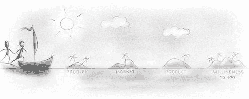
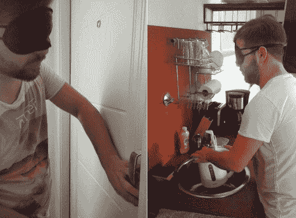
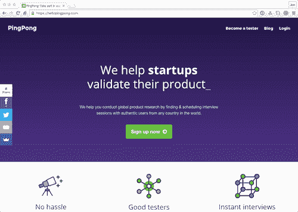
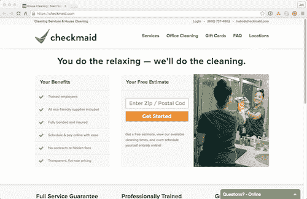
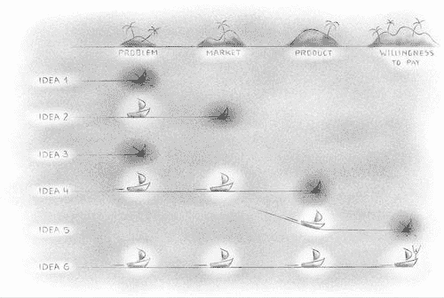

# 产品验证的精益方法——粉碎杂志

> 原文：<https://www.smashingmagazine.com/2016/07/a-lean-approach-to-product-validation/?utm_source=wanqu.co&utm_campaign=Wanqu+Daily&utm_medium=website>

精益验证的整个过程的目标是尽可能晚地延迟昂贵且耗时的编码工作。这是让你保持专注、最小化成本和最大化成功发射机会的最佳方式。

构建产品的最大风险之一是构建错误的东西。你会花上几个月(甚至几年)的时间来建造它，结果却发现你根本无法成功。

在[汉诺](https://hanno.co)，我们一次又一次地看到这种情况发生。这就是我们制作了*精益验证行动手册*的原因。

### 为什么我们要精益

在这种情况下,“精益”意味着你正在快速地弄清楚你将要构建什么，以及你如何用尽可能少的资源来构建它。这些资源可能包括时间、金钱和努力。精益创业方法是埃里克·赖斯倡导的，他通过他的书《精益创业*》极大地影响了我们的工作方式。*

([View large version](https://cloud.netlifyusercontent.com/assets/344dbf88-fdf9-42bb-adb4-46f01eedd629/0c73cbac-c2bb-4e31-bff2-0d5f4016d2fd/image00-lean-approach-large-opt.jpg))

在这份简短的指南中，你将学会如何验证产品是否适合市场，如何与用户交流，如何拼凑原型。目标是确保你的产品想法是可行的，这将节省你的时间和金钱。

在过程结束时，你将能够专注于构建你的产品，相信你有更高的成功机会！

准备好了吗？让我们开始吧。

More after jump! Continue reading below ↓

## 该过程

四个不同的阶段组成了**精益验证流程**。只有当你通过了这四项，你才能确信你的产品创意是值得开发的。

1.  验证问题。
    这是个值得解决的问题吗？如果用户不认为这是一个主要问题，你的解决方案就不会有吸引力。
2.  验证市场。
    一些用户可能会同意这是一个值得解决的问题。但是有足够的数量来构成你们产品的市场吗？
3.  **验证产品。**
    问题可能存在，但你的产品真的解决了它吗？
4.  验证支付意愿。
    可能会有市场需求和很棒的产品。但是人们真的会愿意掏钱包付钱吗？

([View large version](https://cloud.netlifyusercontent.com/assets/344dbf88-fdf9-42bb-adb4-46f01eedd629/ec971ad4-f647-46b2-b4c4-0c5b86ec8e5f/image01-lean-approach-large-opt.jpg))

### 如果一个想法满足所有四个标准呢？

如果一个想法满足所有四个验证标准，那么如果你愿意，你可以自由地直接进入产品开发！但是你可能会选择后退一步。

通过精益验证过程，你肯定会收到来自用户的大量反馈。有了更深的理解，你可能会意识到有更大的机会去解决。在这种情况下，你应该可以随意旋转！

如果你这样做了，你可以用你的旋转和改进的产品想法重复精益验证过程。

无论哪种方式，你都可以确信你在产品开发中采用了一个强有力的想法。

## 验证问题

无论你对产品想法有多自信，你首先需要弄清楚这个问题是否是一个真正需要解决的问题。要做到这一点，你最好的选择就是直接和潜在用户对话。这里的重点是对产品创意进行**定性**验证。

首先，我们从少量适当抽样的有代表性的用户开始，并验证他们是否存在问题。然后，我们[在更多用户和更大规模上优化和验证](https://leanstack.com/pivot-before-productmarket-fit-optimize-after/)这一点。

你从这些面试中学到的东西会给你推进这个想法所需的信心。或者它会告诉你，当你对真正的潜在问题了解得更多的时候，你需要改变这个想法。

下面描述的三种技术可以单独使用，但是它们形成了一套方法，可以更好地描述您正在验证的问题。

([View large version](https://cloud.netlifyusercontent.com/assets/344dbf88-fdf9-42bb-adb4-46f01eedd629/8dcdc189-62f4-4f4b-9b75-4bef7ec87e90/image08-lean-approach-large-opt.jpg))

### 技巧 1:找到五个加入的人

找到至少五个人说他们热衷于使用你假设的产品，这是一个明智的迹象，表明你有一个值得解决的问题。虽然这不一定保证问题确实存在，或者你提出的解决方案是好的或有价值的，但这是开始验证你所发现的问题的最简单的方法。

这里有一个 Rob Walling 的例子，他是电子邮件营销工具 Drip 的创始人:

> “我想找到 10 个人，他们愿意在产品完成后支付一定的金额。这迫使我不去考虑功能，而是将想法提炼到它的核心价值:有人愿意为我的产品付钱的一个原因。我拿着这个给 17 个我认识的，或者至少听说过的人发了邮件，他们可能有着同样的痛苦。通过这种方式，我不仅有了最初的客户，他们可以为我提供关于滴滴应该如何工作的细节反馈，我还拥有了早期的收入基础，我可以用它来开始发展产品。”

如果你能与这些用户建立良好的关系，并掌握他们的联系信息，他们甚至可能愿意成为你的前五个客户。

### 技巧 2:采访用户

通过坐下来和人们交谈，你可能会对你的问题和你的用户有更多的了解。这里的重点是了解你交谈的每个潜在用户的动机和需求，并利用这些反馈来改进产品。

理想情况下，你会希望在面试时面试官和观察者都在场。当访问者与用户交流时，观察者会做笔记。

一些成功面试的好方法包括鼓励参与者分享他们过去的经验以及他们当前的需求和挑战。询问他们过去是如何试图解决这个特殊问题的，结果如何。从个人角度谈论这个问题可以让参与者透露他们的感受，这应该会让你更好地了解他们的动机，并帮助你理解他们的需求。

还有，避免问别人想要什么。人们通常很难确切地分享他们想要什么。对他们来说，告诉你他们想要达到的目标，以及你询问他们背后的动机会更容易。发现这些信息使你能够判断你的产品想法是否满足了特定的需求，或者你是否需要稍微调整它来解决更紧迫的问题。

用户访谈的另一个阻碍是引导性或暗示性的问题。这些问题夹杂着面试官的假设，可能会导致错误的结果。保持问题的公正性和开放性——所以，“你对使用特性 X 有什么印象？”而不是“使用特性 X 导航有多容易？”。我们编辑了[更多关于用户访谈最佳实践的有用提示](https://logbook.hanno.co/7-best-practises-for-better-user-interviews/)。

### 技巧 3:人种学研究

人种学经常被描述为发现未知的过程。在人种学研究中，你扮演无畏的探险家的角色，到用户的自然工作或生活环境中去旅行。这种形式的研究非常适合观察和询问行为(你是做什么的？)，动机(为什么要做？)和认知(你是如何思考自己需要什么，做什么的？).

它提供了很多对上下文的洞察，这是其他更正式的测试技术很难提供的。更多地了解这种情况有助于我们理解它如何影响用户体验，尤其是在实验室条件、受控访谈和测试之外。

这里的关键是发现并捕捉“啊哈！”发现用户动机的时刻。

想象一下，你正在开发一个产品来改善办公室工作人员的人体工程学姿势。人种学研究将是一个有价值的工具，也许比用户访谈更有价值。你可以给自己设定一个目标，去办公室观察“野外”的用户，看看问题是否存在。你也可以参观一系列不同的办公室:创业办公室、共同工作空间以及典型的大公司办公室。

进行人种学研究有助于你了解问题是否真实，甚至可能发现新的问题，这样你就可以改变观点。人种学研究是一个复杂的领域，超出了我们目前所触及的范围。通过[阅读更多相关信息](https://en.wikipedia.org/wiki/Ethnography)，深入了解这种做法。

### 为什么这些方法很重要？

通过关注用户研究，你能够避免常见的陷阱，比如假设你正在处理的问题也是其他人的痛点。我们经常遇到这样的情况，设计师说，“我很像最终用户，所以根据我自己的需求来设计东西是安全的。我想出的任何东西都可能适合其他用户。”请记住，你不是你的用户。因为你离问题太近了，对你来说似乎完美的解决方案对普通用户来说可能是一个糟糕的解决方案。解决你发现的问题也可能意味着你已经花了大量的时间研究这个话题，并且可能比一般人更深刻地理解它。你对手头问题的看法现在是有偏见的，这就是为什么你需要其他用户的输入，以确保你解决的是一个真正的问题，而不仅仅是你头脑中的问题。

## 验证市场

一旦你与用户交谈并确认了问题的存在，你需要确保市场足够大以证明这个想法的合理性。你的用户将来自哪里，市场机会中有多少潜在收入？

通过收集尽可能多的关于潜在市场的信息，你将能够对你的目标受众的规模和你能获得的客户数量做出有根据的猜测。它还会帮助你找出产品可能的定价结构，这在你开始做其他财务预测时会很有价值。

([View large version](https://cloud.netlifyusercontent.com/assets/344dbf88-fdf9-42bb-adb4-46f01eedd629/6581fbdd-e2a4-453c-bcfb-03a2934b88dd/image09-lean-approach-large-opt.jpg))

### 市场应该有多大？

如果你想让产品支持你，那么一个**微型市场**，提供每月几千美元的回报，可能足以满足你的需求。但是，如果你有远大的抱负，想要从这个产品中赚到数十亿美元，成为下一个独角兽创业公司，那么你就需要确保一个大市场的存在。

### “但是我要创造自己的市场！”

的确，有时一个真正创新的产品会创造一个全新的市场。在全食超市出现之前，有机食品市场要小得多。优步通过将技术和人与汽车联系起来，创造了一种全新的按需交通服务。

虽然这是可能的，但要非常小心地假设你自己的想法会经历类似的命运。深入了解和预测市场。毕竟，要让你的产品成功，你最终必须为它找到一个市场。小心行事！

这里有几个工具，你可以用来验证你的产品的市场:

*   [Google Trends](https://www.google.com/trends/) 允许你比较搜索词的相对量。它向你展示了在过去的 12 个月中，每个术语的需求是如何变化的。
*   Google AdWords 的[关键字规划器](https://adwords.google.com/KeywordPlanner)显示了给定关键字的平均每月搜索次数。它也给你一个竞争对手的估计和建议的出价。使用这些数据，你可以估计你的网站使用 Google AdWords 付费广告或通过到达搜索引擎结果的顶部可以带来多少流量。
*   **深入的竞争对手研究**让你了解你未来的竞争对手如何试图解决同样的问题。如果你专注于一个小市场，找到一个竞争对手就足够了。但是如果你专注于一个更大的市场，寻找更多，至少三个。除了寻找直接竞争对手，寻找那些提供类似产品和解决方案的公司。然后，尽可能多地了解他们。抓取他们的资料，阅读他们的博客，寻找媒体报道。了解他们团队的规模、定价结构、财务状况和产品特性。
*   Moz 可以对竞争对手的网站进行内容审计，向你展示他们的关键词排名，以及他们的哪些内容被最广泛地分享。所有这些都将是宝贵的信息。

### “找不到竞争对手怎么办？”

如果你找不到任何竞争对手，那么很可能你在研究中错过了什么，或者你正在研究一个并不存在的问题。然而，也有例外。如果你正在开始一个非常小的利基业务，有可能你还没有任何竞争对手。

在进行竞争对手分析时，另一个需要关注的领域是当市场竞争加剧时，那些试图快速进入新产品或服务领域的公司。虽然这不是当务之急，但大致确定可能会提供与你的产品类似的产品以赢得市场的快速追随者是有好处的。这将有助于你做好准备，并想出一个计划来处理可能出现的情况。

一旦你验证了市场，你就准备好进入有趣的部分:验证产品！

## 验证产品

只有一种方法可以确保你的产品解决你关注的问题:动手做一个原型。

如果你没有太多的技术经验也没关系，你[不需要一个工程师来建造一个伟大的原型](https://m.hanno.co/the-last-thing-you-need-is-a-programmer-4f082ae16ec1#.r9i0c9118)。不要选择昂贵和耗时的原型技术，保持精益。

一旦你建立了原型，你将开始与用户一起运行测试来收集反馈并尽可能多地从他们那里学习。

([View large version](https://cloud.netlifyusercontent.com/assets/344dbf88-fdf9-42bb-adb4-46f01eedd629/9cdc5ed2-a69a-4190-af12-8d152570031e/image02-lean-approach-large-opt.jpg))

### 1.建立一个原型

即使你的最终目标是建立一个漂亮的网站或应用程序，你实际上也不需要写任何代码来验证这个想法。

当你做原型的时候，要有创意！明确你产品的核心是什么，想办法用最简单的方式测试它是否有效。

假设你的产品想法是一种新的硬件和软件设备，帮助视障用户导航他们的家。地理定位和接近传感器将识别用户的位置，振动带将告诉他们需要移动的方向。构建该产品的真实版本将非常昂贵且耗时。

想简单点！你可以在 30 分钟内设计出你的想法，而不需要视力受损的用户来测试。在一次原型制作练习中，我们用该产品的一个非常简单的原型进行了实验:我们蒙住我们一名团队成员的眼睛，通过敲击他的腰部来模拟皮带的振动，从而伪造该产品。这是一个非常简单的设置，让我们对一个产品创意进行基本的初始测试，并获得即时反馈。

([View large version](https://cloud.netlifyusercontent.com/assets/344dbf88-fdf9-42bb-adb4-46f01eedd629/464575b0-364c-48cb-a691-95cf915fd199/image05-lean-approach-large-opt.jpg))

如果您不完全熟悉原型制作，并希望在开始之前了解更多，请查看以下资源:

### 2.与用户一起测试原型

这可能是令人生畏的，尤其是如果你以前没有做过。弄清楚在哪里找到用户以及如何与他们一起运行测试，迫使你将你的产品想法和思考“公开化”。这比在办公桌前研究一个假设的想法要难得多。

一旦您运行了最初的几个测试，您将开始看到测试过程不仅是有价值的洞察力的来源，而且实际上是许多乐趣。

### 忍者用户测试方法

寻找你周围的人作为测试对象是一个很好的起点。理想情况下，在你的目标受众中寻找用户——实际上有视觉障碍的人。然而，在测试的最早期阶段，你可以通过抓住你周围的人并进行简单的测试来获得有用的反馈，就像我们在视觉障碍测试中所做的那样。

一旦你从这些 ninja 测试中学到了更多，并且考虑到你收集的反馈，你可能会对你的产品进行迭代，你就可以对你的目标受众进行更结构化的测试。

### 远程用户测试

如果你在当地社区找不到完美的测试对象，有很多很好的方法可以和用户远程测试。这里有一些工具可以帮助您运行远程测试:

*   [用户测试](https://usertesting.com)通过让用户记录他们在屏幕上使用你的产品的体验，这是一种自动化的、非强制性的采访用户的替代方法
*   一种快速且相当便宜的方式，可以从许多用户那里获得关于你的原型的见解和反应
*   [PingPong](https://hellopingpong.com) 安排 Skype 与远程用户面谈的工具

产品验证的目标，无论是远程的还是亲自的，都是为了确保你的产品以最有效的方式解决了正确的问题。你第一次完全做到这一点是不太可能的——但是这很好！迭代、调整和支点是产品验证过程的自然组成部分，也是为什么原型制作是如此有价值的技术的原因之一。

一旦你开始通过测试原型从目标用户那里收集强有力的积极反馈，就该进入精益验证过程的最后阶段了。

## 验证支付意愿

有许多方法可以验证支付意愿，但其中一个巨大的挑战是，我们不一定相信人们的话。我们都知道有些人会说“当然，我绝对会这么做！”但是到了承诺的时候又会退出。我们希望尽可能地让人们用金钱来兑现他们的承诺。

([View large version](https://cloud.netlifyusercontent.com/assets/344dbf88-fdf9-42bb-adb4-46f01eedd629/4d72cbc1-0a73-4ef4-9a04-e54db01c5218/image04-lean-approach-large-opt.jpg))

### 如何建立一个验证网站

单页网站对于验证来说已经足够了，尤其是作为第一步。但是，如果你想逐步迭代，增加更多的页面和内容，以增加保真度和了解更多，这也是一种选择。

如果你是技术人员，你可以自己设计和编码，但是大多数用户最好使用模板网站生成器。

以下是一些构建验证网站的好方法:

*   Squarespace 有一些非常好看的设计。
*   Webflow 允许大量定制，适合设计单页网站。
*   QuickMVP 是一套有用的工具，用于创建登录页面来验证想法和产品。它简化了创建登录页面、设置广告和收集统计数据的过程。

你肯定想在你的简单网站中包含一些元素:

*   简单明了地解释你的产品的功能。
*   突出产品的独特卖点。
*   解决用户在测试过程中的任何关键问题。如果他们担心安全性、性能或舒适度，请解释您的解决方案。
*   添加直接行动号召，将用户带到网站的结账和支付部分。这应该是清晰明确的——就像“99 美元立即购买！”
*   确保支付页面有一个电子邮件收集表单，这样你就可以收集潜在客户的地址。MailChimp 是个不错的选择。
*   你应该给他们看一个“抱歉”的页面，解释你为什么要做这个实验，而不是确认用户的订单。这样，他们就不会对收到产品抱有错误的期望。
*   在网站上运行分析，跟踪人们如何与它互动。[谷歌分析](https://analytics.google.com/analytics/)简单免费。

一旦验证网站建立并运行，你需要增加它的流量。在你的朋友和家人中做这件事要小心一点。你不想落入收集假阳性的陷阱，这些人报名只是因为他们认识你个人。

给一个认证网站带来公平流量的最好方法是花一点钱在[脸书广告](https://www.facebook.com/business/products/ads)或者简单的[谷歌广告](https://www.google.com/adwords/)活动上。

你可能需要在广告上花费 100 到 500 美元来吸引足够多的用户来验证这个页面。这种开销听起来可能很昂贵，这就是为什么我们把这个验证阶段留到最后。请这样想:100 到 500 美元远比花费数千美元构建实际产品更安全、风险更低。另外，如果产品创意很强，这笔钱就不会浪费。你将建立一个感兴趣的用户的大名单，当产品真正发布时，他们可能会注册。

[脸书](https://www.facebook.com/business)和[谷歌 AdWords](https://www.google.com/adwords/) 拥有强大的定位能力，让你向合适的受众展示你的解决方案，这些受众是你在“验证问题”阶段就已经确定的。您还可以通过考虑初始广告中的数据来进一步优化您的广告，例如点击数、收到的点赞数和分享数以及参与广告的人的位置。在脸书或谷歌 AdWords 上发起广告活动非常简单。我们不会在这里介绍设置广告的步骤，但是[一些](https://www.google.com/ads/new/step-by-step-adwords.html) [谷歌搜索](https://blog.bufferapp.com/the-complete-guide-to-getting-started-with-facebook-ads)应该可以让你快速创建一个广告活动。

我们建议密切关注几个指标:

*   [转化率](https://www.smashingmagazine.com/2009/05/optimizing-conversion-rates-its-all-about-usability/)有多少访问者试图购买该产品？
*   **总“销售额”**了解这些销售额来自哪里(地理位置)。
*   **弃车率**。在真实的在线商店中，这通常在 60%到 80%之间( [68%是平均值](https://baymard.com/lists/cart-abandonment-rate))。这意味着几乎 10 个人中有 7 个人没有完成结账流程。

为了更深入，我们还提出以下建议:

*   [A/B 测试](https://www.smashingmagazine.com/2010/06/the-ultimate-guide-to-a-b-testing/)尝试不同的标题和内容，看看它们如何影响转化率。然而，只有当你的网站吸引了成千上万的访问者时，你的发现才具有统计学意义。
*   **与顾客交谈**。一旦你收集了某人的电子邮件地址，你就可以给他们发送消息和时事通讯，并解释你的产品是如何发展的。但是你也可以直接接触他们，问他们几个问题来了解他们的需求和动机。

### 从礼宾服务开始

礼宾服务的基本原则是，在实际构建任何软件之前，您将伪造服务并手动完成每个订单。

考虑现实世界中的另一个例子。假设我们构建了 [PingPong](https://hellopingpong.com/) ，来帮助用户收集反馈和进行采访。产品背后的技术并不复杂，但是为了推出一个强大的产品，还是需要在设计和开发方面进行大量的投资。一个成功的产品需要大量的工作，但在这个早期阶段，我们仍然有很多关于用户真正想要什么的未经验证的假设。

我们将走礼宾路线，而不是全力以赴，建立一个用户可以直接注册并使用的服务。因此，付费客户现在注册的唯一方法是让他们同意我们将手动完成他们的订单。最终，该产品将接管并自动执行这些任务。当然，总有这样的风险:人工服务无法满足需求，你将不得不拒绝客户；虽然这是你要解决的另一个问题，但请放心，你已经碰到了一个关键问题。

这可能感觉像是一个巨大的时间承诺，但事实上它导致了许多重要的学习。我们将在开始时手动运行服务，并与最初的几个客户建立深厚的关系。因为我们与他们进行了大量的沟通，我们会询问他们关于他们的需求和期望的问题，然后在我们构建完整的产品之前，利用他们的反馈来微调我们的业务模式。这是一个很好的方式来验证用户愿意支付什么，并最大化用户价值。

作为一个奖励，当门房意味着你可能从第一天就开始赚钱！

### 欺骗登录页面

不被那些不准备为你的产品付费的人叫出来的最好的方法是建立一个欺骗营销网站。

这种技术可能会让人觉得有点误导。但是只要你没有拿别人的钱去买你不会交付的东西，人们通常会理解你的动机。

以 [Check Maid](https://checkmaid.com) 为例，这是一个寻找和预订家庭清洁服务的在线服务。当这个团队第一次创建他们的网站时，它背后并没有真正的商业。正如创始人亚历克斯·布罗拉所说:

> “我们实际上验证了[这个想法]，没有任何清洁工来做清洁工作。我们提供了一个网站、一份预订表格、一个电话号码，并通过谷歌和必应(Bing)投放了一些(点击付费)广告，看看如果我们真的有清洁工，转换率会是多少。”

使用欺骗登陆页面验证支付意愿绝对是你需要小心的事情。如果你做错了，你可能会损害你的品牌，给用户带来巨大的挫败感。

关键是展示你的营销内容，并显示一个可见的“注册”或“立即购买”链接。当用户点击该链接时，您将显示一条消息，解释为什么该服务还没有运行，并为他们提供输入电子邮件地址的选项，以便在您启动时接收更新。此外，一个好主意是奖励这些早期用户，告诉他们作为早期支持者有权享受折扣或其他奖励。

我们建议**不要超过存储用户的电子邮件地址**(这样你以后可以联系他们)和可能的他们的大概位置(如果这与你的产品相关的话)(以衡量地区需求)。让他们**在流程中尽早**意识到产品不可用。许多法律，尤其是欧洲的法律，禁止误导性广告——小心不要以误导的方式接受付款或敏感的个人信息。

如果你想避免一个欺骗的登陆页面，你可以选择礼宾路线，这在道德上不那么敏感，通常也是一个不错的选择。

## 验证几个想法

现在你知道了如何验证一个产品创意，让我们看看你如何探索几个产品创意。

([View large version](https://cloud.netlifyusercontent.com/assets/344dbf88-fdf9-42bb-adb4-46f01eedd629/9fc7bec9-e959-4426-8161-c5a8379db8c2/image06-lean-approach-large-opt.jpg))

让我们考虑一下，当我们将上述六个伟大的想法付诸精益验证流程时，它们的表现如何:

1.  这个想法在第一个障碍时就失败了，因为我们无法验证这个问题。
2.  这个想法验证了问题，但不能建立市场。
3.  这一个也不能验证这个问题。
4.  这验证了问题和市场，但没有验证产品。
5.  这是理念 4 的一个支点。也许我们的第一个原型失败了，所以我们决定建立一个新的。这一次，我们可以从错误中吸取教训，采取不同的方法。这种想法验证了产品，但未能验证支付意愿。
6.  这最后一个想法验证了所有四个阶段。在这批想法中，这是我们应该进一步探索和发展的。

正如你将看到的，你的许多伟大的想法会在过程的早期失败。发现你试图解决的问题并不是用户真正困扰的问题是非常普遍的。但是通过坚持不懈的努力和反复，你最终会想出一个产品创意。

您可能会注意到，验证每个阶段的概率相当低。你可能需要微调你最初的想法来解决你发现的一个更紧迫的问题。这绝对没问题。事实上，这是被鼓励的。如果做得对，灵活变通并保持开放的心态会给你带来丰厚的回报。这就是为什么这个精益验证过程会在你过于依赖这个想法或产品之前，让你很快失败，很快失败。

请注意，上述标准及其排序都是简单的推荐准则。最终目标是尽可能瘦，而你是最有资格决定这意味着什么的人。

## 下一步是什么？

即使你通过了验证，你的产品也不能保证成功。验证的过程只是开始。但是如果你已经完整地完成了这个过程，并且完成了所有的阶段，你会处于一个更好的位置。

精益验证过程的目标是尽可能晚地延迟昂贵且耗时的编码工作。这是让你保持专注、最小化成本和最大化成功发射机会的最佳方式。

如果你想了解更多，看看埃里克·赖斯的《创业圣经》， [*精益创业*](https://theleanstartup.com/) 。顾名思义，我们的*精益验证手册*深受精益工作方式的影响。

现在你已经验证过了，你可以开始考虑如何将产品变成现实了。动作要快，但要保持谨慎！继续和你的用户交流，保持流程的精简。我们希望你最终能致力于下一件大事。

祝你好运！

如果你想阅读这篇文章的扩展版本，请查看我们的[精益验证行动手册](https://leanvalidation.hanno.co/)。

### smashing mag 上的进一步阅读:

 (al, il)