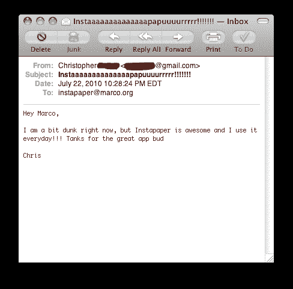

# 电子邮件–Marco.org

> 原文：<https://marco.org/2010/07/22/emails?utm_source=wanqu.co&utm_campaign=Wanqu+Daily&utm_medium=website>

我收到的大部分 Instapaper 邮件分为四类:

1.  “你刚刚毁了我的生活，因为我不知道如何在移动 Safari 中安装 bookmarklet，尽管有一步一步的指导，但我在三个多小时的持续努力中不知何故都失败了。你的应用程序完全没用，你已经让这个世界变得更糟糕了。”
2.  “我喜欢 Instapaper，但如果你从我最喜欢的其他服务中添加这 17 项功能，那就太好了，这些功能显然都值得添加，这些服务与 Instapaper 完全不同。”
3.  “我经营着一个博客或 YouTube 频道，我想评论 Instapaper。你会得到大量的曝光率。请发送一个促销代码以获取评论版，并发送五到十个额外代码以获取赠品。”
4.  “我想与 Instapaper 建立业务关系。我甚至可能是可信的。这里有一面巨大的文字墙解释了为什么我认为这是一个伟大的想法。你这个星期什么时候能亲自见我，谈谈这件事，并雇佣我，拿走我的钱，或者雇用我？”

这对双方来说都是令人沮丧的，因为我对其中的大多数都无能为力。有些人永远得不到足够的帮助，有些人永远不会满意，有些人没有意识到我收到的促销代码请求比苹果给我的还多，一个促销代码从来没有产生足够的“曝光度”，以至于不值得花时间来生成和发送它，有些人没有意识到我在[天](http://www.tumblr.com/about)与他们见面或回复任何电子邮件的时间有多少，这些电子邮件足以证明回复几句话是有道理的。

但偶尔我会收到最好的邮件，这让一切都变得值得:

谢谢克里斯。

◆

