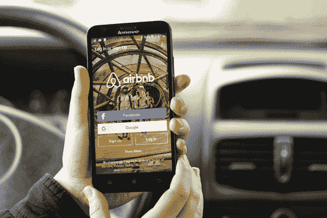

# 优步、Airbnb 和 Etsy 如何吸引第一批 1000 名顾客——HBS 工作知识

> 原文：<http://hbswk.hbs.edu/item/how-uber-airbnb-and-etsy-attracted-their-first-1-000-customers?utm_source=wanqu.co&utm_campaign=Wanqu+Daily&utm_medium=website>

新企业通常很难找到他们的第一批客户。对于共享经济中的初创公司来说，这一挑战甚至更为艰巨，因为它们是连接独立服务提供商和消费者的平台。

以优步为例。它的平台是双向的，将需要乘车的人和有乘车服务的人连接起来。(和 Airbnb 的想法一样，Airbnb 把需要房间的人和房主联系起来。)所以要推出平台服务，这些公司需要在供需双方都找到用户。

> “挖走客户是所有竞争对手都以不同方式做的事情”

哈佛商学院(Harvard Business School)的泰雷兹·特谢拉(Thales Teixeira)表示:“当你有一个双面平台时，你必须同时获得客户和服务。”。

“这是典型的先有鸡还是先有蛋的问题，”他说。二者缺一不可，但你先找到哪一个——顾客的鸡还是服务的蛋？“作为一个小公司，你不可能花同样的精力同时关注这两个方面。你可能需要优先考虑某一方。”

Teixeira 准备在明年春天教授一门关于电子商务营销的新课程，他的目标是找到答案。他研究了三家最知名、最成功的初创公司——优步、Etsy 和 Airbnb——希望找到这些企业如何解决困境的一些共性。

剧透:需要孵化的是蛋。

正如 Teixeira 在一个新的 HBS 案例中报道的那样， [Airbnb，Etsy，优步:获得第一千个客户](http://www.hbs.edu/faculty/Pages/item.aspx?num=50986)，所有这三个平台都专注于首先获得服务，其次是客户。但是有一个问题。“不仅仅是鸡和蛋，你也要选择正确的蛋，”特谢拉解释说。“如果你获得了错误的蛋，鸵鸟出来了，那么你就有麻烦了。小鸡会跑向山丘。”

### 第一课:像顾客一样思考

从一开始，公寓共享网站 Airbnb 的创始人就很清楚，他们需要找到愿意列出自己房子的人，然后才能找到有兴趣入住的人。

 Airbnb expanded its business by finding customers who needed
rooms in cities hosting popular events. *Source: GoodLifeStudio*

“如果你没有房子和公寓的供应，人们不会来，”特谢拉说。问题是，到哪里去找愿意让陌生人住在他们家的人。他们不可能去旧金山挨家挨户敲门。

相反，创始人布莱恩·切斯基(Brian Chesky)和乔·格比亚(Joe Gebbia)像顾客一样思考，试图弄清楚如果 Airbnb 不存在，他们会去哪里。他们很快就找到了答案:Craigslist。企业家们认为，他们可以做得比在线分类网站更好，让公寓更有吸引力，但首先他们必须吸引顾客。为了做到这一点，切斯基和格比亚开发了一个软件，侵入 Craigslist，获取房主的联系信息，然后向他们发送一个在 Airbnb 上列出的信息。

这个策略奏效了。由于没有任何损失，业主找到潜在租户的机会增加了一倍，Airbnb 有现成的房屋供应，可以吸引顾客。

“挖客户是所有竞争对手以不同方式做的事情，”特谢拉说。“如果你是一个网站，你公开向用户提供内容，其他人可以获取这些信息。”不过，他警告称，仅仅拿走别人的客户是不够的——你必须给他们比以前更好的东西。

### 第二课:创造更好的体验

一旦公寓业主上钩，Airbnb 的创始人就意识到他们遇到了一个问题:业主在 iPhones 上为 Craigslist 拍摄的劣质照片对寻找酒店替代品的客户来说永远不会起作用。

特谢拉说:“一个人第一次上 Airbnb，他们会将照片质量与拍摄魅力照片的酒店进行比较。“他们需要在那个水平上竞争。”

为了做到这一点，Chesky 和 Gebbia 做了一件永远无法扩展的事情:雇佣专业摄影师去业主家中拍摄诱人的照片。这一策略奏效了，使该网站比竞争对手更有吸引力，并为摄影树立了一个标准，后来的业主奋起与之匹配，以便与其他房屋竞争。

Teixeira 总结道:“这其中的基本原则是，你应该尽可能帮助你的供应商以最好的方式塑造自己，即使这是不可扩展的。”。“如果没有客户，就没有什么可规模化的。”

拼车应用优步也采取了类似的策略。该公司不是从司机使用自己的汽车的优步池或优步 X 开始，而是从由职业司机驾驶的黑色汽车开始。通过这种方式，他们可以确保客户每次使用该服务时都有很好的体验，然后他们可以依靠客户口头传播这种体验的消息。Teixeira 说:“这就是为什么你首先得到供应方——如果你得到正确的供应商，客户将体验到他们的高质量服务，然后为你做营销。”

Etsy 在寻找合适的鸡蛋来开展业务时，也采取了明显不可扩展的策略。该平台是工艺品供应商的在线市场，以线下战略开始其业务:在全国各地的工艺品展销会上寻找最好的供应商，并向他们推销在网站上开设的在线商店。"他们首先带来他们的顾客，然后他们带来跟随顾客的其他工匠."一旦 Etsy 在网站上有了第一层的工匠，下一层自然会跟随他们。

### 第三课:排序就是一切

优步和 Airbnb 在如何选择扩张方面也很聪明，在正确的时间选择了正确的城市，以取得最大的成功。

由于优步的主要竞争对手是出租车公司，这家初创公司研究了哪些城市的出租车供需差距最大。然后在需求可能最高的时候推出，例如在人们倾向于在外面聚会到很晚的假期。它还在大型音乐会或体育赛事期间开展促销活动，当时大量人群同时都需要出租车，个人可能更有可能选择一家不熟悉的公司优步。

通过这种方式，该公司一举获得了一大批客户。“首先，当需求很高时，他们想出了如何在一个晚上获得一堆客户。然后，他们确保第一批用户有很好的体验，并通过口碑带来下一波客户，”特谢拉说。该公司相信，一旦用户意识到它有多简单，他们开始使用它去上班、购物等等只是时间问题。

Airbnb 的推出遵循了类似的策略，2008 年在丹佛推出，以应对民主党全国代表大会期间酒店空间不足的情况，并在有重大会议或其他活动的时候增加新的城市。

除了显而易见的需求，这种策略还有另一个好处:“你的竞争对手不会把你视为威胁，因为你不会夺走他们的需求，”特谢拉说。当你在市场上站稳脚跟的时候，对他们来说做任何事情都已经太晚了。

在高需求和低供应的情况下启动也有助于初创公司获得正确类型的客户——那些早期采用者可能在公司解决问题时更宽容。毕竟，乞丐不能挑肥拣瘦，如果你感谢在会议期间有一个房间，也许你会原谅没有手巾。一家公司在早期阶段最不想要的就是负面口碑。

“你仍然是一家初创公司，”特谢拉说。“你必须找到愿意接受你的缺点并放你一马的人。满足他们所有的需求和愿望在这个早期阶段是不可行的。”

### 下一课:从 1000 到 10000000

随着早期采用者的到位，公司可以开始考虑如何通过更传统的营销手段来扩大客户群。

为了解决这个问题，特谢拉写了一个后续案例研究， [Airbnb，Etsy，优步:从 1000 名顾客增长到 100 万名顾客](http://www.hbs.edu/faculty/pages/item.aspx?num=51100)，目前正在编写三部曲中的第三部，研究一个平台如何从 100 万名顾客增长到数百万名顾客。

在每种情况下，策略都是不同的。虽然口口相传可能会在第一千年奏效，但不会让你达到第一百万年。“你必须更加主动，控制收购过程，而这是口碑所不允许的。”

这就是数字营销可以发挥作用的地方，让公司以低成本通过搜索广告或社交媒体锁定特定客户。

Teixeira 说:“它具有很强的针对性，你可以以很低的成本做到这一点。”他补充说，数字营销也使公司很容易快速重复其广告信息，调整它以找出什么效果最好。“只有通过了第一百万个客户，你才能进入传统媒体上的广告。这就是你需要大规模的时候，所以你去大众营销。”

随着公司的成长，它必须考虑广告的目的，以便在获得新客户方面取得最佳效果。

Teixeira 说:“有些工具在刚开始的时候更好，有些在你变得更大的时候更好。”“这不是我应该使用数字营销或口碑或电视广告的问题。只有当你说‘我在这个阶段，我应该采取什么方法’时，这个问题才有意义。只有回答了那个问题，你才知道什么工具最合适。"

换句话说，他说，“你需要为巢的每个阶段准备合适大小的蛋。”

*访问泰雷兹·特谢拉的网站*注意力经济学。

### 相关阅读

[也许优步不是上帝给人类的礼物](http://hbswk.hbs.edu/item/maybe-uber-isn-t-god-s-gift-to-mankind)T2】

[工作 3.0:重新定义优步时代的工作和公司](http://hbswk.hbs.edu/item/work-3-0-redefining-jobs-and-companies-in-the-uber-age)

[立体战略:赢得多边平台](http://hbswk.hbs.edu/item/three-dimensional-strategy-winning-the-multisided-platform)