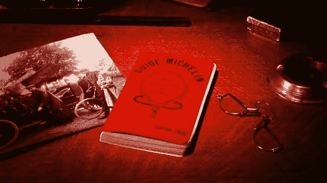
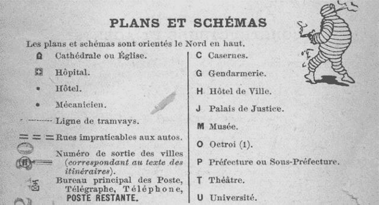
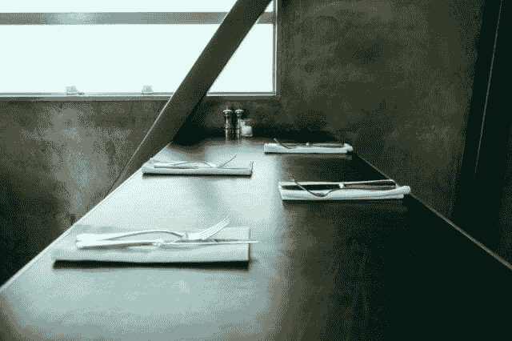
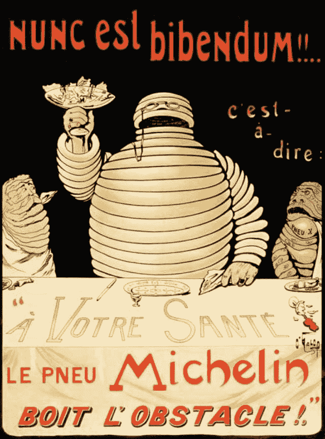
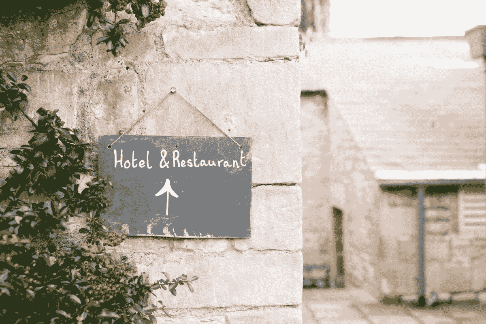
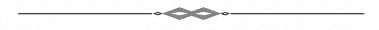

# 为什么一家轮胎公司会发布米其林指南？-价格经济学

> 原文：<http://priceonomics.com/why-does-a-tire-company-publish-the-michelin-guide?utm_source=wanqu.co&utm_campaign=Wanqu+Daily&utm_medium=website>

## 为什么一家轮胎公司会发布《米其林指南》？

[

<noscript></noscript>](http://www.michelin.com/eng/innovation/fields-of-innovation/mobility-solutions/1900-First-Michelin-Guide2) 

每年《米其林指南》出版时，美食家们都会抓狂。

被该公司称为“检查员”的米其林美食评论家在 2016 年只给大约 100 家餐厅授予了米其林三星的最高排名。第一次获得米其林星级的餐厅可能会迎来大批美食游客；失去一颗米其林星对餐馆老板来说是毁灭性的打击。让年轻厨师在他的节目*地狱厨房*中落泪的名厨戈登·拉姆齐，在 2013 年失去两颗米其林星时哭了。

这有点奇怪，因为米其林是一家轮胎公司，其年度报告强调了橡胶成本和乘用车市场的增长。

米其林于 1900 年开始出版《红色指南》,当时汽车和美食旅游都是新奇的奢侈品。它的创造者希望一本提供酒店、餐馆和道路信息的指南能引导人们更多地开车——并购买更多的米其林轮胎。

今天，米其林继续对餐厅进行权威评判，以推广公司的名字。这有点像可口可乐公司在 20 世纪 20 年代创造了奥斯卡颁奖典礼，让人们去看电影，喝更多的苏打水。该指南是否仍在帮助米其林销售轮胎尚有争议，但米其林的所有权有助于其餐厅指南的声誉和权威。

如果米其林指南不是一家不相关的大公司的营销费用，它可能永远不会成为烹饪完美的最终定论。

**创建市场**

曾经有一段时间，人们必须相信汽车是有用的。这就是 1895 年的情况，爱德华和安德烈·米其林兄弟在法国克莱蒙费朗的橡胶公司开发了一种新的汽车轮胎设计。

兄弟俩有一个更好的产品:第一批充气轮胎之一，因为它没有粘在车轮上，所以可以很快更换。为了证明它的价值，兄弟俩赞助了汽车比赛，其中使用米其林轮胎的车手经常以的成绩胜出。

但是法国在 1895 年只有大约 350 辆汽车。赫伯特·洛特曼在《米其林男人》中写道，汽车“仍然是富人的玩具……无法远离可靠的修理厂”。"寻找现实投资的经验丰富的企业家很容易对新生的汽车不屑一顾。"

在这种环境下，增加车手数量——米其林指南的动机——比获得相对于其他轮胎制造商的优势更重要。

该指南于 1900 年首次出版，共 399 页，包含了司机在法国城镇“旅行”所需的全部信息。只有附属于酒店的餐厅被包括在内，它们是被列出来而不是被仔细评级。关于安装和保养米其林轮胎的信息占据了前 33 页，汽车零件制造商的广告占据了另外 50 页。关于几十个城镇的地图和基本信息占了指南的大部分。

<noscript></noscript> 

> 早期米其林指南中的地图图例，米其林人在角落里吸烟。(那是一个不同的时代。)图片来自 Kory Olson 在 Imago Mundi 上发表的“新型游客地图:米其林法国指南”。

对于司机来说，这些信息是必不可少的。那时加油站还不存在，所以司机需要知道哪些药店出售几升装的汽油。司机们需要一年中太阳落山时的时间表，因为高速公路上还没有灯。只有一小部分汽车修理店全年营业，这使得知道哪些在夏末关门变得至关重要。诸如此类的细节将米其林指南与当时的旅游书籍区分开来，后者假设人们乘火车旅行。

米其林兄弟让驾驶变得更容易的努力不仅仅局限于指南。一旦公司员工开始对酒店进行评级，他们就向酒店经营者明确表示，他们应该提供免费停车场。他们还游说政府为驾车者设立路标——爱德华·米其林有时被称为 [和](http://www.newyorker.com/magazine/1954/06/05/the-testing-of-m-thulier) 发明了道路号码，因为他说服政府扩大高速公路上的数字。有时，公司的人会自己竖起路标。

同样，米其林营销的一个主要目标是将汽车作为一种生活方式来推广。1924 年的一则米其林广告宣称:“有了汽车，就没有早上 5 点的火车了”。"有了汽车，家庭生活中有更多享受美好事物的机会."

米其林曾在一篇文章中写道:“我们的行业对汽车的持续进步直接感兴趣，这也是它所依赖的。”。在创建指南的过程中，兄弟俩希望提供信息和基础设施，说服富人购买汽车，在法国各地开车，并购买米其林轮胎。

即使这意味着创建一个完整的指南副业来做这件事。

**【值得一游】**

米其林兄弟并不谦逊。1900 年，在第一本米其林指南的介绍中，安德烈 [宣称](http://www.newyorker.com/magazine/2009/11/23/lunch-with-m#ixzz29X2IhNIo) ，“这部作品问世与世纪；它将持续一样长的时间。”

预测其促销指南将持续 100 年是大胆的。然而，值得注意的是，这是一个低估。

米其林在 1900 年分发了数万份免费拷贝。但是当该公司在 1920 年开始收取大约 2 美元的指南费时，它仍然每年销售 [近 10 万份](https://books.google.com/books?id=g6Slwr81E6IC&dq) 。截至 1953 年，其忠实读者群 [提交了 5 万条评论](http://www.newyorker.com/magazine/1954/06/05/the-testing-of-m-thulier) 以提高指南的准确性。有些人每周都写信。

在此期间，对轮胎保养的关注让位于经典的指南票价。1926 年，米其林创建了地区指南，后来被称为绿色指南，类似于孤独星球和传统的旅行指南。与此同时，红色指南，作为对读者兴趣的回应，侧重于对酒店和餐馆的评论，不同地区和城市有不同的指南。该公司聘请全职评论家，也就是众所周知的检查员，花几个月的时间在路上评选最佳餐厅。好的餐馆在指南中得到了认可；获得米其林一星(“同类中非常好的餐厅”)到米其林三星(“最好的之一，值得一游”)的模范餐厅。

到了 20 世纪 30 年代，红色指南享有国际声誉。《纽约客》对其大加赞赏，并原谅了遍布各处的轮胎广告，因为它们做得“欢快而低调”1952 年，*时代杂志* [称其为](https://books.google.com/books?id=g6Slwr81E6IC&dq) “游客的圣经”，一位著名的法国厨师 [说](http://www.newyorker.com/magazine/1954/06/05/the-testing-of-m-thulier) “法国只有一个导游，米其林。”第一版 116 年后的今天，米其林仍然大张旗鼓地出版红色指南。

[

<noscript></noscript>](https://unsplash.com/photos/XABdwsxRVy0) 

那么，一家轮胎公司是如何成为——为什么它仍然是——烹饪大师的仲裁者呢？

一个先决条件是米其林轮胎公司的悠久历史，这本身就是一个非凡的故事。这家家族公司经历了世界大战和一个世纪的繁荣与萧条，成为世界上最大的轮胎公司之一。(1945 年指南 [哀叹](https://books.google.com/books?id=g6Slwr81E6IC&dq) 有多少“优秀的(法国)厨师坐在德国战俘营里等待回到他们的烤箱。”)

米其林兄弟 30 年的任期是工程师爱德华和营销天才安德烈之间的合作。除了指南之外，安德烈还花钱让报纸开设专栏，描述他的宏伟充气轮胎的传播，巧妙地迎合了法国的民族主义(米其林在德国参加了一场宣传公路赛，公司 [安抚](https://books.google.com/books?id=g6Slwr81E6IC&dq) 的法国读者，以击败德国人)，通过将米其林定位为服务于驾车者及其事业而创建了一个社区，并发明了米其林人，这是一个一眼就能认出来的轮胎堆吉祥物，现在在麦迪逊大道上为星光大道做广告。

Andre 作为政府制图员的背景也有所帮助:他花了七年时间绘制了一些世界上最好的地图，并且在 D 日，盟军带着米其林指南抵达诺曼底，因为它们的质量而闻名。米其林是一家法国公司也是如此。

更重要的是,《米其林指南》对餐馆的评论可能是无耻的精英主义，因为米其林 1900 年针对的轮胎顾客是精英。米其林人今天看起来像棉花糖，但当他被创造出来时，汽车是富人的玩具，他看起来像米其林的顾客:他叼着雪茄，拿着香槟酒杯，戴着夹鼻眼镜。

一份普通的餐厅指南绝不会维持如此挑剔的标准，它只会给整个国家的几十家(或仅仅几家)餐厅授予星级。感兴趣的人的市场太小，不足以支付其成本。然而，《米其林指南》最初只关心那些想了解法国 12 家最佳餐厅的精英，其编辑可以指望米其林市场部支付其成本。

<noscript></noscript> 

> *一张 1898 年的海报，这位米其林男士最初化身为上流社会人士。他的香槟酒杯里有碎玻璃，代表米其林的充气轮胎如何“喝掉障碍物”。29 个经典标志背后不为人知的故事。*T3】

一名记者 [在 1954 年](http://www.newyorker.com/magazine/1954/06/05/the-testing-of-m-thulier) 评论道,《米其林指南》“在商业指南中是独一无二的，因为它把赔钱当成一种美德，并且以每年数万美元的速度赔钱，它以彻底、有辨别力和廉洁而闻名，这也是独一无二的。”尤其是现在，没有人需要购买米其林指南，因为他们可以在美食博客上阅读米其林星级餐厅的名单。

《米其林指南》因没有雇佣足够的检查员对其涵盖的领域进行权威评判而受到批评。但是，当一个典型的旅游指南给一家餐馆四星时，这通常意味着一名员工几年前很快去过，有人最近花了五分钟确保它仍然存在。或者，就像 Zagat 一样，它依赖于客户评论和调查。

你可能相信 Yelp 模型，但大多数百万富翁和世界知名的厨师都不相信。只有米其林能够负担得起在一年内派遣八名检查员去一家餐厅，决定是否给它三星级——这些检查员保持秘密，而不是要求免费用餐，他们(陪同检查员的记者的少数叙述 [表明](http://www.newyorker.com/magazine/1954/06/05/the-testing-of-m-thulier) )识别每种成分，并做一些事情，比如皱着眉头说，“这是一个非常重要的问题。”

像这样花费资源是美食家的梦想。但只有一家对盈利漠不关心的公司才能做到这一点。

**《米其林指南》对米其林有帮助吗？**T3】

《米其林指南》几十年前就实现了米其林兄弟的目标——保障汽车的未来。然而，这家轮胎公司仍在继续印刷红绿指南。

部分原因是销售米其林地图和旅游指南——尽管不是红色餐厅指南——变得相当有利可图。旅游指南在整个 20 世纪都是很好的生意，2007 年，BBC 以2.07 亿美元买下了《孤独星球》。直到 2008 年，大衰退和在线竞争的双重打击才重创了旅游指南的商业模式。2012 年，米其林负责沟通和品牌的副总裁告诉我们，“我们正在努力适应这个新的数字和免费内容的环境。”米其林北美公司的一位发言人表示，该公司和其竞争对手一样，正在发布旅游应用程序，并且做得比你预期的要好。

但是米其林是一家轮胎公司。如果指南继续存在的唯一原因是利润，米其林可能会出售指南业务，而不会继续补贴餐厅指南。

相反，米其林的地图、指南和餐馆评论是促销性的——该公司的首席营销人员 [继续对它们负责](http://adage.com/article/global-news/meet-woman-michelin-man/235309/) 就是证明。旅游业和米其林星级很少在公司的财务文件或投资者介绍中提及。我们无法向米其林确认其地图和指南是否盈利，但米其林北美旅游和休闲部门的发言人 Tony Fouladpour 显然不知道他部门的产品是否赚钱。“这真的被认为是一种投资，”他说。

[

<noscript></noscript>](https://unsplash.com/photos/cwr02zo0gP8) 

那么这是一项好的投资吗？

华盛顿大学营销学教授娜塔莉·米兹克(Natalie Mizik)认为，开展促销活动的价值在于将核心业务与“公司的核心理念”联系起来这通常是一个好策略，因为顾客会将联想从促销活动转移到品牌上。这就是为什么能量饮料制造商红牛赞助极限运动，并在红牛电视上主持直播活动。这也是为什么米其林的旅游指南，以及其更新的 GPS 服务，对米其林这个与旅游知识相关的公司有着重要的推广价值。

2012 年，米其林首席营销官 [告诉](http://adage.com/article/global-news/meet-woman-michelin-man/235309/)*“地图和指南是接近消费者的一种方式。“你每两年买一个轮胎，所以你与该品牌的接近度不是那么高。但是这些指南一年出一次，可以定期使用。这是一种非常令人愉快的与品牌互动的方式。”科罗拉多大学丹佛分校的营销学副教授 Vicky Lane 博士认为，米其林指南是内容营销的先驱，是希望通过流行文章、视频或其他媒体吸引客户和推广品牌的企业的当代流行语。*

 *然而，这位著名的餐厅指南是否真的如此就不太清楚了。“我认为这是一个更不寻常的案例，”米兹克博士说。"如果没有可感知的联系，就不会有效果."

米其林高管显然认为公司与米其林星级之间的联系是有益的；今年， [公司收购了欧洲版 OpenTable 的 Book a Table](http://restaurant.michelin.fr/) ，以补充其在线餐厅搜索服务。米其林轮胎是优质品牌；或许成为美食的权威有助于使其轮胎的高价合法化。

莱恩博士说，她的研究表明，即使是不相关的内容也能帮助一个品牌的核心业务，米其林就是一个很好的例子。但她承认，在这一点上的结论更加模糊，大多数专家建议不要制作无关的服务或内容来推广品牌。

很容易看出原因。米兹克博士是营销专业人士，她承认不知道米其林轮胎和餐厅指南之间的联系。发言人托尼 T2【Fouladpour 说，这是常见的。“你会 惊讶有多少人不知道，”他说。“人们总是告诉我们，‘我们不知道这是同一家公司！’”

这不是人们通常对米其林餐厅指南的争论。相反，人们要么听从它的建议，兴奋地迎接它的出版——要么 [抨击《指南》](http://www.vanityfair.com/culture/2012/11/whats-wrong-with-the-michelin-guide) 古板的法国标准和它释放出的一群美食势利者。

然而，正是这场关于品牌推广和内容营销的辩论，将最终决定米其林星级餐厅和世界上最著名的烹饪指南的命运。因为如果一群营销人员和高管决定不再帮助米其林销售轮胎,《米其林指南》——或者让它兴旺发达的不寻常环境——可能会消失。

我们的下一篇文章是一篇数据驱动的研究，探讨一个城市的非裔美国人与罚款作为政府收入来源之间的联系。 *在我们发帖时得到通知***→*[***加入我们的邮件列表***](https://priceonomics.us4.list-manage.com/subscribe?u=f66f07e4e312263b2c3c8405d&id=6c081361d7) *。****

 ***

<noscript></noscript>* 

**想为 Priceonomics 写稿？我们正在寻找[自由撰稿人](https://priceonomics.com/how-to-pitch-freelance-articles-to-priceonomics/)。**

* * *

* * ****