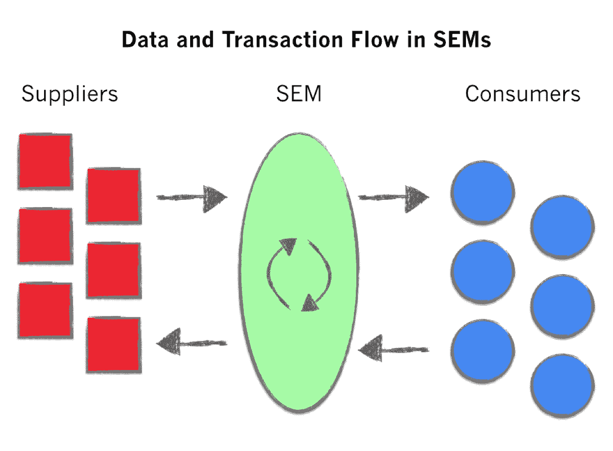

# 数据网络对 SaaS 市场的影响

> 原文：<http://tomtunguz.com/saas-enabled-marketplace-data-advantage/?utm_source=wanqu.co&utm_campaign=Wanqu+Daily&utm_medium=website>

[T2】](https://res.cloudinary.com/dzawgnnlr/image/upload/q_auto/f_auto/w_auto/sems_data_flow.png)

[SaaS 支持的市场](http://tomtunguz.com/software-enabled-marketplaces/)受益于其走向市场的独特优势。他们对自己的市场有一个[全景](https://en.wikipedia.org/wiki/Panopticon)视角，随着时间的推移，这为他们提供了一个不容置疑的竞争优势。

中小企业向供应商和消费者提供软件，然后在他们之间建立市场。第一批中小企业在广告业蓬勃发展。谷歌管理着世界上最大的广告市场之一。他们向出版商提供软件，供应方通过一种叫做 DoubleClick for Publishers 或 DFP 的产品来管理可用的广告库存。此外，谷歌还提供需求端库存系统 AdWords，帮助广告主管理预算。在这两者之间，谷歌运营着一个广告市场 AdX。如今，SEMs 的例子越来越多，包括 StyleSeat(美容)、Zenefits(福利)、Quartzy(实验室管理)、Makeable(制造)、Yardbook(景观美化)、Today(建筑)等等。

因为中小企业将 SaaS 部署到供应方和需求方，所以这些公司可以对其市场有特别的了解。对供应商数据和消费者需求的访问为中小企业提供了四个关键优势。

首先，中小企业了解每一秒的供给/需求曲线。他们知道有多少人在规划景观美化项目，以及在不久的将来可能会有多少园艺师来帮助特定种类的花园设计。因此，如果存在供需不平衡，SEM 可以获得更多的园艺师或更多的房主来平衡市场。

其次，中小企业了解其供应商的卓越运营。托梁可以记录哪些承包商按时按预算完成了他们的项目。这些数据使市场能够积累供应商绩效的普查规模数据，精确到所提供的服务类型。SEM 可以更好地限定和匹配供给和需求。此外，中小企业可以向供应商建议如何提高他们的绩效，例如，为出版商提升广告部门的形象，或者为设计师提供巴西广告。

第三，关于消费者需求和供应商绩效的累积数据组合成一种独特的数据资产，在企业周围建立起一条护城河。市场中第一个成功的 SEM 会识别出最佳类型的消费者和最佳类型的供应商，并在其他人之前追求他们。这进一步推动了市场中已经存在的赢家通吃的动态。

第四，由于对供应/需求的可见性，对供应商优秀的深刻理解，以及识别正确的买方和卖方类型的能力，中小企业受益于更高效的上市。我们在谷歌广泛地这样做了，使用来自 AdSense 的信号来了解获得哪些额外的出版商和广告商。SEM 在需要时获取更多的卖家，在需要时获取更多的买家，与盲目获取相比，提高了营销的效率。这种知情的收购通过在市场中保持最佳的流动性来改善买方和卖方的体验。

一旦站起来，中小企业就是强大的力量。因为它们同时反映了市场的需求方和供应方，所以这些企业积累了独特的数据，从而增强了企业的实力。