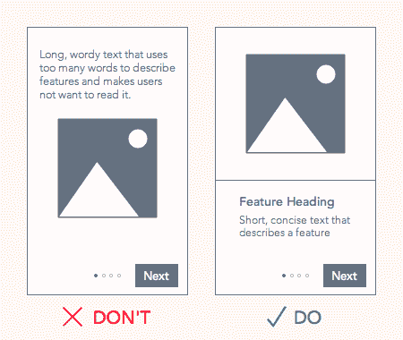
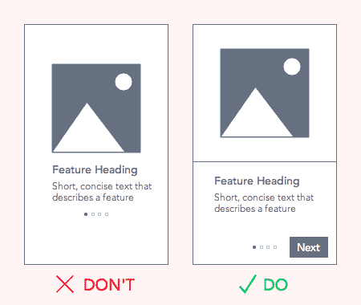
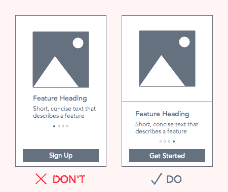
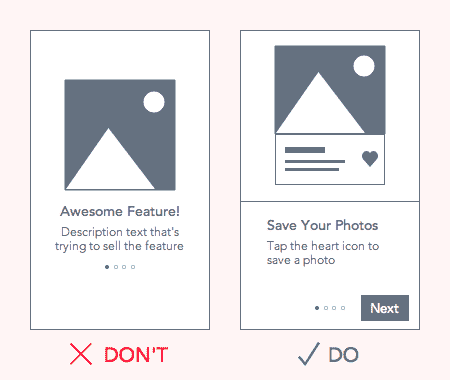

# 如何设计用户将阅读的演练

> 原文：<http://uxmovement.com/mobile/how-to-design-a-walkthrough-that-users-will-read/?utm_source=wanqu.co&utm_campaign=Wanqu+Daily&utm_medium=website>

如果一个应用程序是一个产品，那么演练就是它的使用手册。当新用户第一次打开应用程序时，入门阶段会出现一个演练。在他们开始使用这款应用之前，他们会对其功能有一个大致的了解。这是为了让新用户可以毫无困惑地使用该应用程序。

在你的应用中排除走查会让用户感到困惑。但是，让你的演练难以阅读和导航也会让他们感到困惑。用户最终会跳过它们，这样他们就不必经历这些麻烦。

你的演示应该激励用户去阅读它，这样他们就会知道如何使用你的应用。你可以通过使用清晰的导航提示和使你的文本可浏览来做到这一点。如果用户需要引用它，他们还应该能够再次检索您的演练。所有这些对于用户友好的漫游都是必要的。

## 可扫描文本

可扫描的文本简明扼要。说出你需要说的话，但尽量少用词。使用标题，用几句话概括你的观点。你可以把正文描述放在标题下面，但是要简短。

通过将文本放在导航附近来避免让用户的眼睛过度疲劳。这减少了文本和导航之间的距离，缩短了他们的眼球运动。他们将能够以更少的努力更快地阅读和导航。

<noscript>T3】</noscript>

## 清除导航提示

一些设计者将导航按钮排除在他们的漫游之外。相反，他们只会显示分页点，并期望用户滑动。用户不仅很容易错过这么小的视觉提示，而且圆点表示滑动也不直观。

不要强迫用户弄清楚如何导航。使用清晰的导航提示，比如带有“下一步”标签的按钮，这样用户就不会对如何导航有任何疑问。按钮很直观，每个用户都能理解。你仍然可以允许用户滑动来导航，但也要确保有一个按钮。

<noscript>T3】</noscript>

## 以行动号召按钮结束

将行动号召按钮放在演练的开始并不是一个好主意。这将诱使用户跳过您的演练。大多数用户会跳过它，因为他们会觉得不需要它。但是如果他们跳过帮助页面，很可能会让用户感到困惑。

把你的行动号召按钮放在最后，这样你就不会让用户选择跳过它。从长远来看，这是一个对用户更好的更合理的预期流程。

<noscript>T3】</noscript>

## 图像应该显示如何使用应用程序

一些设计师会在他们的漫游中通过吹捧他们的功能来不断地向用户推销。一旦用户下载了你的应用，就没有必要再在上面卖了。相反，他们需要知道如何使用它。您的图像应该显示用户界面，并指出用户需要点击或滑动来使用某个功能。

<noscript>T3】</noscript>

## 可检索演练

用户完成演练后，可能仍需要返回并引用它。您应该在导航菜单中放置一个指向该演练的链接，以便用户可以轻松地检索该演练。你可以给链接贴上标签:旅游、教程或操作指南。

## 在公园里散步

阅读和导航起来很痛苦的演练是用户总是想跳过的。但是如果你把你的文章写得简短有用，他们会很容易看到。

演练不是帮助和支持页面。这是帮助用户入门的功能的快速概述。有关如何使用该应用程序的详细信息，请访问帮助和支持页面。

人们跳过说明书的一个原因是因为阅读时间太长，而且很难理解。虽然一个演练指导用户，但它永远不应该像一个指导手册。相反，它应该像便利贴一样容易阅读。