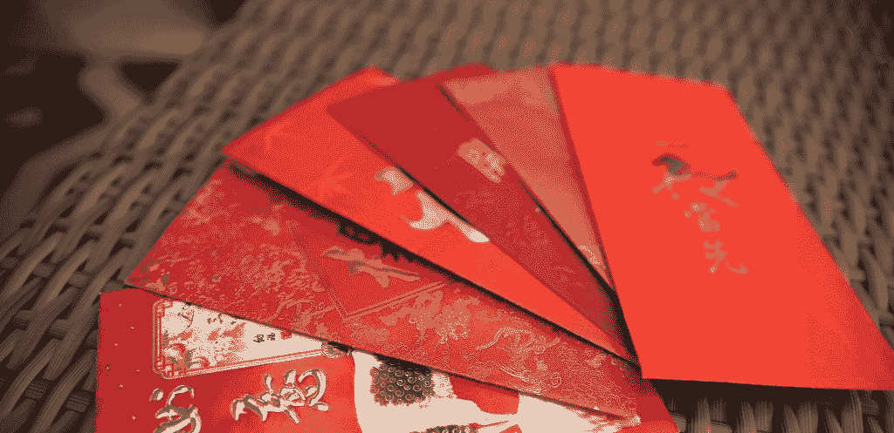
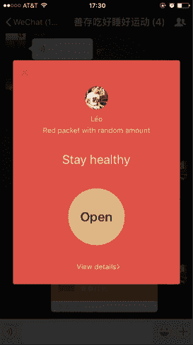
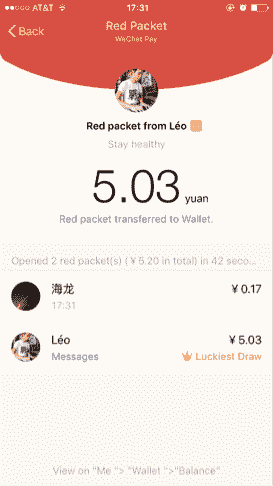
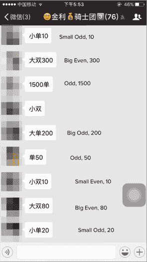
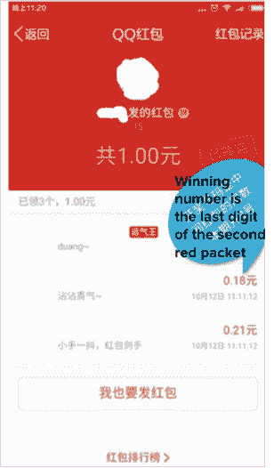
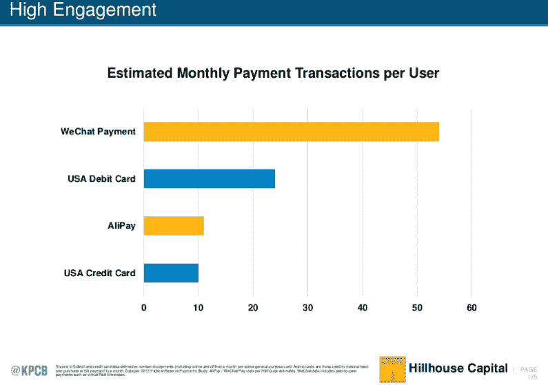

# 作为信息的金钱|安德森·霍洛维茨

> 原文：<https://a16z.com/2016/07/24/money-as-message/?utm_source=wanqu.co&utm_campaign=Wanqu+Daily&utm_medium=website>

*credit: Connie Chan/ a16z*

网络效应——随着越来越多的人使用，产品或服务对用户变得越来越有价值——是软件企业保持更好的产品和更具防御性的市场地位的关键方式之一。对于微信这样的即时通讯应用来说尤其如此——正如我之前[所说](http://a16z.com/2015/08/06/wechat-china-mobile-first/)，它不仅仅是一个即时通讯应用，实际上更像是一个门户、一个平台和一个移动操作系统。不管你怎么称呼它，微信本身就是一个完整的生态系统，尤其是当它在亚洲被使用的时候。这在很大程度上是由于用户账户附带的支付凭证数量巨大，这大大减少了整个市场在线和离线交易中的摩擦。

但是微信是如何解决他们的“先有鸡还是先有蛋的问题”的呢——在市场的两边都获得更多的用户或更多的商家，而一开始两边都没有达到临界质量？对于用户来说,(第一次)在消息平台中输入支付凭证并不比在第三方商家表单中输入来完成交易更容易——没有节省时间，没有消除摩擦。同样，对于市场的商家而言，如果没有现成的购买用户群，就没有动力首先为平台投入营销资金和工程资源。除非你是苹果公司(Apple ),拥有支持信用卡的 iTunes，否则大多数信息和其他应用平台必须额外努力才能让用户愿意分享支付凭证。他们必须说服用户，要么他/她很快会再次在平台上购买，要么在他们那里建立一个[数字钱包](http://a16z.com/2016/04/25/digital-wallets-fintech-platform/)会有一些其他直接的好处。否则用户就没有这样做的动机。

有趣的是，微信解决了这个问题*而没有*使用一种常见的[策略](http://cdixon.org/2009/08/25/six-strategies-for-overcoming-chicken-and-egg-problems/)来解决鸡生蛋的问题。这是因为他们有一个**文化基因**的优势——不是基于商业而是基于 C2C 社交传播的东西——迫使用户将他们的支付凭证与他们的微信账户绑定:红包。这个迷因不仅帮助微信说服了超过一半的中国用户提供支付凭证，还让他们以非常快的速度这样做。(需要明确的是，这是一个病毒增长的例子[而不是](http://platformed.info/virality-viral-growth-network-effects/)网络效应。但重点是，这种病毒式增长导致了微信生态系统中的其他网络效应)。

红包是微信的秘密武器，让用户在其消息平台上采用移动支付，解锁其生态系统中的所有后续交易活动。

##### **什么:作为社会传播的文化模因**

文化背景:装有现金礼物的红包(字面意思是小的红色纸信封)是在特殊场合赠送的，如婚礼、出生、毕业以及被称为中国新年的主要节日/春节——对许多东亚人来说，中国新年就像圣诞节和新年的总和。类似于寄圣诞卡，给朋友发红包就像是说“最美好的祝愿！”。

为了庆祝 2014 年的春节假期，微信推出了一项名为压岁钱的 P2P(点对点)支付功能，后来更名为红包。两年后，超过 4 . 2 亿微信用户在六天假期中发送了 32 亿个数字红包——峰值使用量达到每秒发送 40 . 9 万个红包。(从这个数字来看:2015 年全年，PayPal 在全球的交易量为[49 亿](http://www.thedrum.com/news/2016/02/09/wechat-had-more-mobile-transactions-over-just-chinese-new-year-paypal-had-during)，包括移动和桌面交易。)

中国超过 6000 万微信用户继续每天发送红包——不仅仅是在节假日——因为他们现在已经成为自己的社交沟通形式，类似于发送贴纸或表情符号。

##### **如何:将游戏作为增长黑客**

通过从一开始就将游戏机制注入其数字版红包，微信帮助 P2P 支付成为一种新的社交形式:汇款不再感觉俗气，而是受到社会的欢迎，并附有信息。(It *毕竟是*一个消息平台！).与加速支付的采用同样重要的是，这些游戏机制也导致了更高的群聊使用率。

微信最初推出红包时，提供了两种基本选择:给个人发钱，或者给一群朋友发钱。许多用户选择了后一个选项，因为发送者不仅可以指定礼物总额和信息，还可以指定多少获奖者可以获得一部分奖金(每个金额由微信随机分配)。因此，对于一个有 50 名成员的小组，发送者可能只会选择发放 10 份奖品——这意味着只有该小组中声称获得奖品的前 10 名成员会得到任何东西。这种类似抽奖的功能让收件人陷入疯狂，因为他们都将同时“收到”红包，不知道有多少人可以赢得它，因此会在奖金用完之前争相领取红包。

有趣的是，在现实生活中，即使是发件人也能成为网络赢家，这是不被社会接受的。是的，真的:那些送钱给别人作为礼物的人实际上可以收到他们自己的礼物(就像下面的 Leo 一样)。

 

那么你可能会问这有什么意义呢？接收者仍然会从一开始就收到一个包裹中感受到善意，即使它几乎是空的。赢得好感的是发红包的*行为*，而不是发的金额。事实上，如果接收者抽取的金额很低，他/她会将其归因于运气。这种文化背景使得货币不仅仅是一种交易。

##### **何时:营销活动时机**

除了以零[客户获取成本(CAC)](http://a16z.com/2015/08/21/16-metrics/) 建立上述病毒效应之外，该公司营销其平台的另一种方式是通过付费合作伙伴关系和广告活动。2015 年，微信母公司腾讯投资 810 万美元赢得了中央电视台春节全国节目的版权。想象一下迪克·克拉克的新年摇滚夜，但是有 [8 亿](http://www.hollywoodreporter.com/news/china-crushes-puny-us-super-676907)观众，是超级碗观众的 7 倍。

在这种一次性播出的爆款中，微信广告主(像雪佛兰、华为等。)向 3600 万微信用户分发了超过 8100 万美元的数字货币，这些用户在观看节目时使用该应用程序领取红包。观众只需在电视前晃动手机，试图抓住一个装满免费现金的信封。然后，就在节目结束后，微信又分发了价值 4.84 亿美元的红包优惠券，这些优惠券是由第三方赞助商补贴的。腾讯没有在很长一段时间内分散营销资金，而是要求那些精选的广告合作伙伴围绕这一特殊活动投入资金。

这种免费现金和折扣的集中组合起了作用，而且效果很好。今年，阿里巴巴对支付宝做了类似的事情(只是这次央视转播权据报道贵了[五倍](http://tech.sina.com.cn/i/2016-02-07/doc-ifxpfhzq2604983.shtml))。腾讯没有中标，但话说回来，这也不是必须的:在 2015 年 9 月的中秋节假期期间，在微信央视宣传活动结束仅 7 个月后，1 亿微信用户向朋友和家人发送了红包——微信方面没有任何提示或推广。

然而，微信继续利用文化场合和新游戏作为营销和推广数字红包的机会。例如，在 2016 年，微信允许用户模糊他们在微信时刻新闻订阅(类似于脸书的新闻订阅)中的照片帖子，因此想要取消照片模糊的朋友必须向用户发送红包——实质上是付费解锁照片。该活动开展不到一天，就有 2900 万人上传了模糊的照片。

##### **为什么:预期和非预期的后果**

微信的数字红包中嵌入的游戏和促销说明了他们用来故意发展其网络和生态系统的“增长黑客”。这些策略中的一些乍一看似乎是噱头，但显然加速了支付和群聊等新功能的采用，并开辟了意想不到的新参与机会。

**支付:**今天，超过 3 亿微信用户(来自[7 . 62 亿](http://www.tencent.com/en-us/content/at/2016/attachments/20160518.pdf)mau)已经将他们的银行凭证绑定到他们的用户账户。这意味着这些用户完全可以在整个微信生态系统中进行一次点击支付——从叫出租车和购买电影票到点食物和饮料。这反过来又刺激更多的开发者和合作伙伴投资该平台，这反过来又创造了更好的体验，导致更多的用户(和[品牌](http://mp.weixin.qq.com/s?__biz=MjM5MTgxMjY3MQ==&mid=2653542126&idx=1&sn=280948265a1c6d3afca6dcc299e09c15&scene=5&srcid=0713EjQr1piIuRLhfAkx49pA#rd))想要交易，因此网络效应飞轮旋转。而且由于有用户仅仅从*收到*红包就积累了数字现金余额，微信上实际有消费能力的用户数量甚至更高。

当然，像任何市场一样，也有滥用的情况。例如，由于群聊中随机分配的金钱数量，出现了非法的[赌博圈](http://news.ifeng.com/a/20160526/48850971_0.shtml)，其中一个人在个人红包分配的最后一位数字上下注，类似于在轮盘赌桌上下注。

 

此外，一些欺诈者假冒个人资料(使用相同的头像和明显相似的朋友用户名)来索要钱财，这很像鱼叉式网络钓鱼攻击。为了打击这种和其他移动支付欺诈行为，中国在本月初要求所有移动支付用户必须通过绑定银行或信用卡，或上传他们的国民身份证或其他官方身份来验证他们的真实姓名。具有讽刺意味的是，使用——紧急行为——监管的轨迹强化了更多的采用(至少是支付凭证)!

**对于群聊:**除了让一些东西同时在多组人中传播的乘数效应【参见[里德定律](http://www.slideshare.net/a16z/network-effects-59206938/14-3_common_laws_for_assessing)】，红包有趣的游戏性也让人们为了收发数字红包而创建新的聊天群*。因此，从来没有使用过群聊(或者以前只和家人使用过)的人现在发现了更大或更短暂的群聊的乐趣和内在价值。值得注意的是，在最初的红包被索要后，这些群组仍然存在很长时间，并且在红包推出后的几个月内，群组聊天的使用量增长了 3-4 倍。*

 *其他平台也有这样的群体，但目前没有将其货币化。就微信而言，群聊的广泛使用为其用户带来了新的参与方式。例如，这款消息应用现在可以成为结识陌生人的地方，而不仅仅是巩固现有的社交团体。此外，群聊成为用户广播消息、通过类似 Shopify 的个人商店推广产品、讨论话题和共同兴趣以及共享面向有限公众受众的媒体的渠道。因此，群聊是推动该平台未来发展的关键，因为它们能够催生新的社区和新的关系。随着社交互动变得越来越数字化，拥有一个在约会或工作环境之外结交新朋友的在线场所对于平台上的参与度和粘性来说非常有价值。

社交方面:2015 年 5 月 20 日七夕，微信发现一些用户互发 5.20 元(约 79 美分)的红包。数字 5-2-0 是中文“我爱你”的网络俚语，因此 5/20 的价格是 5.20 元人民币。因此，2016 年，腾讯首席执行官兼董事长马化腾(与马云没有关系)在他的新闻供稿上宣布，仅在那一天，每个红包的上限将从 200 元提高到象征性的 520 元。从午夜到下午 6 点，微信上发送了超过 800 万个红包(6.4 亿美元)。

但是事情是这样的:许多收到 520 元爱的短信的人回复给了原发件人一模一样的钱——所以对许多夫妇来说，并没有真的寄钱。这些是爱的问候，这是作为信息的钱。尽管在这种情况下交换的钱是净的，但从长远来看，这种人为/突发的社交行为对微信更重要，因为它给用户提供了一种全新的相互参与和交流的方式。

##### * * *

主要受其数字钱包的驱动——反过来又主要受红包的驱动——腾讯今天平均每天超过 [5 亿](http://www.yicai.com/news/5018372.html)笔交易(在合并的微信和其他移动 QQ 聊天平台上)。请注意，许多“交易”实际上只是用于社交或象征性交流的小额资金，这就是为什么只关注交易量而不是交易金额有时会产生误导。

例如，下图将红包小额支付和大额购买在视觉上一视同仁，而在现实中，支付宝的*购买*相关市场份额(包括阿里巴巴淘宝/天猫交易)是腾讯的 2-3 倍。

因此，微信似乎在支付领域排名第一，但在红包交易量方面领先(这确实可能在未来导致更高的支付交易市场份额，但现在不是这样)。金钱现在已经成为一种信息，所以现在人们送上少量的钱(通常是幸运数字 8 元人民币，大约 1 美元)来表达问候是很常见的。

微信最初推出红包是作为一种移动网络体验，直到 2015 年他们看到了这种戏剧性的增长，他们才在自己的原生应用程序中加入这一功能。红包提醒我们，没有哪家公司是太大的，也没有哪种产品是太占优势的，我们必须不断地试验和寻找网络增长的窍门。

*编辑:Sonal Chokshi @smc90*

*此处表达的观点是引用的 AH Capital Management，l . l . c .(“a16z”)人员个人的观点，并非 a16z 或其关联公司的观点。此处包含的某些信息来自第三方，包括 a16z 管理的基金组合公司。虽然来自据信可靠的来源，但 a16z 没有独立核实此类信息，也没有对信息的持久准确性或其在给定情况下的适当性做出任何陈述。T3】*

*本内容仅供参考，不应作为法律、商业、投资或税务建议。关于那些事情，你应该咨询你自己的顾问。对任何证券或数字资产的引用仅用于说明目的，并不构成投资建议或提供投资咨询服务。此外，本内容不针对任何投资者或潜在投资者，也不打算由任何投资者或潜在投资者使用，并且在决定投资 a16z 管理的任何基金时，在任何情况下都不得依赖本内容。(投资 a16z 基金的要约只能通过私募备忘录、认购协议和任何此类基金的其他相关文件进行，并应完整阅读。)提及、提及或描述的任何投资或投资组合公司并不代表 a16z 管理的投资工具的所有投资，也不能保证这些投资是盈利的，也不能保证将来进行的其他投资会有类似的特征或结果。安德森·霍洛维茨基金管理的基金的投资清单(不包括发行人未允许 a16z 公开披露的投资和某些公开交易的加密货币/数字资产)可在 https://a16z.com/investments/.T3 获得*

*其中提供的图表仅供参考，不应作为投资决策的依据。过去的表现并不代表未来的结果。该内容仅在所示日期有效。这些材料中表达的任何预测、估计、预测、目标、前景和/或观点可能会随时更改，恕不另行通知，并且可能与他人表达的观点不同或相反。更多重要信息，请见 https://a16z.com/disclosures。T3】**