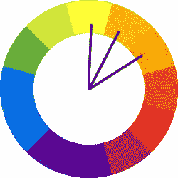
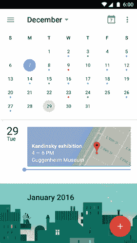

# 手机应用程序 UI 设计中的极简艺术

> 原文：<http://babich.biz/the-art-of-minimalism-in-mobile-app-ui-design/?utm_source=wanqu.co&utm_campaign=Wanqu+Daily&utm_medium=website>

设计是用户参与的最重要的驱动因素之一。随着用户的偏好转向更简单的界面，将 UI 剥离到最基本的、必要的元素是成功的关键。极简主义是形式和功能的完美结合。它最大的优点是形式清晰——简洁的线条、大量的空白和最少的图形元素使最复杂的主题变得简单。当然，前提是有效地使用*。*

 *极简设计必须*简洁*、*清晰*、*一致*才可用。你的交互系统应该通过清晰的视觉交流为你的用户解决问题。这就是为什么一个漂亮的极简主义应用程序结合了巨大的可用性是如此令人印象深刻:一个容易导航，简单的应用程序可以是一种非常强大的交流形式。但是为了实现这个目标，你需要关注以下时刻:

# 简单的配色方案

简化配色方案可以改善用户体验，而过多的颜色会对用户体验产生负面影响。有许多预定义的配色方案标准，使创建新方案变得更加容易，尤其是对初学者而言:

*   **单色方案。**单色配色方案由特定色调内的不同色调、阴影和色彩组成。通过修改单一色调的饱和度和亮度，您可以生成多种颜色，并且配色方案不会让人眼花缭乱。
    T3】

Single-hue blue color scheme. Image credit: Smashing Magazine

Image credit: [Dribbble](https://dribbble.com/shots/1054717-Hack-Day-App-Preview)

*   **类似的配色方案。** [类似的方案](https://babich.biz/a-guide-to-color-and-conversion-rates/)通过使用色轮上彼此相邻的三种颜色来创建。一个极简主义手势驱动的任务管理器应用 Clear 使用类似的颜色在视觉上区分重要任务的优先级，并突出最重要的任务(最上面的项目将是最大胆的颜色，而列表中较低的项目将更亮更微妙)。
    

Shades yellow and orange is an example of an analogous color scheme. Image credit: tuts+

Clear app for iOS

#Blur Effects Blur effect arise as a logical solution to a minimal user interface, allowing a certain amount of play with the layers and hierarchy of the interface. It’s a very efficient solution when working with layered UI since it gives the user a clear understanding of mobile’s solution flow. This also gives designers a perfect opportunity to explore different menu and overlay solutions.

雅虎！天气应用程序显示每个天气位置的漂亮照片，您需要的最重要的数据立即可见，而只需轻轻一点就可以深入了解更详细的数据。该应用程序不会用另一个用户界面层覆盖照片，而是在你点击后让你保持在上下文中——详细信息很容易显示出来，照片保留在背景中。这种互动非常直观，只需一秒钟就能回到之前的位置。
T3】

Yahoo! weather app for iOS

#One App, One Typeface Mixing several different fonts can make your app seem fragmented and sloppy. Reducing the number of fonts on a screen can reveal the power of typography. When designing an app think about how can you make the typography powerful by playing with *weight, style and size*, not different typefaces. 

In general, use a single font throughout your app. Image credit: Apple

When you choosing a typeface for your app keep in mind that a safe bet is to rely on the platform’s default font:

*   苹果使用旧金山字体系列来提供跨所有平台的一致阅读体验(iOS 9 的旧金山字体称为 SF-UI)。
*   Roboto 和 Noto 是谷歌 Android 和 Chrome 的标准字体。
    T3】

Reducing the number of fonts on a screen can reveal the power of typography. Image credit: Dribbble

#Data Spotlight You should use *big font size and striking color* to make a *certain data* the center of focus. Using neutral colors for the general scheme and adding contrasting colors for calls to action, helps the user focus on the action we want them to take. 

Bright accent color into an otherwise-neutral palette is one of the easiest color schemes to create. It’s also one of the most striking, visually. Image credit: Smashing Magazine

Increased font size and an accent color draws the users’ attention to a particular area of the screen without additional visual hints. This provides easier information-gathering experience. 

Increased font size and a pop of color draws the users’ attention to a particular area of the screen. Image credit: [Dribbble](https://dribbble.com/shots/2278322-Adding-a-new-goal-animation)

# 按元素和间距划分，而不是按线条划分

线条和分隔线通常用于清晰地描绘屏幕中的特定部分或类别。但是添加太多这样的元素会导致界面拥挤。

*更少的线条和分隔线*会让你的界面更整洁、更现代、更实用。还有其他方法来分隔内容，如使用块、间距或颜色。谷歌的日历应用是一个很好的例子，说明了如何利用空间和使用[阴影](https://babich.biz/graphical-user-interface-as-a-reflection-of-the-real-world-shadows-and-elevation/)而不是画线来帮助以一种不显眼的方式定义不同的部分。

Spacing provides visual clarity and improved ease of use in Calendar app

#Icons: Stroke and Fill Iconography is a visual language used to represent functionality or content. Icons are meant to be simple, visual elements that are recognized and understood immediately. Since iOS 7 many minimalist UI has stroke and filled icons. In this article we won’t criticize the concept itself, instead we’ll focus on the practical aspect  — stroked and filled type of the same icon: 

Clock icons (stroked and filled). Image credit: [icons8](https://icons8.com)

Let’s take a look on tab bar icons. Because bar icons serve as navigation to other sections of the app, it’s important to indicate which section is currently active by *highlighting its icon* in some way: a solid version to show an active/selected state and a hollow version to show an inactive/unselected state. This makes recognition of active tabs and controls more straightforward. 

Tab bar in AppStore app from Apple. Image credit: viget

# 结论

极简界面和其他设计技术当然是实现好设计的一种方式，但它们不是目标。最终目标是简化我们的界面，让它们*更具功能性和可用性*。简单的用户流程、清晰的视觉效果和宽容的设计有助于创建无缝的交互。

谢谢大家！* 