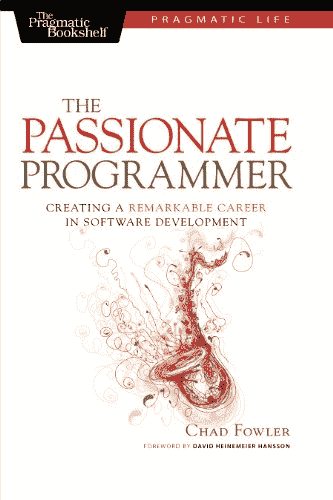
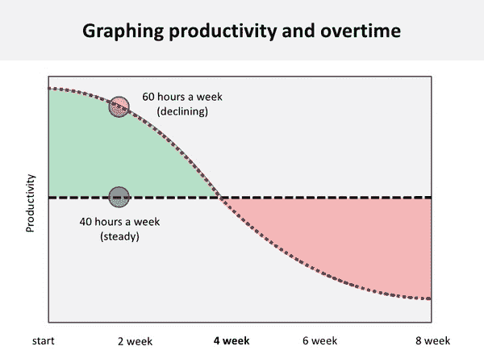

# 没有激情的开发者还有空间吗？Philippe Bourgau 的 XP 教练博客

> 原文：<http://philippe.bourgau.net/is-there-any-room-for-the-not-passionate-developer/?utm_source=wanqu.co&utm_campaign=Wanqu+Daily&utm_medium=website>

[T2】](https://www.amazon.com/Passionate-Programmer-Remarkable-Development-Pragmatic-ebook/dp/B00AYQNR5U/ref=sr_1_1?tag=pbourgau-20&ie=UTF8&qid=1470025727&sr=8-1&keywords=the+passionate+programmer)

在[返工](https://www.amazon.com/Rework-Jason-Fried/dp/0307463745/ref=sr_1_1?tag=pbourgau-20&ie=UTF8&qid=1469597091&sr=8-1&keywords=rework)、[大本营](https://basecamp.com/)的家伙大卫·海涅迈尔·汉森和杰森·弗里德建议[“解雇工作狂”](https://signalvnoise.com/posts/902-fire-the-workaholics)，而在[零比一](https://www.amazon.com/Zero-One-Notes-Startups-Future/dp/0804139296/ref=sr_1_1?tag=pbourgau-20&ie=UTF8&qid=1469801854&sr=8-1&keywords=zero+to+one)中，彼得·泰尔认为，伟大的工作条件(例如谷歌内部所描述的)源于 10 倍的技术优势，而不是相反。

早在 1983 年，比尔·盖茨就说过:

> 你得觉得这是个有趣的行业。你必须晚上回家，打开你的邮件，找到电脑杂志，否则你将无法和(微软的)人保持一致。

我们现在在哪里？你需要生活和呼吸编程来保持一个好的开发者吗？

## 每周 40 小时的规定呢？

研究一再证明，每周 40 小时是最有效率的工作负荷，但在《局外人》中，成功的故事马尔科姆·格拉德威尔解释说，快速达到 10000 小时的练习是通往成功的必经之路。正如我的艾奇多教授所说，你练习得越多，你就会变得越好…

在《软技能:软件开发人员的生活手册》中，John Somnez 也强调了努力工作的重要性，虽然他一直认为聪明的工作就足够了，但只有当他投入更多时，他才能彻底改变自己的职业生涯。

在一次辩论中，DHH 主张工作生活平衡，而杰森·卡拉卡尼斯则认为在创业公司工作必须全力以赴。最终，他们一致认为，重要的是激情。

从我自己的经验来看，每当我从事我热爱的事情时:

*   我更有效率了
*   我感到精力充沛，而不是被工作弄得迟钝

当我环顾四周，我认识的所有伟大的开发人员都充满激情，每周投入超过 40 个小时在编程上。我还注意到，激情和努力一直是未来技能的良好指标。

但是，当每周工作超过 40 小时时，充满激情的人是如何保持高效率的呢？

## 淋浴下的主意怎么样？

在[务实的思考和学习:重构你的湿件(务实的程序员)](https://www.amazon.com/Pragmatic-Thinking-Learning-Refactor-Programmers/dp/1934356050)(顺便说一句，这是一本很棒的书)中，安迪·亨特解释说，我们的 R 模式在后台工作，需要从手头的任务中抽出时间来提出“开箱即用”的创造性解决方案。

极限编程主张一个可持续的速度，但同时，鲍勃大叔说我们应该每周工作 60 小时(40 小时给雇主，20 小时给自己)来成为并保持“专业人士”(如果我没记错的话，我想这是来自“干净的程序员”)。

对我来说，在成为一名净负生产程序员之前，我最多只能就同一主题进行 6 到 8 个小时的结对编程。但是，如果我同时做一个兼职项目，我每天可以做更多的编程工作！

我猜热情的人就是这样做的，他们在主要工作之外还有不同的话题:

*   他们阅读关于编程的书籍
*   他们有自己的[副业](http://www.sideprojectbook.com/)
*   他们阅读关于编程的文章
*   他们可能会维护一个编程博客
*   他们可能会参加、组织 meetup 或在 meetup 上发言

大多数时候，这并不会导致更多的工作，而是更多的学习。如果我注意到我周围所有伟大的程序员都充满热情，努力提高他们的技能，我也会注意到过度工作的工作狂通常效率不高。

## 父母面临的特殊挑战

我认为比尔·盖茨 1983 年的声明仍然有效。如果你对编程没有热情，从长远来看，你将很难继续做一名成功的程序员。

所有这些激情的伟大之处在于，我们可以体验一个充满活力的工作环境，总是充满变化和新奇。另一方面，跟上所有人并不总是容易的。

随着我们开发人员获得的经验越来越多，我们往往会对那些令人头疼的事情失去耐心，并且会想要:

*   强大的语言和技术
*   高效的工作环境
*   聪明的同事

不幸的是，这也可能是你人生中成为父母的时刻，你会想要一份稳定的收入来维持你的家庭，并有一些时间来陪伴你的孩子。

这就是事情变得棘手的时候。你也不能跳槽去下一个又酷又有风险的创业公司，在那里你可以做伟大的事情，你也不能找到足够的时间兼职来提高你的技能…雪上加霜的是，即使你在各种语言和技术方面有 10 年的经验，大多数公司也不会看你的简历，除非你的简历包含好的关键词…这看起来像是开发者版的[创新者的困境](https://www.amazon.com/Innovators-Dilemma-Revolutionary-Change-Business/dp/0062060244/ref=sr_1_sc_1?tag=pbourgau-20&ie=UTF8&qid=1470024448&sr=8-1-spell&keywords=the+innovator%27s+dilemns)！

缺乏激情和父母身份可能部分解释了为什么人们过了一段时间就不再是开发人员了。我可以很快想到这样做的两个不好的后果:

*   我们倾向于重新发明轮子(我正看着你。js 框架……)
*   我们可能会忽略(忽略我们忽略的)那些可以让我们更有效率的人际交往技能

*编辑 2017/01/11 感谢大家的宝贵意见，[下面是一个跟进](/what-happens-to-non-enthusiast-programmers-in-the-long-run/)T3】*

*[中文翻译](http://www.inside.com.tw/2016/08/05/is-there-any-room-for-the-not-passionate-developer)*

