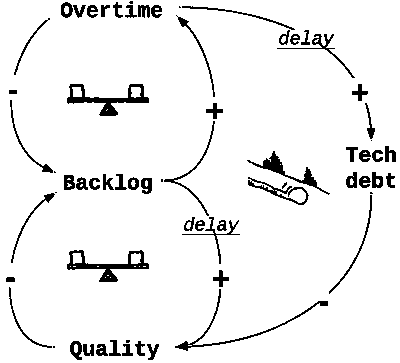

# 可持续步伐-什么是可持续步伐？

> 原文：<http://sustainablepace.net/what-is-sustainable-pace?utm_source=wanqu.co&utm_campaign=Wanqu+Daily&utm_medium=website>

2012 年 2 月 29 日

# 什么是可持续发展速度？

可持续发展是极限编程和敏捷宣言的重要组成部分。与测试驱动的开发或持续集成相比，可持续的步伐不太为人所知，不太正式，因此经常被认为是模糊的或分散的。

## 起源

在 2001 年[敏捷宣言](http://agilemanifesto.org)发布后，可持续步伐背后的概念已经被讨论过了。这个基金会是由极限编程大师 Kent Beck 在“极限编程讲解”的第一版(1999 年)中建立的，他建议每周工作不要超过 40 小时，并且不要连续第二周加班。在“T4”的“八小时燃烧”中，软件工匠罗伯特·c·马丁更关注能源方面，而不仅仅是时间，这导致罗恩·杰弗里斯将这种做法称为“可持续速度”，而不是“每周 40 小时”。

最后，敏捷宣言背后的[原则之一是致力于“可持续发展”，这可以被认为是最广泛接受的定义:](http://agilemanifesto.org/principles.html)

> 敏捷过程促进可持续发展。发起人、开发人员和用户应该能够无限期地保持恒定的步调。

那年晚些时候，[阿利斯泰尔·考克伯恩指出](http://www.amazon.com/Agile-Software-Development-Cooperative-Game/dp/0321482751)宣言的作者之所以讨论可持续发展步伐，是因为项目的有效性和社会责任方面，尤其是前者。

## 有效性

早在 20 世纪 20 年代，亨利·福特就证明了工作时间不会提高生产率，他发现工人每周工作 40 小时可以获得最大利润。有趣的是，大多数法律，如[欧盟工作时间指令](http://en.wikipedia.org/wiki/Working_Time_Directive)(每周工作不超过 48 小时)，不仅受到社会责任的影响，还受到生产力问题的影响。然而，正如德国 2011 年的一项研究表明，仍然有六分之一的大学毕业生工作超过 48 小时。

如果软件开发发生在加班期间会怎么样？几项[研究](http://lunar.lostgarden.com/Rules%20of%20Productivity.pdf)显示，在加班的第一周，生产率会有所提高，但会迅速下降，最终低于 40 小时标准的生产率水平。在加班期间，人们没有注意到他们认知能力的下降，导致错误，最终[质量下降](http://blog.agilegamedevelopment.com/2008/06/scrum-overtime.html)。质量上的差异被称为“技术债务”。马丁·福勒[将这个比喻翻译成软件开发](http://www.martinfowler.com/bliki/TechnicalDebt.html)，

> 正如一个企业为了利用一个市场机会而招致一些债务一样，开发人员也可能为了赶上一个重要的最后期限而招致技术债务。

沃德·坎宁安在 1992 年创造了债务隐喻，他详细阐述了

> 花在不太正确的代码上的每一分钟都算作债务的利息

在[系统论](/fifth-discipline)中，由于加班而导致的技术债务积累可以用[“转移负担”](http://www.systems-thinking.org/theWay/ssb/sb.htm)原型来描述。

计划内加班是技术债务的主要来源，应该避免，如果出现技术债务，应该尽快解决，以便在更可预测、更平衡的系统中工作。

2004 年，Kent Beck [修订了《极限编程讲解》](http://www.amazon.com/Extreme-Programming-Explained-Embrace-Change/dp/0321278658/)，用“充满活力的工作”的概念取代了“每周 40 小时”:

> 尽可能多工作几个小时，尽可能多工作几个小时。

这种变化并没有被忽视，正如软件看板大师 David J. Anderson [描述他对这种范式转变的理解](http://www.agilemanagement.net/index.php/blog/Where_did_the_40_Hour_Week_Go/)。受体育科学家 Loehr 和 Schwartz 的书[“全身心投入的力量”](http://www.amazon.com/exec/obidos/ISBN=0743226755/thelairdorganisaA)的影响，他描述了他对大规模软件开发的看法是如何改变的，他不再把它视为一场马拉松，而是一系列短距离的冲刺，在这些冲刺中，能量被剧烈消耗，并在停顿中恢复。他还提到，比起自律，他更喜欢仪式。

结合了冲刺和仪式两方面的概念是[番茄工作法](/pomodoro-technique)和[放松法](/slack)。

工作不应该以严格恒定的速度进行，而应该通过消耗能量和恢复能量，利用仪式来更加动态地进行。

## 幸福

幸福研究告诉我们，收入和幸福只在一定程度上相关。除了经济上的成功，肯定还有其他方面能增加幸福感。布鲁诺·弗雷引入了程序效用这一术语，该术语认为快乐不能直接获得，它更像是一种副产品。在自组织团队中，像在 Scrum 中，人们感觉更有能力、更相关和更自主，这是[过程效用的三个主要来源](/scrum-and-happiness-research)。新经济学基金会也处理了幸福研究的发现，将其归纳为[五种幸福之道](http://neweconomics.org/projects/five-ways-well-being)。

## 摘要

可持续发展的步伐并不意味着放松和放慢。恰恰相反，你应该精力充沛地消耗能量，通过休息来恢复体力。从长远来看，确保你明智地投入精力，并根据快乐研究的发现来设定你的优先事项。

正如 Bronnie Ware 的《垂死者的五大遗憾》中所述，工作过度是男性在生命终结时特别后悔的事情。我们不应该为了以后的成功和幸福而工作，而应该关注现在的幸福。这应该是衡量成功的标准，也是[有意义工作的起点](http://www.businessweek.com/magazine/content/11_17/b4225060960537.htm)。

